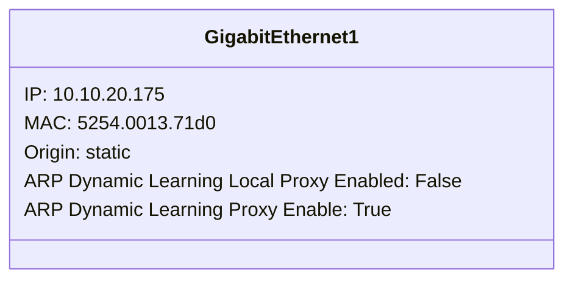
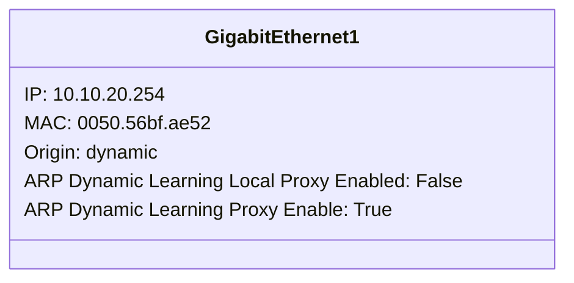
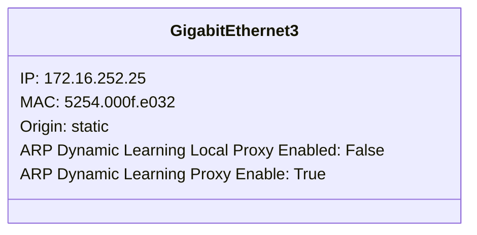
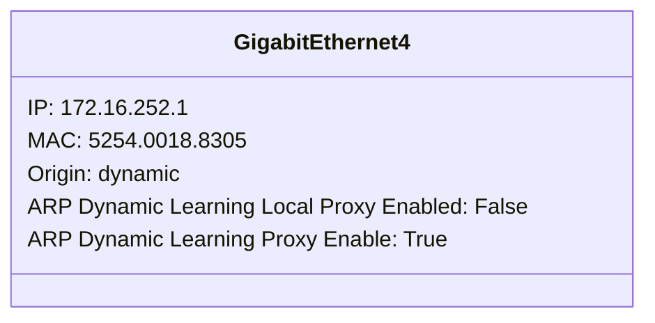
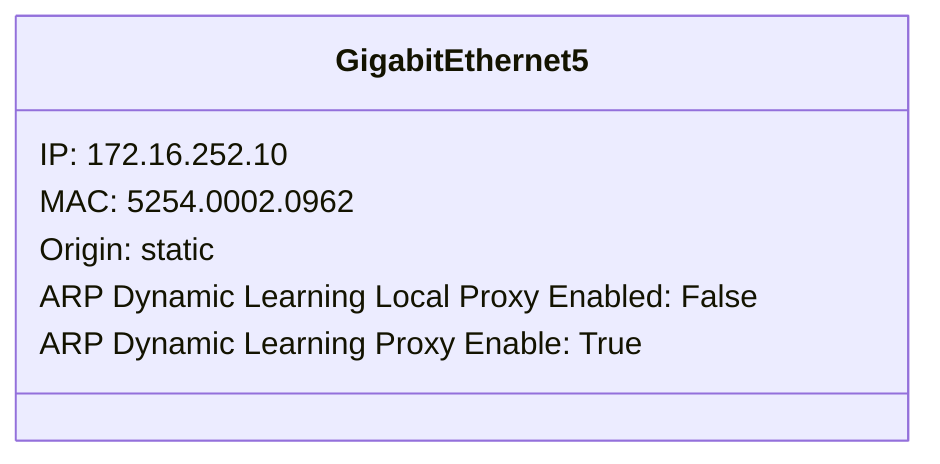
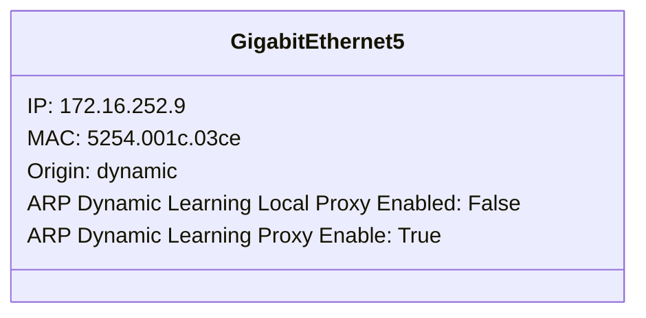
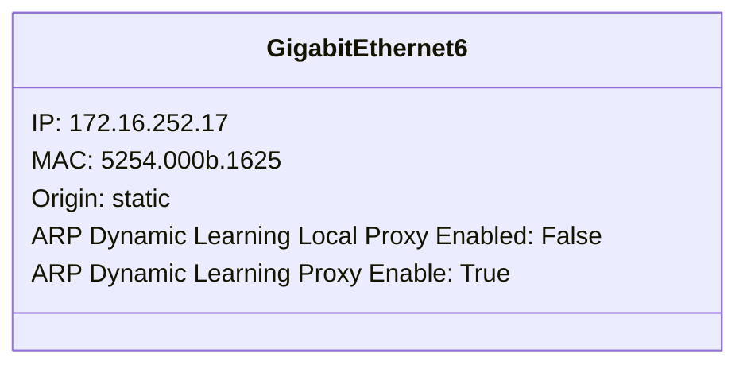
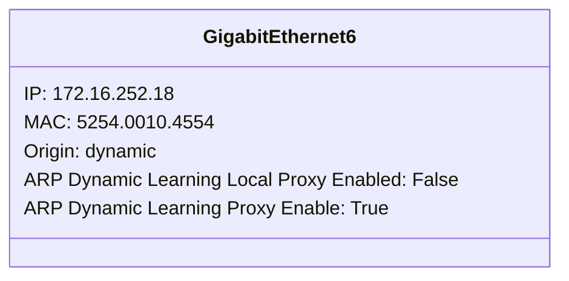
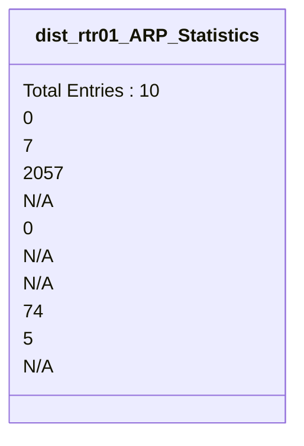

```mermaid
classDiagram
class GigabitEthernet1{
IP: 10.10.20.175
MAC: 5254.0013.71d0
Origin: static
ARP Dynamic Learning Local Proxy Enabled: False
ARP Dynamic Learning Proxy Enable: True
}
```

```mermaid
classDiagram
class GigabitEthernet1{
IP: 10.10.20.254
MAC: 0050.56bf.ae52
Origin: dynamic
ARP Dynamic Learning Local Proxy Enabled: False
ARP Dynamic Learning Proxy Enable: True
}
```

```mermaid
classDiagram
class GigabitEthernet2{
IP: 172.16.252.21
MAC: 5254.0007.e627
Origin: static
ARP Dynamic Learning Local Proxy Enabled: False
ARP Dynamic Learning Proxy Enable: True
}
```

```mermaid
classDiagram
class GigabitEthernet3{
IP: 172.16.252.25
MAC: 5254.000f.e032
Origin: static
ARP Dynamic Learning Local Proxy Enabled: False
ARP Dynamic Learning Proxy Enable: True
}
```

```mermaid
classDiagram
class GigabitEthernet4{
IP: 172.16.252.1
MAC: 5254.0018.8305
Origin: dynamic
ARP Dynamic Learning Local Proxy Enabled: False
ARP Dynamic Learning Proxy Enable: True
}
```

```mermaid
classDiagram
class GigabitEthernet4{
IP: 172.16.252.2
MAC: 5254.0016.f297
Origin: static
ARP Dynamic Learning Local Proxy Enabled: False
ARP Dynamic Learning Proxy Enable: True
}
```

```mermaid
classDiagram
class GigabitEthernet5{
IP: 172.16.252.10
MAC: 5254.0002.0962
Origin: static
ARP Dynamic Learning Local Proxy Enabled: False
ARP Dynamic Learning Proxy Enable: True
}
```

```mermaid
classDiagram
class GigabitEthernet5{
IP: 172.16.252.9
MAC: 5254.001c.03ce
Origin: dynamic
ARP Dynamic Learning Local Proxy Enabled: False
ARP Dynamic Learning Proxy Enable: True
}
```

```mermaid
classDiagram
class GigabitEthernet6{
IP: 172.16.252.17
MAC: 5254.000b.1625
Origin: static
ARP Dynamic Learning Local Proxy Enabled: False
ARP Dynamic Learning Proxy Enable: True
}
```

```mermaid
classDiagram
class GigabitEthernet6{
IP: 172.16.252.18
MAC: 5254.0010.4554
Origin: dynamic
ARP Dynamic Learning Local Proxy Enabled: False
ARP Dynamic Learning Proxy Enable: True
}
```

```mermaid
classDiagram
class dist_rtr01_ARP_Statistics{
Total Entries : 10
0
7
2057
N/A
0
N/A
N/A
74
5
N/A
}
```