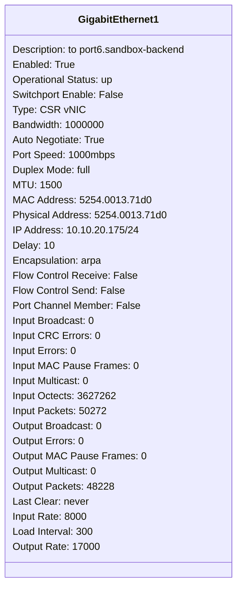
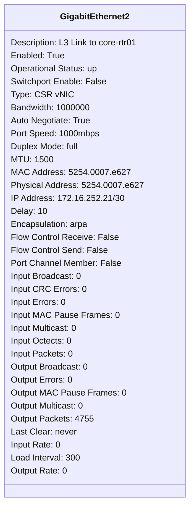
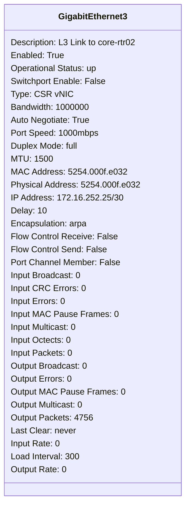
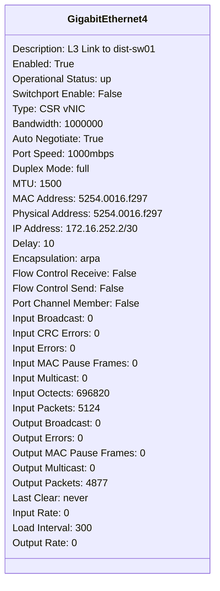
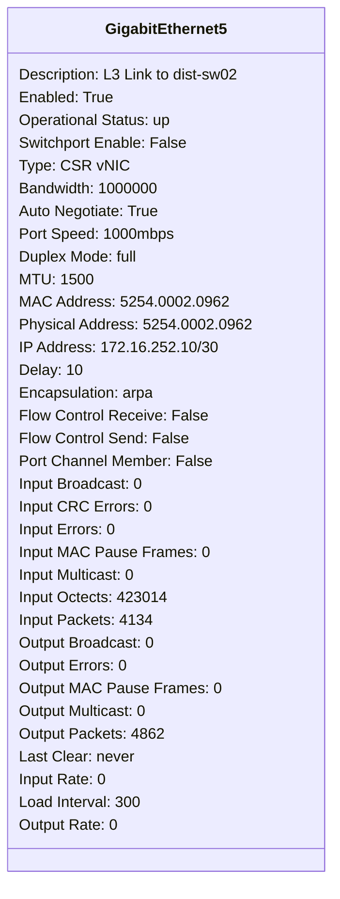
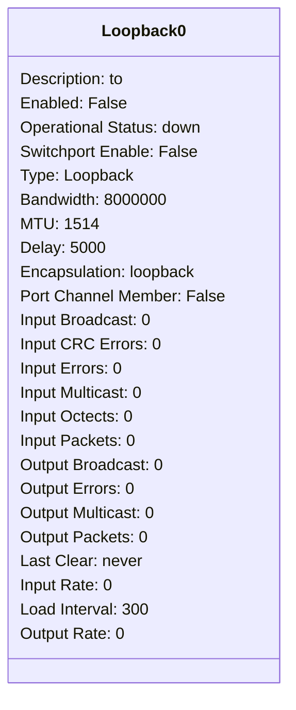

```mermaid
classDiagram
class GigabitEthernet1{
Description: to port6.sandbox-backend
Enabled: True
Operational Status: up
Switchport Enable: False
Type: CSR vNIC
Bandwidth: 1000000
Auto Negotiate: True
Port Speed: 1000mbps
Duplex Mode: full
MTU: 1500
MAC Address: 5254.0013.71d0
Physical Address: 5254.0013.71d0
IP Address: 10.10.20.175/24
Delay: 10
Encapsulation: arpa
Flow Control Receive: False
Flow Control Send: False


Port Channel Member: False
Input Broadcast: 0
Input CRC Errors: 0
Input Errors: 0
Input MAC Pause Frames: 0
Input Multicast: 0
Input Octects: 3627262
Input Packets: 50272
Output Broadcast: 0
Output Errors: 0
Output MAC Pause Frames: 0
Output Multicast: 0
Output Packets: 48228
Last Clear: never
Input Rate: 8000
Load Interval: 300
Output Rate: 17000
}
```

```mermaid
classDiagram
class GigabitEthernet2{
Description: L3 Link to core-rtr01
Enabled: True
Operational Status: up
Switchport Enable: False
Type: CSR vNIC
Bandwidth: 1000000
Auto Negotiate: True
Port Speed: 1000mbps
Duplex Mode: full
MTU: 1500
MAC Address: 5254.0007.e627
Physical Address: 5254.0007.e627
IP Address: 172.16.252.21/30
Delay: 10
Encapsulation: arpa
Flow Control Receive: False
Flow Control Send: False


Port Channel Member: False
Input Broadcast: 0
Input CRC Errors: 0
Input Errors: 0
Input MAC Pause Frames: 0
Input Multicast: 0
Input Octects: 0
Input Packets: 0
Output Broadcast: 0
Output Errors: 0
Output MAC Pause Frames: 0
Output Multicast: 0
Output Packets: 4755
Last Clear: never
Input Rate: 0
Load Interval: 300
Output Rate: 0
}
```

```mermaid
classDiagram
class GigabitEthernet3{
Description: L3 Link to core-rtr02
Enabled: True
Operational Status: up
Switchport Enable: False
Type: CSR vNIC
Bandwidth: 1000000
Auto Negotiate: True
Port Speed: 1000mbps
Duplex Mode: full
MTU: 1500
MAC Address: 5254.000f.e032
Physical Address: 5254.000f.e032
IP Address: 172.16.252.25/30
Delay: 10
Encapsulation: arpa
Flow Control Receive: False
Flow Control Send: False


Port Channel Member: False
Input Broadcast: 0
Input CRC Errors: 0
Input Errors: 0
Input MAC Pause Frames: 0
Input Multicast: 0
Input Octects: 0
Input Packets: 0
Output Broadcast: 0
Output Errors: 0
Output MAC Pause Frames: 0
Output Multicast: 0
Output Packets: 4756
Last Clear: never
Input Rate: 0
Load Interval: 300
Output Rate: 0
}
```

```mermaid
classDiagram
class GigabitEthernet4{
Description: L3 Link to dist-sw01
Enabled: True
Operational Status: up
Switchport Enable: False
Type: CSR vNIC
Bandwidth: 1000000
Auto Negotiate: True
Port Speed: 1000mbps
Duplex Mode: full
MTU: 1500
MAC Address: 5254.0016.f297
Physical Address: 5254.0016.f297
IP Address: 172.16.252.2/30
Delay: 10
Encapsulation: arpa
Flow Control Receive: False
Flow Control Send: False


Port Channel Member: False
Input Broadcast: 0
Input CRC Errors: 0
Input Errors: 0
Input MAC Pause Frames: 0
Input Multicast: 0
Input Octects: 696820
Input Packets: 5124
Output Broadcast: 0
Output Errors: 0
Output MAC Pause Frames: 0
Output Multicast: 0
Output Packets: 4877
Last Clear: never
Input Rate: 0
Load Interval: 300
Output Rate: 0
}
```

```mermaid
classDiagram
class GigabitEthernet5{
Description: L3 Link to dist-sw02
Enabled: True
Operational Status: up
Switchport Enable: False
Type: CSR vNIC
Bandwidth: 1000000
Auto Negotiate: True
Port Speed: 1000mbps
Duplex Mode: full
MTU: 1500
MAC Address: 5254.0002.0962
Physical Address: 5254.0002.0962
IP Address: 172.16.252.10/30
Delay: 10
Encapsulation: arpa
Flow Control Receive: False
Flow Control Send: False


Port Channel Member: False
Input Broadcast: 0
Input CRC Errors: 0
Input Errors: 0
Input MAC Pause Frames: 0
Input Multicast: 0
Input Octects: 423014
Input Packets: 4134
Output Broadcast: 0
Output Errors: 0
Output MAC Pause Frames: 0
Output Multicast: 0
Output Packets: 4862
Last Clear: never
Input Rate: 0
Load Interval: 300
Output Rate: 0
}
```

```mermaid
classDiagram
class GigabitEthernet6{
Description: L3 Link to dist-rtr02
Enabled: True
Operational Status: up
Switchport Enable: False
Type: CSR vNIC
Bandwidth: 1000000
Auto Negotiate: True
Port Speed: 1000mbps
Duplex Mode: full
MTU: 1500
MAC Address: 5254.000b.1625
Physical Address: 5254.000b.1625
IP Address: 172.16.252.17/30
Delay: 10
Encapsulation: arpa
Flow Control Receive: False
Flow Control Send: False


Port Channel Member: False
Input Broadcast: 0
Input CRC Errors: 0
Input Errors: 0
Input MAC Pause Frames: 0
Input Multicast: 0
Input Octects: 949861
Input Packets: 4838
Output Broadcast: 0
Output Errors: 0
Output MAC Pause Frames: 0
Output Multicast: 0
Output Packets: 4862
Last Clear: never
Input Rate: 0
Load Interval: 300
Output Rate: 0
}
```

```mermaid
classDiagram
class Loopback0{
Description: to
Enabled: False
Operational Status: down
Switchport Enable: False
Type: Loopback
Bandwidth: 8000000
MTU: 1514
Delay: 5000
Encapsulation: loopback


Port Channel Member: False
Input Broadcast: 0
Input CRC Errors: 0
Input Errors: 0
Input Multicast: 0
Input Octects: 0
Input Packets: 0
Output Broadcast: 0
Output Errors: 0
Output Multicast: 0
Output Packets: 0
Last Clear: never
Input Rate: 0
Load Interval: 300
Output Rate: 0
}
```