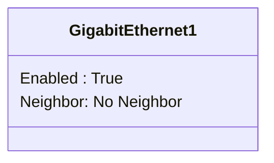
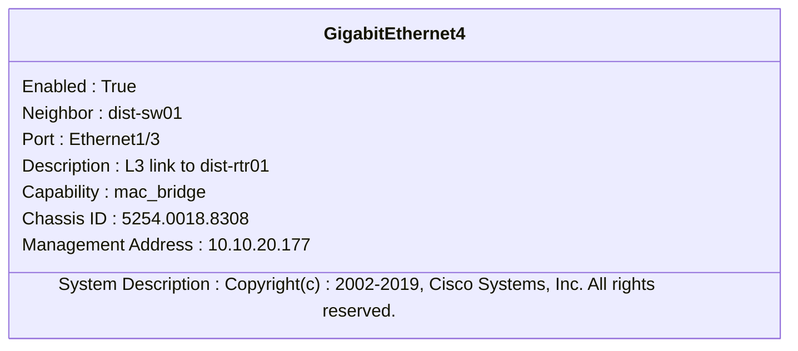
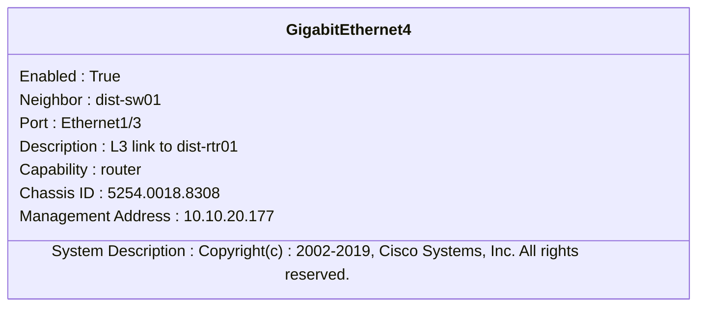
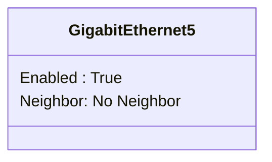
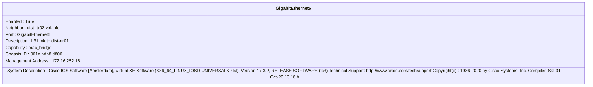
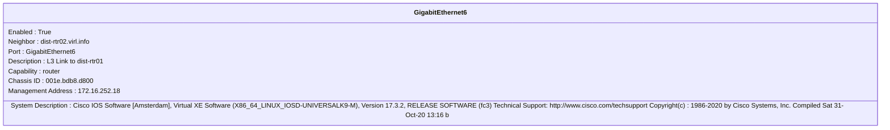
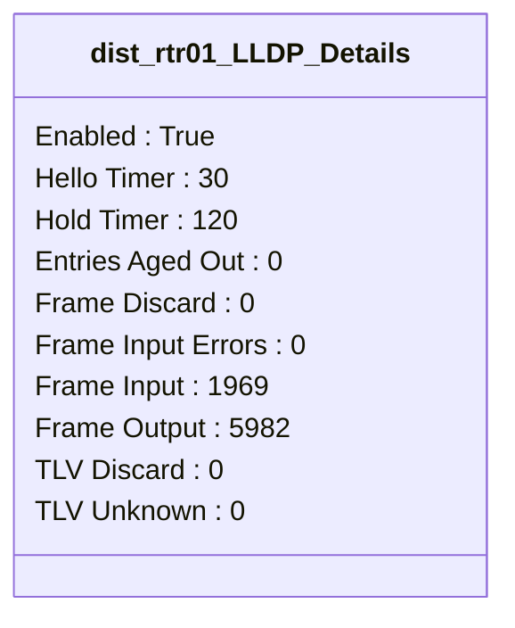

```mermaid
classDiagram
class GigabitEthernet1{
Enabled : True
Neighbor: No Neighbor
}
```

```mermaid
classDiagram
class GigabitEthernet2{
Enabled : True
Neighbor: No Neighbor
}
```

```mermaid
classDiagram
class GigabitEthernet3{
Enabled : True
Neighbor: No Neighbor
}
```

```mermaid
classDiagram
class GigabitEthernet4{
Enabled : True
Neighbor : dist-sw01
Port : Ethernet1/3
Description : L3 link to dist-rtr01
Capability : mac_bridge
Chassis ID : 5254.0018.8308
Management Address : 10.10.20.177
System Description : Copyright (c) 2002-2019, Cisco Systems, Inc. All rights reserved. 
}
```

```mermaid
classDiagram
class GigabitEthernet4{
Enabled : True
Neighbor : dist-sw01
Port : Ethernet1/3
Description : L3 link to dist-rtr01
Capability : router
Chassis ID : 5254.0018.8308
Management Address : 10.10.20.177
System Description : Copyright (c) 2002-2019, Cisco Systems, Inc. All rights reserved. 
}
```

```mermaid
classDiagram
class GigabitEthernet5{
Enabled : True
Neighbor: No Neighbor
}
```

```mermaid
classDiagram
class GigabitEthernet6{
Enabled : True
Neighbor : dist-rtr02.virl.info
Port : GigabitEthernet6
Description : L3 Link to dist-rtr01
Capability : mac_bridge
Chassis ID : 001e.bdb8.d800
Management Address : 172.16.252.18
System Description : Cisco IOS Software [Amsterdam], Virtual XE Software (X86_64_LINUX_IOSD-UNIVERSALK9-M), Version 17.3.2, RELEASE SOFTWARE (fc3) Technical Support: http://www.cisco.com/techsupport Copyright (c) 1986-2020 by Cisco Systems, Inc. Compiled Sat 31-Oct-20 13:16 b
}
```

```mermaid
classDiagram
class GigabitEthernet6{
Enabled : True
Neighbor : dist-rtr02.virl.info
Port : GigabitEthernet6
Description : L3 Link to dist-rtr01
Capability : router
Chassis ID : 001e.bdb8.d800
Management Address : 172.16.252.18
System Description : Cisco IOS Software [Amsterdam], Virtual XE Software (X86_64_LINUX_IOSD-UNIVERSALK9-M), Version 17.3.2, RELEASE SOFTWARE (fc3) Technical Support: http://www.cisco.com/techsupport Copyright (c) 1986-2020 by Cisco Systems, Inc. Compiled Sat 31-Oct-20 13:16 b
}
```

```mermaid
classDiagram
class dist_rtr01_LLDP_Details{
Enabled : True
Hello Timer : 30
Hold Timer : 120
Entries Aged Out : 0
Frame Discard : 0
Frame Input Errors : 0
Frame Input : 1969
Frame Output : 5982
TLV Discard : 0
TLV Unknown : 0
}
```