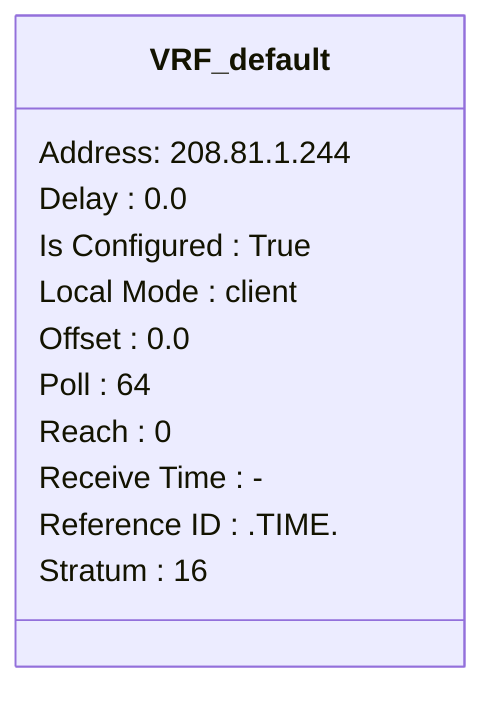
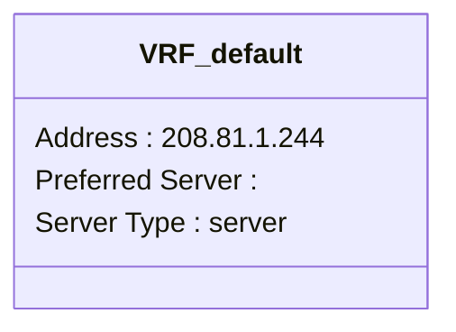
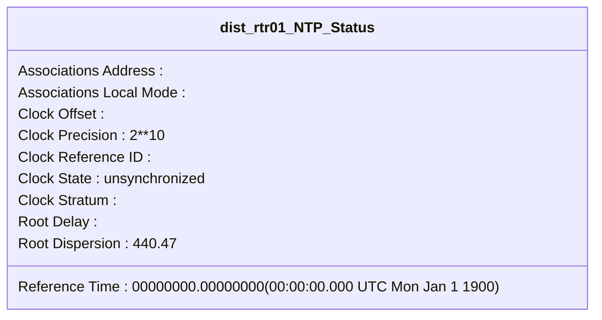

```mermaid
classDiagram
class VRF_default{
Address: 208.81.1.244
Delay : 0.0
Is Configured : True
Local Mode : client
Offset : 0.0
Poll : 64
Reach : 0
Receive Time : -
Reference ID : .TIME.
Stratum : 16
}
```

```mermaid
classDiagram
class VRF_default{
Address : 208.81.1.244
Preferred Server : 
Server Type : server
}
```

```mermaid
classDiagram
class dist_rtr01_NTP_Status{
Associations Address : 
Associations Local Mode : 
Clock Offset : 
Clock Precision : 2**10
Clock Reference ID : 
Clock State : unsynchronized
Clock Stratum : 
Reference Time : 00000000.00000000 (00:00:00.000 UTC Mon Jan 1 1900)
Root Delay : 
Root Dispersion : 440.47
}
```