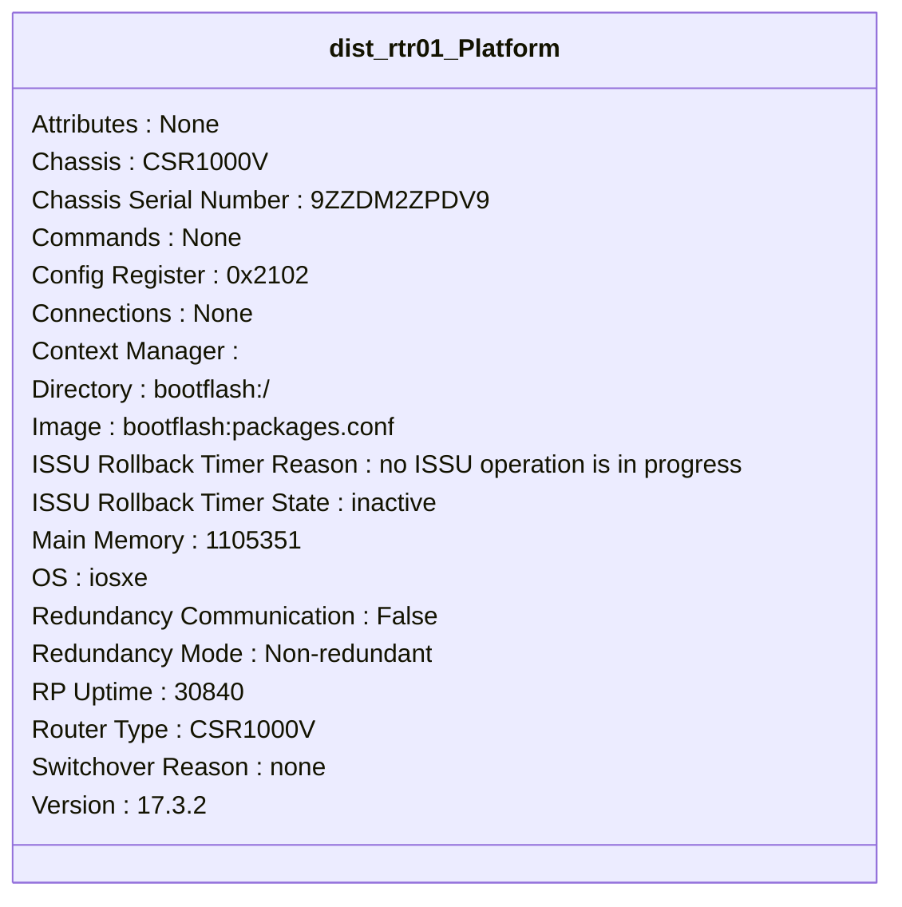

```mermaid
classDiagram
class dist_rtr01_Platform{
Attributes : None
Chassis : CSR1000V
Chassis Serial Number : 9ZZDM2ZPDV9
Commands : None
Config Register : 0x2102
Connections : None
Context Manager : 
Directory : bootflash:/
Image : bootflash:packages.conf
ISSU Rollback Timer Reason : no ISSU operation is in progress
ISSU Rollback Timer State : inactive
Main Memory : 1105351
OS : iosxe
Redundancy Communication : False
Redundancy Mode : Non-redundant
RP Uptime : 30840
Router Type : CSR1000V
Switchover Reason : none
Version : 17.3.2
}
```