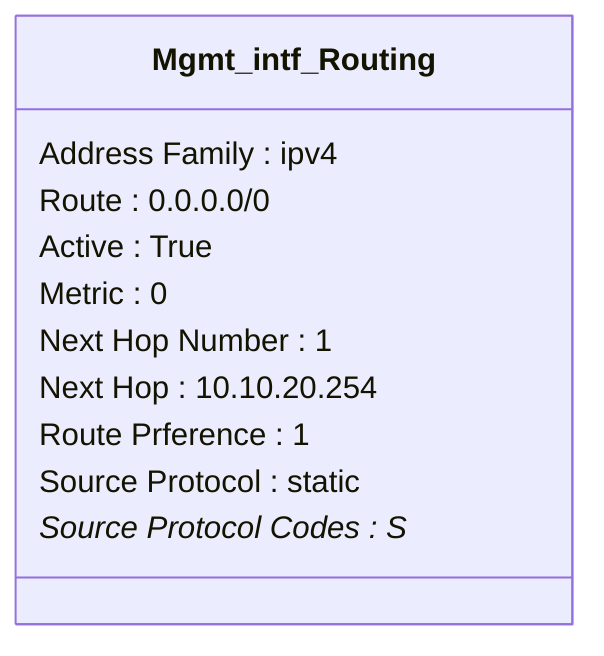
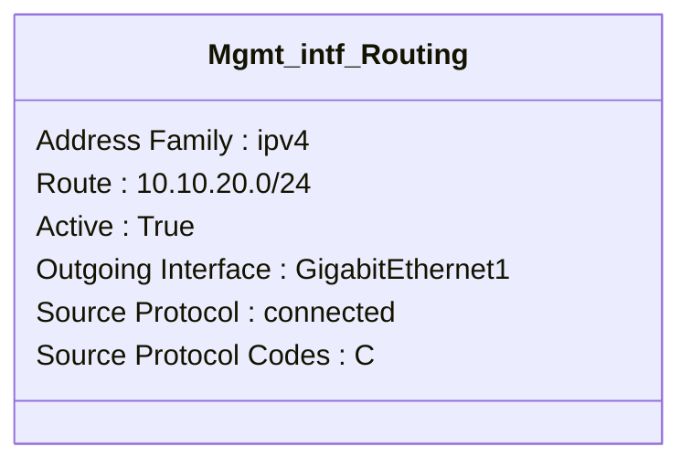
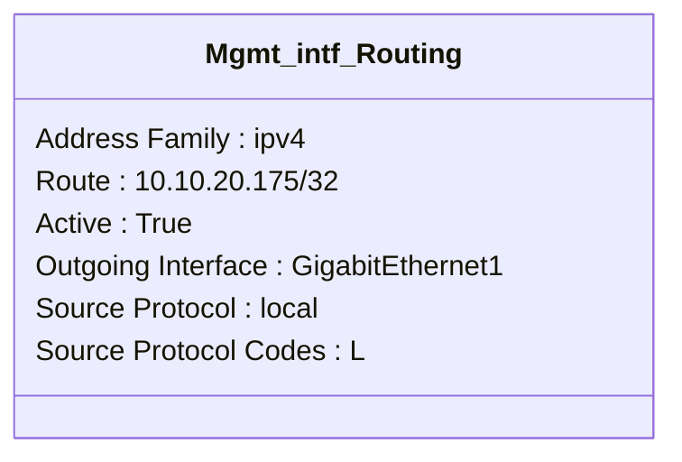
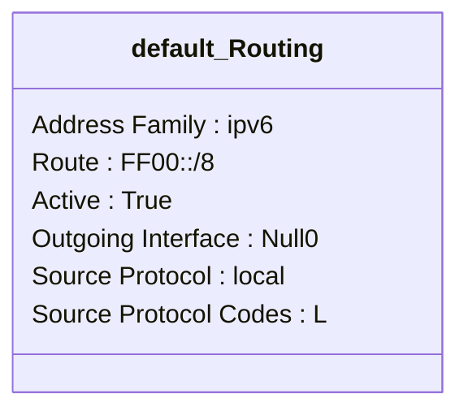

```mermaid
classDiagram
class Mgmt_intf_Routing {
Address Family : ipv4
Route : 0.0.0.0/0
Active : True
Metric : 0
Next Hop Number : 1
Next Hop : 10.10.20.254
Route Prference : 1
Source Protocol : static
Source Protocol Codes : S*
}
```

```mermaid
classDiagram
class Mgmt_intf_Routing {
Address Family : ipv4
Route : 10.10.20.0/24
Active : True
Outgoing Interface : GigabitEthernet1
Source Protocol : connected
Source Protocol Codes : C
}
```

```mermaid
classDiagram
class Mgmt_intf_Routing {
Address Family : ipv4
Route : 10.10.20.175/32
Active : True
Outgoing Interface : GigabitEthernet1
Source Protocol : local
Source Protocol Codes : L
}
```

```mermaid
classDiagram
class default_Routing {
Address Family : ipv6
Route : FF00::/8
Active : True
Outgoing Interface : Null0
Source Protocol : local
Source Protocol Codes : L
}
```