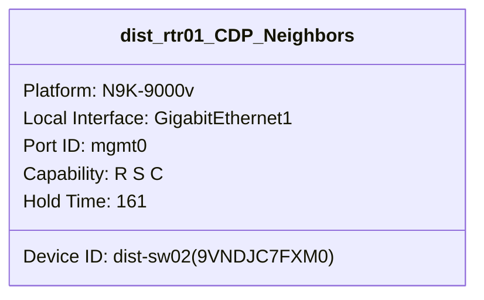
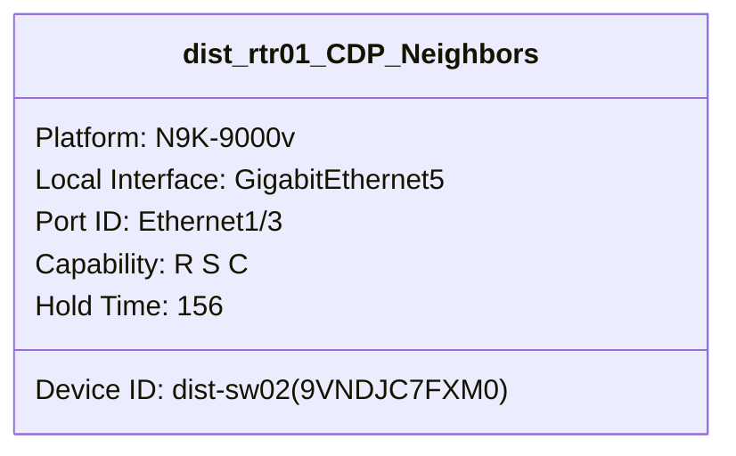
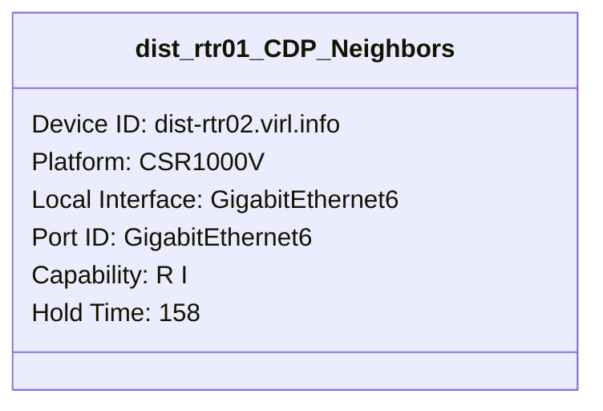
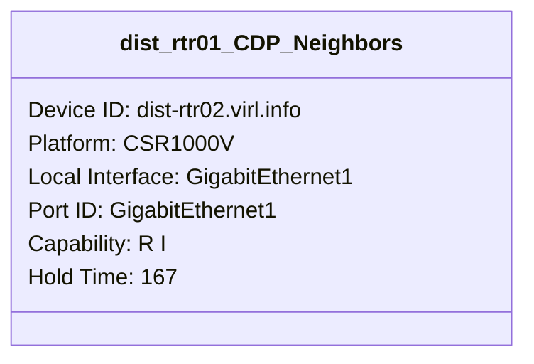
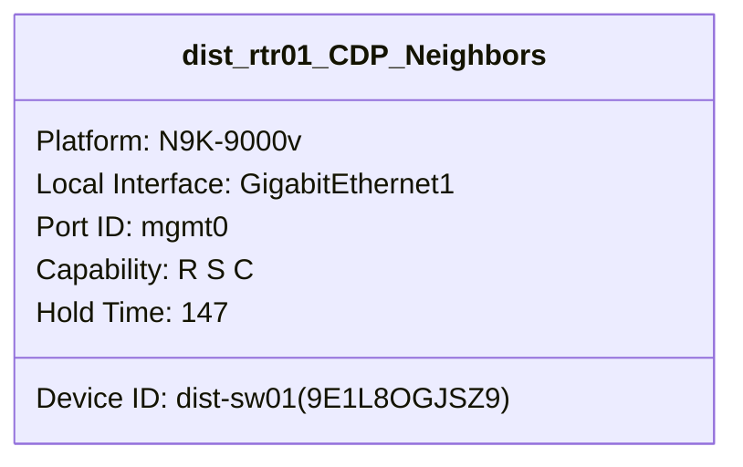
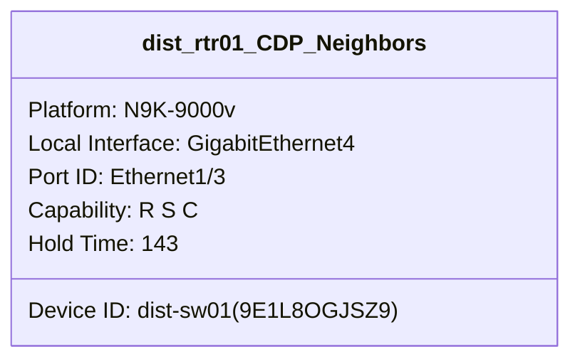

```mermaid
classDiagram
class dist_rtr01_CDP_Neighbors {
Device ID: dist-sw02(9VNDJC7FXM0)
Platform: N9K-9000v
Local Interface: GigabitEthernet1
Port ID: mgmt0
Capability: R S C
Hold Time: 161
}
```

```mermaid
classDiagram
class dist_rtr01_CDP_Neighbors {
Device ID: dist-sw02(9VNDJC7FXM0)
Platform: N9K-9000v
Local Interface: GigabitEthernet5
Port ID: Ethernet1/3
Capability: R S C
Hold Time: 156
}
```

```mermaid
classDiagram
class dist_rtr01_CDP_Neighbors {
Device ID: dist-rtr02.virl.info
Platform: CSR1000V
Local Interface: GigabitEthernet6
Port ID: GigabitEthernet6
Capability: R I
Hold Time: 158
}
```

```mermaid
classDiagram
class dist_rtr01_CDP_Neighbors {
Device ID: dist-rtr02.virl.info
Platform: CSR1000V
Local Interface: GigabitEthernet1
Port ID: GigabitEthernet1
Capability: R I
Hold Time: 167
}
```

```mermaid
classDiagram
class dist_rtr01_CDP_Neighbors {
Device ID: dist-sw01(9E1L8OGJSZ9)
Platform: N9K-9000v
Local Interface: GigabitEthernet1
Port ID: mgmt0
Capability: R S C
Hold Time: 147
}
```

```mermaid
classDiagram
class dist_rtr01_CDP_Neighbors {
Device ID: dist-sw01(9E1L8OGJSZ9)
Platform: N9K-9000v
Local Interface: GigabitEthernet4
Port ID: Ethernet1/3
Capability: R S C
Hold Time: 143
}
```