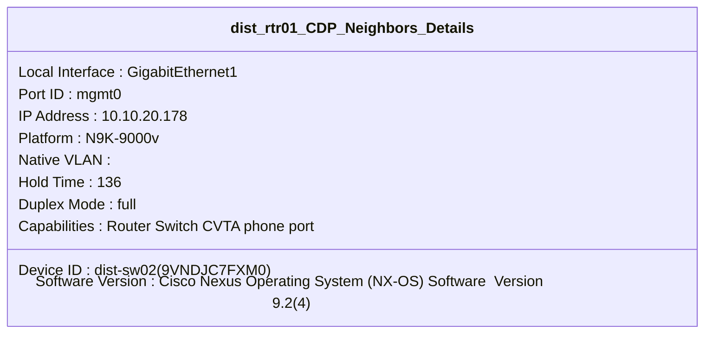
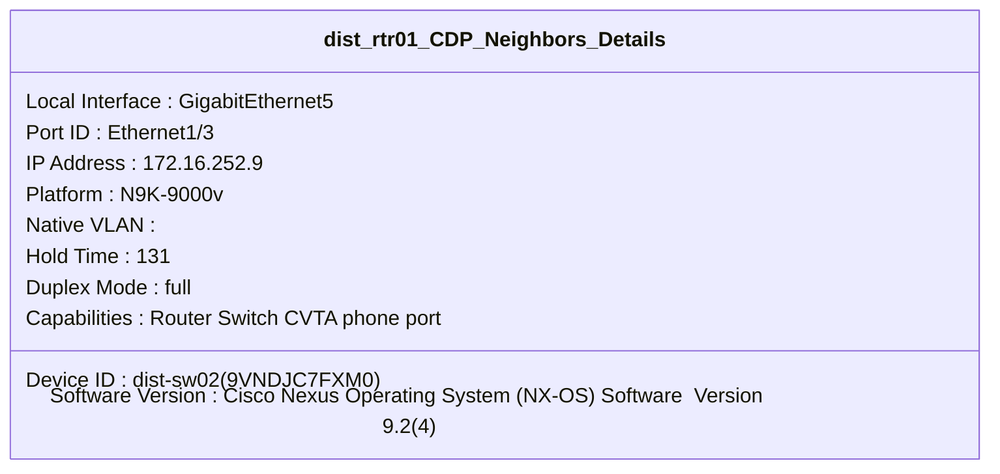
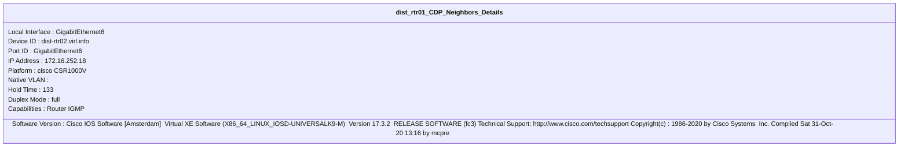
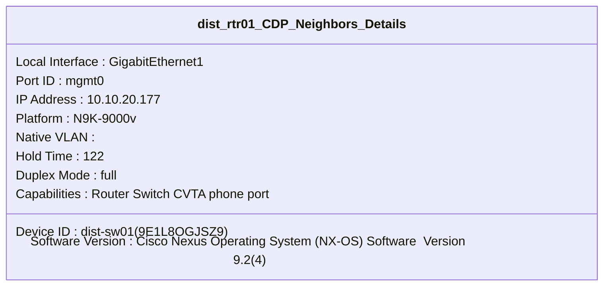

```mermaid
classDiagram
class dist_rtr01_CDP_Neighbors_Details {
Local Interface : GigabitEthernet1
Device ID : dist-sw02(9VNDJC7FXM0)
Port ID : mgmt0
IP Address : 10.10.20.178
Platform : N9K-9000v
Native VLAN : 
Hold Time : 136
Duplex Mode : full
Capabilities : Router Switch CVTA phone port
Software Version : Cisco Nexus Operating System (NX-OS) Software  Version 9.2(4)
}
```

```mermaid
classDiagram
class dist_rtr01_CDP_Neighbors_Details {
Local Interface : GigabitEthernet5
Device ID : dist-sw02(9VNDJC7FXM0)
Port ID : Ethernet1/3
IP Address : 172.16.252.9
Platform : N9K-9000v
Native VLAN : 
Hold Time : 131
Duplex Mode : full
Capabilities : Router Switch CVTA phone port
Software Version : Cisco Nexus Operating System (NX-OS) Software  Version 9.2(4)
}
```

```mermaid
classDiagram
class dist_rtr01_CDP_Neighbors_Details {
Local Interface : GigabitEthernet6
Device ID : dist-rtr02.virl.info
Port ID : GigabitEthernet6
IP Address : 172.16.252.18
Platform : cisco CSR1000V
Native VLAN : 
Hold Time : 133
Duplex Mode : full
Capabilities : Router IGMP
Software Version : Cisco IOS Software [Amsterdam]  Virtual XE Software (X86_64_LINUX_IOSD-UNIVERSALK9-M)  Version 17.3.2  RELEASE SOFTWARE (fc3) Technical Support: http://www.cisco.com/techsupport Copyright (c) 1986-2020 by Cisco Systems  Inc. Compiled Sat 31-Oct-20 13:16 by mcpre
}
```

```mermaid
classDiagram
class dist_rtr01_CDP_Neighbors_Details {
Local Interface : GigabitEthernet1
Device ID : dist-rtr02.virl.info
Port ID : GigabitEthernet1
IP Address : 10.10.20.176
Platform : cisco CSR1000V
Native VLAN : 
Hold Time : 142
Duplex Mode : full
Capabilities : Router IGMP
Software Version : Cisco IOS Software [Amsterdam]  Virtual XE Software (X86_64_LINUX_IOSD-UNIVERSALK9-M)  Version 17.3.2  RELEASE SOFTWARE (fc3) Technical Support: http://www.cisco.com/techsupport Copyright (c) 1986-2020 by Cisco Systems  Inc. Compiled Sat 31-Oct-20 13:16 by mcpre
}
```

```mermaid
classDiagram
class dist_rtr01_CDP_Neighbors_Details {
Local Interface : GigabitEthernet1
Device ID : dist-sw01(9E1L8OGJSZ9)
Port ID : mgmt0
IP Address : 10.10.20.177
Platform : N9K-9000v
Native VLAN : 
Hold Time : 122
Duplex Mode : full
Capabilities : Router Switch CVTA phone port
Software Version : Cisco Nexus Operating System (NX-OS) Software  Version 9.2(4)
}
```

```mermaid
classDiagram
class dist_rtr01_CDP_Neighbors_Details {
Local Interface : GigabitEthernet4
Device ID : dist-sw01(9E1L8OGJSZ9)
Port ID : Ethernet1/3
IP Address : 172.16.252.1
Platform : N9K-9000v
Native VLAN : 
Hold Time : 178
Duplex Mode : full
Capabilities : Router Switch CVTA phone port
Software Version : Cisco Nexus Operating System (NX-OS) Software  Version 9.2(4)
}
```