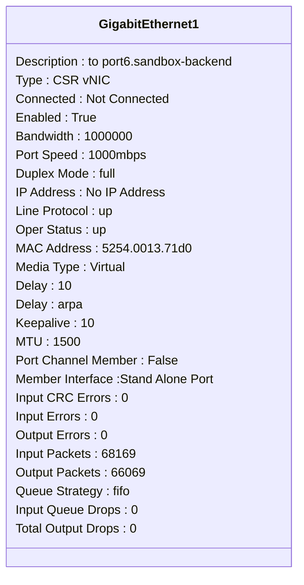
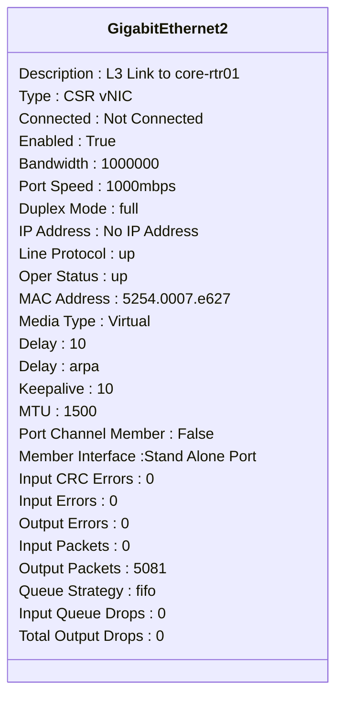
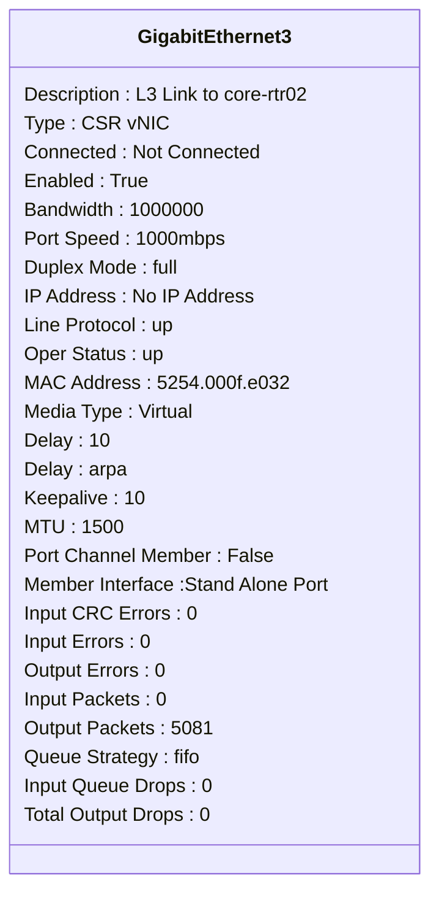
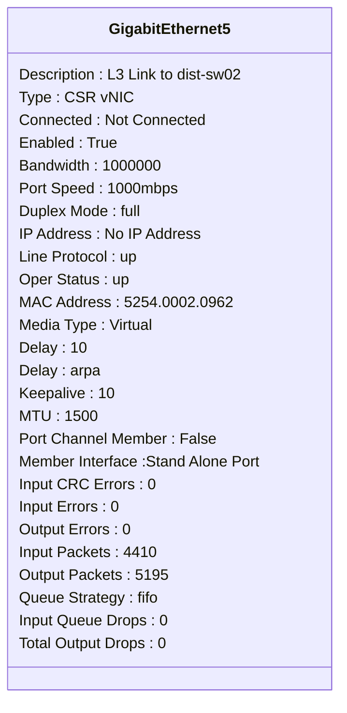
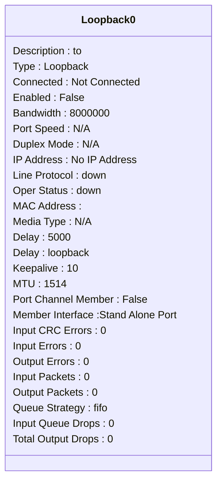

```mermaid
classDiagram
class GigabitEthernet1 {
Description : to port6.sandbox-backend
Type : CSR vNIC
Connected : Not Connected
Enabled : True
Bandwidth : 1000000
Port Speed : 1000mbps
Duplex Mode : full
IP Address : No IP Address
Line Protocol : up
Oper Status : up
MAC Address : 5254.0013.71d0
Media Type : Virtual
Delay : 10
Delay : arpa
Keepalive : 10
MTU : 1500
Port Channel Member : False
Member Interface :Stand Alone Port
Input CRC Errors : 0
Input Errors : 0
Output Errors : 0
Input Packets : 68169
Output Packets : 66069
Queue Strategy : fifo
Input Queue Drops : 0
Total Output Drops : 0
}
```

```mermaid
classDiagram
class GigabitEthernet2 {
Description : L3 Link to core-rtr01
Type : CSR vNIC
Connected : Not Connected
Enabled : True
Bandwidth : 1000000
Port Speed : 1000mbps
Duplex Mode : full
IP Address : No IP Address
Line Protocol : up
Oper Status : up
MAC Address : 5254.0007.e627
Media Type : Virtual
Delay : 10
Delay : arpa
Keepalive : 10
MTU : 1500
Port Channel Member : False
Member Interface :Stand Alone Port
Input CRC Errors : 0
Input Errors : 0
Output Errors : 0
Input Packets : 0
Output Packets : 5081
Queue Strategy : fifo
Input Queue Drops : 0
Total Output Drops : 0
}
```

```mermaid
classDiagram
class GigabitEthernet3 {
Description : L3 Link to core-rtr02
Type : CSR vNIC
Connected : Not Connected
Enabled : True
Bandwidth : 1000000
Port Speed : 1000mbps
Duplex Mode : full
IP Address : No IP Address
Line Protocol : up
Oper Status : up
MAC Address : 5254.000f.e032
Media Type : Virtual
Delay : 10
Delay : arpa
Keepalive : 10
MTU : 1500
Port Channel Member : False
Member Interface :Stand Alone Port
Input CRC Errors : 0
Input Errors : 0
Output Errors : 0
Input Packets : 0
Output Packets : 5081
Queue Strategy : fifo
Input Queue Drops : 0
Total Output Drops : 0
}
```

```mermaid
classDiagram
class GigabitEthernet4 {
Description : L3 Link to dist-sw01
Type : CSR vNIC
Connected : Not Connected
Enabled : True
Bandwidth : 1000000
Port Speed : 1000mbps
Duplex Mode : full
IP Address : No IP Address
Line Protocol : up
Oper Status : up
MAC Address : 5254.0016.f297
Media Type : Virtual
Delay : 10
Delay : arpa
Keepalive : 10
MTU : 1500
Port Channel Member : False
Member Interface :Stand Alone Port
Input CRC Errors : 0
Input Errors : 0
Output Errors : 0
Input Packets : 5471
Output Packets : 5209
Queue Strategy : fifo
Input Queue Drops : 0
Total Output Drops : 0
}
```

```mermaid
classDiagram
class GigabitEthernet5 {
Description : L3 Link to dist-sw02
Type : CSR vNIC
Connected : Not Connected
Enabled : True
Bandwidth : 1000000
Port Speed : 1000mbps
Duplex Mode : full
IP Address : No IP Address
Line Protocol : up
Oper Status : up
MAC Address : 5254.0002.0962
Media Type : Virtual
Delay : 10
Delay : arpa
Keepalive : 10
MTU : 1500
Port Channel Member : False
Member Interface :Stand Alone Port
Input CRC Errors : 0
Input Errors : 0
Output Errors : 0
Input Packets : 4410
Output Packets : 5195
Queue Strategy : fifo
Input Queue Drops : 0
Total Output Drops : 0
}
```

```mermaid
classDiagram
class GigabitEthernet6 {
Description : L3 Link to dist-rtr02
Type : CSR vNIC
Connected : Not Connected
Enabled : True
Bandwidth : 1000000
Port Speed : 1000mbps
Duplex Mode : full
IP Address : No IP Address
Line Protocol : up
Oper Status : up
MAC Address : 5254.000b.1625
Media Type : Virtual
Delay : 10
Delay : arpa
Keepalive : 10
MTU : 1500
Port Channel Member : False
Member Interface :Stand Alone Port
Input CRC Errors : 0
Input Errors : 0
Output Errors : 0
Input Packets : 5167
Output Packets : 5193
Queue Strategy : fifo
Input Queue Drops : 0
Total Output Drops : 0
}
```

```mermaid
classDiagram
class Loopback0 {
Description : to
Type : Loopback
Connected : Not Connected
Enabled : False
Bandwidth : 8000000
Port Speed : N/A
Duplex Mode : N/A
IP Address : No IP Address
Line Protocol : down
Oper Status : down
MAC Address : 
Media Type : N/A
Delay : 5000
Delay : loopback
Keepalive : 10
MTU : 1514
Port Channel Member : False
Member Interface :Stand Alone Port
Input CRC Errors : 0
Input Errors : 0
Output Errors : 0
Input Packets : 0
Output Packets : 0
Queue Strategy : fifo
Input Queue Drops : 0
Total Output Drops : 0
}
```