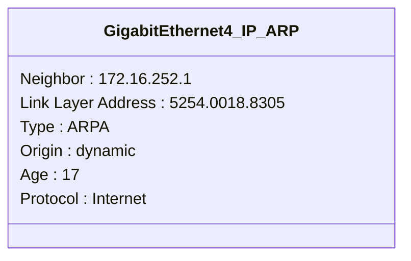
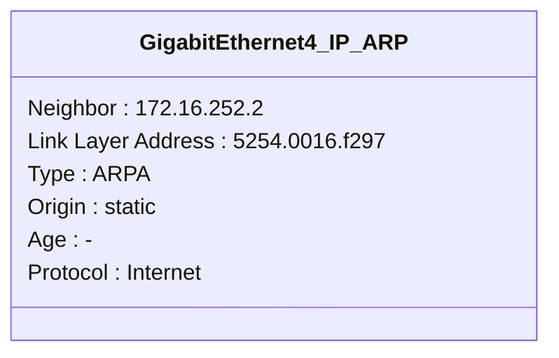
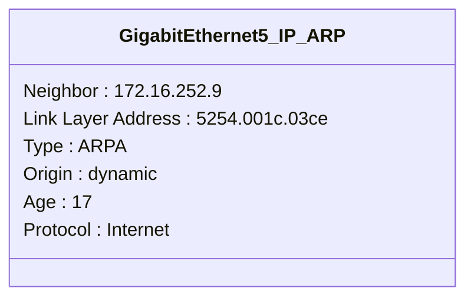
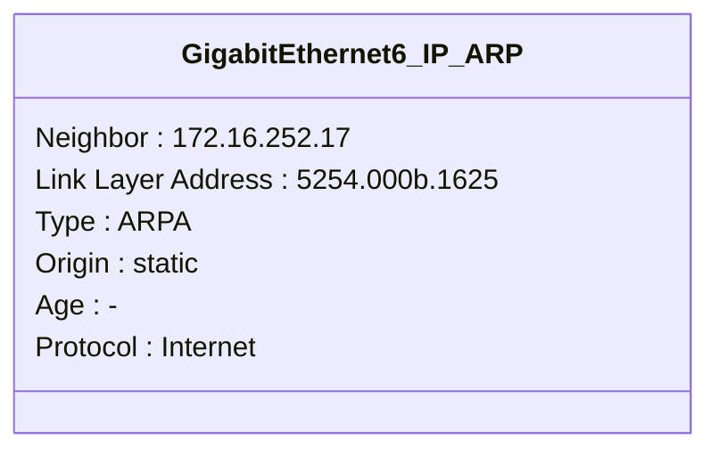
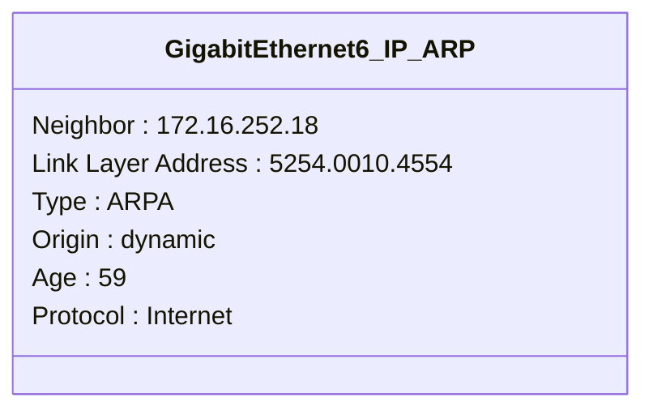

```mermaid
classDiagram
class GigabitEthernet2_IP_ARP {
Neighbor : 172.16.252.21
Link Layer Address : 5254.0007.e627
Type : ARPA
Origin : static
Age : -
Protocol : Internet
}
```

```mermaid
classDiagram
class GigabitEthernet3_IP_ARP {
Neighbor : 172.16.252.25
Link Layer Address : 5254.000f.e032
Type : ARPA
Origin : static
Age : -
Protocol : Internet
}
```

```mermaid
classDiagram
class GigabitEthernet4_IP_ARP {
Neighbor : 172.16.252.1
Link Layer Address : 5254.0018.8305
Type : ARPA
Origin : dynamic
Age : 17
Protocol : Internet
}
```

```mermaid
classDiagram
class GigabitEthernet4_IP_ARP {
Neighbor : 172.16.252.2
Link Layer Address : 5254.0016.f297
Type : ARPA
Origin : static
Age : -
Protocol : Internet
}
```

```mermaid
classDiagram
class GigabitEthernet5_IP_ARP {
Neighbor : 172.16.252.10
Link Layer Address : 5254.0002.0962
Type : ARPA
Origin : static
Age : -
Protocol : Internet
}
```

```mermaid
classDiagram
class GigabitEthernet5_IP_ARP {
Neighbor : 172.16.252.9
Link Layer Address : 5254.001c.03ce
Type : ARPA
Origin : dynamic
Age : 17
Protocol : Internet
}
```

```mermaid
classDiagram
class GigabitEthernet6_IP_ARP {
Neighbor : 172.16.252.17
Link Layer Address : 5254.000b.1625
Type : ARPA
Origin : static
Age : -
Protocol : Internet
}
```

```mermaid
classDiagram
class GigabitEthernet6_IP_ARP {
Neighbor : 172.16.252.18
Link Layer Address : 5254.0010.4554
Type : ARPA
Origin : dynamic
Age : 59
Protocol : Internet
}
```