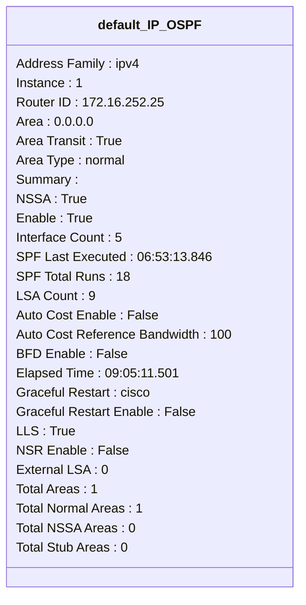
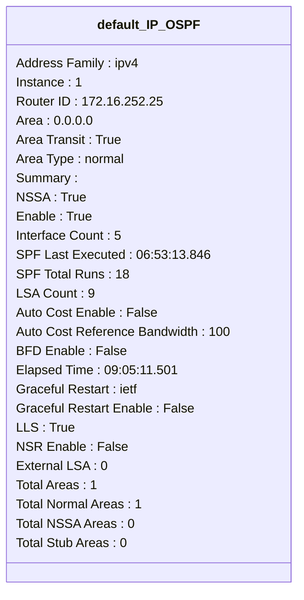

```mermaid
classDiagram
class default_IP_OSPF {
Address Family : ipv4
Instance : 1
Router ID : 172.16.252.25
Area : 0.0.0.0
Area Transit : True
Area Type : normal
Summary : 
NSSA : True
Enable : True
Interface Count : 5
SPF Last Executed : 06:53:13.846
SPF Total Runs : 18
LSA Count : 9
Auto Cost Enable : False
Auto Cost Reference Bandwidth : 100
BFD Enable : False
Elapsed Time : 09:05:11.501
Graceful Restart : cisco
Graceful Restart Enable : False
LLS : True
NSR Enable : False
External LSA : 0
Total Areas : 1
Total Normal Areas : 1
Total NSSA Areas : 0
Total Stub Areas : 0
}
```

```mermaid
classDiagram
class default_IP_OSPF {
Address Family : ipv4
Instance : 1
Router ID : 172.16.252.25
Area : 0.0.0.0
Area Transit : True
Area Type : normal
Summary : 
NSSA : True
Enable : True
Interface Count : 5
SPF Last Executed : 06:53:13.846
SPF Total Runs : 18
LSA Count : 9
Auto Cost Enable : False
Auto Cost Reference Bandwidth : 100
BFD Enable : False
Elapsed Time : 09:05:11.501
Graceful Restart : ietf
Graceful Restart Enable : False
LLS : True
NSR Enable : False
External LSA : 0
Total Areas : 1
Total Normal Areas : 1
Total NSSA Areas : 0
Total Stub Areas : 0
}
```