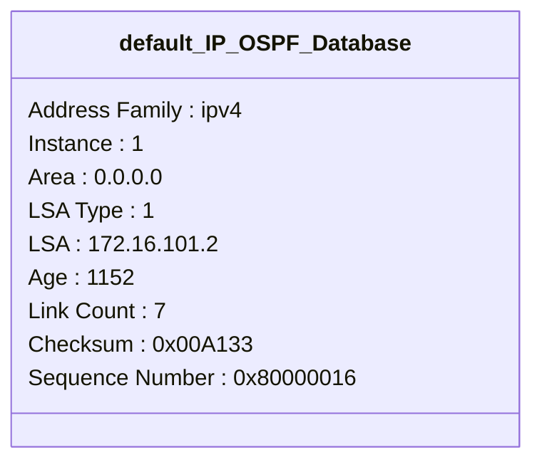
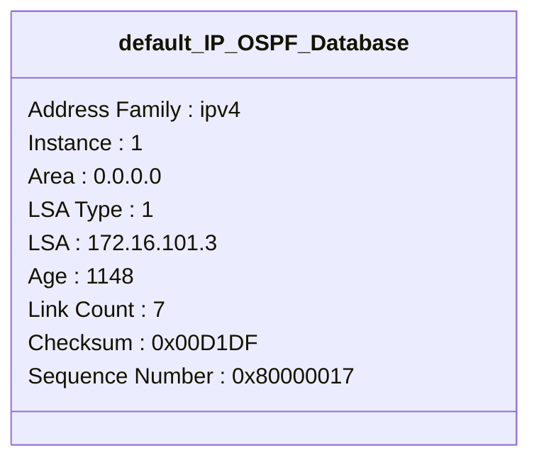
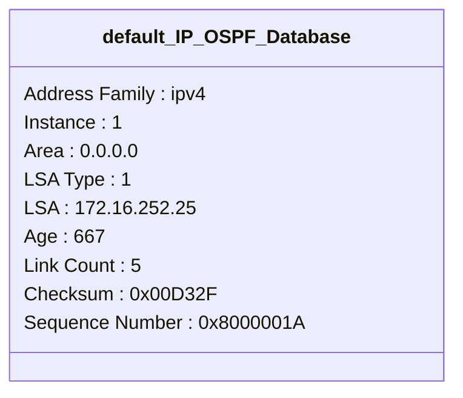
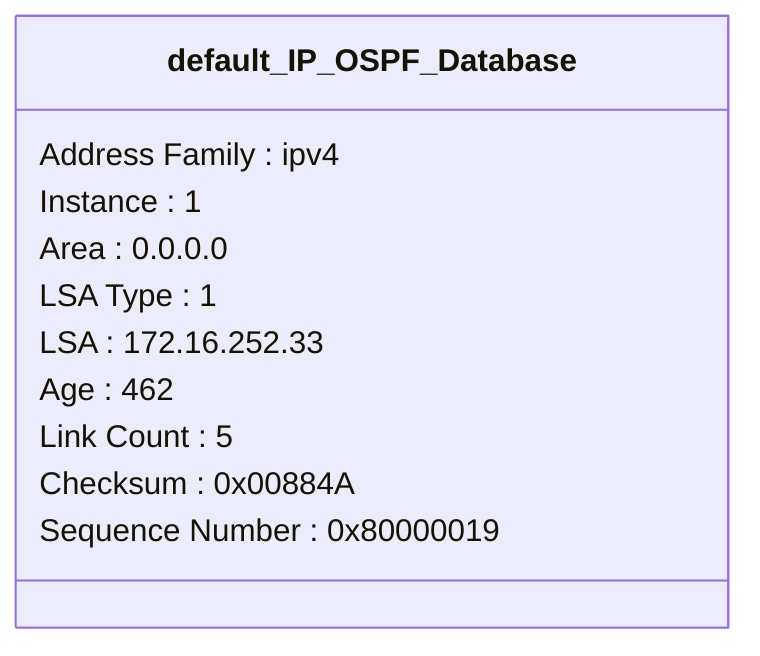
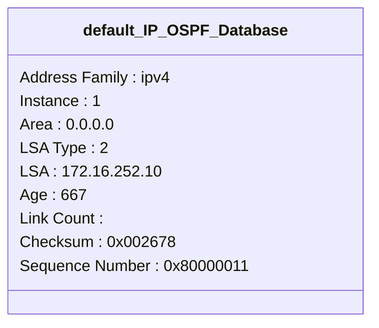
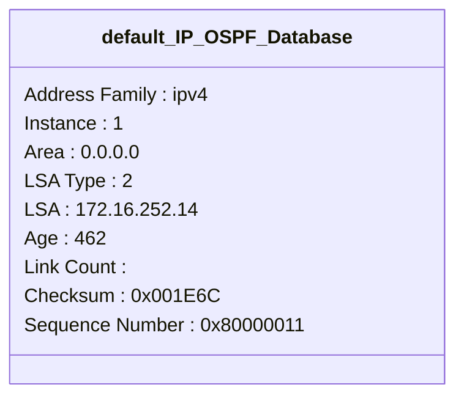

```mermaid
classDiagram
class default_IP_OSPF_Database {
Address Family : ipv4
Instance : 1
Area : 0.0.0.0
LSA Type : 1
LSA : 172.16.101.2
Age : 1152
Link Count : 7
Checksum : 0x00A133
Sequence Number : 0x80000016
}
```

```mermaid
classDiagram
class default_IP_OSPF_Database {
Address Family : ipv4
Instance : 1
Area : 0.0.0.0
LSA Type : 1
LSA : 172.16.101.3
Age : 1148
Link Count : 7
Checksum : 0x00D1DF
Sequence Number : 0x80000017
}
```

```mermaid
classDiagram
class default_IP_OSPF_Database {
Address Family : ipv4
Instance : 1
Area : 0.0.0.0
LSA Type : 1
LSA : 172.16.252.25
Age : 667
Link Count : 5
Checksum : 0x00D32F
Sequence Number : 0x8000001A
}
```

```mermaid
classDiagram
class default_IP_OSPF_Database {
Address Family : ipv4
Instance : 1
Area : 0.0.0.0
LSA Type : 1
LSA : 172.16.252.33
Age : 462
Link Count : 5
Checksum : 0x00884A
Sequence Number : 0x80000019
}
```

```mermaid
classDiagram
class default_IP_OSPF_Database {
Address Family : ipv4
Instance : 1
Area : 0.0.0.0
LSA Type : 2
LSA : 172.16.252.10
Age : 667
Link Count : 
Checksum : 0x002678
Sequence Number : 0x80000011
}
```

```mermaid
classDiagram
class default_IP_OSPF_Database {
Address Family : ipv4
Instance : 1
Area : 0.0.0.0
LSA Type : 2
LSA : 172.16.252.14
Age : 462
Link Count : 
Checksum : 0x001E6C
Sequence Number : 0x80000011
}
```

```mermaid
classDiagram
class default_IP_OSPF_Database {
Address Family : ipv4
Instance : 1
Area : 0.0.0.0
LSA Type : 2
LSA : 172.16.252.18
Age : 462
Link Count : 
Checksum : 0x00DDFA
Sequence Number : 0x80000011
}
```

```mermaid
classDiagram
class default_IP_OSPF_Database {
Address Family : ipv4
Instance : 1
Area : 0.0.0.0
LSA Type : 2
LSA : 172.16.252.2
Age : 667
Link Count : 
Checksum : 0x00683F
Sequence Number : 0x80000011
}
```

```mermaid
classDiagram
class default_IP_OSPF_Database {
Address Family : ipv4
Instance : 1
Area : 0.0.0.0
LSA Type : 2
LSA : 172.16.252.6
Age : 462
Link Count : 
Checksum : 0x006033
Sequence Number : 0x80000011
}
```