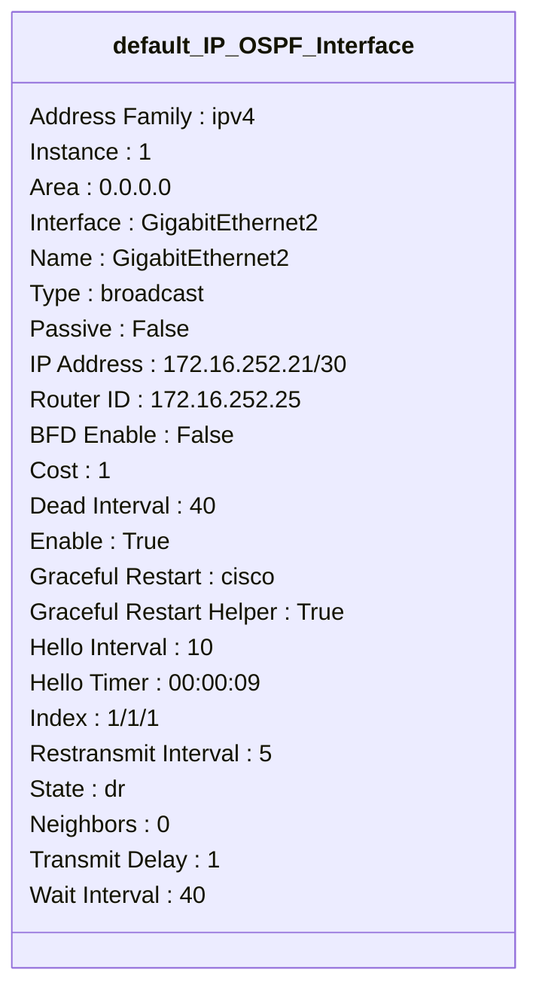
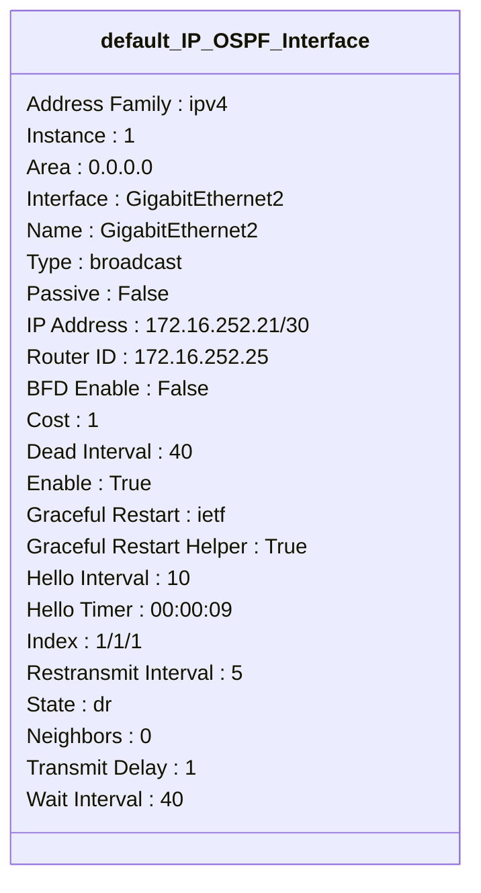
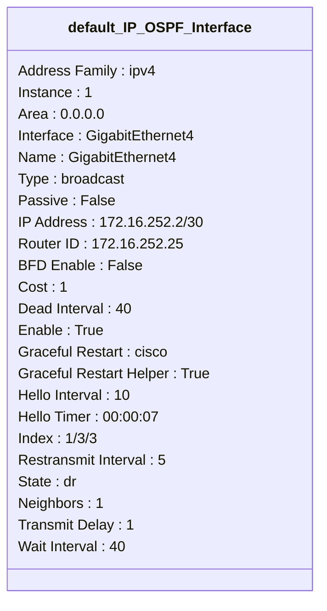
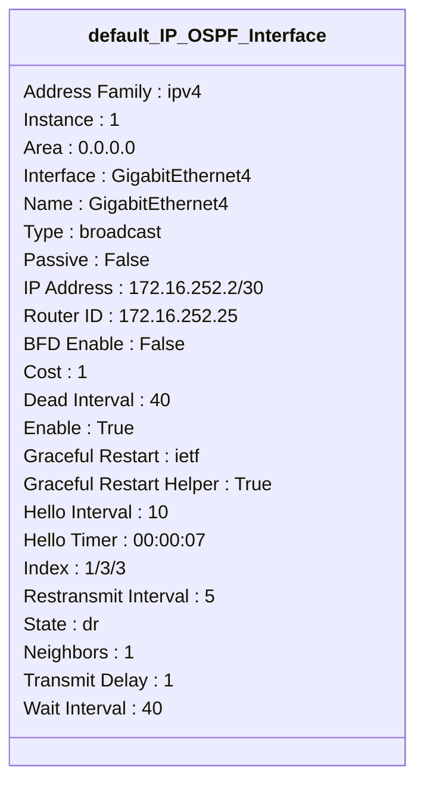
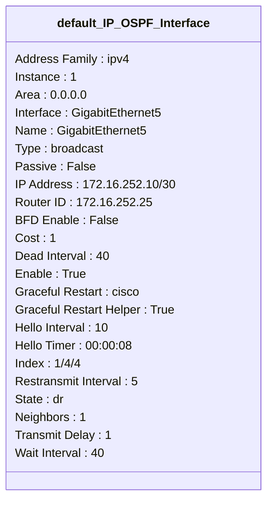
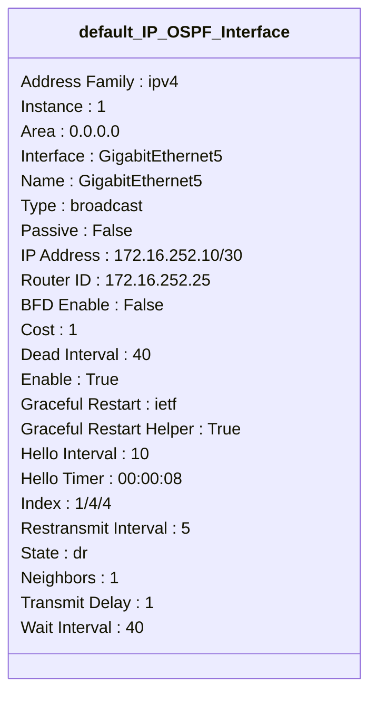
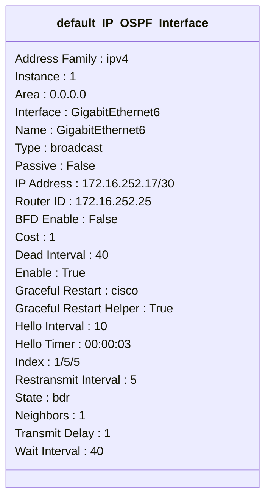
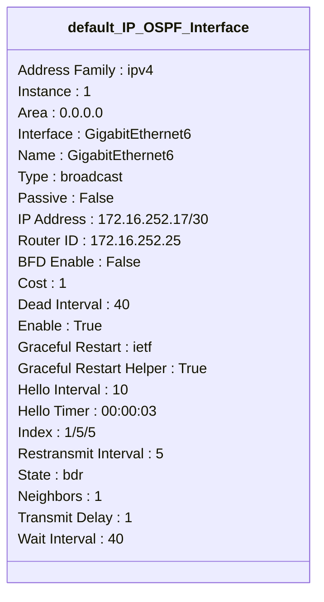

```mermaid
classDiagram
class default_IP_OSPF_Interface {
Address Family : ipv4
Instance : 1
Area : 0.0.0.0
Interface : GigabitEthernet2
Name : GigabitEthernet2
Type : broadcast
Passive : False
IP Address : 172.16.252.21/30
Router ID : 172.16.252.25
BFD Enable : False
Cost : 1
Dead Interval : 40
Enable : True
Graceful Restart : cisco
Graceful Restart Helper : True
Hello Interval : 10
Hello Timer : 00:00:09
Index : 1/1/1
Restransmit Interval : 5
State : dr
Neighbors : 0
Transmit Delay : 1
Wait Interval : 40
}
```

```mermaid
classDiagram
class default_IP_OSPF_Interface {
Address Family : ipv4
Instance : 1
Area : 0.0.0.0
Interface : GigabitEthernet2
Name : GigabitEthernet2
Type : broadcast
Passive : False
IP Address : 172.16.252.21/30
Router ID : 172.16.252.25
BFD Enable : False
Cost : 1
Dead Interval : 40
Enable : True
Graceful Restart : ietf
Graceful Restart Helper : True
Hello Interval : 10
Hello Timer : 00:00:09
Index : 1/1/1
Restransmit Interval : 5
State : dr
Neighbors : 0
Transmit Delay : 1
Wait Interval : 40
}
```

```mermaid
classDiagram
class default_IP_OSPF_Interface {
Address Family : ipv4
Instance : 1
Area : 0.0.0.0
Interface : GigabitEthernet3
Name : GigabitEthernet3
Type : broadcast
Passive : False
IP Address : 172.16.252.25/30
Router ID : 172.16.252.25
BFD Enable : False
Cost : 1
Dead Interval : 40
Enable : True
Graceful Restart : cisco
Graceful Restart Helper : True
Hello Interval : 10
Hello Timer : 00:00:00
Index : 1/2/2
Restransmit Interval : 5
State : dr
Neighbors : 0
Transmit Delay : 1
Wait Interval : 40
}
```

```mermaid
classDiagram
class default_IP_OSPF_Interface {
Address Family : ipv4
Instance : 1
Area : 0.0.0.0
Interface : GigabitEthernet3
Name : GigabitEthernet3
Type : broadcast
Passive : False
IP Address : 172.16.252.25/30
Router ID : 172.16.252.25
BFD Enable : False
Cost : 1
Dead Interval : 40
Enable : True
Graceful Restart : ietf
Graceful Restart Helper : True
Hello Interval : 10
Hello Timer : 00:00:00
Index : 1/2/2
Restransmit Interval : 5
State : dr
Neighbors : 0
Transmit Delay : 1
Wait Interval : 40
}
```

```mermaid
classDiagram
class default_IP_OSPF_Interface {
Address Family : ipv4
Instance : 1
Area : 0.0.0.0
Interface : GigabitEthernet4
Name : GigabitEthernet4
Type : broadcast
Passive : False
IP Address : 172.16.252.2/30
Router ID : 172.16.252.25
BFD Enable : False
Cost : 1
Dead Interval : 40
Enable : True
Graceful Restart : cisco
Graceful Restart Helper : True
Hello Interval : 10
Hello Timer : 00:00:07
Index : 1/3/3
Restransmit Interval : 5
State : dr
Neighbors : 1
Transmit Delay : 1
Wait Interval : 40
}
```

```mermaid
classDiagram
class default_IP_OSPF_Interface {
Address Family : ipv4
Instance : 1
Area : 0.0.0.0
Interface : GigabitEthernet4
Name : GigabitEthernet4
Type : broadcast
Passive : False
IP Address : 172.16.252.2/30
Router ID : 172.16.252.25
BFD Enable : False
Cost : 1
Dead Interval : 40
Enable : True
Graceful Restart : ietf
Graceful Restart Helper : True
Hello Interval : 10
Hello Timer : 00:00:07
Index : 1/3/3
Restransmit Interval : 5
State : dr
Neighbors : 1
Transmit Delay : 1
Wait Interval : 40
}
```

```mermaid
classDiagram
class default_IP_OSPF_Interface {
Address Family : ipv4
Instance : 1
Area : 0.0.0.0
Interface : GigabitEthernet5
Name : GigabitEthernet5
Type : broadcast
Passive : False
IP Address : 172.16.252.10/30
Router ID : 172.16.252.25
BFD Enable : False
Cost : 1
Dead Interval : 40
Enable : True
Graceful Restart : cisco
Graceful Restart Helper : True
Hello Interval : 10
Hello Timer : 00:00:08
Index : 1/4/4
Restransmit Interval : 5
State : dr
Neighbors : 1
Transmit Delay : 1
Wait Interval : 40
}
```

```mermaid
classDiagram
class default_IP_OSPF_Interface {
Address Family : ipv4
Instance : 1
Area : 0.0.0.0
Interface : GigabitEthernet5
Name : GigabitEthernet5
Type : broadcast
Passive : False
IP Address : 172.16.252.10/30
Router ID : 172.16.252.25
BFD Enable : False
Cost : 1
Dead Interval : 40
Enable : True
Graceful Restart : ietf
Graceful Restart Helper : True
Hello Interval : 10
Hello Timer : 00:00:08
Index : 1/4/4
Restransmit Interval : 5
State : dr
Neighbors : 1
Transmit Delay : 1
Wait Interval : 40
}
```

```mermaid
classDiagram
class default_IP_OSPF_Interface {
Address Family : ipv4
Instance : 1
Area : 0.0.0.0
Interface : GigabitEthernet6
Name : GigabitEthernet6
Type : broadcast
Passive : False
IP Address : 172.16.252.17/30
Router ID : 172.16.252.25
BFD Enable : False
Cost : 1
Dead Interval : 40
Enable : True
Graceful Restart : cisco
Graceful Restart Helper : True
Hello Interval : 10
Hello Timer : 00:00:03
Index : 1/5/5
Restransmit Interval : 5
State : bdr
Neighbors : 1
Transmit Delay : 1
Wait Interval : 40
}
```

```mermaid
classDiagram
class default_IP_OSPF_Interface {
Address Family : ipv4
Instance : 1
Area : 0.0.0.0
Interface : GigabitEthernet6
Name : GigabitEthernet6
Type : broadcast
Passive : False
IP Address : 172.16.252.17/30
Router ID : 172.16.252.25
BFD Enable : False
Cost : 1
Dead Interval : 40
Enable : True
Graceful Restart : ietf
Graceful Restart Helper : True
Hello Interval : 10
Hello Timer : 00:00:03
Index : 1/5/5
Restransmit Interval : 5
State : bdr
Neighbors : 1
Transmit Delay : 1
Wait Interval : 40
}
```