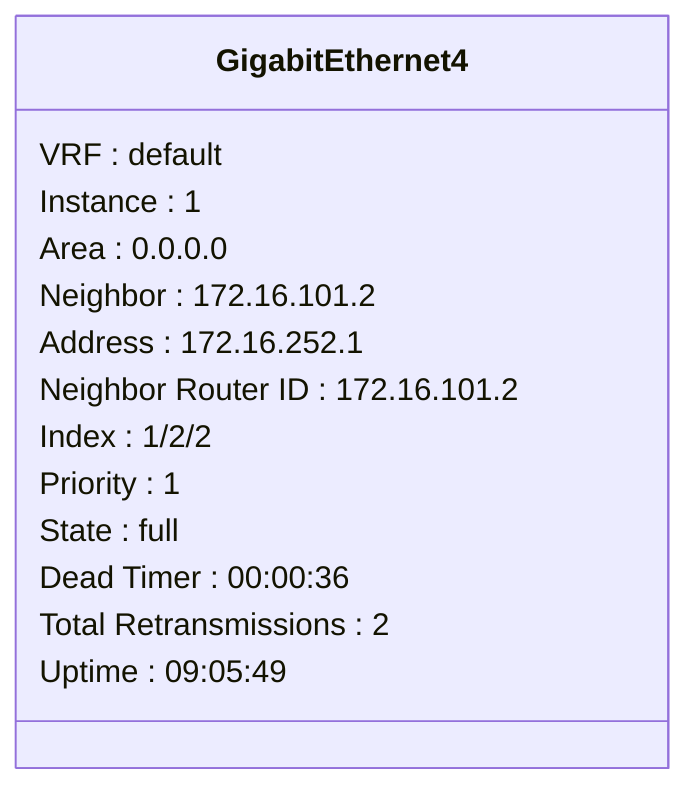
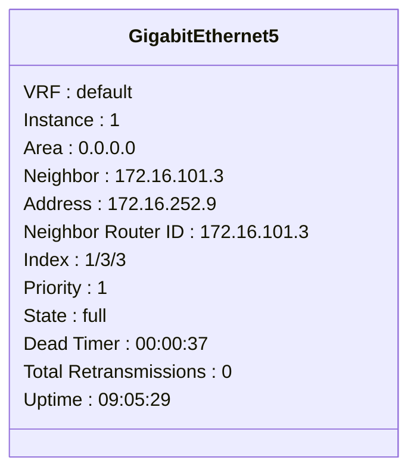
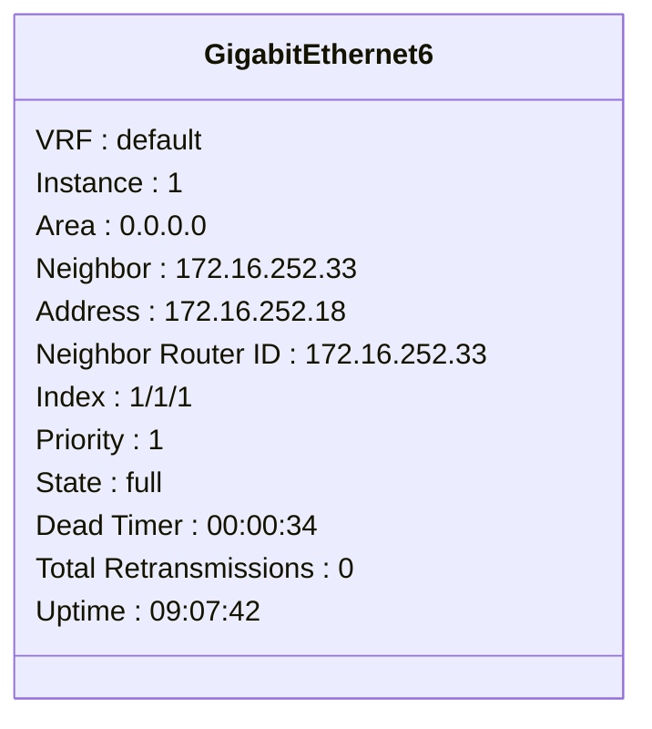

```mermaid
classDiagram
class GigabitEthernet4 {
VRF : default
Instance : 1
Area : 0.0.0.0
Neighbor : 172.16.101.2
Address : 172.16.252.1
Neighbor Router ID : 172.16.101.2
Index : 1/2/2
Priority : 1
State : full
Dead Timer : 00:00:36
Total Retransmissions : 2
Uptime : 09:05:49
}
```

```mermaid
classDiagram
class GigabitEthernet5 {
VRF : default
Instance : 1
Area : 0.0.0.0
Neighbor : 172.16.101.3
Address : 172.16.252.9
Neighbor Router ID : 172.16.101.3
Index : 1/3/3
Priority : 1
State : full
Dead Timer : 00:00:37
Total Retransmissions : 0
Uptime : 09:05:29
}
```

```mermaid
classDiagram
class GigabitEthernet6 {
VRF : default
Instance : 1
Area : 0.0.0.0
Neighbor : 172.16.252.33
Address : 172.16.252.18
Neighbor Router ID : 172.16.252.33
Index : 1/1/1
Priority : 1
State : full
Dead Timer : 00:00:34
Total Retransmissions : 0
Uptime : 09:07:42
}
```