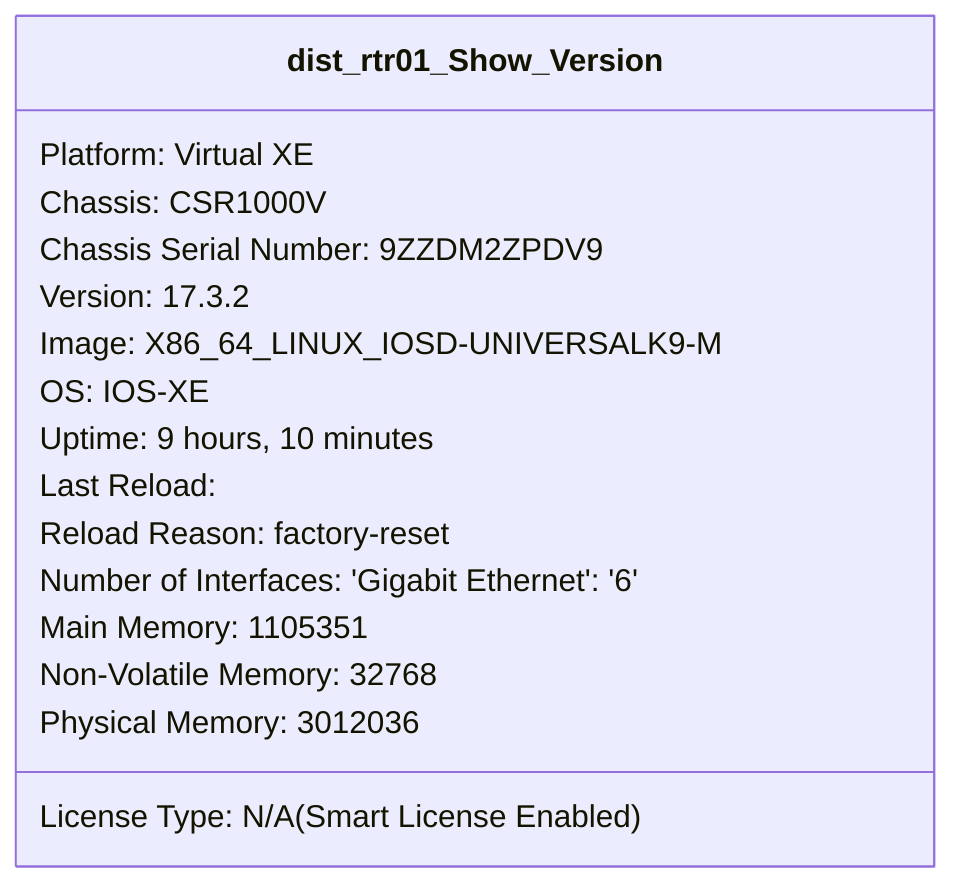

```mermaid
classDiagram
class dist_rtr01_Show_Version {
Platform: Virtual XE
Chassis: CSR1000V
Chassis Serial Number: 9ZZDM2ZPDV9
Version: 17.3.2
Image: X86_64_LINUX_IOSD-UNIVERSALK9-M
OS: IOS-XE
Uptime: 9 hours, 10 minutes
Last Reload: 
Reload Reason: factory-reset
Number of Interfaces: 'Gigabit Ethernet': '6'
Main Memory: 1105351
Non-Volatile Memory: 32768
Physical Memory: 3012036
License Type: N/A(Smart License Enabled)
}
```