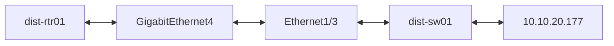
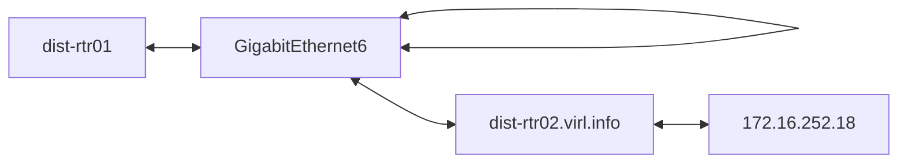

```mermaid
flowchart LR;
dist-rtr01 <--> GigabitEthernet1 <--> No_Neighbor
```

```mermaid
flowchart LR;
dist-rtr01 <--> GigabitEthernet2 <--> No_Neighbor
```

```mermaid
flowchart LR;
dist-rtr01 <--> GigabitEthernet3 <--> No_Neighbor
```

```mermaid
flowchart LR;
dist-rtr01 <--> GigabitEthernet4 <--> Ethernet1/3 <--> dist-sw01 <--> 10.10.20.177
```

```mermaid
flowchart LR;
dist-rtr01 <--> GigabitEthernet4 <--> Ethernet1/3 <--> dist-sw01 <--> 10.10.20.177
```

```mermaid
flowchart LR;
dist-rtr01 <--> GigabitEthernet5 <--> No_Neighbor
```

```mermaid
flowchart LR;
dist-rtr01 <--> GigabitEthernet6 <--> GigabitEthernet6 <--> dist-rtr02.virl.info <--> 172.16.252.18
```

```mermaid
flowchart LR;
dist-rtr01 <--> GigabitEthernet6 <--> GigabitEthernet6 <--> dist-rtr02.virl.info <--> 172.16.252.18
```
