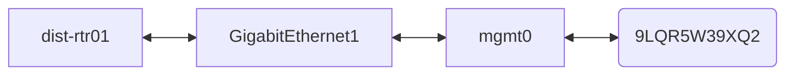
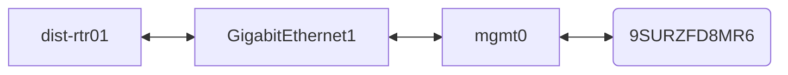
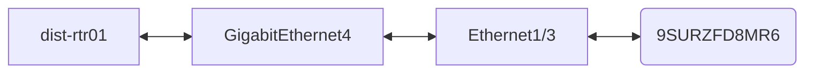

```mermaid
flowchart LR;
dist-rtr01 <--> GigabitEthernet1 <--> mgmt0 <--> dist-sw02(9LQR5W39XQ2)
```

```mermaid
flowchart LR;
dist-rtr01 <--> GigabitEthernet5 <--> Ethernet1/3 <--> dist-sw02(9LQR5W39XQ2)
```

```mermaid
flowchart LR;
dist-rtr01 <--> GigabitEthernet1 <--> mgmt0 <--> dist-sw01(9SURZFD8MR6)
```

```mermaid
flowchart LR;
dist-rtr01 <--> GigabitEthernet4 <--> Ethernet1/3 <--> dist-sw01(9SURZFD8MR6)
```

```mermaid
flowchart LR;
dist-rtr01 <--> GigabitEthernet6 <--> dist-rtr02.virl.info
```

```mermaid
flowchart LR;
dist-rtr01 <--> GigabitEthernet1 <--> dist-rtr02.virl.info
```