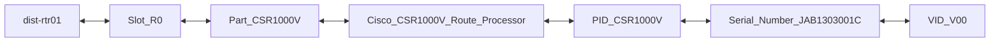

```mermaid
flowchart LR;
dist-rtr01 <--> Slot_chassis <--> Part_CSR1000V <--> Cisco_CSR1000V_Chassis <--> PID_CSR1000V <--> Serial_Number_9Y23RGWSFML <--> VID_V00
```

```mermaid
flowchart LR;
dist-rtr01 <--> Slot_F0 <--> Part_CSR1000V <--> Cisco_CSR1000V_Embedded_Services_Processor <--> PID_CSR1000V <--> Serial_Number_ <--> VID_
```

```mermaid
flowchart LR;
dist-rtr01 <--> Slot_R0 <--> Part_CSR1000V <--> Cisco_CSR1000V_Route_Processor <--> PID_CSR1000V <--> Serial_Number_JAB1303001C <--> VID_V00
```