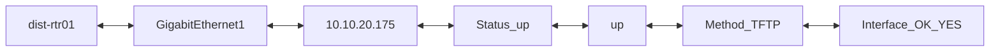
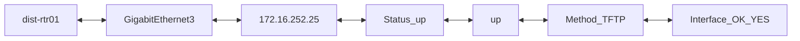
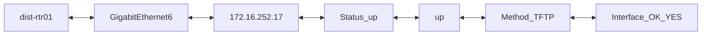
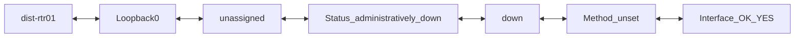

  

```mermaid
flowchart LR;
dist-rtr01 <--> GigabitEthernet1 <--> 10.10.20.175 <--> Status_up <--> up <--> Method_TFTP <--> Interface_OK_YES
```  

```mermaid
flowchart LR;
dist-rtr01 <--> GigabitEthernet2 <--> 172.16.252.21 <--> Status_up <--> up <--> Method_TFTP <--> Interface_OK_YES
```  

```mermaid
flowchart LR;
dist-rtr01 <--> GigabitEthernet3 <--> 172.16.252.25 <--> Status_up <--> up <--> Method_TFTP <--> Interface_OK_YES
```  

```mermaid
flowchart LR;
dist-rtr01 <--> GigabitEthernet4 <--> 172.16.252.2 <--> Status_up <--> up <--> Method_TFTP <--> Interface_OK_YES
```  

```mermaid
flowchart LR;
dist-rtr01 <--> GigabitEthernet5 <--> 172.16.252.10 <--> Status_up <--> up <--> Method_TFTP <--> Interface_OK_YES
```  

```mermaid
flowchart LR;
dist-rtr01 <--> GigabitEthernet6 <--> 172.16.252.17 <--> Status_up <--> up <--> Method_TFTP <--> Interface_OK_YES
```  

```mermaid
flowchart LR;
dist-rtr01 <--> Loopback0 <--> unassigned <--> Status_administratively_down <--> down <--> Method_unset <--> Interface_OK_YES
```