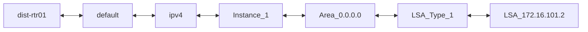
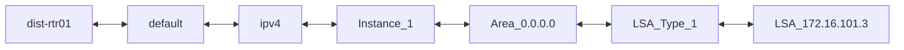
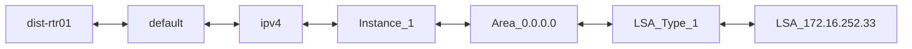
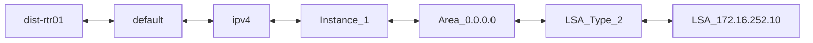
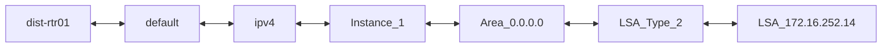
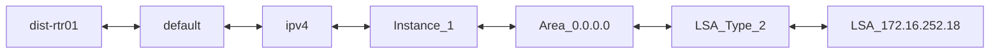
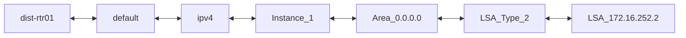
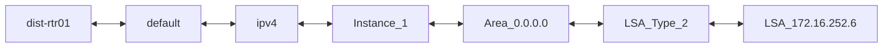

```mermaid
flowchart LR;
dist-rtr01 <--> default <--> ipv4 <--> Instance_1 <--> Area_0.0.0.0 <--> LSA_Type_1 <--> LSA_172.16.101.2
```

```mermaid
flowchart LR;
dist-rtr01 <--> default <--> ipv4 <--> Instance_1 <--> Area_0.0.0.0 <--> LSA_Type_1 <--> LSA_172.16.101.3
```

```mermaid
flowchart LR;
dist-rtr01 <--> default <--> ipv4 <--> Instance_1 <--> Area_0.0.0.0 <--> LSA_Type_1 <--> LSA_172.16.252.25
```

```mermaid
flowchart LR;
dist-rtr01 <--> default <--> ipv4 <--> Instance_1 <--> Area_0.0.0.0 <--> LSA_Type_1 <--> LSA_172.16.252.33
```

```mermaid
flowchart LR;
dist-rtr01 <--> default <--> ipv4 <--> Instance_1 <--> Area_0.0.0.0 <--> LSA_Type_2 <--> LSA_172.16.252.10
```

```mermaid
flowchart LR;
dist-rtr01 <--> default <--> ipv4 <--> Instance_1 <--> Area_0.0.0.0 <--> LSA_Type_2 <--> LSA_172.16.252.14
```

```mermaid
flowchart LR;
dist-rtr01 <--> default <--> ipv4 <--> Instance_1 <--> Area_0.0.0.0 <--> LSA_Type_2 <--> LSA_172.16.252.18
```

```mermaid
flowchart LR;
dist-rtr01 <--> default <--> ipv4 <--> Instance_1 <--> Area_0.0.0.0 <--> LSA_Type_2 <--> LSA_172.16.252.2
```

```mermaid
flowchart LR;
dist-rtr01 <--> default <--> ipv4 <--> Instance_1 <--> Area_0.0.0.0 <--> LSA_Type_2 <--> LSA_172.16.252.6
```