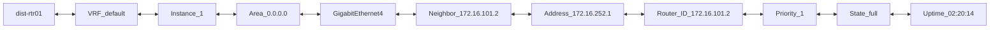
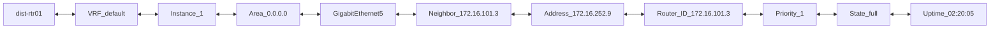
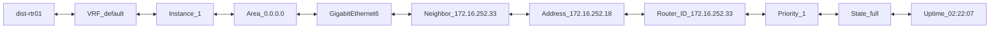

```mermaid
flowchart LR;
dist-rtr01 <--> VRF_default <--> Instance_1 <--> Area_0.0.0.0 <--> GigabitEthernet4 <--> Neighbor_172.16.101.2 <--> Address_172.16.252.1 <--> Router_ID_172.16.101.2 <--> Priority_1 <--> State_full <--> Uptime_02:20:14
```

```mermaid
flowchart LR;
dist-rtr01 <--> VRF_default <--> Instance_1 <--> Area_0.0.0.0 <--> GigabitEthernet5 <--> Neighbor_172.16.101.3 <--> Address_172.16.252.9 <--> Router_ID_172.16.101.3 <--> Priority_1 <--> State_full <--> Uptime_02:20:05
```

```mermaid
flowchart LR;
dist-rtr01 <--> VRF_default <--> Instance_1 <--> Area_0.0.0.0 <--> GigabitEthernet6 <--> Neighbor_172.16.252.33 <--> Address_172.16.252.18 <--> Router_ID_172.16.252.33 <--> Priority_1 <--> State_full <--> Uptime_02:22:07
```