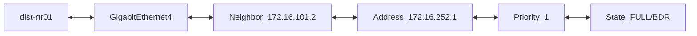
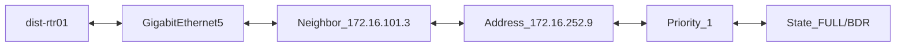
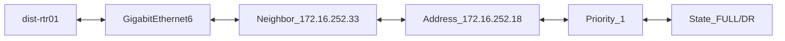

```mermaid
flowchart LR;
dist-rtr01 <--> GigabitEthernet4 <--> Neighbor_172.16.101.2 <--> Address_172.16.252.1 <--> Priority_1 <--> State_FULL/BDR
```

```mermaid
flowchart LR;
dist-rtr01 <--> GigabitEthernet5 <--> Neighbor_172.16.101.3 <--> Address_172.16.252.9 <--> Priority_1 <--> State_FULL/BDR
```

```mermaid
flowchart LR;
dist-rtr01 <--> GigabitEthernet6 <--> Neighbor_172.16.252.33 <--> Address_172.16.252.18 <--> Priority_1 <--> State_FULL/DR
```