```mermaid
flowchart LR;
dist-rtr01 <--> VRF_default <--> ipv4 <--> Route_172.16.101.0/24 <--> Active_True <--> Metric_41 <--> Preference_110 <--> Protocol_ospf <--> Next_Hop_Number1 <--> Next_Hop_172.16.252.9 <--> Outgoing_GigabitEthernet5 <--> Updated_01:49:53
```

```mermaid
flowchart LR;
dist-rtr01 <--> VRF_default <--> ipv4 <--> Route_172.16.101.0/24 <--> Active_True <--> Metric_41 <--> Preference_110 <--> Protocol_ospf <--> Next_Hop_Number2 <--> Next_Hop_172.16.252.1 <--> Outgoing_GigabitEthernet4 <--> Updated_02:20:39
```

```mermaid
flowchart LR;
dist-rtr01 <--> VRF_default <--> ipv4 <--> Route_172.16.102.0/24 <--> Active_True <--> Metric_41 <--> Preference_110 <--> Protocol_ospf <--> Next_Hop_Number2 <--> Next_Hop_172.16.252.1 <--> Outgoing_GigabitEthernet4 <--> Updated_01:49:53
```
```mermaid
flowchart LR;
dist-rtr01 <--> VRF_default <--> ipv4 <--> Route_172.16.103.0/24 <--> Active_True <--> Metric_41 <--> Preference_110 <--> Protocol_ospf <--> Next_Hop_Number1 <--> Next_Hop_172.16.252.9 <--> Outgoing_GigabitEthernet5 <--> Updated_01:49:47
```

```mermaid
flowchart LR;
dist-rtr01 <--> VRF_default <--> ipv4 <--> Route_172.16.104.0/24 <--> Active_True <--> Metric_41 <--> Preference_110 <--> Protocol_ospf <--> Next_Hop_Number1 <--> Next_Hop_172.16.252.9 <--> Outgoing_GigabitEthernet5 <--> Updated_01:49:47
```
```mermaid
flowchart LR;
dist-rtr01 <--> VRF_default <--> ipv4 <--> Route_172.16.104.0/24 <--> Active_True <--> Metric_41 <--> Preference_110 <--> Protocol_ospf <--> Next_Hop_Number2 <--> Next_Hop_172.16.252.1 <--> Outgoing_GigabitEthernet4 <--> Updated_01:49:48
```
```mermaid
flowchart LR;
dist-rtr01 <--> VRF_default <--> ipv4 <--> Route_172.16.105.0/24 <--> Active_True <--> Metric_41 <--> Preference_110 <--> Protocol_ospf <--> Next_Hop_Number1 <--> Next_Hop_172.16.252.9 <--> Outgoing_GigabitEthernet5 <--> Updated_01:49:47
```
```mermaid
flowchart LR;
dist-rtr01 <--> VRF_default <--> ipv4 <--> Route_172.16.105.0/24 <--> Active_True <--> Metric_41 <--> Preference_110 <--> Protocol_ospf <--> Next_Hop_Number2 <--> Next_Hop_172.16.252.1 <--> Outgoing_GigabitEthernet4 <--> Updated_01:49:48
```  
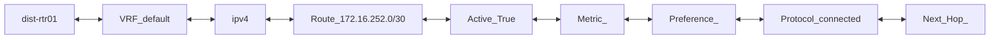
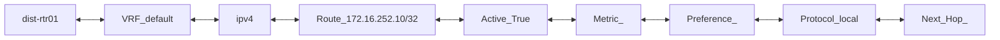
```mermaid
flowchart LR;
dist-rtr01 <--> VRF_default <--> ipv4 <--> Route_172.16.252.12/30 <--> Active_True <--> Metric_2 <--> Preference_110 <--> Protocol_ospf <--> Next_Hop_Number1 <--> Next_Hop_172.16.252.18 <--> Outgoing_GigabitEthernet6 <--> Updated_02:21:55
```  


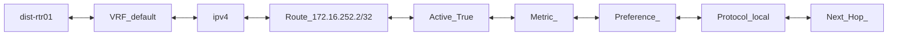
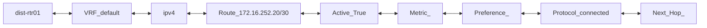
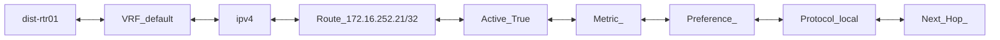

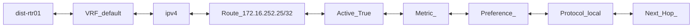
```mermaid
flowchart LR;
dist-rtr01 <--> VRF_default <--> ipv4 <--> Route_172.16.252.28/30 <--> Active_True <--> Metric_2 <--> Preference_110 <--> Protocol_ospf <--> Next_Hop_Number1 <--> Next_Hop_172.16.252.18 <--> Outgoing_GigabitEthernet6 <--> Updated_02:21:55
```
```mermaid
flowchart LR;
dist-rtr01 <--> VRF_default <--> ipv4 <--> Route_172.16.252.32/30 <--> Active_True <--> Metric_2 <--> Preference_110 <--> Protocol_ospf <--> Next_Hop_Number1 <--> Next_Hop_172.16.252.18 <--> Outgoing_GigabitEthernet6 <--> Updated_02:21:55
```
```mermaid
flowchart LR;
dist-rtr01 <--> VRF_default <--> ipv4 <--> Route_172.16.252.4/30 <--> Active_True <--> Metric_2 <--> Preference_110 <--> Protocol_ospf <--> Next_Hop_Number1 <--> Next_Hop_172.16.252.18 <--> Outgoing_GigabitEthernet6 <--> Updated_02:21:55
```  
```mermaid
flowchart LR;
dist-rtr01 <--> VRF_default <--> ipv4 <--> Route_172.16.252.8/30 <--> Active_True <--> Metric_ <--> Preference_ <--> Protocol_connected <--> Next_Hop_
```