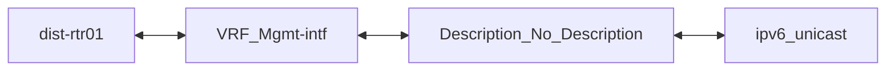

```mermaid
flowchart LR;
dist-rtr01 <--> VRF_Mgmt-intf <--> Description_No_Description <--> ipv4_unicast
```

```mermaid
flowchart LR;
dist-rtr01 <--> VRF_Mgmt-intf <--> Description_No_Description <--> ipv6_unicast
```