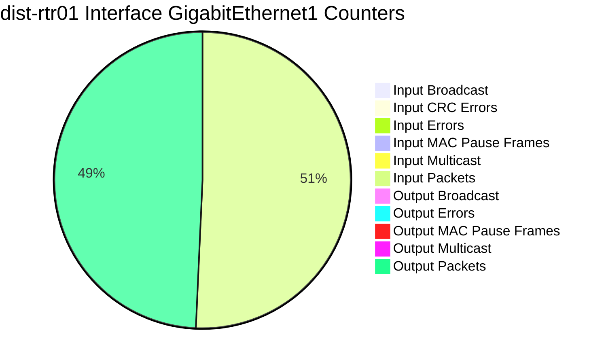
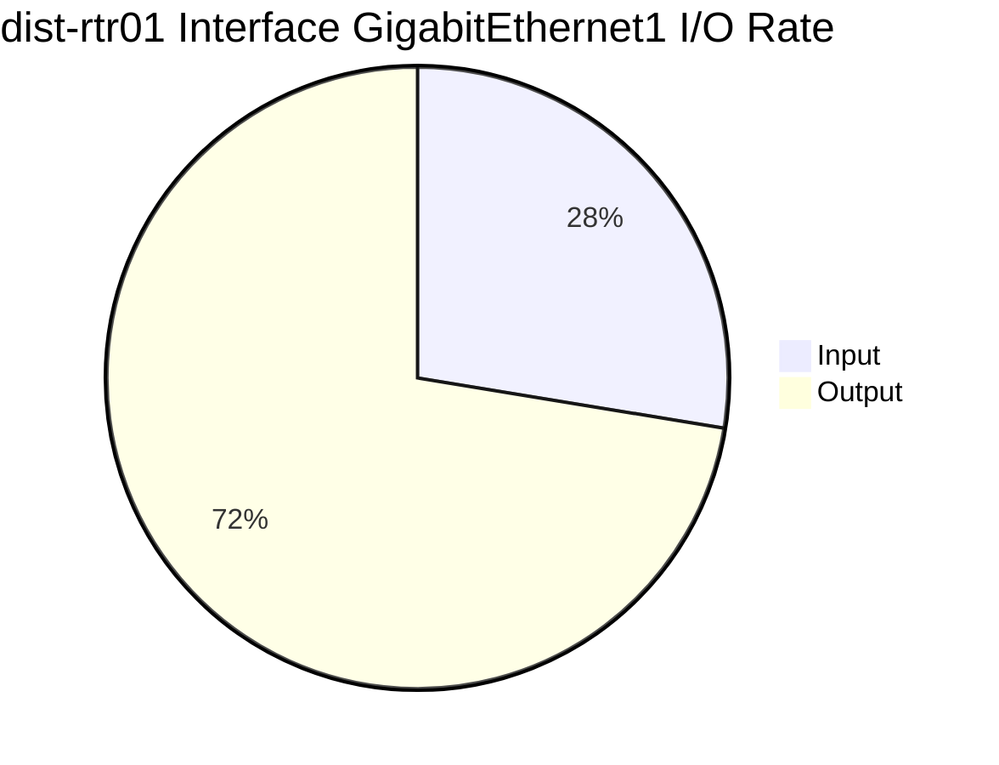
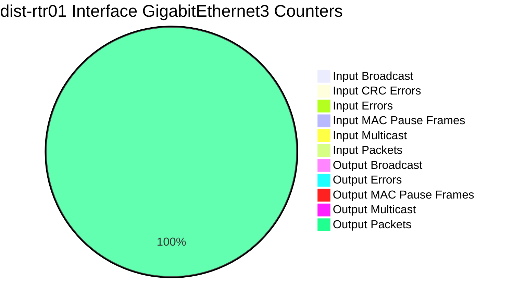
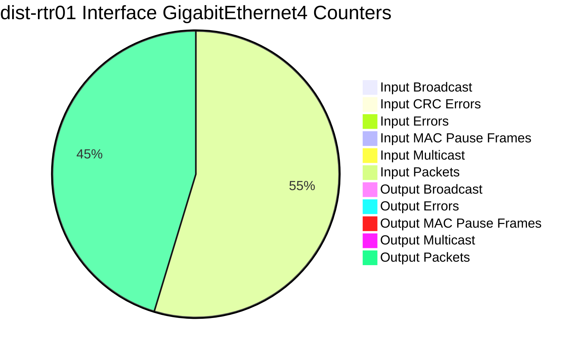
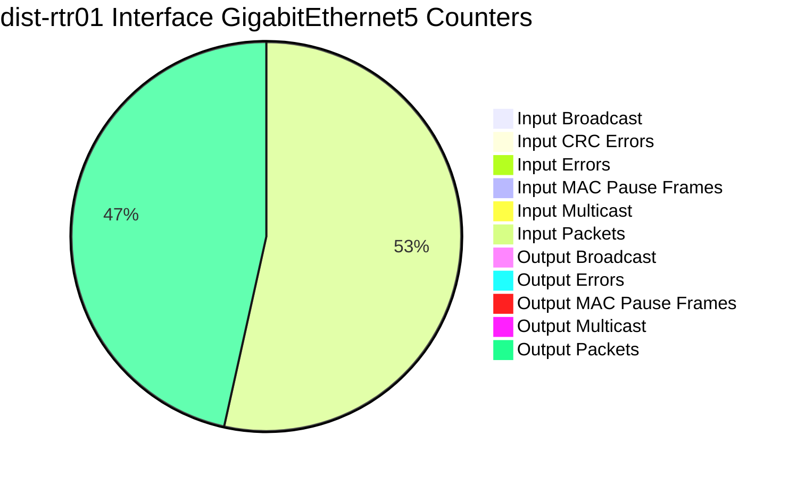
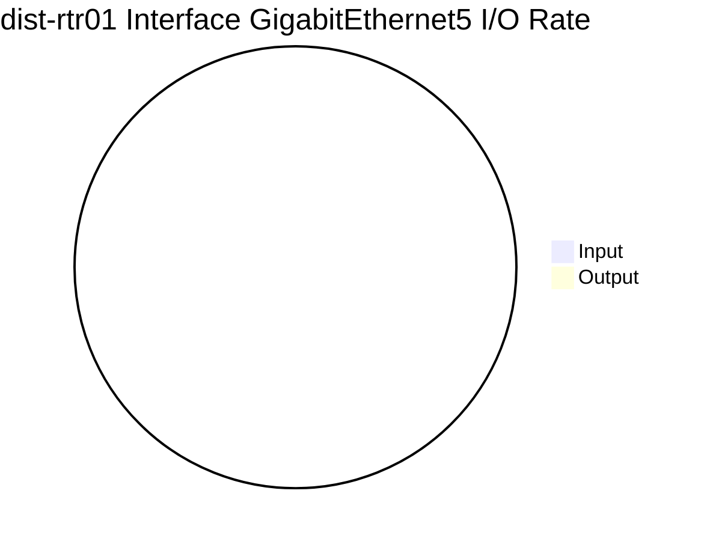
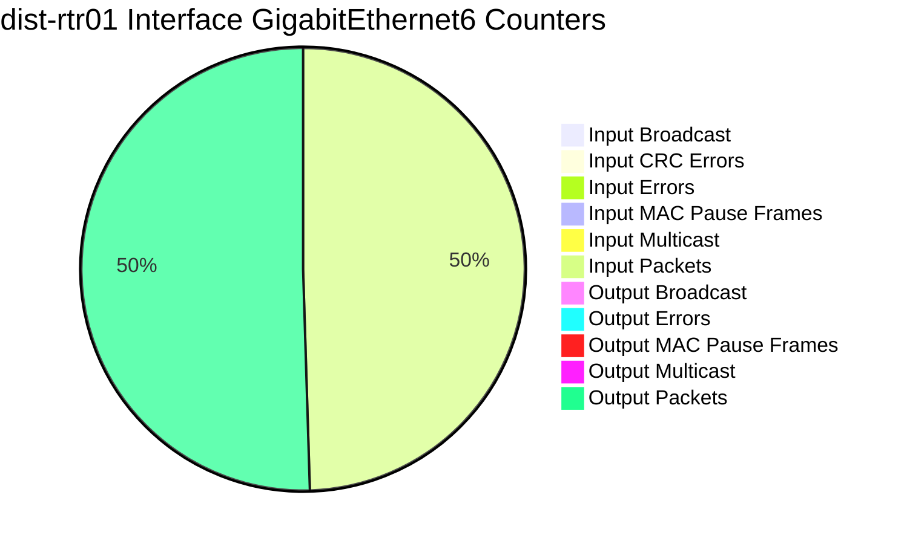
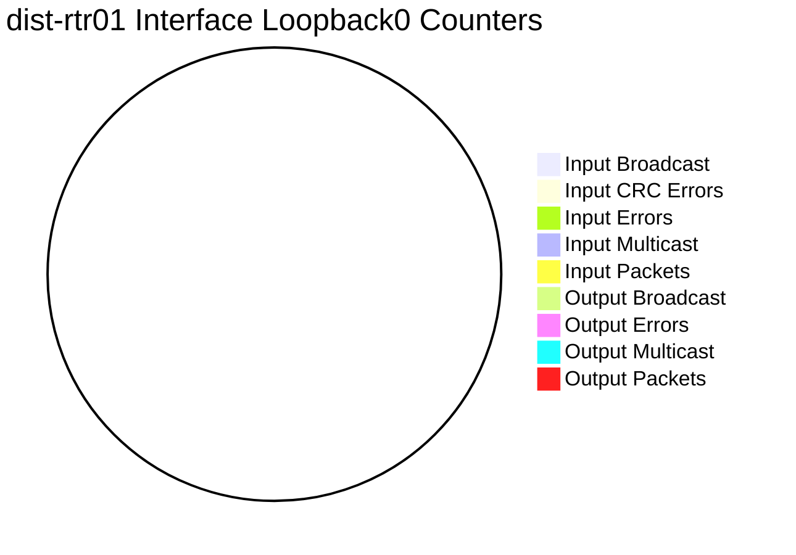
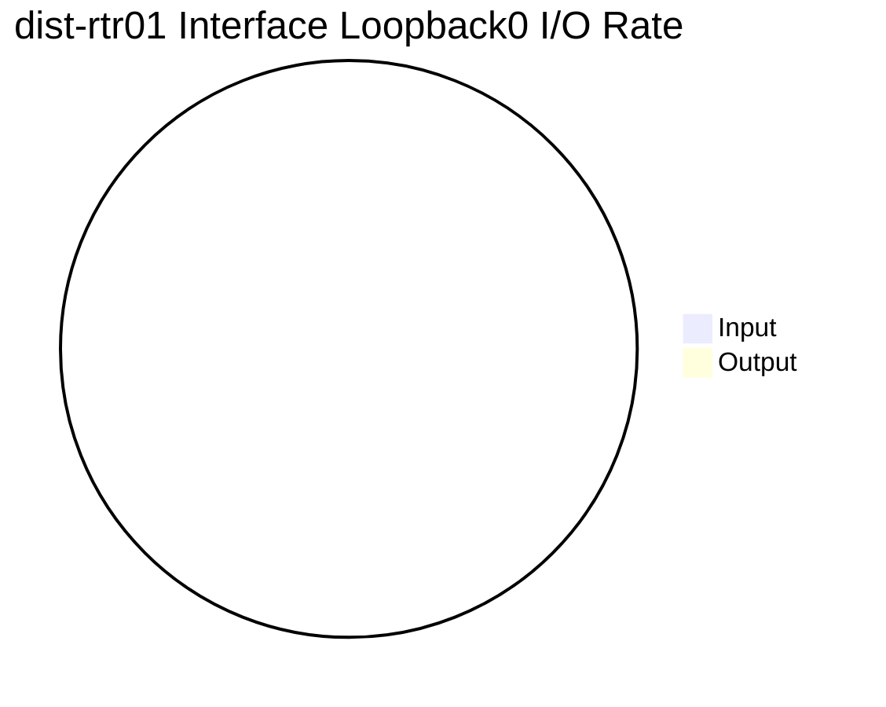

```mermaid
pie
    title dist-rtr01 Interface GigabitEthernet1 Counters
"Input Broadcast" : 0
"Input CRC Errors" : 0
"Input Errors " : 0
"Input MAC Pause Frames" : 0
"Input Multicast" : 0
"Input Packets" : 48460
"Output Broadcast" : 0
"Output Errors" : 0
"Output MAC Pause Frames" : 0
"Output Multicast" : 0
"Output Packets" : 47090
```

```mermaid
pie
    title dist-rtr01 Interface GigabitEthernet1 I/O Rate
"Input" : 8000
"Output" : 21000
```

```mermaid
pie
    title dist-rtr01 Interface GigabitEthernet2 Counters
"Input Broadcast" : 0
"Input CRC Errors" : 0
"Input Errors " : 0
"Input MAC Pause Frames" : 0
"Input Multicast" : 0
"Input Packets" : 0
"Output Broadcast" : 0
"Output Errors" : 0
"Output MAC Pause Frames" : 0
"Output Multicast" : 0
"Output Packets" : 888
```

```mermaid
pie
    title dist-rtr01 Interface GigabitEthernet2 I/O Rate
"Input" : 0
"Output" : 0
```

```mermaid
pie
    title dist-rtr01 Interface GigabitEthernet3 Counters
"Input Broadcast" : 0
"Input CRC Errors" : 0
"Input Errors " : 0
"Input MAC Pause Frames" : 0
"Input Multicast" : 0
"Input Packets" : 0
"Output Broadcast" : 0
"Output Errors" : 0
"Output MAC Pause Frames" : 0
"Output Multicast" : 0
"Output Packets" : 888
```

```mermaid
pie
    title dist-rtr01 Interface GigabitEthernet3 I/O Rate
"Input" : 0
"Output" : 0
```

```mermaid
pie
    title dist-rtr01 Interface GigabitEthernet4 Counters
"Input Broadcast" : 0
"Input CRC Errors" : 0
"Input Errors " : 0
"Input MAC Pause Frames" : 0
"Input Multicast" : 0
"Input Packets" : 1126
"Output Broadcast" : 0
"Output Errors" : 0
"Output MAC Pause Frames" : 0
"Output Multicast" : 0
"Output Packets" : 933
```

```mermaid
pie
    title dist-rtr01 Interface GigabitEthernet4 I/O Rate
"Input" : 0
"Output" : 0
```

```mermaid
pie
    title dist-rtr01 Interface GigabitEthernet5 Counters
"Input Broadcast" : 0
"Input CRC Errors" : 0
"Input Errors " : 0
"Input MAC Pause Frames" : 0
"Input Multicast" : 0
"Input Packets" : 1069
"Output Broadcast" : 0
"Output Errors" : 0
"Output MAC Pause Frames" : 0
"Output Multicast" : 0
"Output Packets" : 930
```

```mermaid
pie
    title dist-rtr01 Interface GigabitEthernet5 I/O Rate
"Input" : 0
"Output" : 0
```

```mermaid
pie
    title dist-rtr01 Interface GigabitEthernet6 Counters
"Input Broadcast" : 0
"Input CRC Errors" : 0
"Input Errors " : 0
"Input MAC Pause Frames" : 0
"Input Multicast" : 0
"Input Packets" : 914
"Output Broadcast" : 0
"Output Errors" : 0
"Output MAC Pause Frames" : 0
"Output Multicast" : 0
"Output Packets" : 932
```

```mermaid
pie
    title dist-rtr01 Interface GigabitEthernet6 I/O Rate
"Input" : 0
"Output" : 0
```

```mermaid
pie
    title dist-rtr01 Interface Loopback0 Counters
"Input Broadcast" : 0
"Input CRC Errors" : 0
"Input Errors " : 0
"Input Multicast" : 0
"Input Packets" : 0
"Output Broadcast" : 0
"Output Errors" : 0
"Output Multicast" : 0
"Output Packets" : 0
```

```mermaid
pie
    title dist-rtr01 Interface Loopback0 I/O Rate
"Input" : 0
"Output" : 0
```