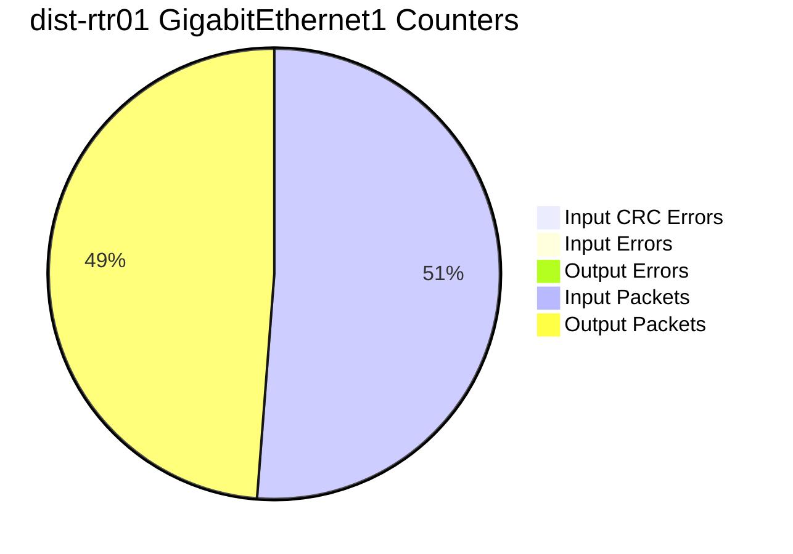
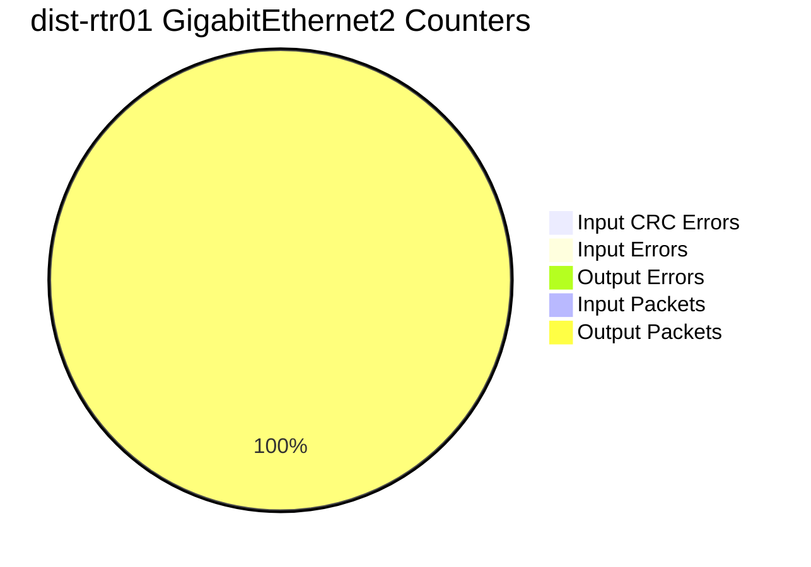
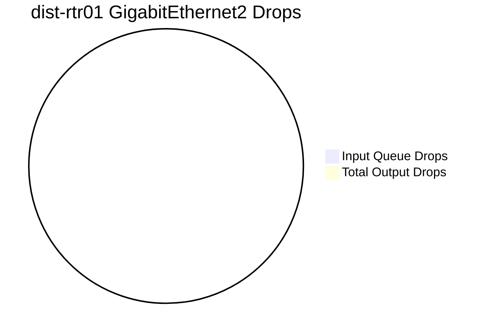
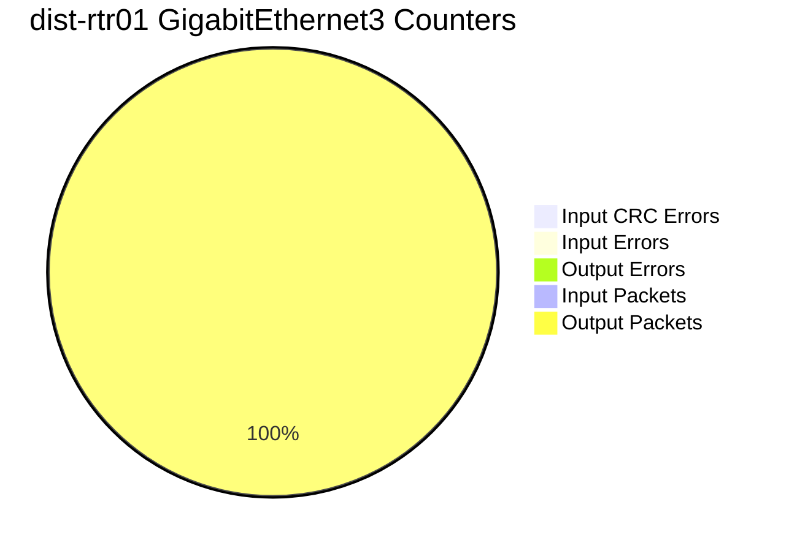
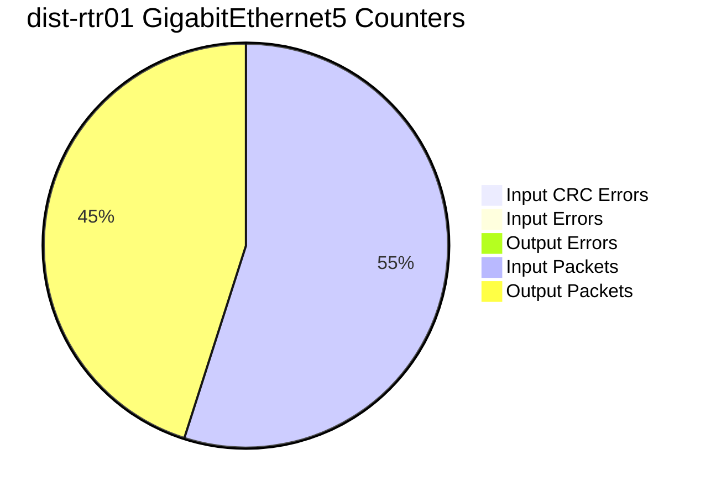
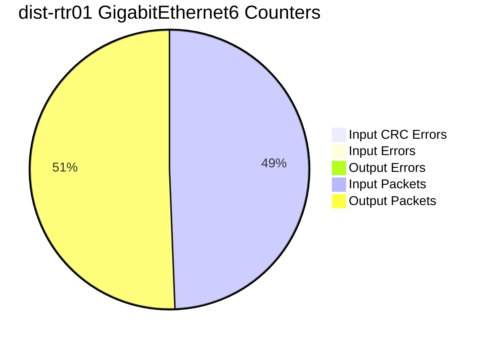
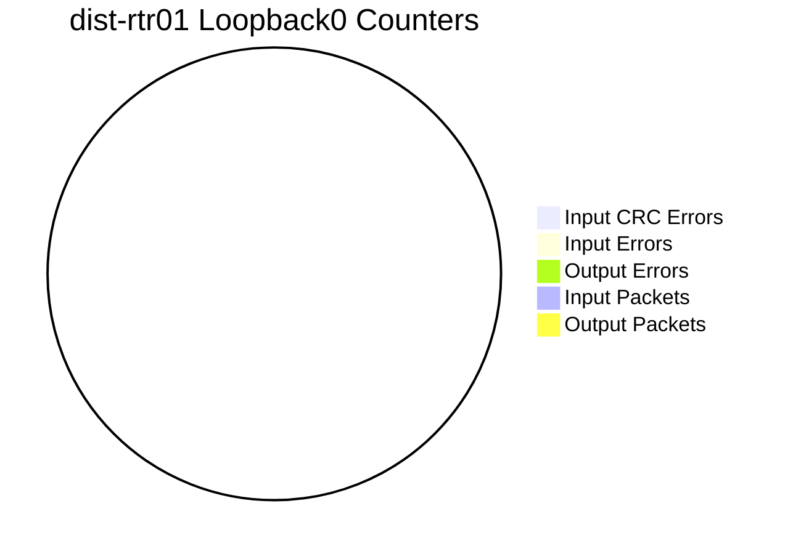
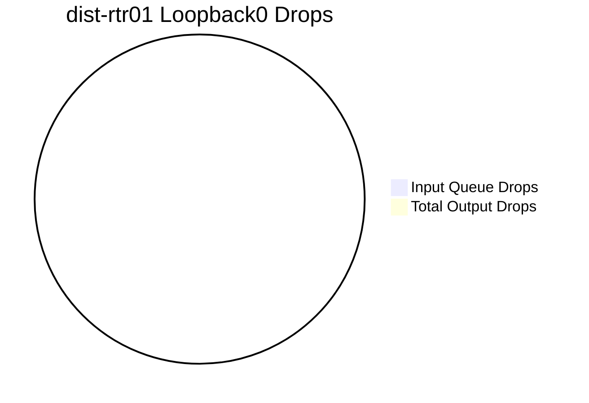

```mermaid
pie
title dist-rtr01 GigabitEthernet1 Counters
"Input CRC Errors" : 0
"Input Errors" : 0
"Output Errors" : 0
"Input Packets" : 57258
"Output Packets" : 54527
```

```mermaid
pie
title dist-rtr01 GigabitEthernet1 Drops
"Input Queue Drops" : 0
"Total Output Drops" : 0
```

```mermaid
pie
title dist-rtr01 GigabitEthernet2 Counters
"Input CRC Errors" : 0
"Input Errors" : 0
"Output Errors" : 0
"Input Packets" : 0
"Output Packets" : 4968
```

```mermaid
pie
title dist-rtr01 GigabitEthernet2 Drops
"Input Queue Drops" : 0
"Total Output Drops" : 0
```

```mermaid
pie
title dist-rtr01 GigabitEthernet3 Counters
"Input CRC Errors" : 0
"Input Errors" : 0
"Output Errors" : 0
"Input Packets" : 0
"Output Packets" : 4966
```

```mermaid
pie
title dist-rtr01 GigabitEthernet3 Drops
"Input Queue Drops" : 0
"Total Output Drops" : 0
```

```mermaid
pie
title dist-rtr01 GigabitEthernet4 Counters
"Input CRC Errors" : 0
"Input Errors" : 0
"Output Errors" : 0
"Input Packets" : 6293
"Output Packets" : 5120
```

```mermaid
pie
title dist-rtr01 GigabitEthernet4 Drops
"Input Queue Drops" : 0
"Total Output Drops" : 0
```

```mermaid
pie
title dist-rtr01 GigabitEthernet5 Counters
"Input CRC Errors" : 0
"Input Errors" : 0
"Output Errors" : 0
"Input Packets" : 6237
"Output Packets" : 5118
```

```mermaid
pie
title dist-rtr01 GigabitEthernet5 Drops
"Input Queue Drops" : 0
"Total Output Drops" : 0
```

```mermaid
pie
title dist-rtr01 GigabitEthernet6 Counters
"Input CRC Errors" : 0
"Input Errors" : 0
"Output Errors" : 0
"Input Packets" : 4982
"Output Packets" : 5108
```

```mermaid
pie
title dist-rtr01 GigabitEthernet6 Drops
"Input Queue Drops" : 0
"Total Output Drops" : 0
```

```mermaid
pie
title dist-rtr01 Loopback0 Counters
"Input CRC Errors" : 0
"Input Errors" : 0
"Output Errors" : 0
"Input Packets" : 0
"Output Packets" : 0
```

```mermaid
pie
title dist-rtr01 Loopback0 Drops
"Input Queue Drops" : 0
"Total Output Drops" : 0
```