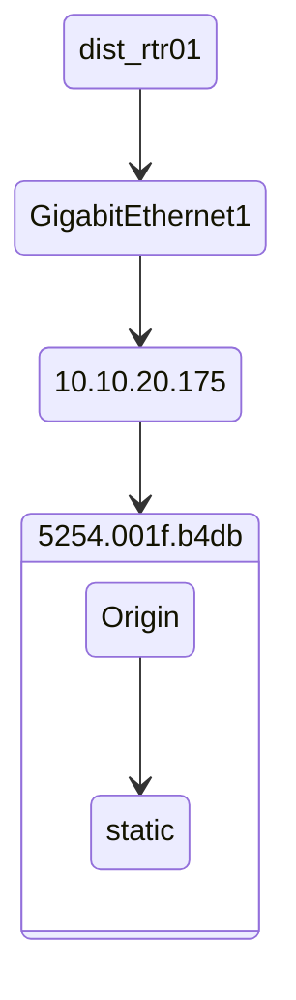
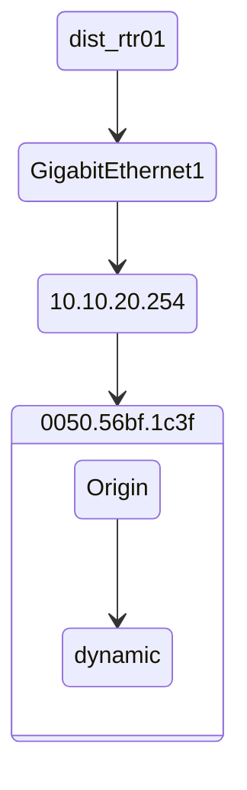
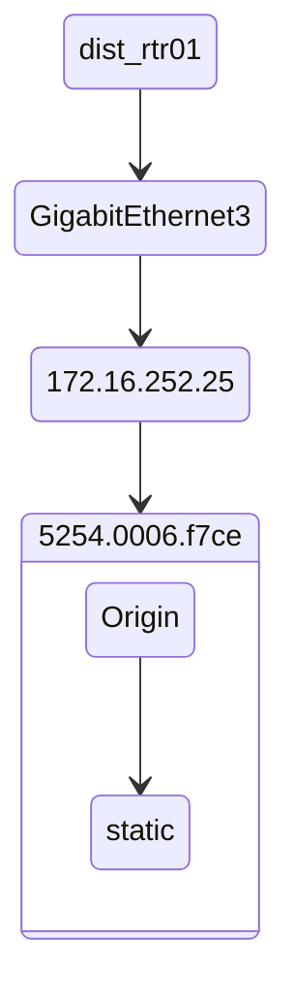
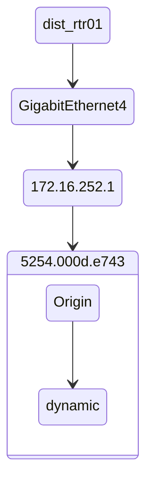
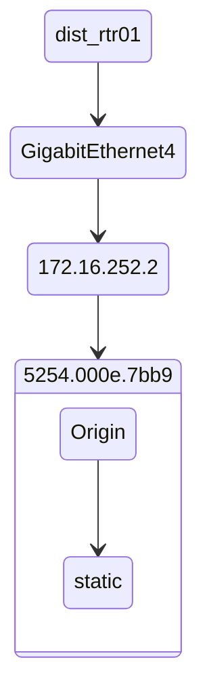
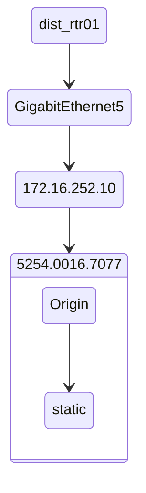
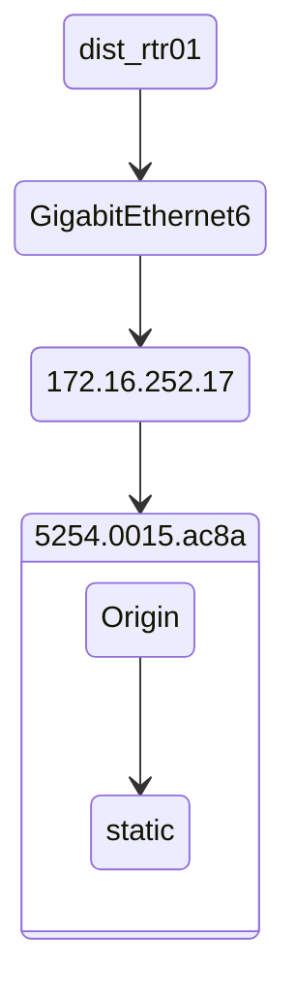

```mermaid
stateDiagram
dist_rtr01 --> GigabitEthernet1
GigabitEthernet1 --> 10.10.20.175
10.10.20.175 --> 5254.001f.b4db
state 5254.001f.b4db{
Origin --> static
}
```

```mermaid
stateDiagram
dist_rtr01 --> GigabitEthernet1
GigabitEthernet1 --> 10.10.20.254
10.10.20.254 --> 0050.56bf.1c3f
state 0050.56bf.1c3f{
Origin --> dynamic
}
```

```mermaid
stateDiagram
dist_rtr01 --> GigabitEthernet2
GigabitEthernet2 --> 172.16.252.21
172.16.252.21 --> 5254.001e.d479
state 5254.001e.d479{
Origin --> static
}
```

```mermaid
stateDiagram
dist_rtr01 --> GigabitEthernet3
GigabitEthernet3 --> 172.16.252.25
172.16.252.25 --> 5254.0006.f7ce
state 5254.0006.f7ce{
Origin --> static
}
```

```mermaid
stateDiagram
dist_rtr01 --> GigabitEthernet4
GigabitEthernet4 --> 172.16.252.1
172.16.252.1 --> 5254.000d.e743
state 5254.000d.e743{
Origin --> dynamic
}
```

```mermaid
stateDiagram
dist_rtr01 --> GigabitEthernet4
GigabitEthernet4 --> 172.16.252.2
172.16.252.2 --> 5254.000e.7bb9
state 5254.000e.7bb9{
Origin --> static
}
```

```mermaid
stateDiagram
dist_rtr01 --> GigabitEthernet5
GigabitEthernet5 --> 172.16.252.10
172.16.252.10 --> 5254.0016.7077
state 5254.0016.7077{
Origin --> static
}
```

```mermaid
stateDiagram
dist_rtr01 --> GigabitEthernet5
GigabitEthernet5 --> 172.16.252.9
172.16.252.9 --> 5254.0004.4185
state 5254.0004.4185{
Origin --> dynamic
}
```

```mermaid
stateDiagram
dist_rtr01 --> GigabitEthernet6
GigabitEthernet6 --> 172.16.252.17
172.16.252.17 --> 5254.0015.ac8a
state 5254.0015.ac8a{
Origin --> static
}
```

```mermaid
stateDiagram
dist_rtr01 --> GigabitEthernet6
GigabitEthernet6 --> 172.16.252.18
172.16.252.18 --> 5254.000c.8b4c
state 5254.000c.8b4c{
Origin --> dynamic
}
```