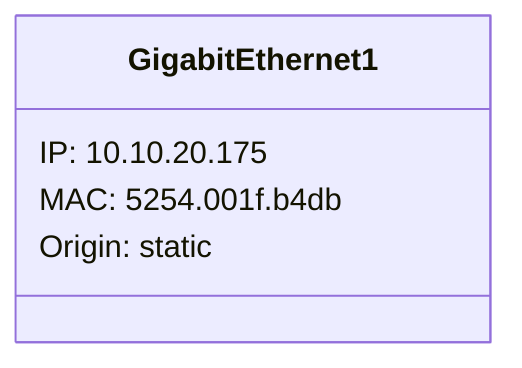
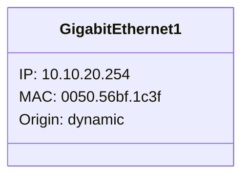
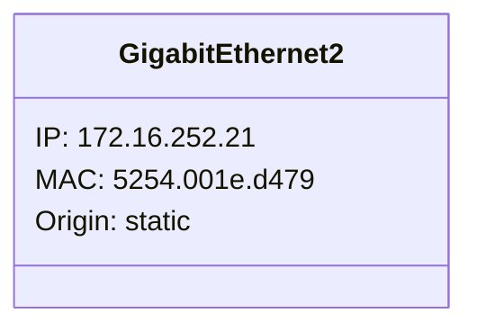
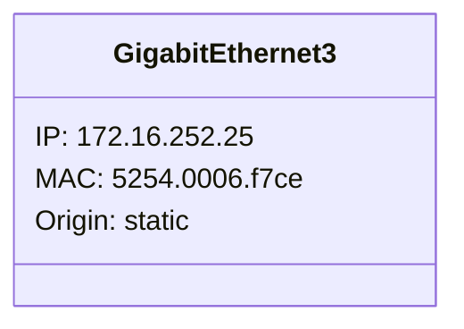
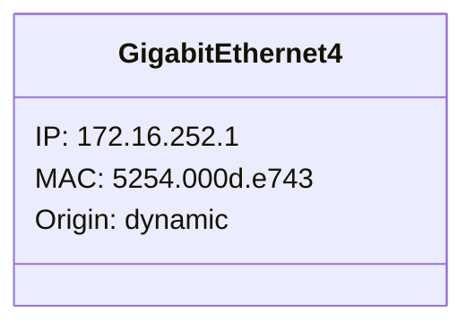
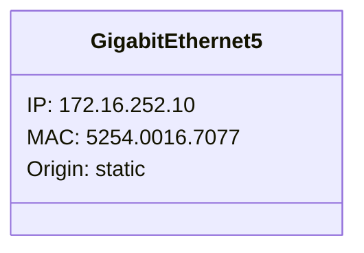
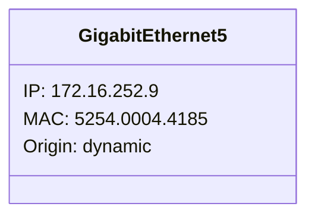
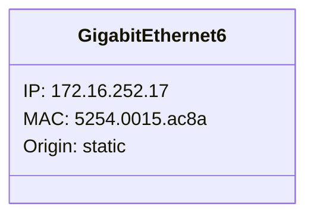

```mermaid
classDiagram
class GigabitEthernet1{
IP: 10.10.20.175
MAC: 5254.001f.b4db
Origin: static
}
```

```mermaid
classDiagram
class GigabitEthernet1{
IP: 10.10.20.254
MAC: 0050.56bf.1c3f
Origin: dynamic
}
```

```mermaid
classDiagram
class GigabitEthernet2{
IP: 172.16.252.21
MAC: 5254.001e.d479
Origin: static
}
```

```mermaid
classDiagram
class GigabitEthernet3{
IP: 172.16.252.25
MAC: 5254.0006.f7ce
Origin: static
}
```

```mermaid
classDiagram
class GigabitEthernet4{
IP: 172.16.252.1
MAC: 5254.000d.e743
Origin: dynamic
}
```

```mermaid
classDiagram
class GigabitEthernet4{
IP: 172.16.252.2
MAC: 5254.000e.7bb9
Origin: static
}
```

```mermaid
classDiagram
class GigabitEthernet5{
IP: 172.16.252.10
MAC: 5254.0016.7077
Origin: static
}
```

```mermaid
classDiagram
class GigabitEthernet5{
IP: 172.16.252.9
MAC: 5254.0004.4185
Origin: dynamic
}
```

```mermaid
classDiagram
class GigabitEthernet6{
IP: 172.16.252.17
MAC: 5254.0015.ac8a
Origin: static
}
```

```mermaid
classDiagram
class GigabitEthernet6{
IP: 172.16.252.18
MAC: 5254.000c.8b4c
Origin: dynamic
}
```