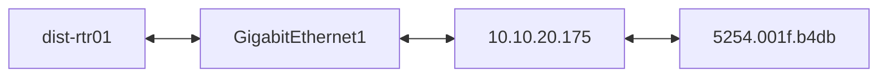
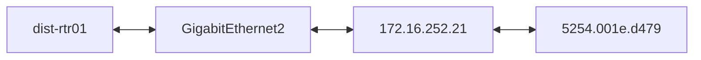
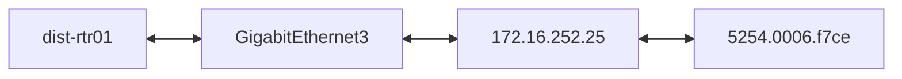
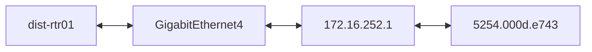
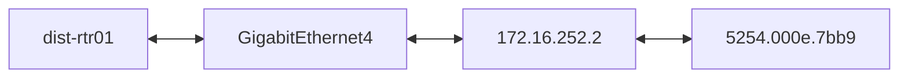
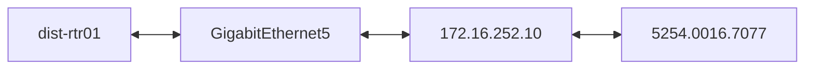
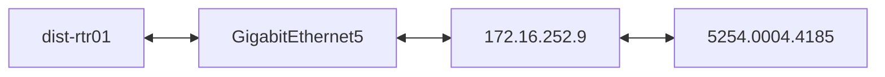
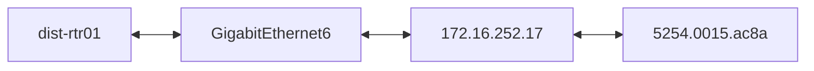
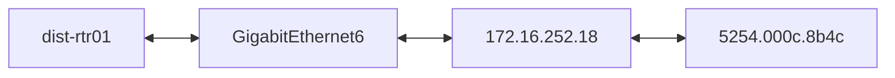

```mermaid
flowchart LR;
dist-rtr01 <--> GigabitEthernet1 <--> 10.10.20.175 <--> 5254.001f.b4db
```

```mermaid
flowchart LR;
dist-rtr01 <--> GigabitEthernet1 <--> 10.10.20.254 <--> 0050.56bf.1c3f
```

```mermaid
flowchart LR;
dist-rtr01 <--> GigabitEthernet2 <--> 172.16.252.21 <--> 5254.001e.d479
```

```mermaid
flowchart LR;
dist-rtr01 <--> GigabitEthernet3 <--> 172.16.252.25 <--> 5254.0006.f7ce
```

```mermaid
flowchart LR;
dist-rtr01 <--> GigabitEthernet4 <--> 172.16.252.1 <--> 5254.000d.e743
```

```mermaid
flowchart LR;
dist-rtr01 <--> GigabitEthernet4 <--> 172.16.252.2 <--> 5254.000e.7bb9
```

```mermaid
flowchart LR;
dist-rtr01 <--> GigabitEthernet5 <--> 172.16.252.10 <--> 5254.0016.7077
```

```mermaid
flowchart LR;
dist-rtr01 <--> GigabitEthernet5 <--> 172.16.252.9 <--> 5254.0004.4185
```

```mermaid
flowchart LR;
dist-rtr01 <--> GigabitEthernet6 <--> 172.16.252.17 <--> 5254.0015.ac8a
```

```mermaid
flowchart LR;
dist-rtr01 <--> GigabitEthernet6 <--> 172.16.252.18 <--> 5254.000c.8b4c
```