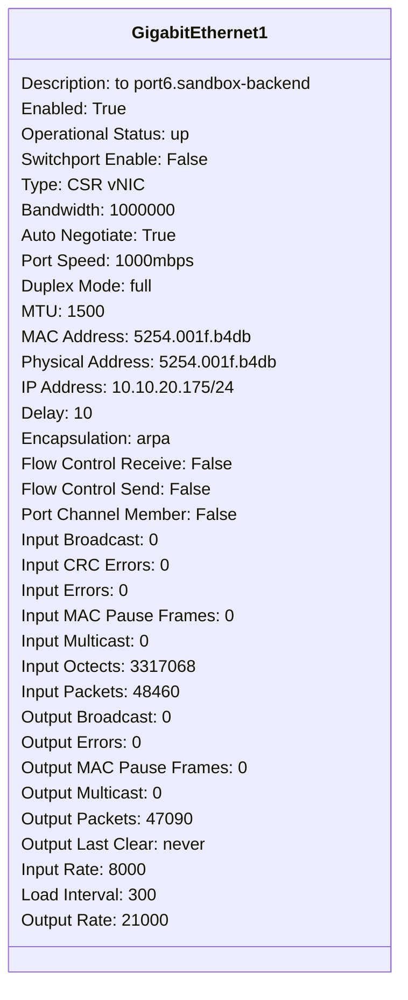
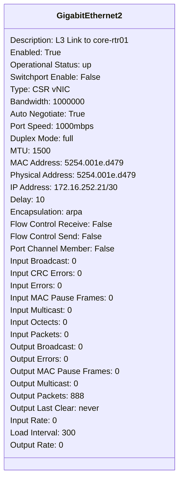
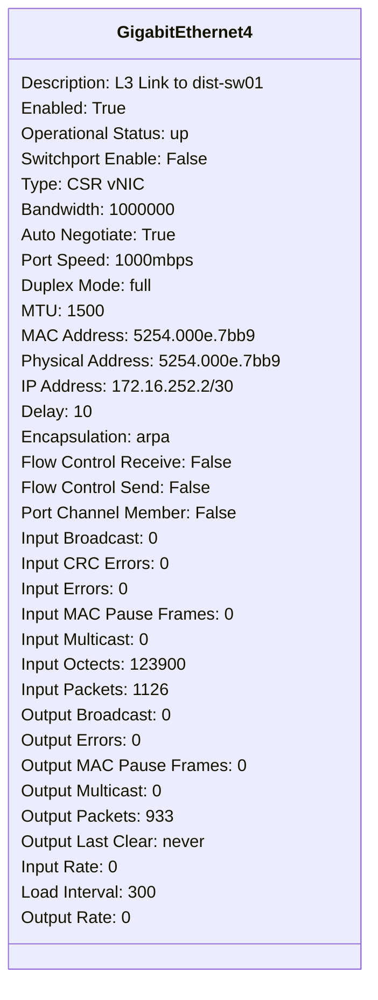
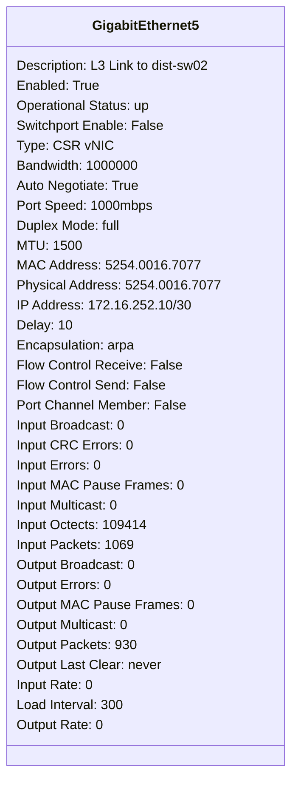
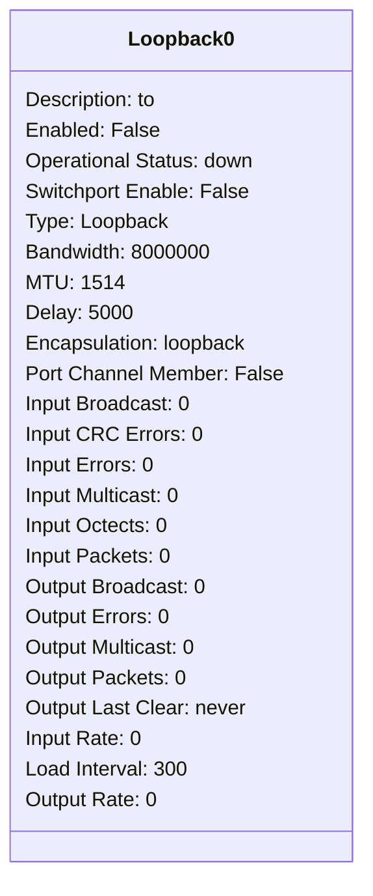

```mermaid
classDiagram
class GigabitEthernet1{
Description: to port6.sandbox-backend
Enabled: True
Operational Status: up
Switchport Enable: False
Type: CSR vNIC
Bandwidth: 1000000
Auto Negotiate: True
Port Speed: 1000mbps
Duplex Mode: full
MTU: 1500
MAC Address: 5254.001f.b4db
Physical Address: 5254.001f.b4db
IP Address: 10.10.20.175/24
Delay: 10
Encapsulation: arpa
Flow Control Receive: False
Flow Control Send: False


Port Channel Member: False
Input Broadcast: 0
Input CRC Errors: 0
Input Errors: 0
Input MAC Pause Frames: 0
Input Multicast: 0
Input Octects: 3317068
Input Packets: 48460
Output Broadcast: 0
Output Errors: 0
Output MAC Pause Frames: 0
Output Multicast: 0
Output Packets: 47090
Output Last Clear: never
Input Rate: 8000
Load Interval: 300
Output Rate: 21000
}
```

```mermaid
classDiagram
class GigabitEthernet2{
Description: L3 Link to core-rtr01
Enabled: True
Operational Status: up
Switchport Enable: False
Type: CSR vNIC
Bandwidth: 1000000
Auto Negotiate: True
Port Speed: 1000mbps
Duplex Mode: full
MTU: 1500
MAC Address: 5254.001e.d479
Physical Address: 5254.001e.d479
IP Address: 172.16.252.21/30
Delay: 10
Encapsulation: arpa
Flow Control Receive: False
Flow Control Send: False


Port Channel Member: False
Input Broadcast: 0
Input CRC Errors: 0
Input Errors: 0
Input MAC Pause Frames: 0
Input Multicast: 0
Input Octects: 0
Input Packets: 0
Output Broadcast: 0
Output Errors: 0
Output MAC Pause Frames: 0
Output Multicast: 0
Output Packets: 888
Output Last Clear: never
Input Rate: 0
Load Interval: 300
Output Rate: 0
}
```

```mermaid
classDiagram
class GigabitEthernet3{
Description: L3 Link to core-rtr02
Enabled: True
Operational Status: up
Switchport Enable: False
Type: CSR vNIC
Bandwidth: 1000000
Auto Negotiate: True
Port Speed: 1000mbps
Duplex Mode: full
MTU: 1500
MAC Address: 5254.0006.f7ce
Physical Address: 5254.0006.f7ce
IP Address: 172.16.252.25/30
Delay: 10
Encapsulation: arpa
Flow Control Receive: False
Flow Control Send: False


Port Channel Member: False
Input Broadcast: 0
Input CRC Errors: 0
Input Errors: 0
Input MAC Pause Frames: 0
Input Multicast: 0
Input Octects: 0
Input Packets: 0
Output Broadcast: 0
Output Errors: 0
Output MAC Pause Frames: 0
Output Multicast: 0
Output Packets: 888
Output Last Clear: never
Input Rate: 0
Load Interval: 300
Output Rate: 0
}
```

```mermaid
classDiagram
class GigabitEthernet4{
Description: L3 Link to dist-sw01
Enabled: True
Operational Status: up
Switchport Enable: False
Type: CSR vNIC
Bandwidth: 1000000
Auto Negotiate: True
Port Speed: 1000mbps
Duplex Mode: full
MTU: 1500
MAC Address: 5254.000e.7bb9
Physical Address: 5254.000e.7bb9
IP Address: 172.16.252.2/30
Delay: 10
Encapsulation: arpa
Flow Control Receive: False
Flow Control Send: False


Port Channel Member: False
Input Broadcast: 0
Input CRC Errors: 0
Input Errors: 0
Input MAC Pause Frames: 0
Input Multicast: 0
Input Octects: 123900
Input Packets: 1126
Output Broadcast: 0
Output Errors: 0
Output MAC Pause Frames: 0
Output Multicast: 0
Output Packets: 933
Output Last Clear: never
Input Rate: 0
Load Interval: 300
Output Rate: 0
}
```

```mermaid
classDiagram
class GigabitEthernet5{
Description: L3 Link to dist-sw02
Enabled: True
Operational Status: up
Switchport Enable: False
Type: CSR vNIC
Bandwidth: 1000000
Auto Negotiate: True
Port Speed: 1000mbps
Duplex Mode: full
MTU: 1500
MAC Address: 5254.0016.7077
Physical Address: 5254.0016.7077
IP Address: 172.16.252.10/30
Delay: 10
Encapsulation: arpa
Flow Control Receive: False
Flow Control Send: False


Port Channel Member: False
Input Broadcast: 0
Input CRC Errors: 0
Input Errors: 0
Input MAC Pause Frames: 0
Input Multicast: 0
Input Octects: 109414
Input Packets: 1069
Output Broadcast: 0
Output Errors: 0
Output MAC Pause Frames: 0
Output Multicast: 0
Output Packets: 930
Output Last Clear: never
Input Rate: 0
Load Interval: 300
Output Rate: 0
}
```

```mermaid
classDiagram
class GigabitEthernet6{
Description: L3 Link to dist-rtr02
Enabled: True
Operational Status: up
Switchport Enable: False
Type: CSR vNIC
Bandwidth: 1000000
Auto Negotiate: True
Port Speed: 1000mbps
Duplex Mode: full
MTU: 1500
MAC Address: 5254.0015.ac8a
Physical Address: 5254.0015.ac8a
IP Address: 172.16.252.17/30
Delay: 10
Encapsulation: arpa
Flow Control Receive: False
Flow Control Send: False


Port Channel Member: False
Input Broadcast: 0
Input CRC Errors: 0
Input Errors: 0
Input MAC Pause Frames: 0
Input Multicast: 0
Input Octects: 123161
Input Packets: 914
Output Broadcast: 0
Output Errors: 0
Output MAC Pause Frames: 0
Output Multicast: 0
Output Packets: 932
Output Last Clear: never
Input Rate: 0
Load Interval: 300
Output Rate: 0
}
```

```mermaid
classDiagram
class Loopback0{
Description: to
Enabled: False
Operational Status: down
Switchport Enable: False
Type: Loopback
Bandwidth: 8000000
MTU: 1514
Delay: 5000
Encapsulation: loopback


Port Channel Member: False
Input Broadcast: 0
Input CRC Errors: 0
Input Errors: 0
Input Multicast: 0
Input Octects: 0
Input Packets: 0
Output Broadcast: 0
Output Errors: 0
Output Multicast: 0
Output Packets: 0
Output Last Clear: never
Input Rate: 0
Load Interval: 300
Output Rate: 0
}
```