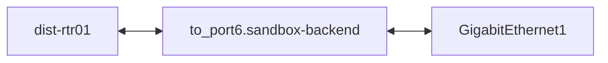
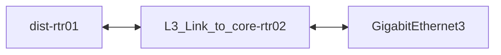
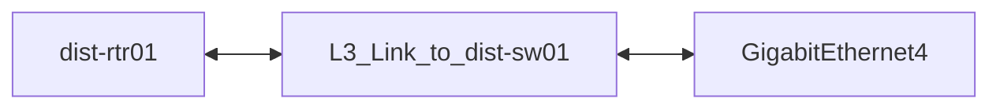
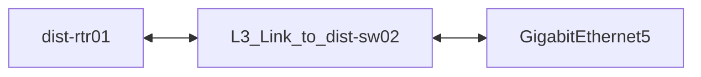
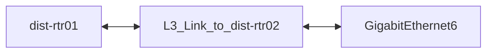
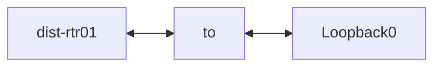

```mermaid
flowchart LR;
dist-rtr01 <--> to_port6.sandbox-backend <--> GigabitEthernet1
```

```mermaid
flowchart LR;
dist-rtr01 <--> L3_Link_to_core-rtr01 <--> GigabitEthernet2
```

```mermaid
flowchart LR;
dist-rtr01 <--> L3_Link_to_core-rtr02 <--> GigabitEthernet3
```

```mermaid
flowchart LR;
dist-rtr01 <--> L3_Link_to_dist-sw01 <--> GigabitEthernet4
```

```mermaid
flowchart LR;
dist-rtr01 <--> L3_Link_to_dist-sw02 <--> GigabitEthernet5
```

```mermaid
flowchart LR;
dist-rtr01 <--> L3_Link_to_dist-rtr02 <--> GigabitEthernet6
```

```mermaid
flowchart LR;
dist-rtr01 <--> to <--> Loopback0
```