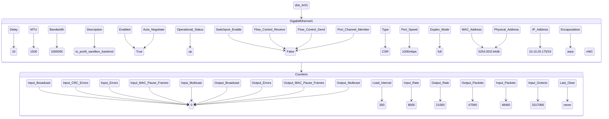
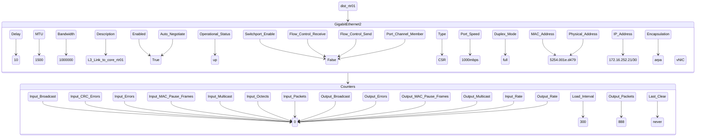
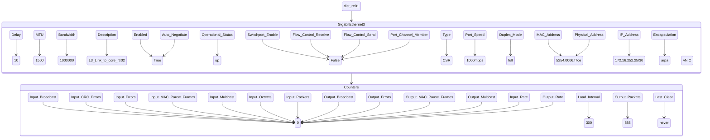
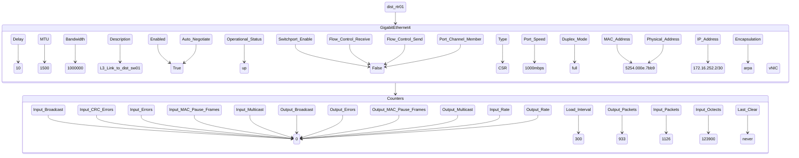
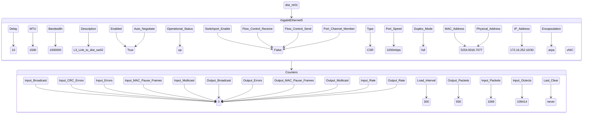
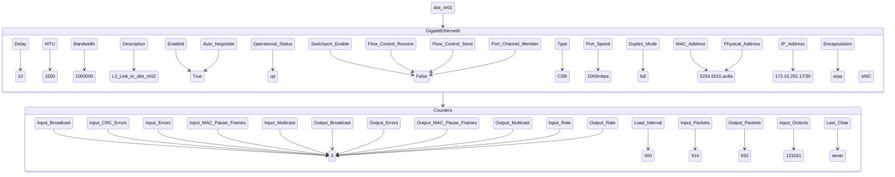
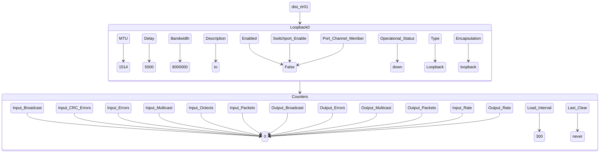

```mermaid
stateDiagram
dist_rtr01 --> GigabitEthernet1
GigabitEthernet1 --> Counters
    state GigabitEthernet1{
Description -->  to_port6_sandbox_backend
Enabled -->  True
Operational_Status -->  up
Switchport_Enable -->  False
Type -->  CSR vNIC
Bandwidth -->  1000000
Auto_Negotiate -->  True
Port_Speed -->  1000mbps
Duplex_Mode -->  full
MTU -->  1500
MAC_Address -->  5254.001f.b4db
Physical_Address -->  5254.001f.b4db
IP_Address -->  10.10.20.175/24
Delay -->  10
Encapsulation -->  arpa
Flow_Control_Receive -->  False
Flow_Control_Send -->  False


Port_Channel_Member -->  False
    }
state Counters{
Input_Broadcast -->  0
Input_CRC_Errors -->  0
Input_Errors -->  0
Input_MAC_Pause_Frames -->  0
Input_Multicast -->  0
Input_Octects -->  3317068
Input_Packets -->  48460
Output_Broadcast -->  0
Output_Errors -->  0
Output_MAC_Pause_Frames -->  0
Output_Multicast -->  0
Output_Packets -->  47090
Last_Clear -->  never
Input_Rate -->  8000
Load_Interval -->  300
Output_Rate -->  21000
}
```

```mermaid
stateDiagram
dist_rtr01 --> GigabitEthernet2
GigabitEthernet2 --> Counters
    state GigabitEthernet2{
Description -->  L3_Link_to_core_rtr01
Enabled -->  True
Operational_Status -->  up
Switchport_Enable -->  False
Type -->  CSR vNIC
Bandwidth -->  1000000
Auto_Negotiate -->  True
Port_Speed -->  1000mbps
Duplex_Mode -->  full
MTU -->  1500
MAC_Address -->  5254.001e.d479
Physical_Address -->  5254.001e.d479
IP_Address -->  172.16.252.21/30
Delay -->  10
Encapsulation -->  arpa
Flow_Control_Receive -->  False
Flow_Control_Send -->  False


Port_Channel_Member -->  False
    }
state Counters{
Input_Broadcast -->  0
Input_CRC_Errors -->  0
Input_Errors -->  0
Input_MAC_Pause_Frames -->  0
Input_Multicast -->  0
Input_Octects -->  0
Input_Packets -->  0
Output_Broadcast -->  0
Output_Errors -->  0
Output_MAC_Pause_Frames -->  0
Output_Multicast -->  0
Output_Packets -->  888
Last_Clear -->  never
Input_Rate -->  0
Load_Interval -->  300
Output_Rate -->  0
}
```

```mermaid
stateDiagram
dist_rtr01 --> GigabitEthernet3
GigabitEthernet3 --> Counters
    state GigabitEthernet3{
Description -->  L3_Link_to_core_rtr02
Enabled -->  True
Operational_Status -->  up
Switchport_Enable -->  False
Type -->  CSR vNIC
Bandwidth -->  1000000
Auto_Negotiate -->  True
Port_Speed -->  1000mbps
Duplex_Mode -->  full
MTU -->  1500
MAC_Address -->  5254.0006.f7ce
Physical_Address -->  5254.0006.f7ce
IP_Address -->  172.16.252.25/30
Delay -->  10
Encapsulation -->  arpa
Flow_Control_Receive -->  False
Flow_Control_Send -->  False


Port_Channel_Member -->  False
    }
state Counters{
Input_Broadcast -->  0
Input_CRC_Errors -->  0
Input_Errors -->  0
Input_MAC_Pause_Frames -->  0
Input_Multicast -->  0
Input_Octects -->  0
Input_Packets -->  0
Output_Broadcast -->  0
Output_Errors -->  0
Output_MAC_Pause_Frames -->  0
Output_Multicast -->  0
Output_Packets -->  888
Last_Clear -->  never
Input_Rate -->  0
Load_Interval -->  300
Output_Rate -->  0
}
```

```mermaid
stateDiagram
dist_rtr01 --> GigabitEthernet4
GigabitEthernet4 --> Counters
    state GigabitEthernet4{
Description -->  L3_Link_to_dist_sw01
Enabled -->  True
Operational_Status -->  up
Switchport_Enable -->  False
Type -->  CSR vNIC
Bandwidth -->  1000000
Auto_Negotiate -->  True
Port_Speed -->  1000mbps
Duplex_Mode -->  full
MTU -->  1500
MAC_Address -->  5254.000e.7bb9
Physical_Address -->  5254.000e.7bb9
IP_Address -->  172.16.252.2/30
Delay -->  10
Encapsulation -->  arpa
Flow_Control_Receive -->  False
Flow_Control_Send -->  False


Port_Channel_Member -->  False
    }
state Counters{
Input_Broadcast -->  0
Input_CRC_Errors -->  0
Input_Errors -->  0
Input_MAC_Pause_Frames -->  0
Input_Multicast -->  0
Input_Octects -->  123900
Input_Packets -->  1126
Output_Broadcast -->  0
Output_Errors -->  0
Output_MAC_Pause_Frames -->  0
Output_Multicast -->  0
Output_Packets -->  933
Last_Clear -->  never
Input_Rate -->  0
Load_Interval -->  300
Output_Rate -->  0
}
```

```mermaid
stateDiagram
dist_rtr01 --> GigabitEthernet5
GigabitEthernet5 --> Counters
    state GigabitEthernet5{
Description -->  L3_Link_to_dist_sw02
Enabled -->  True
Operational_Status -->  up
Switchport_Enable -->  False
Type -->  CSR vNIC
Bandwidth -->  1000000
Auto_Negotiate -->  True
Port_Speed -->  1000mbps
Duplex_Mode -->  full
MTU -->  1500
MAC_Address -->  5254.0016.7077
Physical_Address -->  5254.0016.7077
IP_Address -->  172.16.252.10/30
Delay -->  10
Encapsulation -->  arpa
Flow_Control_Receive -->  False
Flow_Control_Send -->  False


Port_Channel_Member -->  False
    }
state Counters{
Input_Broadcast -->  0
Input_CRC_Errors -->  0
Input_Errors -->  0
Input_MAC_Pause_Frames -->  0
Input_Multicast -->  0
Input_Octects -->  109414
Input_Packets -->  1069
Output_Broadcast -->  0
Output_Errors -->  0
Output_MAC_Pause_Frames -->  0
Output_Multicast -->  0
Output_Packets -->  930
Last_Clear -->  never
Input_Rate -->  0
Load_Interval -->  300
Output_Rate -->  0
}
```

```mermaid
stateDiagram
dist_rtr01 --> GigabitEthernet6
GigabitEthernet6 --> Counters
    state GigabitEthernet6{
Description -->  L3_Link_to_dist_rtr02
Enabled -->  True
Operational_Status -->  up
Switchport_Enable -->  False
Type -->  CSR vNIC
Bandwidth -->  1000000
Auto_Negotiate -->  True
Port_Speed -->  1000mbps
Duplex_Mode -->  full
MTU -->  1500
MAC_Address -->  5254.0015.ac8a
Physical_Address -->  5254.0015.ac8a
IP_Address -->  172.16.252.17/30
Delay -->  10
Encapsulation -->  arpa
Flow_Control_Receive -->  False
Flow_Control_Send -->  False


Port_Channel_Member -->  False
    }
state Counters{
Input_Broadcast -->  0
Input_CRC_Errors -->  0
Input_Errors -->  0
Input_MAC_Pause_Frames -->  0
Input_Multicast -->  0
Input_Octects -->  123161
Input_Packets -->  914
Output_Broadcast -->  0
Output_Errors -->  0
Output_MAC_Pause_Frames -->  0
Output_Multicast -->  0
Output_Packets -->  932
Last_Clear -->  never
Input_Rate -->  0
Load_Interval -->  300
Output_Rate -->  0
}
```

```mermaid
stateDiagram
dist_rtr01 --> Loopback0
Loopback0 --> Counters
    state Loopback0{
Description -->  to
Enabled -->  False
Operational_Status -->  down
Switchport_Enable -->  False
Type -->  Loopback
Bandwidth -->  8000000
MTU -->  1514
Delay -->  5000
Encapsulation -->  loopback


Port_Channel_Member -->  False
    }
state Counters{
Input_Broadcast -->  0
Input_CRC_Errors -->  0
Input_Errors -->  0
Input_Multicast -->  0
Input_Octects -->  0
Input_Packets -->  0
Output_Broadcast -->  0
Output_Errors -->  0
Output_Multicast -->  0
Output_Packets -->  0
Last_Clear -->  never
Input_Rate -->  0
Load_Interval -->  300
Output_Rate -->  0
}
```