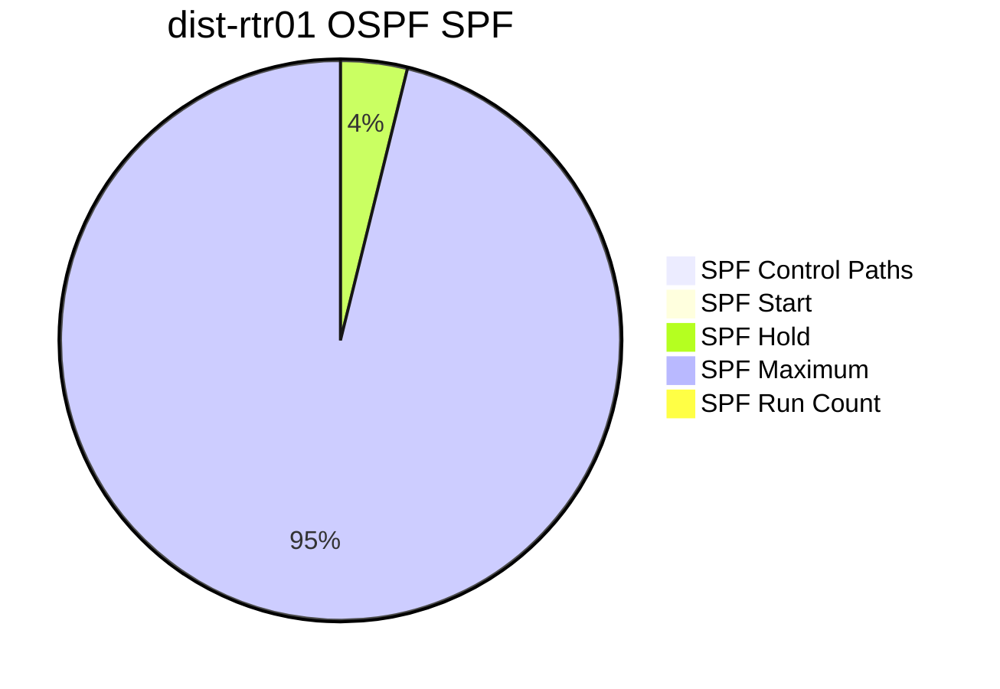
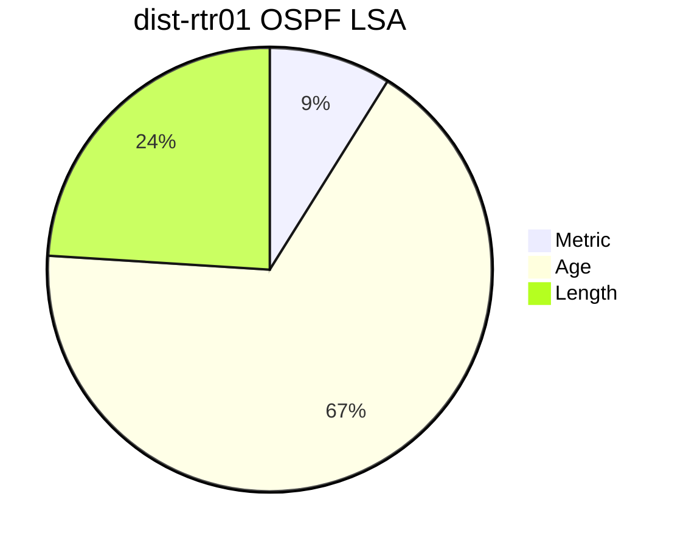
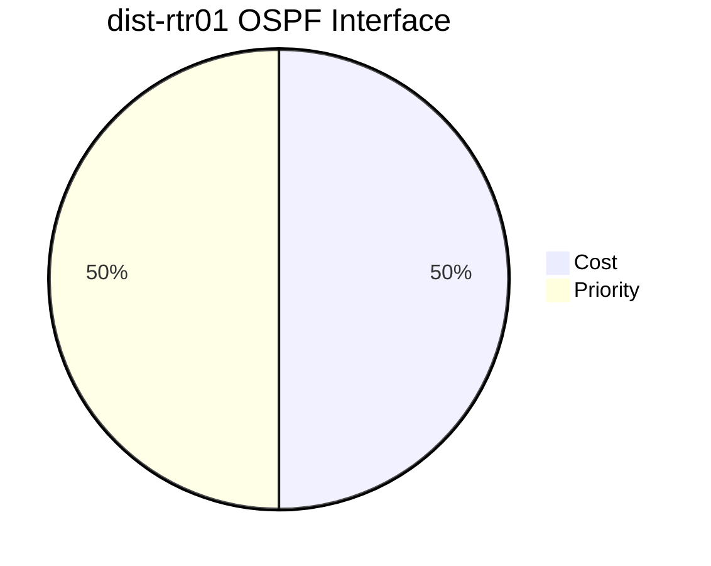
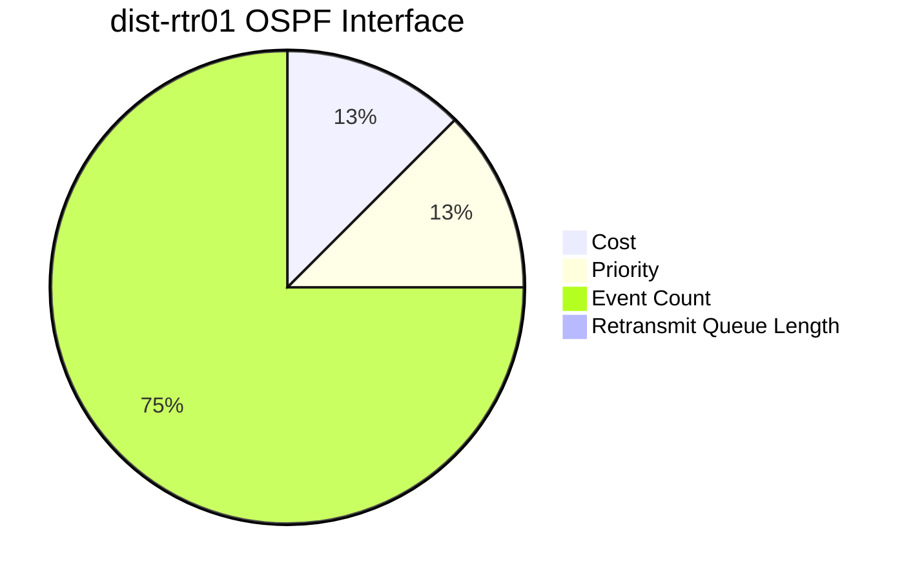

```mermaid
pie
title dist-rtr01 OSPF Interface
"Cost" : 1
"Priority" : 1
```
```mermaid
pie
title dist-rtr01 OSPF SPF
"SPF Control Paths" : 4
"SPF Start" : 50
"SPF Hold" : 200
"SPF Maximum" : 5000
"SPF Run Count" : 17
```
```mermaid
pie
title dist-rtr01 OSPF LSA
"Metric" : 40
"Age" : 302
"Length" : 108
```
```mermaid
pie
title dist-rtr01 OSPF Interface
"Cost" : 1
"Priority" : 1
"Event Count" : 6
"Retransmit Queue Length" : 0
```
```mermaid
pie
title dist-rtr01 OSPF SPF
"SPF Control Paths" : 4
"SPF Start" : 50
"SPF Hold" : 200
"SPF Maximum" : 5000
"SPF Run Count" : 17
```
```mermaid
pie
title dist-rtr01 OSPF LSA
"Metric" : 40
"Age" : 302
"Length" : 108
```
```mermaid
pie
title dist-rtr01 OSPF Interface
"Cost" : 1
"Priority" : 1
"Event Count" : 6
"Retransmit Queue Length" : 0
```
```mermaid
pie
title dist-rtr01 OSPF SPF
"SPF Control Paths" : 4
"SPF Start" : 50
"SPF Hold" : 200
"SPF Maximum" : 5000
"SPF Run Count" : 17
```
```mermaid
pie
title dist-rtr01 OSPF LSA
"Metric" : 40
"Age" : 302
"Length" : 108
```
```mermaid
pie
title dist-rtr01 OSPF Interface
"Cost" : 1
"Priority" : 1
"Event Count" : 6
"Retransmit Queue Length" : 0
```
```mermaid
pie
title dist-rtr01 OSPF SPF
"SPF Control Paths" : 4
"SPF Start" : 50
"SPF Hold" : 200
"SPF Maximum" : 5000
"SPF Run Count" : 17
```
```mermaid
pie
title dist-rtr01 OSPF LSA
"Metric" : 40
"Age" : 302
"Length" : 108
```
```mermaid
pie
title dist-rtr01 OSPF Interface
"Cost" : 1
"Priority" : 1
```
```mermaid
pie
title dist-rtr01 OSPF SPF
"SPF Control Paths" : 4
"SPF Start" : 50
"SPF Hold" : 200
"SPF Maximum" : 5000
"SPF Run Count" : 17
```
```mermaid
pie
title dist-rtr01 OSPF LSA
"Metric" : 40
"Age" : 302
"Length" : 108
```
```mermaid
pie
title dist-rtr01 OSPF Interface
"Cost" : 1
"Priority" : 1
```
```mermaid
pie
title dist-rtr01 OSPF SPF
"SPF Control Paths" : 4
"SPF Start" : 50
"SPF Hold" : 200
"SPF Maximum" : 5000
"SPF Run Count" : 17
```
```mermaid
pie
title dist-rtr01 OSPF LSA
"Metric" : 40
"Age" : 302
"Length" : 108
```
```mermaid
pie
title dist-rtr01 OSPF Interface
"Cost" : 1
"Priority" : 1
"Event Count" : 6
"Retransmit Queue Length" : 0
```
```mermaid
pie
title dist-rtr01 OSPF SPF
"SPF Control Paths" : 4
"SPF Start" : 50
"SPF Hold" : 200
"SPF Maximum" : 5000
"SPF Run Count" : 17
```
```mermaid
pie
title dist-rtr01 OSPF LSA
"Metric" : 40
"Age" : 302
"Length" : 108
```
```mermaid
pie
title dist-rtr01 OSPF Interface
"Cost" : 1
"Priority" : 1
"Event Count" : 6
"Retransmit Queue Length" : 0
```
```mermaid
pie
title dist-rtr01 OSPF SPF
"SPF Control Paths" : 4
"SPF Start" : 50
"SPF Hold" : 200
"SPF Maximum" : 5000
"SPF Run Count" : 17
```
```mermaid
pie
title dist-rtr01 OSPF LSA
"Metric" : 40
"Age" : 302
"Length" : 108
```
```mermaid
pie
title dist-rtr01 OSPF Interface
"Cost" : 1
"Priority" : 1
"Event Count" : 6
"Retransmit Queue Length" : 0
```
```mermaid
pie
title dist-rtr01 OSPF SPF
"SPF Control Paths" : 4
"SPF Start" : 50
"SPF Hold" : 200
"SPF Maximum" : 5000
"SPF Run Count" : 17
```
```mermaid
pie
title dist-rtr01 OSPF LSA
"Metric" : 40
"Age" : 302
"Length" : 108
```
```mermaid
pie
title dist-rtr01 OSPF Interface
"Cost" : 1
"Priority" : 1
```
```mermaid
pie
title dist-rtr01 OSPF SPF
"SPF Control Paths" : 4
"SPF Start" : 50
"SPF Hold" : 200
"SPF Maximum" : 5000
"SPF Run Count" : 17
```
```mermaid
pie
title dist-rtr01 OSPF LSA
"Metric" : 40
"Age" : 302
"Length" : 108
```
```mermaid
pie
title dist-rtr01 OSPF Interface
"Cost" : 1
"Priority" : 1
```
```mermaid
pie
title dist-rtr01 OSPF SPF
"SPF Control Paths" : 4
"SPF Start" : 50
"SPF Hold" : 200
"SPF Maximum" : 5000
"SPF Run Count" : 17
```
```mermaid
pie
title dist-rtr01 OSPF LSA
"Metric" : 40
"Age" : 302
"Length" : 108
```
```mermaid
pie
title dist-rtr01 OSPF Interface
"Cost" : 1
"Priority" : 1
"Event Count" : 6
"Retransmit Queue Length" : 0
```
```mermaid
pie
title dist-rtr01 OSPF SPF
"SPF Control Paths" : 4
"SPF Start" : 50
"SPF Hold" : 200
"SPF Maximum" : 5000
"SPF Run Count" : 17
```
```mermaid
pie
title dist-rtr01 OSPF LSA
"Metric" : 40
"Age" : 302
"Length" : 108
```
```mermaid
pie
title dist-rtr01 OSPF Interface
"Cost" : 1
"Priority" : 1
"Event Count" : 6
"Retransmit Queue Length" : 0
```
```mermaid
pie
title dist-rtr01 OSPF SPF
"SPF Control Paths" : 4
"SPF Start" : 50
"SPF Hold" : 200
"SPF Maximum" : 5000
"SPF Run Count" : 17
```
```mermaid
pie
title dist-rtr01 OSPF LSA
"Metric" : 40
"Age" : 302
"Length" : 108
```
```mermaid
pie
title dist-rtr01 OSPF Interface
"Cost" : 1
"Priority" : 1
"Event Count" : 6
"Retransmit Queue Length" : 0
```
```mermaid
pie
title dist-rtr01 OSPF SPF
"SPF Control Paths" : 4
"SPF Start" : 50
"SPF Hold" : 200
"SPF Maximum" : 5000
"SPF Run Count" : 17
```
```mermaid
pie
title dist-rtr01 OSPF LSA
"Metric" : 40
"Age" : 302
"Length" : 108
```
```mermaid
pie
title dist-rtr01 OSPF Interface
"Cost" : 1
"Priority" : 1
```
```mermaid
pie
title dist-rtr01 OSPF SPF
"SPF Control Paths" : 4
"SPF Start" : 50
"SPF Hold" : 200
"SPF Maximum" : 5000
"SPF Run Count" : 17
```
```mermaid
pie
title dist-rtr01 OSPF LSA
"Metric" : 40
"Age" : 302
"Length" : 108
```
```mermaid
pie
title dist-rtr01 OSPF Interface
"Cost" : 1
"Priority" : 1
```
```mermaid
pie
title dist-rtr01 OSPF SPF
"SPF Control Paths" : 4
"SPF Start" : 50
"SPF Hold" : 200
"SPF Maximum" : 5000
"SPF Run Count" : 17
```
```mermaid
pie
title dist-rtr01 OSPF LSA
"Metric" : 40
"Age" : 302
"Length" : 108
```
```mermaid
pie
title dist-rtr01 OSPF Interface
"Cost" : 1
"Priority" : 1
"Event Count" : 6
"Retransmit Queue Length" : 0
```
```mermaid
pie
title dist-rtr01 OSPF SPF
"SPF Control Paths" : 4
"SPF Start" : 50
"SPF Hold" : 200
"SPF Maximum" : 5000
"SPF Run Count" : 17
```
```mermaid
pie
title dist-rtr01 OSPF LSA
"Metric" : 40
"Age" : 302
"Length" : 108
```
```mermaid
pie
title dist-rtr01 OSPF Interface
"Cost" : 1
"Priority" : 1
"Event Count" : 6
"Retransmit Queue Length" : 0
```
```mermaid
pie
title dist-rtr01 OSPF SPF
"SPF Control Paths" : 4
"SPF Start" : 50
"SPF Hold" : 200
"SPF Maximum" : 5000
"SPF Run Count" : 17
```
```mermaid
pie
title dist-rtr01 OSPF LSA
"Metric" : 40
"Age" : 302
"Length" : 108
```
```mermaid
pie
title dist-rtr01 OSPF Interface
"Cost" : 1
"Priority" : 1
"Event Count" : 6
"Retransmit Queue Length" : 0
```
```mermaid
pie
title dist-rtr01 OSPF SPF
"SPF Control Paths" : 4
"SPF Start" : 50
"SPF Hold" : 200
"SPF Maximum" : 5000
"SPF Run Count" : 17
```
```mermaid
pie
title dist-rtr01 OSPF LSA
"Metric" : 40
"Age" : 302
"Length" : 108
```
```mermaid
pie
title dist-rtr01 OSPF Interface
"Cost" : 1
"Priority" : 1
```
```mermaid
pie
title dist-rtr01 OSPF SPF
"SPF Control Paths" : 4
"SPF Start" : 50
"SPF Hold" : 200
"SPF Maximum" : 5000
"SPF Run Count" : 17
```
```mermaid
pie
title dist-rtr01 OSPF LSA
"Metric" : 40
"Age" : 302
"Length" : 108
```
```mermaid
pie
title dist-rtr01 OSPF Interface
"Cost" : 1
"Priority" : 1
```
```mermaid
pie
title dist-rtr01 OSPF SPF
"SPF Control Paths" : 4
"SPF Start" : 50
"SPF Hold" : 200
"SPF Maximum" : 5000
"SPF Run Count" : 17
```
```mermaid
pie
title dist-rtr01 OSPF LSA
"Metric" : 40
"Age" : 302
"Length" : 108
```
```mermaid
pie
title dist-rtr01 OSPF Interface
"Cost" : 1
"Priority" : 1
"Event Count" : 6
"Retransmit Queue Length" : 0
```
```mermaid
pie
title dist-rtr01 OSPF SPF
"SPF Control Paths" : 4
"SPF Start" : 50
"SPF Hold" : 200
"SPF Maximum" : 5000
"SPF Run Count" : 17
```
```mermaid
pie
title dist-rtr01 OSPF LSA
"Metric" : 40
"Age" : 302
"Length" : 108
```
```mermaid
pie
title dist-rtr01 OSPF Interface
"Cost" : 1
"Priority" : 1
"Event Count" : 6
"Retransmit Queue Length" : 0
```
```mermaid
pie
title dist-rtr01 OSPF SPF
"SPF Control Paths" : 4
"SPF Start" : 50
"SPF Hold" : 200
"SPF Maximum" : 5000
"SPF Run Count" : 17
```
```mermaid
pie
title dist-rtr01 OSPF LSA
"Metric" : 40
"Age" : 302
"Length" : 108
```
```mermaid
pie
title dist-rtr01 OSPF Interface
"Cost" : 1
"Priority" : 1
"Event Count" : 6
"Retransmit Queue Length" : 0
```
```mermaid
pie
title dist-rtr01 OSPF SPF
"SPF Control Paths" : 4
"SPF Start" : 50
"SPF Hold" : 200
"SPF Maximum" : 5000
"SPF Run Count" : 17
```
```mermaid
pie
title dist-rtr01 OSPF LSA
"Metric" : 40
"Age" : 302
"Length" : 108
```
```mermaid
pie
title dist-rtr01 OSPF Interface
"Cost" : 1
"Priority" : 1
```
```mermaid
pie
title dist-rtr01 OSPF SPF
"SPF Control Paths" : 4
"SPF Start" : 50
"SPF Hold" : 200
"SPF Maximum" : 5000
"SPF Run Count" : 17
```
```mermaid
pie
title dist-rtr01 OSPF LSA
"Metric" : 40
"Age" : 302
"Length" : 108
```
```mermaid
pie
title dist-rtr01 OSPF Interface
"Cost" : 1
"Priority" : 1
```
```mermaid
pie
title dist-rtr01 OSPF SPF
"SPF Control Paths" : 4
"SPF Start" : 50
"SPF Hold" : 200
"SPF Maximum" : 5000
"SPF Run Count" : 17
```
```mermaid
pie
title dist-rtr01 OSPF LSA
"Metric" : 40
"Age" : 302
"Length" : 108
```
```mermaid
pie
title dist-rtr01 OSPF Interface
"Cost" : 1
"Priority" : 1
"Event Count" : 6
"Retransmit Queue Length" : 0
```
```mermaid
pie
title dist-rtr01 OSPF SPF
"SPF Control Paths" : 4
"SPF Start" : 50
"SPF Hold" : 200
"SPF Maximum" : 5000
"SPF Run Count" : 17
```
```mermaid
pie
title dist-rtr01 OSPF LSA
"Metric" : 40
"Age" : 302
"Length" : 108
```
```mermaid
pie
title dist-rtr01 OSPF Interface
"Cost" : 1
"Priority" : 1
"Event Count" : 6
"Retransmit Queue Length" : 0
```
```mermaid
pie
title dist-rtr01 OSPF SPF
"SPF Control Paths" : 4
"SPF Start" : 50
"SPF Hold" : 200
"SPF Maximum" : 5000
"SPF Run Count" : 17
```
```mermaid
pie
title dist-rtr01 OSPF LSA
"Metric" : 40
"Age" : 302
"Length" : 108
```
```mermaid
pie
title dist-rtr01 OSPF Interface
"Cost" : 1
"Priority" : 1
"Event Count" : 6
"Retransmit Queue Length" : 0
```
```mermaid
pie
title dist-rtr01 OSPF SPF
"SPF Control Paths" : 4
"SPF Start" : 50
"SPF Hold" : 200
"SPF Maximum" : 5000
"SPF Run Count" : 17
```
```mermaid
pie
title dist-rtr01 OSPF LSA
"Metric" : 40
"Age" : 289
"Length" : 108
```
```mermaid
pie
title dist-rtr01 OSPF Interface
"Cost" : 1
"Priority" : 1
```
```mermaid
pie
title dist-rtr01 OSPF SPF
"SPF Control Paths" : 4
"SPF Start" : 50
"SPF Hold" : 200
"SPF Maximum" : 5000
"SPF Run Count" : 17
```
```mermaid
pie
title dist-rtr01 OSPF LSA
"Metric" : 40
"Age" : 289
"Length" : 108
```
```mermaid
pie
title dist-rtr01 OSPF Interface
"Cost" : 1
"Priority" : 1
```
```mermaid
pie
title dist-rtr01 OSPF SPF
"SPF Control Paths" : 4
"SPF Start" : 50
"SPF Hold" : 200
"SPF Maximum" : 5000
"SPF Run Count" : 17
```
```mermaid
pie
title dist-rtr01 OSPF LSA
"Metric" : 40
"Age" : 289
"Length" : 108
```
```mermaid
pie
title dist-rtr01 OSPF Interface
"Cost" : 1
"Priority" : 1
"Event Count" : 6
"Retransmit Queue Length" : 0
```
```mermaid
pie
title dist-rtr01 OSPF SPF
"SPF Control Paths" : 4
"SPF Start" : 50
"SPF Hold" : 200
"SPF Maximum" : 5000
"SPF Run Count" : 17
```
```mermaid
pie
title dist-rtr01 OSPF LSA
"Metric" : 40
"Age" : 289
"Length" : 108
```
```mermaid
pie
title dist-rtr01 OSPF Interface
"Cost" : 1
"Priority" : 1
"Event Count" : 6
"Retransmit Queue Length" : 0
```
```mermaid
pie
title dist-rtr01 OSPF SPF
"SPF Control Paths" : 4
"SPF Start" : 50
"SPF Hold" : 200
"SPF Maximum" : 5000
"SPF Run Count" : 17
```
```mermaid
pie
title dist-rtr01 OSPF LSA
"Metric" : 40
"Age" : 289
"Length" : 108
```
```mermaid
pie
title dist-rtr01 OSPF Interface
"Cost" : 1
"Priority" : 1
"Event Count" : 6
"Retransmit Queue Length" : 0
```
```mermaid
pie
title dist-rtr01 OSPF SPF
"SPF Control Paths" : 4
"SPF Start" : 50
"SPF Hold" : 200
"SPF Maximum" : 5000
"SPF Run Count" : 17
```
```mermaid
pie
title dist-rtr01 OSPF LSA
"Metric" : 40
"Age" : 289
"Length" : 108
```
```mermaid
pie
title dist-rtr01 OSPF Interface
"Cost" : 1
"Priority" : 1
```
```mermaid
pie
title dist-rtr01 OSPF SPF
"SPF Control Paths" : 4
"SPF Start" : 50
"SPF Hold" : 200
"SPF Maximum" : 5000
"SPF Run Count" : 17
```
```mermaid
pie
title dist-rtr01 OSPF LSA
"Metric" : 40
"Age" : 289
"Length" : 108
```
```mermaid
pie
title dist-rtr01 OSPF Interface
"Cost" : 1
"Priority" : 1
```
```mermaid
pie
title dist-rtr01 OSPF SPF
"SPF Control Paths" : 4
"SPF Start" : 50
"SPF Hold" : 200
"SPF Maximum" : 5000
"SPF Run Count" : 17
```
```mermaid
pie
title dist-rtr01 OSPF LSA
"Metric" : 40
"Age" : 289
"Length" : 108
```
```mermaid
pie
title dist-rtr01 OSPF Interface
"Cost" : 1
"Priority" : 1
"Event Count" : 6
"Retransmit Queue Length" : 0
```
```mermaid
pie
title dist-rtr01 OSPF SPF
"SPF Control Paths" : 4
"SPF Start" : 50
"SPF Hold" : 200
"SPF Maximum" : 5000
"SPF Run Count" : 17
```
```mermaid
pie
title dist-rtr01 OSPF LSA
"Metric" : 40
"Age" : 289
"Length" : 108
```
```mermaid
pie
title dist-rtr01 OSPF Interface
"Cost" : 1
"Priority" : 1
"Event Count" : 6
"Retransmit Queue Length" : 0
```
```mermaid
pie
title dist-rtr01 OSPF SPF
"SPF Control Paths" : 4
"SPF Start" : 50
"SPF Hold" : 200
"SPF Maximum" : 5000
"SPF Run Count" : 17
```
```mermaid
pie
title dist-rtr01 OSPF LSA
"Metric" : 40
"Age" : 289
"Length" : 108
```
```mermaid
pie
title dist-rtr01 OSPF Interface
"Cost" : 1
"Priority" : 1
"Event Count" : 6
"Retransmit Queue Length" : 0
```
```mermaid
pie
title dist-rtr01 OSPF SPF
"SPF Control Paths" : 4
"SPF Start" : 50
"SPF Hold" : 200
"SPF Maximum" : 5000
"SPF Run Count" : 17
```
```mermaid
pie
title dist-rtr01 OSPF LSA
"Metric" : 40
"Age" : 289
"Length" : 108
```
```mermaid
pie
title dist-rtr01 OSPF Interface
"Cost" : 1
"Priority" : 1
```
```mermaid
pie
title dist-rtr01 OSPF SPF
"SPF Control Paths" : 4
"SPF Start" : 50
"SPF Hold" : 200
"SPF Maximum" : 5000
"SPF Run Count" : 17
```
```mermaid
pie
title dist-rtr01 OSPF LSA
"Metric" : 40
"Age" : 289
"Length" : 108
```
```mermaid
pie
title dist-rtr01 OSPF Interface
"Cost" : 1
"Priority" : 1
```
```mermaid
pie
title dist-rtr01 OSPF SPF
"SPF Control Paths" : 4
"SPF Start" : 50
"SPF Hold" : 200
"SPF Maximum" : 5000
"SPF Run Count" : 17
```
```mermaid
pie
title dist-rtr01 OSPF LSA
"Metric" : 40
"Age" : 289
"Length" : 108
```
```mermaid
pie
title dist-rtr01 OSPF Interface
"Cost" : 1
"Priority" : 1
"Event Count" : 6
"Retransmit Queue Length" : 0
```
```mermaid
pie
title dist-rtr01 OSPF SPF
"SPF Control Paths" : 4
"SPF Start" : 50
"SPF Hold" : 200
"SPF Maximum" : 5000
"SPF Run Count" : 17
```
```mermaid
pie
title dist-rtr01 OSPF LSA
"Metric" : 40
"Age" : 289
"Length" : 108
```
```mermaid
pie
title dist-rtr01 OSPF Interface
"Cost" : 1
"Priority" : 1
"Event Count" : 6
"Retransmit Queue Length" : 0
```
```mermaid
pie
title dist-rtr01 OSPF SPF
"SPF Control Paths" : 4
"SPF Start" : 50
"SPF Hold" : 200
"SPF Maximum" : 5000
"SPF Run Count" : 17
```
```mermaid
pie
title dist-rtr01 OSPF LSA
"Metric" : 40
"Age" : 289
"Length" : 108
```
```mermaid
pie
title dist-rtr01 OSPF Interface
"Cost" : 1
"Priority" : 1
"Event Count" : 6
"Retransmit Queue Length" : 0
```
```mermaid
pie
title dist-rtr01 OSPF SPF
"SPF Control Paths" : 4
"SPF Start" : 50
"SPF Hold" : 200
"SPF Maximum" : 5000
"SPF Run Count" : 17
```
```mermaid
pie
title dist-rtr01 OSPF LSA
"Metric" : 40
"Age" : 289
"Length" : 108
```
```mermaid
pie
title dist-rtr01 OSPF Interface
"Cost" : 1
"Priority" : 1
```
```mermaid
pie
title dist-rtr01 OSPF SPF
"SPF Control Paths" : 4
"SPF Start" : 50
"SPF Hold" : 200
"SPF Maximum" : 5000
"SPF Run Count" : 17
```
```mermaid
pie
title dist-rtr01 OSPF LSA
"Metric" : 40
"Age" : 289
"Length" : 108
```
```mermaid
pie
title dist-rtr01 OSPF Interface
"Cost" : 1
"Priority" : 1
```
```mermaid
pie
title dist-rtr01 OSPF SPF
"SPF Control Paths" : 4
"SPF Start" : 50
"SPF Hold" : 200
"SPF Maximum" : 5000
"SPF Run Count" : 17
```
```mermaid
pie
title dist-rtr01 OSPF LSA
"Metric" : 40
"Age" : 289
"Length" : 108
```
```mermaid
pie
title dist-rtr01 OSPF Interface
"Cost" : 1
"Priority" : 1
"Event Count" : 6
"Retransmit Queue Length" : 0
```
```mermaid
pie
title dist-rtr01 OSPF SPF
"SPF Control Paths" : 4
"SPF Start" : 50
"SPF Hold" : 200
"SPF Maximum" : 5000
"SPF Run Count" : 17
```
```mermaid
pie
title dist-rtr01 OSPF LSA
"Metric" : 40
"Age" : 289
"Length" : 108
```
```mermaid
pie
title dist-rtr01 OSPF Interface
"Cost" : 1
"Priority" : 1
"Event Count" : 6
"Retransmit Queue Length" : 0
```
```mermaid
pie
title dist-rtr01 OSPF SPF
"SPF Control Paths" : 4
"SPF Start" : 50
"SPF Hold" : 200
"SPF Maximum" : 5000
"SPF Run Count" : 17
```
```mermaid
pie
title dist-rtr01 OSPF LSA
"Metric" : 40
"Age" : 289
"Length" : 108
```
```mermaid
pie
title dist-rtr01 OSPF Interface
"Cost" : 1
"Priority" : 1
"Event Count" : 6
"Retransmit Queue Length" : 0
```
```mermaid
pie
title dist-rtr01 OSPF SPF
"SPF Control Paths" : 4
"SPF Start" : 50
"SPF Hold" : 200
"SPF Maximum" : 5000
"SPF Run Count" : 17
```
```mermaid
pie
title dist-rtr01 OSPF LSA
"Metric" : 40
"Age" : 289
"Length" : 108
```
```mermaid
pie
title dist-rtr01 OSPF Interface
"Cost" : 1
"Priority" : 1
```
```mermaid
pie
title dist-rtr01 OSPF SPF
"SPF Control Paths" : 4
"SPF Start" : 50
"SPF Hold" : 200
"SPF Maximum" : 5000
"SPF Run Count" : 17
```
```mermaid
pie
title dist-rtr01 OSPF LSA
"Metric" : 40
"Age" : 289
"Length" : 108
```
```mermaid
pie
title dist-rtr01 OSPF Interface
"Cost" : 1
"Priority" : 1
```
```mermaid
pie
title dist-rtr01 OSPF SPF
"SPF Control Paths" : 4
"SPF Start" : 50
"SPF Hold" : 200
"SPF Maximum" : 5000
"SPF Run Count" : 17
```
```mermaid
pie
title dist-rtr01 OSPF LSA
"Metric" : 40
"Age" : 289
"Length" : 108
```
```mermaid
pie
title dist-rtr01 OSPF Interface
"Cost" : 1
"Priority" : 1
"Event Count" : 6
"Retransmit Queue Length" : 0
```
```mermaid
pie
title dist-rtr01 OSPF SPF
"SPF Control Paths" : 4
"SPF Start" : 50
"SPF Hold" : 200
"SPF Maximum" : 5000
"SPF Run Count" : 17
```
```mermaid
pie
title dist-rtr01 OSPF LSA
"Metric" : 40
"Age" : 289
"Length" : 108
```
```mermaid
pie
title dist-rtr01 OSPF Interface
"Cost" : 1
"Priority" : 1
"Event Count" : 6
"Retransmit Queue Length" : 0
```
```mermaid
pie
title dist-rtr01 OSPF SPF
"SPF Control Paths" : 4
"SPF Start" : 50
"SPF Hold" : 200
"SPF Maximum" : 5000
"SPF Run Count" : 17
```
```mermaid
pie
title dist-rtr01 OSPF LSA
"Metric" : 40
"Age" : 289
"Length" : 108
```
```mermaid
pie
title dist-rtr01 OSPF Interface
"Cost" : 1
"Priority" : 1
"Event Count" : 6
"Retransmit Queue Length" : 0
```
```mermaid
pie
title dist-rtr01 OSPF SPF
"SPF Control Paths" : 4
"SPF Start" : 50
"SPF Hold" : 200
"SPF Maximum" : 5000
"SPF Run Count" : 17
```
```mermaid
pie
title dist-rtr01 OSPF LSA
"Metric" : 40
"Age" : 289
"Length" : 108
```
```mermaid
pie
title dist-rtr01 OSPF Interface
"Cost" : 1
"Priority" : 1
```
```mermaid
pie
title dist-rtr01 OSPF SPF
"SPF Control Paths" : 4
"SPF Start" : 50
"SPF Hold" : 200
"SPF Maximum" : 5000
"SPF Run Count" : 17
```
```mermaid
pie
title dist-rtr01 OSPF LSA
"Metric" : 40
"Age" : 289
"Length" : 108
```
```mermaid
pie
title dist-rtr01 OSPF Interface
"Cost" : 1
"Priority" : 1
```
```mermaid
pie
title dist-rtr01 OSPF SPF
"SPF Control Paths" : 4
"SPF Start" : 50
"SPF Hold" : 200
"SPF Maximum" : 5000
"SPF Run Count" : 17
```
```mermaid
pie
title dist-rtr01 OSPF LSA
"Metric" : 40
"Age" : 289
"Length" : 108
```
```mermaid
pie
title dist-rtr01 OSPF Interface
"Cost" : 1
"Priority" : 1
"Event Count" : 6
"Retransmit Queue Length" : 0
```
```mermaid
pie
title dist-rtr01 OSPF SPF
"SPF Control Paths" : 4
"SPF Start" : 50
"SPF Hold" : 200
"SPF Maximum" : 5000
"SPF Run Count" : 17
```
```mermaid
pie
title dist-rtr01 OSPF LSA
"Metric" : 40
"Age" : 289
"Length" : 108
```
```mermaid
pie
title dist-rtr01 OSPF Interface
"Cost" : 1
"Priority" : 1
"Event Count" : 6
"Retransmit Queue Length" : 0
```
```mermaid
pie
title dist-rtr01 OSPF SPF
"SPF Control Paths" : 4
"SPF Start" : 50
"SPF Hold" : 200
"SPF Maximum" : 5000
"SPF Run Count" : 17
```
```mermaid
pie
title dist-rtr01 OSPF LSA
"Metric" : 40
"Age" : 289
"Length" : 108
```
```mermaid
pie
title dist-rtr01 OSPF Interface
"Cost" : 1
"Priority" : 1
"Event Count" : 6
"Retransmit Queue Length" : 0
```
```mermaid
pie
title dist-rtr01 OSPF SPF
"SPF Control Paths" : 4
"SPF Start" : 50
"SPF Hold" : 200
"SPF Maximum" : 5000
"SPF Run Count" : 17
```
```mermaid
pie
title dist-rtr01 OSPF LSA
"Metric" : 40
"Age" : 289
"Length" : 108
```
```mermaid
pie
title dist-rtr01 OSPF Interface
"Cost" : 1
"Priority" : 1
```
```mermaid
pie
title dist-rtr01 OSPF SPF
"SPF Control Paths" : 4
"SPF Start" : 50
"SPF Hold" : 200
"SPF Maximum" : 5000
"SPF Run Count" : 17
```
```mermaid
pie
title dist-rtr01 OSPF LSA
"Metric" : 40
"Age" : 289
"Length" : 108
```
```mermaid
pie
title dist-rtr01 OSPF Interface
"Cost" : 1
"Priority" : 1
```
```mermaid
pie
title dist-rtr01 OSPF SPF
"SPF Control Paths" : 4
"SPF Start" : 50
"SPF Hold" : 200
"SPF Maximum" : 5000
"SPF Run Count" : 17
```
```mermaid
pie
title dist-rtr01 OSPF LSA
"Metric" : 40
"Age" : 289
"Length" : 108
```
```mermaid
pie
title dist-rtr01 OSPF Interface
"Cost" : 1
"Priority" : 1
"Event Count" : 6
"Retransmit Queue Length" : 0
```
```mermaid
pie
title dist-rtr01 OSPF SPF
"SPF Control Paths" : 4
"SPF Start" : 50
"SPF Hold" : 200
"SPF Maximum" : 5000
"SPF Run Count" : 17
```
```mermaid
pie
title dist-rtr01 OSPF LSA
"Metric" : 40
"Age" : 289
"Length" : 108
```
```mermaid
pie
title dist-rtr01 OSPF Interface
"Cost" : 1
"Priority" : 1
"Event Count" : 6
"Retransmit Queue Length" : 0
```
```mermaid
pie
title dist-rtr01 OSPF SPF
"SPF Control Paths" : 4
"SPF Start" : 50
"SPF Hold" : 200
"SPF Maximum" : 5000
"SPF Run Count" : 17
```
```mermaid
pie
title dist-rtr01 OSPF LSA
"Metric" : 40
"Age" : 289
"Length" : 108
```
```mermaid
pie
title dist-rtr01 OSPF Interface
"Cost" : 1
"Priority" : 1
"Event Count" : 6
"Retransmit Queue Length" : 0
```
```mermaid
pie
title dist-rtr01 OSPF SPF
"SPF Control Paths" : 4
"SPF Start" : 50
"SPF Hold" : 200
"SPF Maximum" : 5000
"SPF Run Count" : 17
```
```mermaid
pie
title dist-rtr01 OSPF LSA
"Metric" : 1
"Age" : 1446
"Length" : 84
```
```mermaid
pie
title dist-rtr01 OSPF Interface
"Cost" : 1
"Priority" : 1
```
```mermaid
pie
title dist-rtr01 OSPF SPF
"SPF Control Paths" : 4
"SPF Start" : 50
"SPF Hold" : 200
"SPF Maximum" : 5000
"SPF Run Count" : 17
```
```mermaid
pie
title dist-rtr01 OSPF LSA
"Metric" : 1
"Age" : 1446
"Length" : 84
```
```mermaid
pie
title dist-rtr01 OSPF Interface
"Cost" : 1
"Priority" : 1
```
```mermaid
pie
title dist-rtr01 OSPF SPF
"SPF Control Paths" : 4
"SPF Start" : 50
"SPF Hold" : 200
"SPF Maximum" : 5000
"SPF Run Count" : 17
```
```mermaid
pie
title dist-rtr01 OSPF LSA
"Metric" : 1
"Age" : 1446
"Length" : 84
```
```mermaid
pie
title dist-rtr01 OSPF Interface
"Cost" : 1
"Priority" : 1
"Event Count" : 6
"Retransmit Queue Length" : 0
```
```mermaid
pie
title dist-rtr01 OSPF SPF
"SPF Control Paths" : 4
"SPF Start" : 50
"SPF Hold" : 200
"SPF Maximum" : 5000
"SPF Run Count" : 17
```
```mermaid
pie
title dist-rtr01 OSPF LSA
"Metric" : 1
"Age" : 1446
"Length" : 84
```
```mermaid
pie
title dist-rtr01 OSPF Interface
"Cost" : 1
"Priority" : 1
"Event Count" : 6
"Retransmit Queue Length" : 0
```
```mermaid
pie
title dist-rtr01 OSPF SPF
"SPF Control Paths" : 4
"SPF Start" : 50
"SPF Hold" : 200
"SPF Maximum" : 5000
"SPF Run Count" : 17
```
```mermaid
pie
title dist-rtr01 OSPF LSA
"Metric" : 1
"Age" : 1446
"Length" : 84
```
```mermaid
pie
title dist-rtr01 OSPF Interface
"Cost" : 1
"Priority" : 1
"Event Count" : 6
"Retransmit Queue Length" : 0
```
```mermaid
pie
title dist-rtr01 OSPF SPF
"SPF Control Paths" : 4
"SPF Start" : 50
"SPF Hold" : 200
"SPF Maximum" : 5000
"SPF Run Count" : 17
```
```mermaid
pie
title dist-rtr01 OSPF LSA
"Metric" : 1
"Age" : 1446
"Length" : 84
```
```mermaid
pie
title dist-rtr01 OSPF Interface
"Cost" : 1
"Priority" : 1
```
```mermaid
pie
title dist-rtr01 OSPF SPF
"SPF Control Paths" : 4
"SPF Start" : 50
"SPF Hold" : 200
"SPF Maximum" : 5000
"SPF Run Count" : 17
```
```mermaid
pie
title dist-rtr01 OSPF LSA
"Metric" : 1
"Age" : 1446
"Length" : 84
```
```mermaid
pie
title dist-rtr01 OSPF Interface
"Cost" : 1
"Priority" : 1
```
```mermaid
pie
title dist-rtr01 OSPF SPF
"SPF Control Paths" : 4
"SPF Start" : 50
"SPF Hold" : 200
"SPF Maximum" : 5000
"SPF Run Count" : 17
```
```mermaid
pie
title dist-rtr01 OSPF LSA
"Metric" : 1
"Age" : 1446
"Length" : 84
```
```mermaid
pie
title dist-rtr01 OSPF Interface
"Cost" : 1
"Priority" : 1
"Event Count" : 6
"Retransmit Queue Length" : 0
```
```mermaid
pie
title dist-rtr01 OSPF SPF
"SPF Control Paths" : 4
"SPF Start" : 50
"SPF Hold" : 200
"SPF Maximum" : 5000
"SPF Run Count" : 17
```
```mermaid
pie
title dist-rtr01 OSPF LSA
"Metric" : 1
"Age" : 1446
"Length" : 84
```
```mermaid
pie
title dist-rtr01 OSPF Interface
"Cost" : 1
"Priority" : 1
"Event Count" : 6
"Retransmit Queue Length" : 0
```
```mermaid
pie
title dist-rtr01 OSPF SPF
"SPF Control Paths" : 4
"SPF Start" : 50
"SPF Hold" : 200
"SPF Maximum" : 5000
"SPF Run Count" : 17
```
```mermaid
pie
title dist-rtr01 OSPF LSA
"Metric" : 1
"Age" : 1446
"Length" : 84
```
```mermaid
pie
title dist-rtr01 OSPF Interface
"Cost" : 1
"Priority" : 1
"Event Count" : 6
"Retransmit Queue Length" : 0
```
```mermaid
pie
title dist-rtr01 OSPF SPF
"SPF Control Paths" : 4
"SPF Start" : 50
"SPF Hold" : 200
"SPF Maximum" : 5000
"SPF Run Count" : 17
```
```mermaid
pie
title dist-rtr01 OSPF LSA
"Metric" : 1
"Age" : 1446
"Length" : 84
```
```mermaid
pie
title dist-rtr01 OSPF Interface
"Cost" : 1
"Priority" : 1
```
```mermaid
pie
title dist-rtr01 OSPF SPF
"SPF Control Paths" : 4
"SPF Start" : 50
"SPF Hold" : 200
"SPF Maximum" : 5000
"SPF Run Count" : 17
```
```mermaid
pie
title dist-rtr01 OSPF LSA
"Metric" : 1
"Age" : 1446
"Length" : 84
```
```mermaid
pie
title dist-rtr01 OSPF Interface
"Cost" : 1
"Priority" : 1
```
```mermaid
pie
title dist-rtr01 OSPF SPF
"SPF Control Paths" : 4
"SPF Start" : 50
"SPF Hold" : 200
"SPF Maximum" : 5000
"SPF Run Count" : 17
```
```mermaid
pie
title dist-rtr01 OSPF LSA
"Metric" : 1
"Age" : 1446
"Length" : 84
```
```mermaid
pie
title dist-rtr01 OSPF Interface
"Cost" : 1
"Priority" : 1
"Event Count" : 6
"Retransmit Queue Length" : 0
```
```mermaid
pie
title dist-rtr01 OSPF SPF
"SPF Control Paths" : 4
"SPF Start" : 50
"SPF Hold" : 200
"SPF Maximum" : 5000
"SPF Run Count" : 17
```
```mermaid
pie
title dist-rtr01 OSPF LSA
"Metric" : 1
"Age" : 1446
"Length" : 84
```
```mermaid
pie
title dist-rtr01 OSPF Interface
"Cost" : 1
"Priority" : 1
"Event Count" : 6
"Retransmit Queue Length" : 0
```
```mermaid
pie
title dist-rtr01 OSPF SPF
"SPF Control Paths" : 4
"SPF Start" : 50
"SPF Hold" : 200
"SPF Maximum" : 5000
"SPF Run Count" : 17
```
```mermaid
pie
title dist-rtr01 OSPF LSA
"Metric" : 1
"Age" : 1446
"Length" : 84
```
```mermaid
pie
title dist-rtr01 OSPF Interface
"Cost" : 1
"Priority" : 1
"Event Count" : 6
"Retransmit Queue Length" : 0
```
```mermaid
pie
title dist-rtr01 OSPF SPF
"SPF Control Paths" : 4
"SPF Start" : 50
"SPF Hold" : 200
"SPF Maximum" : 5000
"SPF Run Count" : 17
```
```mermaid
pie
title dist-rtr01 OSPF LSA
"Metric" : 1
"Age" : 1446
"Length" : 84
```
```mermaid
pie
title dist-rtr01 OSPF Interface
"Cost" : 1
"Priority" : 1
```
```mermaid
pie
title dist-rtr01 OSPF SPF
"SPF Control Paths" : 4
"SPF Start" : 50
"SPF Hold" : 200
"SPF Maximum" : 5000
"SPF Run Count" : 17
```
```mermaid
pie
title dist-rtr01 OSPF LSA
"Metric" : 1
"Age" : 1446
"Length" : 84
```
```mermaid
pie
title dist-rtr01 OSPF Interface
"Cost" : 1
"Priority" : 1
```
```mermaid
pie
title dist-rtr01 OSPF SPF
"SPF Control Paths" : 4
"SPF Start" : 50
"SPF Hold" : 200
"SPF Maximum" : 5000
"SPF Run Count" : 17
```
```mermaid
pie
title dist-rtr01 OSPF LSA
"Metric" : 1
"Age" : 1446
"Length" : 84
```
```mermaid
pie
title dist-rtr01 OSPF Interface
"Cost" : 1
"Priority" : 1
"Event Count" : 6
"Retransmit Queue Length" : 0
```
```mermaid
pie
title dist-rtr01 OSPF SPF
"SPF Control Paths" : 4
"SPF Start" : 50
"SPF Hold" : 200
"SPF Maximum" : 5000
"SPF Run Count" : 17
```
```mermaid
pie
title dist-rtr01 OSPF LSA
"Metric" : 1
"Age" : 1446
"Length" : 84
```
```mermaid
pie
title dist-rtr01 OSPF Interface
"Cost" : 1
"Priority" : 1
"Event Count" : 6
"Retransmit Queue Length" : 0
```
```mermaid
pie
title dist-rtr01 OSPF SPF
"SPF Control Paths" : 4
"SPF Start" : 50
"SPF Hold" : 200
"SPF Maximum" : 5000
"SPF Run Count" : 17
```
```mermaid
pie
title dist-rtr01 OSPF LSA
"Metric" : 1
"Age" : 1446
"Length" : 84
```
```mermaid
pie
title dist-rtr01 OSPF Interface
"Cost" : 1
"Priority" : 1
"Event Count" : 6
"Retransmit Queue Length" : 0
```
```mermaid
pie
title dist-rtr01 OSPF SPF
"SPF Control Paths" : 4
"SPF Start" : 50
"SPF Hold" : 200
"SPF Maximum" : 5000
"SPF Run Count" : 17
```
```mermaid
pie
title dist-rtr01 OSPF LSA
"Metric" : 1
"Age" : 1446
"Length" : 84
```
```mermaid
pie
title dist-rtr01 OSPF Interface
"Cost" : 1
"Priority" : 1
```
```mermaid
pie
title dist-rtr01 OSPF SPF
"SPF Control Paths" : 4
"SPF Start" : 50
"SPF Hold" : 200
"SPF Maximum" : 5000
"SPF Run Count" : 17
```
```mermaid
pie
title dist-rtr01 OSPF LSA
"Metric" : 1
"Age" : 1446
"Length" : 84
```
```mermaid
pie
title dist-rtr01 OSPF Interface
"Cost" : 1
"Priority" : 1
```
```mermaid
pie
title dist-rtr01 OSPF SPF
"SPF Control Paths" : 4
"SPF Start" : 50
"SPF Hold" : 200
"SPF Maximum" : 5000
"SPF Run Count" : 17
```
```mermaid
pie
title dist-rtr01 OSPF LSA
"Metric" : 1
"Age" : 1446
"Length" : 84
```
```mermaid
pie
title dist-rtr01 OSPF Interface
"Cost" : 1
"Priority" : 1
"Event Count" : 6
"Retransmit Queue Length" : 0
```
```mermaid
pie
title dist-rtr01 OSPF SPF
"SPF Control Paths" : 4
"SPF Start" : 50
"SPF Hold" : 200
"SPF Maximum" : 5000
"SPF Run Count" : 17
```
```mermaid
pie
title dist-rtr01 OSPF LSA
"Metric" : 1
"Age" : 1446
"Length" : 84
```
```mermaid
pie
title dist-rtr01 OSPF Interface
"Cost" : 1
"Priority" : 1
"Event Count" : 6
"Retransmit Queue Length" : 0
```
```mermaid
pie
title dist-rtr01 OSPF SPF
"SPF Control Paths" : 4
"SPF Start" : 50
"SPF Hold" : 200
"SPF Maximum" : 5000
"SPF Run Count" : 17
```
```mermaid
pie
title dist-rtr01 OSPF LSA
"Metric" : 1
"Age" : 1446
"Length" : 84
```
```mermaid
pie
title dist-rtr01 OSPF Interface
"Cost" : 1
"Priority" : 1
"Event Count" : 6
"Retransmit Queue Length" : 0
```
```mermaid
pie
title dist-rtr01 OSPF SPF
"SPF Control Paths" : 4
"SPF Start" : 50
"SPF Hold" : 200
"SPF Maximum" : 5000
"SPF Run Count" : 17
```
```mermaid
pie
title dist-rtr01 OSPF LSA
"Metric" : 1
"Age" : 1274
"Length" : 84
```
```mermaid
pie
title dist-rtr01 OSPF Interface
"Cost" : 1
"Priority" : 1
```
```mermaid
pie
title dist-rtr01 OSPF SPF
"SPF Control Paths" : 4
"SPF Start" : 50
"SPF Hold" : 200
"SPF Maximum" : 5000
"SPF Run Count" : 17
```
```mermaid
pie
title dist-rtr01 OSPF LSA
"Metric" : 1
"Age" : 1274
"Length" : 84
```
```mermaid
pie
title dist-rtr01 OSPF Interface
"Cost" : 1
"Priority" : 1
```
```mermaid
pie
title dist-rtr01 OSPF SPF
"SPF Control Paths" : 4
"SPF Start" : 50
"SPF Hold" : 200
"SPF Maximum" : 5000
"SPF Run Count" : 17
```
```mermaid
pie
title dist-rtr01 OSPF LSA
"Metric" : 1
"Age" : 1274
"Length" : 84
```
```mermaid
pie
title dist-rtr01 OSPF Interface
"Cost" : 1
"Priority" : 1
"Event Count" : 6
"Retransmit Queue Length" : 0
```
```mermaid
pie
title dist-rtr01 OSPF SPF
"SPF Control Paths" : 4
"SPF Start" : 50
"SPF Hold" : 200
"SPF Maximum" : 5000
"SPF Run Count" : 17
```
```mermaid
pie
title dist-rtr01 OSPF LSA
"Metric" : 1
"Age" : 1274
"Length" : 84
```
```mermaid
pie
title dist-rtr01 OSPF Interface
"Cost" : 1
"Priority" : 1
"Event Count" : 6
"Retransmit Queue Length" : 0
```
```mermaid
pie
title dist-rtr01 OSPF SPF
"SPF Control Paths" : 4
"SPF Start" : 50
"SPF Hold" : 200
"SPF Maximum" : 5000
"SPF Run Count" : 17
```
```mermaid
pie
title dist-rtr01 OSPF LSA
"Metric" : 1
"Age" : 1274
"Length" : 84
```
```mermaid
pie
title dist-rtr01 OSPF Interface
"Cost" : 1
"Priority" : 1
"Event Count" : 6
"Retransmit Queue Length" : 0
```
```mermaid
pie
title dist-rtr01 OSPF SPF
"SPF Control Paths" : 4
"SPF Start" : 50
"SPF Hold" : 200
"SPF Maximum" : 5000
"SPF Run Count" : 17
```
```mermaid
pie
title dist-rtr01 OSPF LSA
"Metric" : 1
"Age" : 1274
"Length" : 84
```
```mermaid
pie
title dist-rtr01 OSPF Interface
"Cost" : 1
"Priority" : 1
```
```mermaid
pie
title dist-rtr01 OSPF SPF
"SPF Control Paths" : 4
"SPF Start" : 50
"SPF Hold" : 200
"SPF Maximum" : 5000
"SPF Run Count" : 17
```
```mermaid
pie
title dist-rtr01 OSPF LSA
"Metric" : 1
"Age" : 1274
"Length" : 84
```
```mermaid
pie
title dist-rtr01 OSPF Interface
"Cost" : 1
"Priority" : 1
```
```mermaid
pie
title dist-rtr01 OSPF SPF
"SPF Control Paths" : 4
"SPF Start" : 50
"SPF Hold" : 200
"SPF Maximum" : 5000
"SPF Run Count" : 17
```
```mermaid
pie
title dist-rtr01 OSPF LSA
"Metric" : 1
"Age" : 1274
"Length" : 84
```
```mermaid
pie
title dist-rtr01 OSPF Interface
"Cost" : 1
"Priority" : 1
"Event Count" : 6
"Retransmit Queue Length" : 0
```
```mermaid
pie
title dist-rtr01 OSPF SPF
"SPF Control Paths" : 4
"SPF Start" : 50
"SPF Hold" : 200
"SPF Maximum" : 5000
"SPF Run Count" : 17
```
```mermaid
pie
title dist-rtr01 OSPF LSA
"Metric" : 1
"Age" : 1274
"Length" : 84
```
```mermaid
pie
title dist-rtr01 OSPF Interface
"Cost" : 1
"Priority" : 1
"Event Count" : 6
"Retransmit Queue Length" : 0
```
```mermaid
pie
title dist-rtr01 OSPF SPF
"SPF Control Paths" : 4
"SPF Start" : 50
"SPF Hold" : 200
"SPF Maximum" : 5000
"SPF Run Count" : 17
```
```mermaid
pie
title dist-rtr01 OSPF LSA
"Metric" : 1
"Age" : 1274
"Length" : 84
```
```mermaid
pie
title dist-rtr01 OSPF Interface
"Cost" : 1
"Priority" : 1
"Event Count" : 6
"Retransmit Queue Length" : 0
```
```mermaid
pie
title dist-rtr01 OSPF SPF
"SPF Control Paths" : 4
"SPF Start" : 50
"SPF Hold" : 200
"SPF Maximum" : 5000
"SPF Run Count" : 17
```
```mermaid
pie
title dist-rtr01 OSPF LSA
"Metric" : 1
"Age" : 1274
"Length" : 84
```
```mermaid
pie
title dist-rtr01 OSPF Interface
"Cost" : 1
"Priority" : 1
```
```mermaid
pie
title dist-rtr01 OSPF SPF
"SPF Control Paths" : 4
"SPF Start" : 50
"SPF Hold" : 200
"SPF Maximum" : 5000
"SPF Run Count" : 17
```
```mermaid
pie
title dist-rtr01 OSPF LSA
"Metric" : 1
"Age" : 1274
"Length" : 84
```
```mermaid
pie
title dist-rtr01 OSPF Interface
"Cost" : 1
"Priority" : 1
```
```mermaid
pie
title dist-rtr01 OSPF SPF
"SPF Control Paths" : 4
"SPF Start" : 50
"SPF Hold" : 200
"SPF Maximum" : 5000
"SPF Run Count" : 17
```
```mermaid
pie
title dist-rtr01 OSPF LSA
"Metric" : 1
"Age" : 1274
"Length" : 84
```
```mermaid
pie
title dist-rtr01 OSPF Interface
"Cost" : 1
"Priority" : 1
"Event Count" : 6
"Retransmit Queue Length" : 0
```
```mermaid
pie
title dist-rtr01 OSPF SPF
"SPF Control Paths" : 4
"SPF Start" : 50
"SPF Hold" : 200
"SPF Maximum" : 5000
"SPF Run Count" : 17
```
```mermaid
pie
title dist-rtr01 OSPF LSA
"Metric" : 1
"Age" : 1274
"Length" : 84
```
```mermaid
pie
title dist-rtr01 OSPF Interface
"Cost" : 1
"Priority" : 1
"Event Count" : 6
"Retransmit Queue Length" : 0
```
```mermaid
pie
title dist-rtr01 OSPF SPF
"SPF Control Paths" : 4
"SPF Start" : 50
"SPF Hold" : 200
"SPF Maximum" : 5000
"SPF Run Count" : 17
```
```mermaid
pie
title dist-rtr01 OSPF LSA
"Metric" : 1
"Age" : 1274
"Length" : 84
```
```mermaid
pie
title dist-rtr01 OSPF Interface
"Cost" : 1
"Priority" : 1
"Event Count" : 6
"Retransmit Queue Length" : 0
```
```mermaid
pie
title dist-rtr01 OSPF SPF
"SPF Control Paths" : 4
"SPF Start" : 50
"SPF Hold" : 200
"SPF Maximum" : 5000
"SPF Run Count" : 17
```
```mermaid
pie
title dist-rtr01 OSPF LSA
"Metric" : 1
"Age" : 1274
"Length" : 84
```
```mermaid
pie
title dist-rtr01 OSPF Interface
"Cost" : 1
"Priority" : 1
```
```mermaid
pie
title dist-rtr01 OSPF SPF
"SPF Control Paths" : 4
"SPF Start" : 50
"SPF Hold" : 200
"SPF Maximum" : 5000
"SPF Run Count" : 17
```
```mermaid
pie
title dist-rtr01 OSPF LSA
"Metric" : 1
"Age" : 1274
"Length" : 84
```
```mermaid
pie
title dist-rtr01 OSPF Interface
"Cost" : 1
"Priority" : 1
```
```mermaid
pie
title dist-rtr01 OSPF SPF
"SPF Control Paths" : 4
"SPF Start" : 50
"SPF Hold" : 200
"SPF Maximum" : 5000
"SPF Run Count" : 17
```
```mermaid
pie
title dist-rtr01 OSPF LSA
"Metric" : 1
"Age" : 1274
"Length" : 84
```
```mermaid
pie
title dist-rtr01 OSPF Interface
"Cost" : 1
"Priority" : 1
"Event Count" : 6
"Retransmit Queue Length" : 0
```
```mermaid
pie
title dist-rtr01 OSPF SPF
"SPF Control Paths" : 4
"SPF Start" : 50
"SPF Hold" : 200
"SPF Maximum" : 5000
"SPF Run Count" : 17
```
```mermaid
pie
title dist-rtr01 OSPF LSA
"Metric" : 1
"Age" : 1274
"Length" : 84
```
```mermaid
pie
title dist-rtr01 OSPF Interface
"Cost" : 1
"Priority" : 1
"Event Count" : 6
"Retransmit Queue Length" : 0
```
```mermaid
pie
title dist-rtr01 OSPF SPF
"SPF Control Paths" : 4
"SPF Start" : 50
"SPF Hold" : 200
"SPF Maximum" : 5000
"SPF Run Count" : 17
```
```mermaid
pie
title dist-rtr01 OSPF LSA
"Metric" : 1
"Age" : 1274
"Length" : 84
```
```mermaid
pie
title dist-rtr01 OSPF Interface
"Cost" : 1
"Priority" : 1
"Event Count" : 6
"Retransmit Queue Length" : 0
```
```mermaid
pie
title dist-rtr01 OSPF SPF
"SPF Control Paths" : 4
"SPF Start" : 50
"SPF Hold" : 200
"SPF Maximum" : 5000
"SPF Run Count" : 17
```
```mermaid
pie
title dist-rtr01 OSPF LSA
"Metric" : 1
"Age" : 1274
"Length" : 84
```
```mermaid
pie
title dist-rtr01 OSPF Interface
"Cost" : 1
"Priority" : 1
```
```mermaid
pie
title dist-rtr01 OSPF SPF
"SPF Control Paths" : 4
"SPF Start" : 50
"SPF Hold" : 200
"SPF Maximum" : 5000
"SPF Run Count" : 17
```
```mermaid
pie
title dist-rtr01 OSPF LSA
"Metric" : 1
"Age" : 1274
"Length" : 84
```
```mermaid
pie
title dist-rtr01 OSPF Interface
"Cost" : 1
"Priority" : 1
```
```mermaid
pie
title dist-rtr01 OSPF SPF
"SPF Control Paths" : 4
"SPF Start" : 50
"SPF Hold" : 200
"SPF Maximum" : 5000
"SPF Run Count" : 17
```
```mermaid
pie
title dist-rtr01 OSPF LSA
"Metric" : 1
"Age" : 1274
"Length" : 84
```
```mermaid
pie
title dist-rtr01 OSPF Interface
"Cost" : 1
"Priority" : 1
"Event Count" : 6
"Retransmit Queue Length" : 0
```
```mermaid
pie
title dist-rtr01 OSPF SPF
"SPF Control Paths" : 4
"SPF Start" : 50
"SPF Hold" : 200
"SPF Maximum" : 5000
"SPF Run Count" : 17
```
```mermaid
pie
title dist-rtr01 OSPF LSA
"Metric" : 1
"Age" : 1274
"Length" : 84
```
```mermaid
pie
title dist-rtr01 OSPF Interface
"Cost" : 1
"Priority" : 1
"Event Count" : 6
"Retransmit Queue Length" : 0
```
```mermaid
pie
title dist-rtr01 OSPF SPF
"SPF Control Paths" : 4
"SPF Start" : 50
"SPF Hold" : 200
"SPF Maximum" : 5000
"SPF Run Count" : 17
```
```mermaid
pie
title dist-rtr01 OSPF LSA
"Metric" : 1
"Age" : 1274
"Length" : 84
```
```mermaid
pie
title dist-rtr01 OSPF Interface
"Cost" : 1
"Priority" : 1
"Event Count" : 6
"Retransmit Queue Length" : 0
```
```mermaid
pie
title dist-rtr01 OSPF SPF
"SPF Control Paths" : 4
"SPF Start" : 50
"SPF Hold" : 200
"SPF Maximum" : 5000
"SPF Run Count" : 17
```
```mermaid
pie
title dist-rtr01 OSPF LSA
"Metric" : 40
"Age" : 302
"Length" : 108
```
```mermaid
pie
title dist-rtr01 OSPF Interface
"Cost" : 1
"Priority" : 1
```
```mermaid
pie
title dist-rtr01 OSPF SPF
"SPF Control Paths" : 4
"SPF Start" : 50
"SPF Hold" : 200
"SPF Maximum" : 5000
"SPF Run Count" : 17
```
```mermaid
pie
title dist-rtr01 OSPF LSA
"Metric" : 40
"Age" : 302
"Length" : 108
```
```mermaid
pie
title dist-rtr01 OSPF Interface
"Cost" : 1
"Priority" : 1
```
```mermaid
pie
title dist-rtr01 OSPF SPF
"SPF Control Paths" : 4
"SPF Start" : 50
"SPF Hold" : 200
"SPF Maximum" : 5000
"SPF Run Count" : 17
```
```mermaid
pie
title dist-rtr01 OSPF LSA
"Metric" : 40
"Age" : 302
"Length" : 108
```
```mermaid
pie
title dist-rtr01 OSPF Interface
"Cost" : 1
"Priority" : 1
"Event Count" : 6
"Retransmit Queue Length" : 0
```
```mermaid
pie
title dist-rtr01 OSPF SPF
"SPF Control Paths" : 4
"SPF Start" : 50
"SPF Hold" : 200
"SPF Maximum" : 5000
"SPF Run Count" : 17
```
```mermaid
pie
title dist-rtr01 OSPF LSA
"Metric" : 40
"Age" : 302
"Length" : 108
```
```mermaid
pie
title dist-rtr01 OSPF Interface
"Cost" : 1
"Priority" : 1
"Event Count" : 6
"Retransmit Queue Length" : 0
```
```mermaid
pie
title dist-rtr01 OSPF SPF
"SPF Control Paths" : 4
"SPF Start" : 50
"SPF Hold" : 200
"SPF Maximum" : 5000
"SPF Run Count" : 17
```
```mermaid
pie
title dist-rtr01 OSPF LSA
"Metric" : 40
"Age" : 302
"Length" : 108
```
```mermaid
pie
title dist-rtr01 OSPF Interface
"Cost" : 1
"Priority" : 1
"Event Count" : 6
"Retransmit Queue Length" : 0
```
```mermaid
pie
title dist-rtr01 OSPF SPF
"SPF Control Paths" : 4
"SPF Start" : 50
"SPF Hold" : 200
"SPF Maximum" : 5000
"SPF Run Count" : 17
```
```mermaid
pie
title dist-rtr01 OSPF LSA
"Metric" : 40
"Age" : 302
"Length" : 108
```
```mermaid
pie
title dist-rtr01 OSPF Interface
"Cost" : 1
"Priority" : 1
```
```mermaid
pie
title dist-rtr01 OSPF SPF
"SPF Control Paths" : 4
"SPF Start" : 50
"SPF Hold" : 200
"SPF Maximum" : 5000
"SPF Run Count" : 17
```
```mermaid
pie
title dist-rtr01 OSPF LSA
"Metric" : 40
"Age" : 302
"Length" : 108
```
```mermaid
pie
title dist-rtr01 OSPF Interface
"Cost" : 1
"Priority" : 1
```
```mermaid
pie
title dist-rtr01 OSPF SPF
"SPF Control Paths" : 4
"SPF Start" : 50
"SPF Hold" : 200
"SPF Maximum" : 5000
"SPF Run Count" : 17
```
```mermaid
pie
title dist-rtr01 OSPF LSA
"Metric" : 40
"Age" : 302
"Length" : 108
```
```mermaid
pie
title dist-rtr01 OSPF Interface
"Cost" : 1
"Priority" : 1
"Event Count" : 6
"Retransmit Queue Length" : 0
```
```mermaid
pie
title dist-rtr01 OSPF SPF
"SPF Control Paths" : 4
"SPF Start" : 50
"SPF Hold" : 200
"SPF Maximum" : 5000
"SPF Run Count" : 17
```
```mermaid
pie
title dist-rtr01 OSPF LSA
"Metric" : 40
"Age" : 302
"Length" : 108
```
```mermaid
pie
title dist-rtr01 OSPF Interface
"Cost" : 1
"Priority" : 1
"Event Count" : 6
"Retransmit Queue Length" : 0
```
```mermaid
pie
title dist-rtr01 OSPF SPF
"SPF Control Paths" : 4
"SPF Start" : 50
"SPF Hold" : 200
"SPF Maximum" : 5000
"SPF Run Count" : 17
```
```mermaid
pie
title dist-rtr01 OSPF LSA
"Metric" : 40
"Age" : 302
"Length" : 108
```
```mermaid
pie
title dist-rtr01 OSPF Interface
"Cost" : 1
"Priority" : 1
"Event Count" : 6
"Retransmit Queue Length" : 0
```
```mermaid
pie
title dist-rtr01 OSPF SPF
"SPF Control Paths" : 4
"SPF Start" : 50
"SPF Hold" : 200
"SPF Maximum" : 5000
"SPF Run Count" : 17
```
```mermaid
pie
title dist-rtr01 OSPF LSA
"Metric" : 40
"Age" : 302
"Length" : 108
```
```mermaid
pie
title dist-rtr01 OSPF Interface
"Cost" : 1
"Priority" : 1
```
```mermaid
pie
title dist-rtr01 OSPF SPF
"SPF Control Paths" : 4
"SPF Start" : 50
"SPF Hold" : 200
"SPF Maximum" : 5000
"SPF Run Count" : 17
```
```mermaid
pie
title dist-rtr01 OSPF LSA
"Metric" : 40
"Age" : 302
"Length" : 108
```
```mermaid
pie
title dist-rtr01 OSPF Interface
"Cost" : 1
"Priority" : 1
```
```mermaid
pie
title dist-rtr01 OSPF SPF
"SPF Control Paths" : 4
"SPF Start" : 50
"SPF Hold" : 200
"SPF Maximum" : 5000
"SPF Run Count" : 17
```
```mermaid
pie
title dist-rtr01 OSPF LSA
"Metric" : 40
"Age" : 302
"Length" : 108
```
```mermaid
pie
title dist-rtr01 OSPF Interface
"Cost" : 1
"Priority" : 1
"Event Count" : 6
"Retransmit Queue Length" : 0
```
```mermaid
pie
title dist-rtr01 OSPF SPF
"SPF Control Paths" : 4
"SPF Start" : 50
"SPF Hold" : 200
"SPF Maximum" : 5000
"SPF Run Count" : 17
```
```mermaid
pie
title dist-rtr01 OSPF LSA
"Metric" : 40
"Age" : 302
"Length" : 108
```
```mermaid
pie
title dist-rtr01 OSPF Interface
"Cost" : 1
"Priority" : 1
"Event Count" : 6
"Retransmit Queue Length" : 0
```
```mermaid
pie
title dist-rtr01 OSPF SPF
"SPF Control Paths" : 4
"SPF Start" : 50
"SPF Hold" : 200
"SPF Maximum" : 5000
"SPF Run Count" : 17
```
```mermaid
pie
title dist-rtr01 OSPF LSA
"Metric" : 40
"Age" : 302
"Length" : 108
```
```mermaid
pie
title dist-rtr01 OSPF Interface
"Cost" : 1
"Priority" : 1
"Event Count" : 6
"Retransmit Queue Length" : 0
```
```mermaid
pie
title dist-rtr01 OSPF SPF
"SPF Control Paths" : 4
"SPF Start" : 50
"SPF Hold" : 200
"SPF Maximum" : 5000
"SPF Run Count" : 17
```
```mermaid
pie
title dist-rtr01 OSPF LSA
"Metric" : 40
"Age" : 302
"Length" : 108
```
```mermaid
pie
title dist-rtr01 OSPF Interface
"Cost" : 1
"Priority" : 1
```
```mermaid
pie
title dist-rtr01 OSPF SPF
"SPF Control Paths" : 4
"SPF Start" : 50
"SPF Hold" : 200
"SPF Maximum" : 5000
"SPF Run Count" : 17
```
```mermaid
pie
title dist-rtr01 OSPF LSA
"Metric" : 40
"Age" : 302
"Length" : 108
```
```mermaid
pie
title dist-rtr01 OSPF Interface
"Cost" : 1
"Priority" : 1
```
```mermaid
pie
title dist-rtr01 OSPF SPF
"SPF Control Paths" : 4
"SPF Start" : 50
"SPF Hold" : 200
"SPF Maximum" : 5000
"SPF Run Count" : 17
```
```mermaid
pie
title dist-rtr01 OSPF LSA
"Metric" : 40
"Age" : 302
"Length" : 108
```
```mermaid
pie
title dist-rtr01 OSPF Interface
"Cost" : 1
"Priority" : 1
"Event Count" : 6
"Retransmit Queue Length" : 0
```
```mermaid
pie
title dist-rtr01 OSPF SPF
"SPF Control Paths" : 4
"SPF Start" : 50
"SPF Hold" : 200
"SPF Maximum" : 5000
"SPF Run Count" : 17
```
```mermaid
pie
title dist-rtr01 OSPF LSA
"Metric" : 40
"Age" : 302
"Length" : 108
```
```mermaid
pie
title dist-rtr01 OSPF Interface
"Cost" : 1
"Priority" : 1
"Event Count" : 6
"Retransmit Queue Length" : 0
```
```mermaid
pie
title dist-rtr01 OSPF SPF
"SPF Control Paths" : 4
"SPF Start" : 50
"SPF Hold" : 200
"SPF Maximum" : 5000
"SPF Run Count" : 17
```
```mermaid
pie
title dist-rtr01 OSPF LSA
"Metric" : 40
"Age" : 302
"Length" : 108
```
```mermaid
pie
title dist-rtr01 OSPF Interface
"Cost" : 1
"Priority" : 1
"Event Count" : 6
"Retransmit Queue Length" : 0
```
```mermaid
pie
title dist-rtr01 OSPF SPF
"SPF Control Paths" : 4
"SPF Start" : 50
"SPF Hold" : 200
"SPF Maximum" : 5000
"SPF Run Count" : 17
```
```mermaid
pie
title dist-rtr01 OSPF LSA
"Metric" : 40
"Age" : 302
"Length" : 108
```
```mermaid
pie
title dist-rtr01 OSPF Interface
"Cost" : 1
"Priority" : 1
```
```mermaid
pie
title dist-rtr01 OSPF SPF
"SPF Control Paths" : 4
"SPF Start" : 50
"SPF Hold" : 200
"SPF Maximum" : 5000
"SPF Run Count" : 17
```
```mermaid
pie
title dist-rtr01 OSPF LSA
"Metric" : 40
"Age" : 302
"Length" : 108
```
```mermaid
pie
title dist-rtr01 OSPF Interface
"Cost" : 1
"Priority" : 1
```
```mermaid
pie
title dist-rtr01 OSPF SPF
"SPF Control Paths" : 4
"SPF Start" : 50
"SPF Hold" : 200
"SPF Maximum" : 5000
"SPF Run Count" : 17
```
```mermaid
pie
title dist-rtr01 OSPF LSA
"Metric" : 40
"Age" : 302
"Length" : 108
```
```mermaid
pie
title dist-rtr01 OSPF Interface
"Cost" : 1
"Priority" : 1
"Event Count" : 6
"Retransmit Queue Length" : 0
```
```mermaid
pie
title dist-rtr01 OSPF SPF
"SPF Control Paths" : 4
"SPF Start" : 50
"SPF Hold" : 200
"SPF Maximum" : 5000
"SPF Run Count" : 17
```
```mermaid
pie
title dist-rtr01 OSPF LSA
"Metric" : 40
"Age" : 302
"Length" : 108
```
```mermaid
pie
title dist-rtr01 OSPF Interface
"Cost" : 1
"Priority" : 1
"Event Count" : 6
"Retransmit Queue Length" : 0
```
```mermaid
pie
title dist-rtr01 OSPF SPF
"SPF Control Paths" : 4
"SPF Start" : 50
"SPF Hold" : 200
"SPF Maximum" : 5000
"SPF Run Count" : 17
```
```mermaid
pie
title dist-rtr01 OSPF LSA
"Metric" : 40
"Age" : 302
"Length" : 108
```
```mermaid
pie
title dist-rtr01 OSPF Interface
"Cost" : 1
"Priority" : 1
"Event Count" : 6
"Retransmit Queue Length" : 0
```
```mermaid
pie
title dist-rtr01 OSPF SPF
"SPF Control Paths" : 4
"SPF Start" : 50
"SPF Hold" : 200
"SPF Maximum" : 5000
"SPF Run Count" : 17
```
```mermaid
pie
title dist-rtr01 OSPF LSA
"Metric" : 40
"Age" : 302
"Length" : 108
```
```mermaid
pie
title dist-rtr01 OSPF Interface
"Cost" : 1
"Priority" : 1
```
```mermaid
pie
title dist-rtr01 OSPF SPF
"SPF Control Paths" : 4
"SPF Start" : 50
"SPF Hold" : 200
"SPF Maximum" : 5000
"SPF Run Count" : 17
```
```mermaid
pie
title dist-rtr01 OSPF LSA
"Metric" : 40
"Age" : 302
"Length" : 108
```
```mermaid
pie
title dist-rtr01 OSPF Interface
"Cost" : 1
"Priority" : 1
```
```mermaid
pie
title dist-rtr01 OSPF SPF
"SPF Control Paths" : 4
"SPF Start" : 50
"SPF Hold" : 200
"SPF Maximum" : 5000
"SPF Run Count" : 17
```
```mermaid
pie
title dist-rtr01 OSPF LSA
"Metric" : 40
"Age" : 302
"Length" : 108
```
```mermaid
pie
title dist-rtr01 OSPF Interface
"Cost" : 1
"Priority" : 1
"Event Count" : 6
"Retransmit Queue Length" : 0
```
```mermaid
pie
title dist-rtr01 OSPF SPF
"SPF Control Paths" : 4
"SPF Start" : 50
"SPF Hold" : 200
"SPF Maximum" : 5000
"SPF Run Count" : 17
```
```mermaid
pie
title dist-rtr01 OSPF LSA
"Metric" : 40
"Age" : 302
"Length" : 108
```
```mermaid
pie
title dist-rtr01 OSPF Interface
"Cost" : 1
"Priority" : 1
"Event Count" : 6
"Retransmit Queue Length" : 0
```
```mermaid
pie
title dist-rtr01 OSPF SPF
"SPF Control Paths" : 4
"SPF Start" : 50
"SPF Hold" : 200
"SPF Maximum" : 5000
"SPF Run Count" : 17
```
```mermaid
pie
title dist-rtr01 OSPF LSA
"Metric" : 40
"Age" : 302
"Length" : 108
```
```mermaid
pie
title dist-rtr01 OSPF Interface
"Cost" : 1
"Priority" : 1
"Event Count" : 6
"Retransmit Queue Length" : 0
```
```mermaid
pie
title dist-rtr01 OSPF SPF
"SPF Control Paths" : 4
"SPF Start" : 50
"SPF Hold" : 200
"SPF Maximum" : 5000
"SPF Run Count" : 17
```
```mermaid
pie
title dist-rtr01 OSPF LSA
"Metric" : 40
"Age" : 302
"Length" : 108
```
```mermaid
pie
title dist-rtr01 OSPF Interface
"Cost" : 1
"Priority" : 1
```
```mermaid
pie
title dist-rtr01 OSPF SPF
"SPF Control Paths" : 4
"SPF Start" : 50
"SPF Hold" : 200
"SPF Maximum" : 5000
"SPF Run Count" : 17
```
```mermaid
pie
title dist-rtr01 OSPF LSA
"Metric" : 40
"Age" : 302
"Length" : 108
```
```mermaid
pie
title dist-rtr01 OSPF Interface
"Cost" : 1
"Priority" : 1
```
```mermaid
pie
title dist-rtr01 OSPF SPF
"SPF Control Paths" : 4
"SPF Start" : 50
"SPF Hold" : 200
"SPF Maximum" : 5000
"SPF Run Count" : 17
```
```mermaid
pie
title dist-rtr01 OSPF LSA
"Metric" : 40
"Age" : 302
"Length" : 108
```
```mermaid
pie
title dist-rtr01 OSPF Interface
"Cost" : 1
"Priority" : 1
"Event Count" : 6
"Retransmit Queue Length" : 0
```
```mermaid
pie
title dist-rtr01 OSPF SPF
"SPF Control Paths" : 4
"SPF Start" : 50
"SPF Hold" : 200
"SPF Maximum" : 5000
"SPF Run Count" : 17
```
```mermaid
pie
title dist-rtr01 OSPF LSA
"Metric" : 40
"Age" : 302
"Length" : 108
```
```mermaid
pie
title dist-rtr01 OSPF Interface
"Cost" : 1
"Priority" : 1
"Event Count" : 6
"Retransmit Queue Length" : 0
```
```mermaid
pie
title dist-rtr01 OSPF SPF
"SPF Control Paths" : 4
"SPF Start" : 50
"SPF Hold" : 200
"SPF Maximum" : 5000
"SPF Run Count" : 17
```
```mermaid
pie
title dist-rtr01 OSPF LSA
"Metric" : 40
"Age" : 302
"Length" : 108
```
```mermaid
pie
title dist-rtr01 OSPF Interface
"Cost" : 1
"Priority" : 1
"Event Count" : 6
"Retransmit Queue Length" : 0
```
```mermaid
pie
title dist-rtr01 OSPF SPF
"SPF Control Paths" : 4
"SPF Start" : 50
"SPF Hold" : 200
"SPF Maximum" : 5000
"SPF Run Count" : 17
```
```mermaid
pie
title dist-rtr01 OSPF LSA
"Metric" : 40
"Age" : 289
"Length" : 108
```
```mermaid
pie
title dist-rtr01 OSPF Interface
"Cost" : 1
"Priority" : 1
```
```mermaid
pie
title dist-rtr01 OSPF SPF
"SPF Control Paths" : 4
"SPF Start" : 50
"SPF Hold" : 200
"SPF Maximum" : 5000
"SPF Run Count" : 17
```
```mermaid
pie
title dist-rtr01 OSPF LSA
"Metric" : 40
"Age" : 289
"Length" : 108
```
```mermaid
pie
title dist-rtr01 OSPF Interface
"Cost" : 1
"Priority" : 1
```
```mermaid
pie
title dist-rtr01 OSPF SPF
"SPF Control Paths" : 4
"SPF Start" : 50
"SPF Hold" : 200
"SPF Maximum" : 5000
"SPF Run Count" : 17
```
```mermaid
pie
title dist-rtr01 OSPF LSA
"Metric" : 40
"Age" : 289
"Length" : 108
```
```mermaid
pie
title dist-rtr01 OSPF Interface
"Cost" : 1
"Priority" : 1
"Event Count" : 6
"Retransmit Queue Length" : 0
```
```mermaid
pie
title dist-rtr01 OSPF SPF
"SPF Control Paths" : 4
"SPF Start" : 50
"SPF Hold" : 200
"SPF Maximum" : 5000
"SPF Run Count" : 17
```
```mermaid
pie
title dist-rtr01 OSPF LSA
"Metric" : 40
"Age" : 289
"Length" : 108
```
```mermaid
pie
title dist-rtr01 OSPF Interface
"Cost" : 1
"Priority" : 1
"Event Count" : 6
"Retransmit Queue Length" : 0
```
```mermaid
pie
title dist-rtr01 OSPF SPF
"SPF Control Paths" : 4
"SPF Start" : 50
"SPF Hold" : 200
"SPF Maximum" : 5000
"SPF Run Count" : 17
```
```mermaid
pie
title dist-rtr01 OSPF LSA
"Metric" : 40
"Age" : 289
"Length" : 108
```
```mermaid
pie
title dist-rtr01 OSPF Interface
"Cost" : 1
"Priority" : 1
"Event Count" : 6
"Retransmit Queue Length" : 0
```
```mermaid
pie
title dist-rtr01 OSPF SPF
"SPF Control Paths" : 4
"SPF Start" : 50
"SPF Hold" : 200
"SPF Maximum" : 5000
"SPF Run Count" : 17
```
```mermaid
pie
title dist-rtr01 OSPF LSA
"Metric" : 40
"Age" : 289
"Length" : 108
```
```mermaid
pie
title dist-rtr01 OSPF Interface
"Cost" : 1
"Priority" : 1
```
```mermaid
pie
title dist-rtr01 OSPF SPF
"SPF Control Paths" : 4
"SPF Start" : 50
"SPF Hold" : 200
"SPF Maximum" : 5000
"SPF Run Count" : 17
```
```mermaid
pie
title dist-rtr01 OSPF LSA
"Metric" : 40
"Age" : 289
"Length" : 108
```
```mermaid
pie
title dist-rtr01 OSPF Interface
"Cost" : 1
"Priority" : 1
```
```mermaid
pie
title dist-rtr01 OSPF SPF
"SPF Control Paths" : 4
"SPF Start" : 50
"SPF Hold" : 200
"SPF Maximum" : 5000
"SPF Run Count" : 17
```
```mermaid
pie
title dist-rtr01 OSPF LSA
"Metric" : 40
"Age" : 289
"Length" : 108
```
```mermaid
pie
title dist-rtr01 OSPF Interface
"Cost" : 1
"Priority" : 1
"Event Count" : 6
"Retransmit Queue Length" : 0
```
```mermaid
pie
title dist-rtr01 OSPF SPF
"SPF Control Paths" : 4
"SPF Start" : 50
"SPF Hold" : 200
"SPF Maximum" : 5000
"SPF Run Count" : 17
```
```mermaid
pie
title dist-rtr01 OSPF LSA
"Metric" : 40
"Age" : 289
"Length" : 108
```
```mermaid
pie
title dist-rtr01 OSPF Interface
"Cost" : 1
"Priority" : 1
"Event Count" : 6
"Retransmit Queue Length" : 0
```
```mermaid
pie
title dist-rtr01 OSPF SPF
"SPF Control Paths" : 4
"SPF Start" : 50
"SPF Hold" : 200
"SPF Maximum" : 5000
"SPF Run Count" : 17
```
```mermaid
pie
title dist-rtr01 OSPF LSA
"Metric" : 40
"Age" : 289
"Length" : 108
```
```mermaid
pie
title dist-rtr01 OSPF Interface
"Cost" : 1
"Priority" : 1
"Event Count" : 6
"Retransmit Queue Length" : 0
```
```mermaid
pie
title dist-rtr01 OSPF SPF
"SPF Control Paths" : 4
"SPF Start" : 50
"SPF Hold" : 200
"SPF Maximum" : 5000
"SPF Run Count" : 17
```
```mermaid
pie
title dist-rtr01 OSPF LSA
"Metric" : 40
"Age" : 289
"Length" : 108
```
```mermaid
pie
title dist-rtr01 OSPF Interface
"Cost" : 1
"Priority" : 1
```
```mermaid
pie
title dist-rtr01 OSPF SPF
"SPF Control Paths" : 4
"SPF Start" : 50
"SPF Hold" : 200
"SPF Maximum" : 5000
"SPF Run Count" : 17
```
```mermaid
pie
title dist-rtr01 OSPF LSA
"Metric" : 40
"Age" : 289
"Length" : 108
```
```mermaid
pie
title dist-rtr01 OSPF Interface
"Cost" : 1
"Priority" : 1
```
```mermaid
pie
title dist-rtr01 OSPF SPF
"SPF Control Paths" : 4
"SPF Start" : 50
"SPF Hold" : 200
"SPF Maximum" : 5000
"SPF Run Count" : 17
```
```mermaid
pie
title dist-rtr01 OSPF LSA
"Metric" : 40
"Age" : 289
"Length" : 108
```
```mermaid
pie
title dist-rtr01 OSPF Interface
"Cost" : 1
"Priority" : 1
"Event Count" : 6
"Retransmit Queue Length" : 0
```
```mermaid
pie
title dist-rtr01 OSPF SPF
"SPF Control Paths" : 4
"SPF Start" : 50
"SPF Hold" : 200
"SPF Maximum" : 5000
"SPF Run Count" : 17
```
```mermaid
pie
title dist-rtr01 OSPF LSA
"Metric" : 40
"Age" : 289
"Length" : 108
```
```mermaid
pie
title dist-rtr01 OSPF Interface
"Cost" : 1
"Priority" : 1
"Event Count" : 6
"Retransmit Queue Length" : 0
```
```mermaid
pie
title dist-rtr01 OSPF SPF
"SPF Control Paths" : 4
"SPF Start" : 50
"SPF Hold" : 200
"SPF Maximum" : 5000
"SPF Run Count" : 17
```
```mermaid
pie
title dist-rtr01 OSPF LSA
"Metric" : 40
"Age" : 289
"Length" : 108
```
```mermaid
pie
title dist-rtr01 OSPF Interface
"Cost" : 1
"Priority" : 1
"Event Count" : 6
"Retransmit Queue Length" : 0
```
```mermaid
pie
title dist-rtr01 OSPF SPF
"SPF Control Paths" : 4
"SPF Start" : 50
"SPF Hold" : 200
"SPF Maximum" : 5000
"SPF Run Count" : 17
```
```mermaid
pie
title dist-rtr01 OSPF LSA
"Metric" : 40
"Age" : 289
"Length" : 108
```
```mermaid
pie
title dist-rtr01 OSPF Interface
"Cost" : 1
"Priority" : 1
```
```mermaid
pie
title dist-rtr01 OSPF SPF
"SPF Control Paths" : 4
"SPF Start" : 50
"SPF Hold" : 200
"SPF Maximum" : 5000
"SPF Run Count" : 17
```
```mermaid
pie
title dist-rtr01 OSPF LSA
"Metric" : 40
"Age" : 289
"Length" : 108
```
```mermaid
pie
title dist-rtr01 OSPF Interface
"Cost" : 1
"Priority" : 1
```
```mermaid
pie
title dist-rtr01 OSPF SPF
"SPF Control Paths" : 4
"SPF Start" : 50
"SPF Hold" : 200
"SPF Maximum" : 5000
"SPF Run Count" : 17
```
```mermaid
pie
title dist-rtr01 OSPF LSA
"Metric" : 40
"Age" : 289
"Length" : 108
```
```mermaid
pie
title dist-rtr01 OSPF Interface
"Cost" : 1
"Priority" : 1
"Event Count" : 6
"Retransmit Queue Length" : 0
```
```mermaid
pie
title dist-rtr01 OSPF SPF
"SPF Control Paths" : 4
"SPF Start" : 50
"SPF Hold" : 200
"SPF Maximum" : 5000
"SPF Run Count" : 17
```
```mermaid
pie
title dist-rtr01 OSPF LSA
"Metric" : 40
"Age" : 289
"Length" : 108
```
```mermaid
pie
title dist-rtr01 OSPF Interface
"Cost" : 1
"Priority" : 1
"Event Count" : 6
"Retransmit Queue Length" : 0
```
```mermaid
pie
title dist-rtr01 OSPF SPF
"SPF Control Paths" : 4
"SPF Start" : 50
"SPF Hold" : 200
"SPF Maximum" : 5000
"SPF Run Count" : 17
```
```mermaid
pie
title dist-rtr01 OSPF LSA
"Metric" : 40
"Age" : 289
"Length" : 108
```
```mermaid
pie
title dist-rtr01 OSPF Interface
"Cost" : 1
"Priority" : 1
"Event Count" : 6
"Retransmit Queue Length" : 0
```
```mermaid
pie
title dist-rtr01 OSPF SPF
"SPF Control Paths" : 4
"SPF Start" : 50
"SPF Hold" : 200
"SPF Maximum" : 5000
"SPF Run Count" : 17
```
```mermaid
pie
title dist-rtr01 OSPF LSA
"Metric" : 40
"Age" : 289
"Length" : 108
```
```mermaid
pie
title dist-rtr01 OSPF Interface
"Cost" : 1
"Priority" : 1
```
```mermaid
pie
title dist-rtr01 OSPF SPF
"SPF Control Paths" : 4
"SPF Start" : 50
"SPF Hold" : 200
"SPF Maximum" : 5000
"SPF Run Count" : 17
```
```mermaid
pie
title dist-rtr01 OSPF LSA
"Metric" : 40
"Age" : 289
"Length" : 108
```
```mermaid
pie
title dist-rtr01 OSPF Interface
"Cost" : 1
"Priority" : 1
```
```mermaid
pie
title dist-rtr01 OSPF SPF
"SPF Control Paths" : 4
"SPF Start" : 50
"SPF Hold" : 200
"SPF Maximum" : 5000
"SPF Run Count" : 17
```
```mermaid
pie
title dist-rtr01 OSPF LSA
"Metric" : 40
"Age" : 289
"Length" : 108
```
```mermaid
pie
title dist-rtr01 OSPF Interface
"Cost" : 1
"Priority" : 1
"Event Count" : 6
"Retransmit Queue Length" : 0
```
```mermaid
pie
title dist-rtr01 OSPF SPF
"SPF Control Paths" : 4
"SPF Start" : 50
"SPF Hold" : 200
"SPF Maximum" : 5000
"SPF Run Count" : 17
```
```mermaid
pie
title dist-rtr01 OSPF LSA
"Metric" : 40
"Age" : 289
"Length" : 108
```
```mermaid
pie
title dist-rtr01 OSPF Interface
"Cost" : 1
"Priority" : 1
"Event Count" : 6
"Retransmit Queue Length" : 0
```
```mermaid
pie
title dist-rtr01 OSPF SPF
"SPF Control Paths" : 4
"SPF Start" : 50
"SPF Hold" : 200
"SPF Maximum" : 5000
"SPF Run Count" : 17
```
```mermaid
pie
title dist-rtr01 OSPF LSA
"Metric" : 40
"Age" : 289
"Length" : 108
```
```mermaid
pie
title dist-rtr01 OSPF Interface
"Cost" : 1
"Priority" : 1
"Event Count" : 6
"Retransmit Queue Length" : 0
```
```mermaid
pie
title dist-rtr01 OSPF SPF
"SPF Control Paths" : 4
"SPF Start" : 50
"SPF Hold" : 200
"SPF Maximum" : 5000
"SPF Run Count" : 17
```
```mermaid
pie
title dist-rtr01 OSPF LSA
"Metric" : 40
"Age" : 289
"Length" : 108
```
```mermaid
pie
title dist-rtr01 OSPF Interface
"Cost" : 1
"Priority" : 1
```
```mermaid
pie
title dist-rtr01 OSPF SPF
"SPF Control Paths" : 4
"SPF Start" : 50
"SPF Hold" : 200
"SPF Maximum" : 5000
"SPF Run Count" : 17
```
```mermaid
pie
title dist-rtr01 OSPF LSA
"Metric" : 40
"Age" : 289
"Length" : 108
```
```mermaid
pie
title dist-rtr01 OSPF Interface
"Cost" : 1
"Priority" : 1
```
```mermaid
pie
title dist-rtr01 OSPF SPF
"SPF Control Paths" : 4
"SPF Start" : 50
"SPF Hold" : 200
"SPF Maximum" : 5000
"SPF Run Count" : 17
```
```mermaid
pie
title dist-rtr01 OSPF LSA
"Metric" : 40
"Age" : 289
"Length" : 108
```
```mermaid
pie
title dist-rtr01 OSPF Interface
"Cost" : 1
"Priority" : 1
"Event Count" : 6
"Retransmit Queue Length" : 0
```
```mermaid
pie
title dist-rtr01 OSPF SPF
"SPF Control Paths" : 4
"SPF Start" : 50
"SPF Hold" : 200
"SPF Maximum" : 5000
"SPF Run Count" : 17
```
```mermaid
pie
title dist-rtr01 OSPF LSA
"Metric" : 40
"Age" : 289
"Length" : 108
```
```mermaid
pie
title dist-rtr01 OSPF Interface
"Cost" : 1
"Priority" : 1
"Event Count" : 6
"Retransmit Queue Length" : 0
```
```mermaid
pie
title dist-rtr01 OSPF SPF
"SPF Control Paths" : 4
"SPF Start" : 50
"SPF Hold" : 200
"SPF Maximum" : 5000
"SPF Run Count" : 17
```
```mermaid
pie
title dist-rtr01 OSPF LSA
"Metric" : 40
"Age" : 289
"Length" : 108
```
```mermaid
pie
title dist-rtr01 OSPF Interface
"Cost" : 1
"Priority" : 1
"Event Count" : 6
"Retransmit Queue Length" : 0
```
```mermaid
pie
title dist-rtr01 OSPF SPF
"SPF Control Paths" : 4
"SPF Start" : 50
"SPF Hold" : 200
"SPF Maximum" : 5000
"SPF Run Count" : 17
```
```mermaid
pie
title dist-rtr01 OSPF LSA
"Metric" : 40
"Age" : 289
"Length" : 108
```
```mermaid
pie
title dist-rtr01 OSPF Interface
"Cost" : 1
"Priority" : 1
```
```mermaid
pie
title dist-rtr01 OSPF SPF
"SPF Control Paths" : 4
"SPF Start" : 50
"SPF Hold" : 200
"SPF Maximum" : 5000
"SPF Run Count" : 17
```
```mermaid
pie
title dist-rtr01 OSPF LSA
"Metric" : 40
"Age" : 289
"Length" : 108
```
```mermaid
pie
title dist-rtr01 OSPF Interface
"Cost" : 1
"Priority" : 1
```
```mermaid
pie
title dist-rtr01 OSPF SPF
"SPF Control Paths" : 4
"SPF Start" : 50
"SPF Hold" : 200
"SPF Maximum" : 5000
"SPF Run Count" : 17
```
```mermaid
pie
title dist-rtr01 OSPF LSA
"Metric" : 40
"Age" : 289
"Length" : 108
```
```mermaid
pie
title dist-rtr01 OSPF Interface
"Cost" : 1
"Priority" : 1
"Event Count" : 6
"Retransmit Queue Length" : 0
```
```mermaid
pie
title dist-rtr01 OSPF SPF
"SPF Control Paths" : 4
"SPF Start" : 50
"SPF Hold" : 200
"SPF Maximum" : 5000
"SPF Run Count" : 17
```
```mermaid
pie
title dist-rtr01 OSPF LSA
"Metric" : 40
"Age" : 289
"Length" : 108
```
```mermaid
pie
title dist-rtr01 OSPF Interface
"Cost" : 1
"Priority" : 1
"Event Count" : 6
"Retransmit Queue Length" : 0
```
```mermaid
pie
title dist-rtr01 OSPF SPF
"SPF Control Paths" : 4
"SPF Start" : 50
"SPF Hold" : 200
"SPF Maximum" : 5000
"SPF Run Count" : 17
```
```mermaid
pie
title dist-rtr01 OSPF LSA
"Metric" : 40
"Age" : 289
"Length" : 108
```
```mermaid
pie
title dist-rtr01 OSPF Interface
"Cost" : 1
"Priority" : 1
"Event Count" : 6
"Retransmit Queue Length" : 0
```
```mermaid
pie
title dist-rtr01 OSPF SPF
"SPF Control Paths" : 4
"SPF Start" : 50
"SPF Hold" : 200
"SPF Maximum" : 5000
"SPF Run Count" : 17
```
```mermaid
pie
title dist-rtr01 OSPF LSA
"Metric" : 1
"Age" : 1446
"Length" : 84
```
```mermaid
pie
title dist-rtr01 OSPF Interface
"Cost" : 1
"Priority" : 1
```
```mermaid
pie
title dist-rtr01 OSPF SPF
"SPF Control Paths" : 4
"SPF Start" : 50
"SPF Hold" : 200
"SPF Maximum" : 5000
"SPF Run Count" : 17
```
```mermaid
pie
title dist-rtr01 OSPF LSA
"Metric" : 1
"Age" : 1446
"Length" : 84
```
```mermaid
pie
title dist-rtr01 OSPF Interface
"Cost" : 1
"Priority" : 1
```
```mermaid
pie
title dist-rtr01 OSPF SPF
"SPF Control Paths" : 4
"SPF Start" : 50
"SPF Hold" : 200
"SPF Maximum" : 5000
"SPF Run Count" : 17
```
```mermaid
pie
title dist-rtr01 OSPF LSA
"Metric" : 1
"Age" : 1446
"Length" : 84
```
```mermaid
pie
title dist-rtr01 OSPF Interface
"Cost" : 1
"Priority" : 1
"Event Count" : 6
"Retransmit Queue Length" : 0
```
```mermaid
pie
title dist-rtr01 OSPF SPF
"SPF Control Paths" : 4
"SPF Start" : 50
"SPF Hold" : 200
"SPF Maximum" : 5000
"SPF Run Count" : 17
```
```mermaid
pie
title dist-rtr01 OSPF LSA
"Metric" : 1
"Age" : 1446
"Length" : 84
```
```mermaid
pie
title dist-rtr01 OSPF Interface
"Cost" : 1
"Priority" : 1
"Event Count" : 6
"Retransmit Queue Length" : 0
```
```mermaid
pie
title dist-rtr01 OSPF SPF
"SPF Control Paths" : 4
"SPF Start" : 50
"SPF Hold" : 200
"SPF Maximum" : 5000
"SPF Run Count" : 17
```
```mermaid
pie
title dist-rtr01 OSPF LSA
"Metric" : 1
"Age" : 1446
"Length" : 84
```
```mermaid
pie
title dist-rtr01 OSPF Interface
"Cost" : 1
"Priority" : 1
"Event Count" : 6
"Retransmit Queue Length" : 0
```
```mermaid
pie
title dist-rtr01 OSPF SPF
"SPF Control Paths" : 4
"SPF Start" : 50
"SPF Hold" : 200
"SPF Maximum" : 5000
"SPF Run Count" : 17
```
```mermaid
pie
title dist-rtr01 OSPF LSA
"Metric" : 1
"Age" : 1446
"Length" : 84
```
```mermaid
pie
title dist-rtr01 OSPF Interface
"Cost" : 1
"Priority" : 1
```
```mermaid
pie
title dist-rtr01 OSPF SPF
"SPF Control Paths" : 4
"SPF Start" : 50
"SPF Hold" : 200
"SPF Maximum" : 5000
"SPF Run Count" : 17
```
```mermaid
pie
title dist-rtr01 OSPF LSA
"Metric" : 1
"Age" : 1446
"Length" : 84
```
```mermaid
pie
title dist-rtr01 OSPF Interface
"Cost" : 1
"Priority" : 1
```
```mermaid
pie
title dist-rtr01 OSPF SPF
"SPF Control Paths" : 4
"SPF Start" : 50
"SPF Hold" : 200
"SPF Maximum" : 5000
"SPF Run Count" : 17
```
```mermaid
pie
title dist-rtr01 OSPF LSA
"Metric" : 1
"Age" : 1446
"Length" : 84
```
```mermaid
pie
title dist-rtr01 OSPF Interface
"Cost" : 1
"Priority" : 1
"Event Count" : 6
"Retransmit Queue Length" : 0
```
```mermaid
pie
title dist-rtr01 OSPF SPF
"SPF Control Paths" : 4
"SPF Start" : 50
"SPF Hold" : 200
"SPF Maximum" : 5000
"SPF Run Count" : 17
```
```mermaid
pie
title dist-rtr01 OSPF LSA
"Metric" : 1
"Age" : 1446
"Length" : 84
```
```mermaid
pie
title dist-rtr01 OSPF Interface
"Cost" : 1
"Priority" : 1
"Event Count" : 6
"Retransmit Queue Length" : 0
```
```mermaid
pie
title dist-rtr01 OSPF SPF
"SPF Control Paths" : 4
"SPF Start" : 50
"SPF Hold" : 200
"SPF Maximum" : 5000
"SPF Run Count" : 17
```
```mermaid
pie
title dist-rtr01 OSPF LSA
"Metric" : 1
"Age" : 1446
"Length" : 84
```
```mermaid
pie
title dist-rtr01 OSPF Interface
"Cost" : 1
"Priority" : 1
"Event Count" : 6
"Retransmit Queue Length" : 0
```
```mermaid
pie
title dist-rtr01 OSPF SPF
"SPF Control Paths" : 4
"SPF Start" : 50
"SPF Hold" : 200
"SPF Maximum" : 5000
"SPF Run Count" : 17
```
```mermaid
pie
title dist-rtr01 OSPF LSA
"Metric" : 1
"Age" : 1446
"Length" : 84
```
```mermaid
pie
title dist-rtr01 OSPF Interface
"Cost" : 1
"Priority" : 1
```
```mermaid
pie
title dist-rtr01 OSPF SPF
"SPF Control Paths" : 4
"SPF Start" : 50
"SPF Hold" : 200
"SPF Maximum" : 5000
"SPF Run Count" : 17
```
```mermaid
pie
title dist-rtr01 OSPF LSA
"Metric" : 1
"Age" : 1446
"Length" : 84
```
```mermaid
pie
title dist-rtr01 OSPF Interface
"Cost" : 1
"Priority" : 1
```
```mermaid
pie
title dist-rtr01 OSPF SPF
"SPF Control Paths" : 4
"SPF Start" : 50
"SPF Hold" : 200
"SPF Maximum" : 5000
"SPF Run Count" : 17
```
```mermaid
pie
title dist-rtr01 OSPF LSA
"Metric" : 1
"Age" : 1446
"Length" : 84
```
```mermaid
pie
title dist-rtr01 OSPF Interface
"Cost" : 1
"Priority" : 1
"Event Count" : 6
"Retransmit Queue Length" : 0
```
```mermaid
pie
title dist-rtr01 OSPF SPF
"SPF Control Paths" : 4
"SPF Start" : 50
"SPF Hold" : 200
"SPF Maximum" : 5000
"SPF Run Count" : 17
```
```mermaid
pie
title dist-rtr01 OSPF LSA
"Metric" : 1
"Age" : 1446
"Length" : 84
```
```mermaid
pie
title dist-rtr01 OSPF Interface
"Cost" : 1
"Priority" : 1
"Event Count" : 6
"Retransmit Queue Length" : 0
```
```mermaid
pie
title dist-rtr01 OSPF SPF
"SPF Control Paths" : 4
"SPF Start" : 50
"SPF Hold" : 200
"SPF Maximum" : 5000
"SPF Run Count" : 17
```
```mermaid
pie
title dist-rtr01 OSPF LSA
"Metric" : 1
"Age" : 1446
"Length" : 84
```
```mermaid
pie
title dist-rtr01 OSPF Interface
"Cost" : 1
"Priority" : 1
"Event Count" : 6
"Retransmit Queue Length" : 0
```
```mermaid
pie
title dist-rtr01 OSPF SPF
"SPF Control Paths" : 4
"SPF Start" : 50
"SPF Hold" : 200
"SPF Maximum" : 5000
"SPF Run Count" : 17
```
```mermaid
pie
title dist-rtr01 OSPF LSA
"Metric" : 1
"Age" : 1446
"Length" : 84
```
```mermaid
pie
title dist-rtr01 OSPF Interface
"Cost" : 1
"Priority" : 1
```
```mermaid
pie
title dist-rtr01 OSPF SPF
"SPF Control Paths" : 4
"SPF Start" : 50
"SPF Hold" : 200
"SPF Maximum" : 5000
"SPF Run Count" : 17
```
```mermaid
pie
title dist-rtr01 OSPF LSA
"Metric" : 1
"Age" : 1446
"Length" : 84
```
```mermaid
pie
title dist-rtr01 OSPF Interface
"Cost" : 1
"Priority" : 1
```
```mermaid
pie
title dist-rtr01 OSPF SPF
"SPF Control Paths" : 4
"SPF Start" : 50
"SPF Hold" : 200
"SPF Maximum" : 5000
"SPF Run Count" : 17
```
```mermaid
pie
title dist-rtr01 OSPF LSA
"Metric" : 1
"Age" : 1446
"Length" : 84
```
```mermaid
pie
title dist-rtr01 OSPF Interface
"Cost" : 1
"Priority" : 1
"Event Count" : 6
"Retransmit Queue Length" : 0
```
```mermaid
pie
title dist-rtr01 OSPF SPF
"SPF Control Paths" : 4
"SPF Start" : 50
"SPF Hold" : 200
"SPF Maximum" : 5000
"SPF Run Count" : 17
```
```mermaid
pie
title dist-rtr01 OSPF LSA
"Metric" : 1
"Age" : 1446
"Length" : 84
```
```mermaid
pie
title dist-rtr01 OSPF Interface
"Cost" : 1
"Priority" : 1
"Event Count" : 6
"Retransmit Queue Length" : 0
```
```mermaid
pie
title dist-rtr01 OSPF SPF
"SPF Control Paths" : 4
"SPF Start" : 50
"SPF Hold" : 200
"SPF Maximum" : 5000
"SPF Run Count" : 17
```
```mermaid
pie
title dist-rtr01 OSPF LSA
"Metric" : 1
"Age" : 1446
"Length" : 84
```
```mermaid
pie
title dist-rtr01 OSPF Interface
"Cost" : 1
"Priority" : 1
"Event Count" : 6
"Retransmit Queue Length" : 0
```
```mermaid
pie
title dist-rtr01 OSPF SPF
"SPF Control Paths" : 4
"SPF Start" : 50
"SPF Hold" : 200
"SPF Maximum" : 5000
"SPF Run Count" : 17
```
```mermaid
pie
title dist-rtr01 OSPF LSA
"Metric" : 1
"Age" : 1446
"Length" : 84
```
```mermaid
pie
title dist-rtr01 OSPF Interface
"Cost" : 1
"Priority" : 1
```
```mermaid
pie
title dist-rtr01 OSPF SPF
"SPF Control Paths" : 4
"SPF Start" : 50
"SPF Hold" : 200
"SPF Maximum" : 5000
"SPF Run Count" : 17
```
```mermaid
pie
title dist-rtr01 OSPF LSA
"Metric" : 1
"Age" : 1446
"Length" : 84
```
```mermaid
pie
title dist-rtr01 OSPF Interface
"Cost" : 1
"Priority" : 1
```
```mermaid
pie
title dist-rtr01 OSPF SPF
"SPF Control Paths" : 4
"SPF Start" : 50
"SPF Hold" : 200
"SPF Maximum" : 5000
"SPF Run Count" : 17
```
```mermaid
pie
title dist-rtr01 OSPF LSA
"Metric" : 1
"Age" : 1446
"Length" : 84
```
```mermaid
pie
title dist-rtr01 OSPF Interface
"Cost" : 1
"Priority" : 1
"Event Count" : 6
"Retransmit Queue Length" : 0
```
```mermaid
pie
title dist-rtr01 OSPF SPF
"SPF Control Paths" : 4
"SPF Start" : 50
"SPF Hold" : 200
"SPF Maximum" : 5000
"SPF Run Count" : 17
```
```mermaid
pie
title dist-rtr01 OSPF LSA
"Metric" : 1
"Age" : 1446
"Length" : 84
```
```mermaid
pie
title dist-rtr01 OSPF Interface
"Cost" : 1
"Priority" : 1
"Event Count" : 6
"Retransmit Queue Length" : 0
```
```mermaid
pie
title dist-rtr01 OSPF SPF
"SPF Control Paths" : 4
"SPF Start" : 50
"SPF Hold" : 200
"SPF Maximum" : 5000
"SPF Run Count" : 17
```
```mermaid
pie
title dist-rtr01 OSPF LSA
"Metric" : 1
"Age" : 1446
"Length" : 84
```
```mermaid
pie
title dist-rtr01 OSPF Interface
"Cost" : 1
"Priority" : 1
"Event Count" : 6
"Retransmit Queue Length" : 0
```
```mermaid
pie
title dist-rtr01 OSPF SPF
"SPF Control Paths" : 4
"SPF Start" : 50
"SPF Hold" : 200
"SPF Maximum" : 5000
"SPF Run Count" : 17
```
```mermaid
pie
title dist-rtr01 OSPF LSA
"Metric" : 1
"Age" : 1274
"Length" : 84
```
```mermaid
pie
title dist-rtr01 OSPF Interface
"Cost" : 1
"Priority" : 1
```
```mermaid
pie
title dist-rtr01 OSPF SPF
"SPF Control Paths" : 4
"SPF Start" : 50
"SPF Hold" : 200
"SPF Maximum" : 5000
"SPF Run Count" : 17
```
```mermaid
pie
title dist-rtr01 OSPF LSA
"Metric" : 1
"Age" : 1274
"Length" : 84
```
```mermaid
pie
title dist-rtr01 OSPF Interface
"Cost" : 1
"Priority" : 1
```
```mermaid
pie
title dist-rtr01 OSPF SPF
"SPF Control Paths" : 4
"SPF Start" : 50
"SPF Hold" : 200
"SPF Maximum" : 5000
"SPF Run Count" : 17
```
```mermaid
pie
title dist-rtr01 OSPF LSA
"Metric" : 1
"Age" : 1274
"Length" : 84
```
```mermaid
pie
title dist-rtr01 OSPF Interface
"Cost" : 1
"Priority" : 1
"Event Count" : 6
"Retransmit Queue Length" : 0
```
```mermaid
pie
title dist-rtr01 OSPF SPF
"SPF Control Paths" : 4
"SPF Start" : 50
"SPF Hold" : 200
"SPF Maximum" : 5000
"SPF Run Count" : 17
```
```mermaid
pie
title dist-rtr01 OSPF LSA
"Metric" : 1
"Age" : 1274
"Length" : 84
```
```mermaid
pie
title dist-rtr01 OSPF Interface
"Cost" : 1
"Priority" : 1
"Event Count" : 6
"Retransmit Queue Length" : 0
```
```mermaid
pie
title dist-rtr01 OSPF SPF
"SPF Control Paths" : 4
"SPF Start" : 50
"SPF Hold" : 200
"SPF Maximum" : 5000
"SPF Run Count" : 17
```
```mermaid
pie
title dist-rtr01 OSPF LSA
"Metric" : 1
"Age" : 1274
"Length" : 84
```
```mermaid
pie
title dist-rtr01 OSPF Interface
"Cost" : 1
"Priority" : 1
"Event Count" : 6
"Retransmit Queue Length" : 0
```
```mermaid
pie
title dist-rtr01 OSPF SPF
"SPF Control Paths" : 4
"SPF Start" : 50
"SPF Hold" : 200
"SPF Maximum" : 5000
"SPF Run Count" : 17
```
```mermaid
pie
title dist-rtr01 OSPF LSA
"Metric" : 1
"Age" : 1274
"Length" : 84
```
```mermaid
pie
title dist-rtr01 OSPF Interface
"Cost" : 1
"Priority" : 1
```
```mermaid
pie
title dist-rtr01 OSPF SPF
"SPF Control Paths" : 4
"SPF Start" : 50
"SPF Hold" : 200
"SPF Maximum" : 5000
"SPF Run Count" : 17
```
```mermaid
pie
title dist-rtr01 OSPF LSA
"Metric" : 1
"Age" : 1274
"Length" : 84
```
```mermaid
pie
title dist-rtr01 OSPF Interface
"Cost" : 1
"Priority" : 1
```
```mermaid
pie
title dist-rtr01 OSPF SPF
"SPF Control Paths" : 4
"SPF Start" : 50
"SPF Hold" : 200
"SPF Maximum" : 5000
"SPF Run Count" : 17
```
```mermaid
pie
title dist-rtr01 OSPF LSA
"Metric" : 1
"Age" : 1274
"Length" : 84
```
```mermaid
pie
title dist-rtr01 OSPF Interface
"Cost" : 1
"Priority" : 1
"Event Count" : 6
"Retransmit Queue Length" : 0
```
```mermaid
pie
title dist-rtr01 OSPF SPF
"SPF Control Paths" : 4
"SPF Start" : 50
"SPF Hold" : 200
"SPF Maximum" : 5000
"SPF Run Count" : 17
```
```mermaid
pie
title dist-rtr01 OSPF LSA
"Metric" : 1
"Age" : 1274
"Length" : 84
```
```mermaid
pie
title dist-rtr01 OSPF Interface
"Cost" : 1
"Priority" : 1
"Event Count" : 6
"Retransmit Queue Length" : 0
```
```mermaid
pie
title dist-rtr01 OSPF SPF
"SPF Control Paths" : 4
"SPF Start" : 50
"SPF Hold" : 200
"SPF Maximum" : 5000
"SPF Run Count" : 17
```
```mermaid
pie
title dist-rtr01 OSPF LSA
"Metric" : 1
"Age" : 1274
"Length" : 84
```
```mermaid
pie
title dist-rtr01 OSPF Interface
"Cost" : 1
"Priority" : 1
"Event Count" : 6
"Retransmit Queue Length" : 0
```
```mermaid
pie
title dist-rtr01 OSPF SPF
"SPF Control Paths" : 4
"SPF Start" : 50
"SPF Hold" : 200
"SPF Maximum" : 5000
"SPF Run Count" : 17
```
```mermaid
pie
title dist-rtr01 OSPF LSA
"Metric" : 1
"Age" : 1274
"Length" : 84
```
```mermaid
pie
title dist-rtr01 OSPF Interface
"Cost" : 1
"Priority" : 1
```
```mermaid
pie
title dist-rtr01 OSPF SPF
"SPF Control Paths" : 4
"SPF Start" : 50
"SPF Hold" : 200
"SPF Maximum" : 5000
"SPF Run Count" : 17
```
```mermaid
pie
title dist-rtr01 OSPF LSA
"Metric" : 1
"Age" : 1274
"Length" : 84
```
```mermaid
pie
title dist-rtr01 OSPF Interface
"Cost" : 1
"Priority" : 1
```
```mermaid
pie
title dist-rtr01 OSPF SPF
"SPF Control Paths" : 4
"SPF Start" : 50
"SPF Hold" : 200
"SPF Maximum" : 5000
"SPF Run Count" : 17
```
```mermaid
pie
title dist-rtr01 OSPF LSA
"Metric" : 1
"Age" : 1274
"Length" : 84
```
```mermaid
pie
title dist-rtr01 OSPF Interface
"Cost" : 1
"Priority" : 1
"Event Count" : 6
"Retransmit Queue Length" : 0
```
```mermaid
pie
title dist-rtr01 OSPF SPF
"SPF Control Paths" : 4
"SPF Start" : 50
"SPF Hold" : 200
"SPF Maximum" : 5000
"SPF Run Count" : 17
```
```mermaid
pie
title dist-rtr01 OSPF LSA
"Metric" : 1
"Age" : 1274
"Length" : 84
```
```mermaid
pie
title dist-rtr01 OSPF Interface
"Cost" : 1
"Priority" : 1
"Event Count" : 6
"Retransmit Queue Length" : 0
```
```mermaid
pie
title dist-rtr01 OSPF SPF
"SPF Control Paths" : 4
"SPF Start" : 50
"SPF Hold" : 200
"SPF Maximum" : 5000
"SPF Run Count" : 17
```
```mermaid
pie
title dist-rtr01 OSPF LSA
"Metric" : 1
"Age" : 1274
"Length" : 84
```
```mermaid
pie
title dist-rtr01 OSPF Interface
"Cost" : 1
"Priority" : 1
"Event Count" : 6
"Retransmit Queue Length" : 0
```
```mermaid
pie
title dist-rtr01 OSPF SPF
"SPF Control Paths" : 4
"SPF Start" : 50
"SPF Hold" : 200
"SPF Maximum" : 5000
"SPF Run Count" : 17
```
```mermaid
pie
title dist-rtr01 OSPF LSA
"Metric" : 1
"Age" : 1274
"Length" : 84
```
```mermaid
pie
title dist-rtr01 OSPF Interface
"Cost" : 1
"Priority" : 1
```
```mermaid
pie
title dist-rtr01 OSPF SPF
"SPF Control Paths" : 4
"SPF Start" : 50
"SPF Hold" : 200
"SPF Maximum" : 5000
"SPF Run Count" : 17
```
```mermaid
pie
title dist-rtr01 OSPF LSA
"Metric" : 1
"Age" : 1274
"Length" : 84
```
```mermaid
pie
title dist-rtr01 OSPF Interface
"Cost" : 1
"Priority" : 1
```
```mermaid
pie
title dist-rtr01 OSPF SPF
"SPF Control Paths" : 4
"SPF Start" : 50
"SPF Hold" : 200
"SPF Maximum" : 5000
"SPF Run Count" : 17
```
```mermaid
pie
title dist-rtr01 OSPF LSA
"Metric" : 1
"Age" : 1274
"Length" : 84
```
```mermaid
pie
title dist-rtr01 OSPF Interface
"Cost" : 1
"Priority" : 1
"Event Count" : 6
"Retransmit Queue Length" : 0
```
```mermaid
pie
title dist-rtr01 OSPF SPF
"SPF Control Paths" : 4
"SPF Start" : 50
"SPF Hold" : 200
"SPF Maximum" : 5000
"SPF Run Count" : 17
```
```mermaid
pie
title dist-rtr01 OSPF LSA
"Metric" : 1
"Age" : 1274
"Length" : 84
```
```mermaid
pie
title dist-rtr01 OSPF Interface
"Cost" : 1
"Priority" : 1
"Event Count" : 6
"Retransmit Queue Length" : 0
```
```mermaid
pie
title dist-rtr01 OSPF SPF
"SPF Control Paths" : 4
"SPF Start" : 50
"SPF Hold" : 200
"SPF Maximum" : 5000
"SPF Run Count" : 17
```
```mermaid
pie
title dist-rtr01 OSPF LSA
"Metric" : 1
"Age" : 1274
"Length" : 84
```
```mermaid
pie
title dist-rtr01 OSPF Interface
"Cost" : 1
"Priority" : 1
"Event Count" : 6
"Retransmit Queue Length" : 0
```
```mermaid
pie
title dist-rtr01 OSPF SPF
"SPF Control Paths" : 4
"SPF Start" : 50
"SPF Hold" : 200
"SPF Maximum" : 5000
"SPF Run Count" : 17
```
```mermaid
pie
title dist-rtr01 OSPF LSA
"Metric" : 1
"Age" : 1274
"Length" : 84
```
```mermaid
pie
title dist-rtr01 OSPF Interface
"Cost" : 1
"Priority" : 1
```
```mermaid
pie
title dist-rtr01 OSPF SPF
"SPF Control Paths" : 4
"SPF Start" : 50
"SPF Hold" : 200
"SPF Maximum" : 5000
"SPF Run Count" : 17
```
```mermaid
pie
title dist-rtr01 OSPF LSA
"Metric" : 1
"Age" : 1274
"Length" : 84
```
```mermaid
pie
title dist-rtr01 OSPF Interface
"Cost" : 1
"Priority" : 1
```
```mermaid
pie
title dist-rtr01 OSPF SPF
"SPF Control Paths" : 4
"SPF Start" : 50
"SPF Hold" : 200
"SPF Maximum" : 5000
"SPF Run Count" : 17
```
```mermaid
pie
title dist-rtr01 OSPF LSA
"Metric" : 1
"Age" : 1274
"Length" : 84
```
```mermaid
pie
title dist-rtr01 OSPF Interface
"Cost" : 1
"Priority" : 1
"Event Count" : 6
"Retransmit Queue Length" : 0
```
```mermaid
pie
title dist-rtr01 OSPF SPF
"SPF Control Paths" : 4
"SPF Start" : 50
"SPF Hold" : 200
"SPF Maximum" : 5000
"SPF Run Count" : 17
```
```mermaid
pie
title dist-rtr01 OSPF LSA
"Metric" : 1
"Age" : 1274
"Length" : 84
```
```mermaid
pie
title dist-rtr01 OSPF Interface
"Cost" : 1
"Priority" : 1
"Event Count" : 6
"Retransmit Queue Length" : 0
```
```mermaid
pie
title dist-rtr01 OSPF SPF
"SPF Control Paths" : 4
"SPF Start" : 50
"SPF Hold" : 200
"SPF Maximum" : 5000
"SPF Run Count" : 17
```
```mermaid
pie
title dist-rtr01 OSPF LSA
"Metric" : 1
"Age" : 1274
"Length" : 84
```
```mermaid
pie
title dist-rtr01 OSPF Interface
"Cost" : 1
"Priority" : 1
"Event Count" : 6
"Retransmit Queue Length" : 0
```