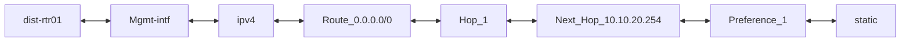
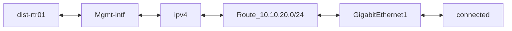
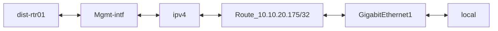
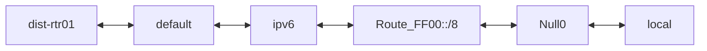

```mermaid
flowchart LR;
dist-rtr01 <--> Mgmt-intf <--> ipv4 <--> Route_0.0.0.0/0 <--> Hop_1 <--> Next_Hop_10.10.20.254 <--> Preference_1 <--> static
```

```mermaid
flowchart LR;
dist-rtr01 <--> Mgmt-intf <--> ipv4 <--> Route_10.10.20.0/24 <--> GigabitEthernet1 <--> connected
```

```mermaid
flowchart LR;
dist-rtr01 <--> Mgmt-intf <--> ipv4 <--> Route_10.10.20.175/32 <--> GigabitEthernet1 <--> local
```

```mermaid
flowchart LR;
dist-rtr01 <--> default <--> ipv6 <--> Route_FF00::/8 <--> Null0 <--> local
```