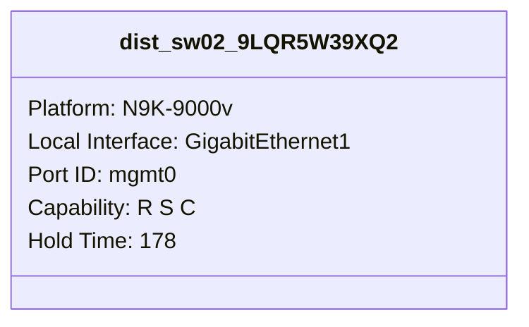
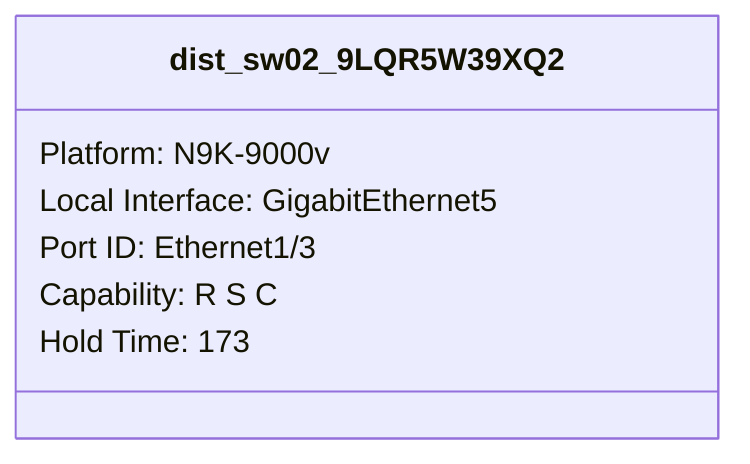
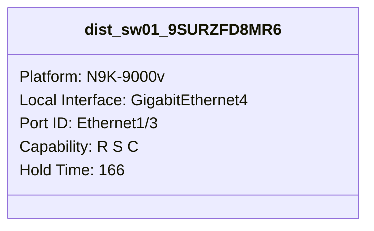
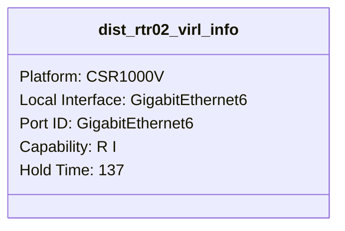
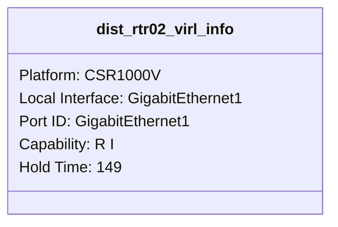

```mermaid
classDiagram
class dist_sw02_9LQR5W39XQ2{
Platform: N9K-9000v
Local Interface: GigabitEthernet1
Port ID: mgmt0
Capability: R S C
Hold Time: 178
}
```

```mermaid
classDiagram
class dist_sw02_9LQR5W39XQ2{
Platform: N9K-9000v
Local Interface: GigabitEthernet5
Port ID: Ethernet1/3
Capability: R S C
Hold Time: 173
}
```

```mermaid
classDiagram
class dist_sw01_9SURZFD8MR6{
Platform: N9K-9000v
Local Interface: GigabitEthernet1
Port ID: mgmt0
Capability: R S C
Hold Time: 171
}
```

```mermaid
classDiagram
class dist_sw01_9SURZFD8MR6{
Platform: N9K-9000v
Local Interface: GigabitEthernet4
Port ID: Ethernet1/3
Capability: R S C
Hold Time: 166
}
```

```mermaid
classDiagram
class dist_rtr02_virl_info{
Platform: CSR1000V
Local Interface: GigabitEthernet6
Port ID: GigabitEthernet6
Capability: R I
Hold Time: 137
}
```

```mermaid
classDiagram
class dist_rtr02_virl_info{
Platform: CSR1000V
Local Interface: GigabitEthernet1
Port ID: GigabitEthernet1
Capability: R I
Hold Time: 149
}
```