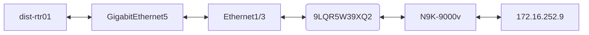
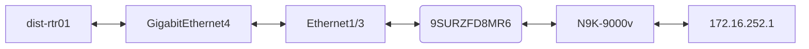
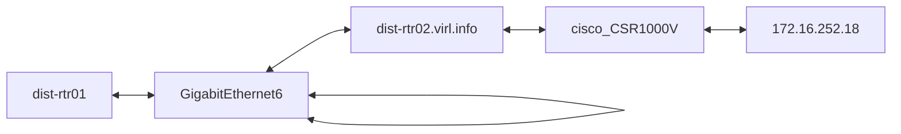
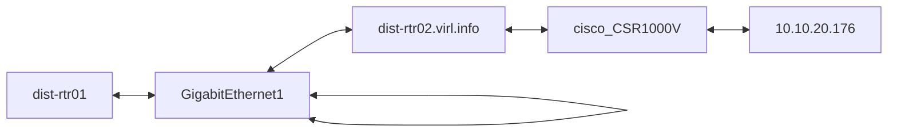

```mermaid
flowchart LR;
dist-rtr01 <--> GigabitEthernet1 <--> mgmt0 <--> dist-sw02(9LQR5W39XQ2) <--> N9K-9000v <--> 10.10.20.178
```

```mermaid
flowchart LR;
dist-rtr01 <--> GigabitEthernet5 <--> Ethernet1/3 <--> dist-sw02(9LQR5W39XQ2) <--> N9K-9000v <--> 172.16.252.9
```

```mermaid
flowchart LR;
dist-rtr01 <--> GigabitEthernet1 <--> mgmt0 <--> dist-sw01(9SURZFD8MR6) <--> N9K-9000v <--> 10.10.20.177
```

```mermaid
flowchart LR;
dist-rtr01 <--> GigabitEthernet4 <--> Ethernet1/3 <--> dist-sw01(9SURZFD8MR6) <--> N9K-9000v <--> 172.16.252.1
```

```mermaid
flowchart LR;
dist-rtr01 <--> GigabitEthernet6 <--> GigabitEthernet6 <--> dist-rtr02.virl.info <--> cisco_CSR1000V <--> 172.16.252.18
```

```mermaid
flowchart LR;
dist-rtr01 <--> GigabitEthernet1 <--> GigabitEthernet1 <--> dist-rtr02.virl.info <--> cisco_CSR1000V <--> 10.10.20.176
```