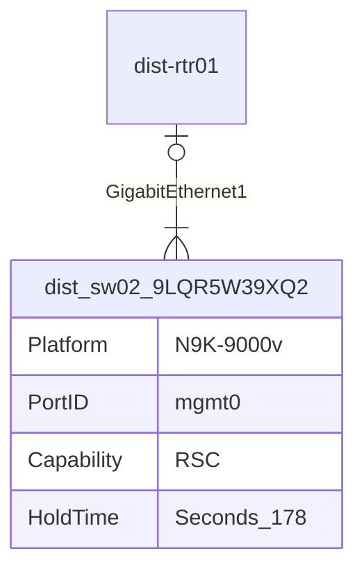
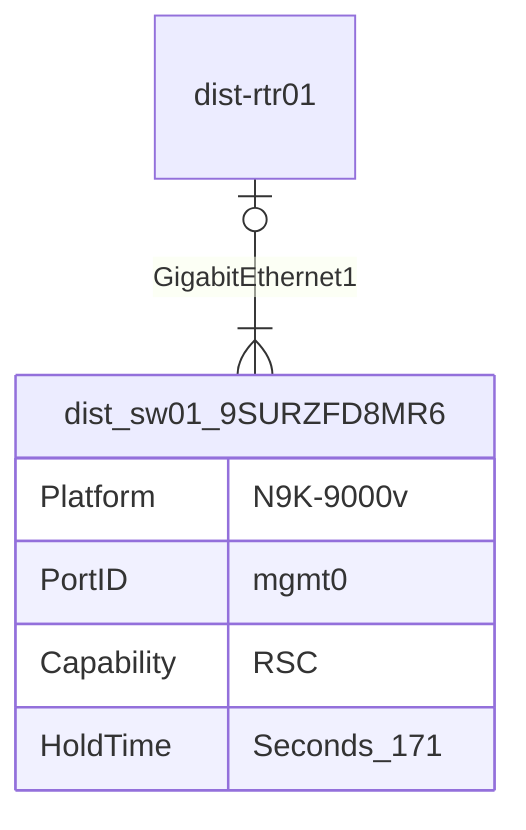
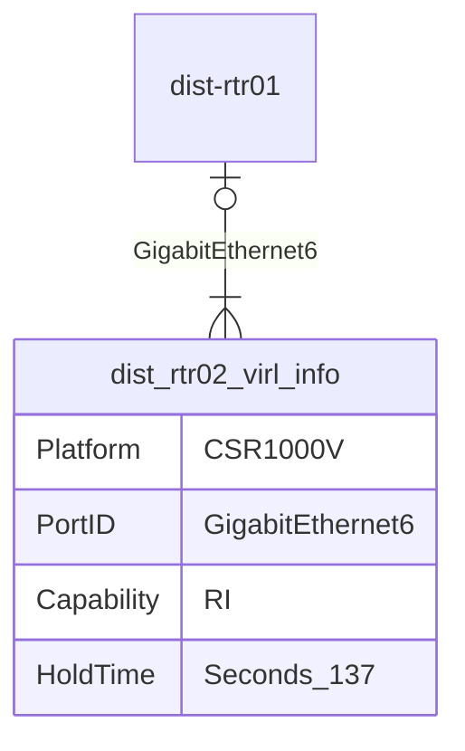
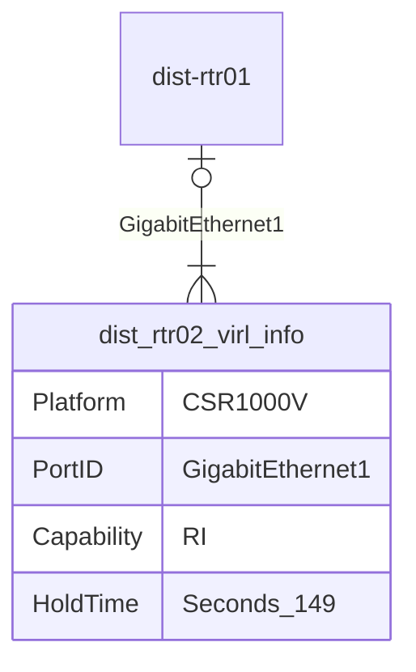

```mermaid
erDiagram
    dist-rtr01 |o--|{ dist_sw02_9LQR5W39XQ2 : GigabitEthernet5
    dist_sw02_9LQR5W39XQ2 {
        Platform N9K-9000v
        PortID Ethernet1/3
        Capability RSC
        HoldTime Seconds_173
    }
```



```mermaid
erDiagram
    dist-rtr01 |o--|{ dist_sw01_9SURZFD8MR6 : GigabitEthernet4
    dist_sw01_9SURZFD8MR6 {
        Platform N9K-9000v
        PortID Ethernet1/3
        Capability RSC
        HoldTime Seconds_166
    }
```




