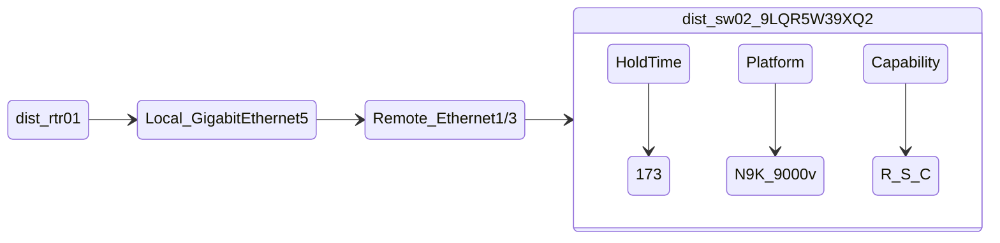
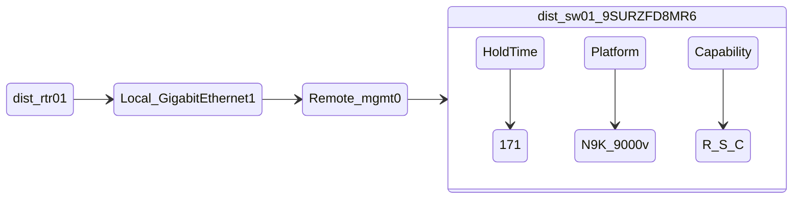
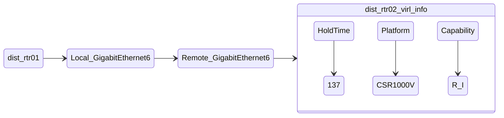

```mermaid
stateDiagram
    direction LR
dist_rtr01 --> Local_GigabitEthernet1
Local_GigabitEthernet1 --> Remote_mgmt0
Remote_mgmt0 --> dist_sw02_9LQR5W39XQ2
    state dist_sw02_9LQR5W39XQ2{
        Platform --> N9K_9000v
        Capability --> R_S_C
        HoldTime --> 178
}
```

```mermaid
stateDiagram
    direction LR
dist_rtr01 --> Local_GigabitEthernet5
Local_GigabitEthernet5 --> Remote_Ethernet1/3
Remote_Ethernet1/3 --> dist_sw02_9LQR5W39XQ2
    state dist_sw02_9LQR5W39XQ2{
        Platform --> N9K_9000v
        Capability --> R_S_C
        HoldTime --> 173
}
```

```mermaid
stateDiagram
    direction LR
dist_rtr01 --> Local_GigabitEthernet1
Local_GigabitEthernet1 --> Remote_mgmt0
Remote_mgmt0 --> dist_sw01_9SURZFD8MR6
    state dist_sw01_9SURZFD8MR6{
        Platform --> N9K_9000v
        Capability --> R_S_C
        HoldTime --> 171
}
```

```mermaid
stateDiagram
    direction LR
dist_rtr01 --> Local_GigabitEthernet4
Local_GigabitEthernet4 --> Remote_Ethernet1/3
Remote_Ethernet1/3 --> dist_sw01_9SURZFD8MR6
    state dist_sw01_9SURZFD8MR6{
        Platform --> N9K_9000v
        Capability --> R_S_C
        HoldTime --> 166
}
```

```mermaid
stateDiagram
    direction LR
dist_rtr01 --> Local_GigabitEthernet6
Local_GigabitEthernet6 --> Remote_GigabitEthernet6
Remote_GigabitEthernet6 --> dist_rtr02_virl_info
    state dist_rtr02_virl_info{
        Platform --> CSR1000V
        Capability --> R_I
        HoldTime --> 137
}
```

```mermaid
stateDiagram
    direction LR
dist_rtr01 --> Local_GigabitEthernet1
Local_GigabitEthernet1 --> Remote_GigabitEthernet1
Remote_GigabitEthernet1 --> dist_rtr02_virl_info
    state dist_rtr02_virl_info{
        Platform --> CSR1000V
        Capability --> R_I
        HoldTime --> 149
}
```