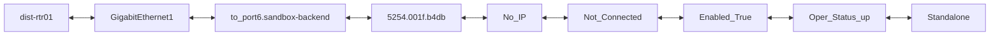
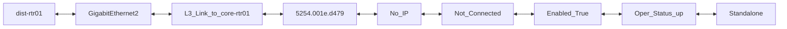
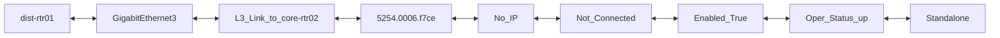
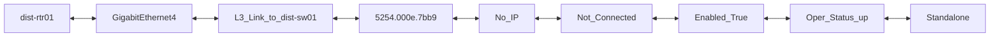
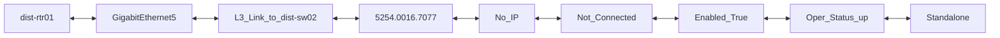
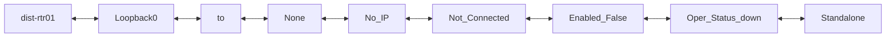

```mermaid
flowchart LR;
dist-rtr01 <--> GigabitEthernet1 <--> to_port6.sandbox-backend <--> 5254.001f.b4db <--> No_IP <--> Not_Connected <--> Enabled_True <--> Oper_Status_up <--> Standalone
```

```mermaid
flowchart LR;
dist-rtr01 <--> GigabitEthernet2 <--> L3_Link_to_core-rtr01 <--> 5254.001e.d479 <--> No_IP <--> Not_Connected <--> Enabled_True <--> Oper_Status_up <--> Standalone
```

```mermaid
flowchart LR;
dist-rtr01 <--> GigabitEthernet3 <--> L3_Link_to_core-rtr02 <--> 5254.0006.f7ce <--> No_IP <--> Not_Connected <--> Enabled_True <--> Oper_Status_up <--> Standalone
```

```mermaid
flowchart LR;
dist-rtr01 <--> GigabitEthernet4 <--> L3_Link_to_dist-sw01 <--> 5254.000e.7bb9 <--> No_IP <--> Not_Connected <--> Enabled_True <--> Oper_Status_up <--> Standalone
```

```mermaid
flowchart LR;
dist-rtr01 <--> GigabitEthernet5 <--> L3_Link_to_dist-sw02 <--> 5254.0016.7077 <--> No_IP <--> Not_Connected <--> Enabled_True <--> Oper_Status_up <--> Standalone
```

```mermaid
flowchart LR;
dist-rtr01 <--> GigabitEthernet6 <--> L3_Link_to_dist-rtr02 <--> 5254.0015.ac8a <--> No_IP <--> Not_Connected <--> Enabled_True <--> Oper_Status_up <--> Standalone
```

```mermaid
flowchart LR;
dist-rtr01 <--> Loopback0 <--> to <--> None <--> No_IP <--> Not_Connected <--> Enabled_False <--> Oper_Status_down <--> Standalone
```