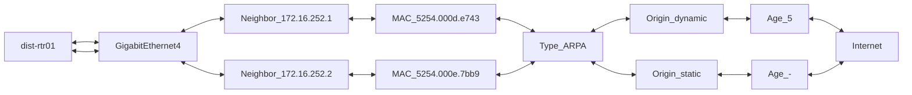
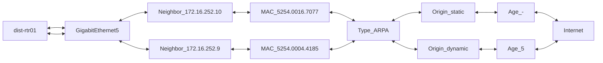
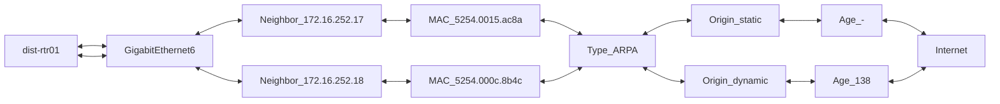

```mermaid
flowchart LR;
dist-rtr01 <--> GigabitEthernet2 <--> Neighbor_172.16.252.21 <--> MAC_5254.001e.d479 <--> Type_ARPA <--> Origin_static <--> Age_- <--> Internet
```

```mermaid
flowchart LR;
dist-rtr01 <--> GigabitEthernet3 <--> Neighbor_172.16.252.25 <--> MAC_5254.0006.f7ce <--> Type_ARPA <--> Origin_static <--> Age_- <--> Internet
```

```mermaid
flowchart LR;
dist-rtr01 <--> GigabitEthernet4 <--> Neighbor_172.16.252.1 <--> MAC_5254.000d.e743 <--> Type_ARPA <--> Origin_dynamic <--> Age_5 <--> Internet
dist-rtr01 <--> GigabitEthernet4 <--> Neighbor_172.16.252.2 <--> MAC_5254.000e.7bb9 <--> Type_ARPA <--> Origin_static <--> Age_- <--> Internet
```

```mermaid
flowchart LR;
dist-rtr01 <--> GigabitEthernet5 <--> Neighbor_172.16.252.10 <--> MAC_5254.0016.7077 <--> Type_ARPA <--> Origin_static <--> Age_- <--> Internet
dist-rtr01 <--> GigabitEthernet5 <--> Neighbor_172.16.252.9 <--> MAC_5254.0004.4185 <--> Type_ARPA <--> Origin_dynamic <--> Age_5 <--> Internet
```

```mermaid
flowchart LR;
dist-rtr01 <--> GigabitEthernet6 <--> Neighbor_172.16.252.17 <--> MAC_5254.0015.ac8a <--> Type_ARPA <--> Origin_static <--> Age_- <--> Internet
dist-rtr01 <--> GigabitEthernet6 <--> Neighbor_172.16.252.18 <--> MAC_5254.000c.8b4c <--> Type_ARPA <--> Origin_dynamic <--> Age_138 <--> Internet
```