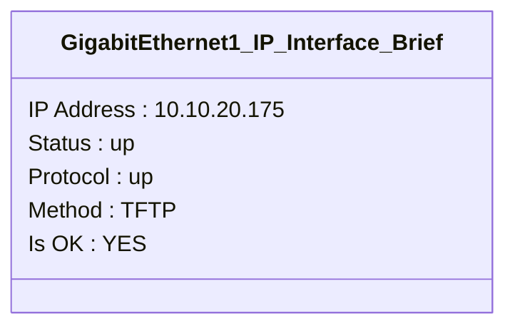
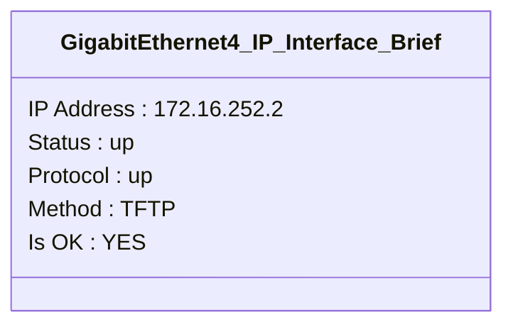
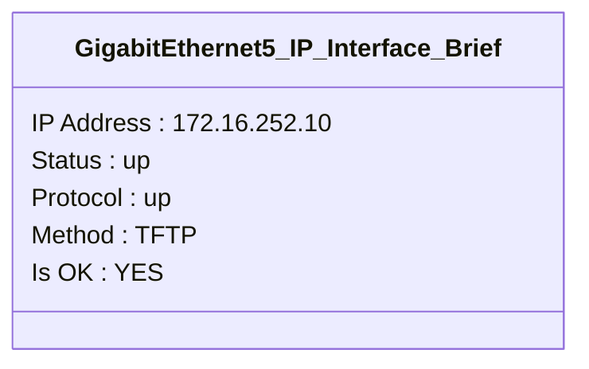
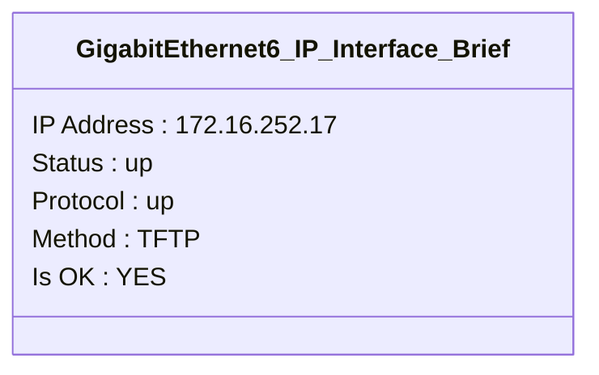
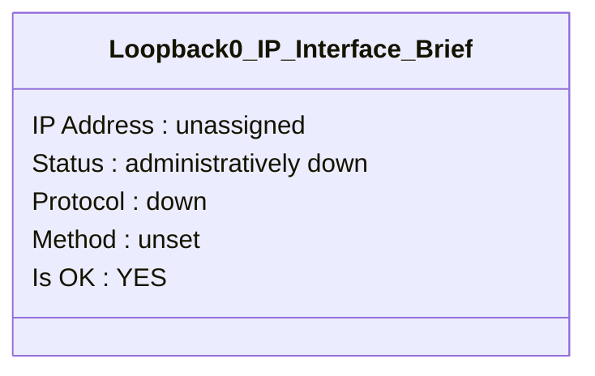

  

```mermaid
classDiagram
class GigabitEthernet1_IP_Interface_Brief {
IP Address : 10.10.20.175
Status : up
Protocol : up
Method : TFTP
Is OK : YES
}
```  

```mermaid
classDiagram
class GigabitEthernet2_IP_Interface_Brief {
IP Address : 172.16.252.21
Status : up
Protocol : up
Method : TFTP
Is OK : YES
}
```  

```mermaid
classDiagram
class GigabitEthernet3_IP_Interface_Brief {
IP Address : 172.16.252.25
Status : up
Protocol : up
Method : TFTP
Is OK : YES
}
```  

```mermaid
classDiagram
class GigabitEthernet4_IP_Interface_Brief {
IP Address : 172.16.252.2
Status : up
Protocol : up
Method : TFTP
Is OK : YES
}
```  

```mermaid
classDiagram
class GigabitEthernet5_IP_Interface_Brief {
IP Address : 172.16.252.10
Status : up
Protocol : up
Method : TFTP
Is OK : YES
}
```  

```mermaid
classDiagram
class GigabitEthernet6_IP_Interface_Brief {
IP Address : 172.16.252.17
Status : up
Protocol : up
Method : TFTP
Is OK : YES
}
```  

```mermaid
classDiagram
class Loopback0_IP_Interface_Brief {
IP Address : unassigned
Status : administratively down
Protocol : down
Method : unset
Is OK : YES
}
```