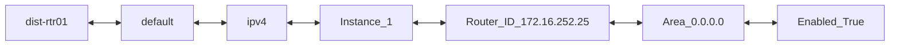

```mermaid
flowchart LR;
dist-rtr01 <--> default <--> ipv4 <--> Instance_1 <--> Router_ID_172.16.252.25 <--> Area_0.0.0.0 <--> Enabled_True
```

```mermaid
flowchart LR;
dist-rtr01 <--> default <--> ipv4 <--> Instance_1 <--> Router_ID_172.16.252.25 <--> Area_0.0.0.0 <--> Enabled_True
```