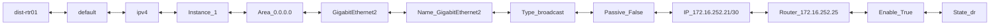
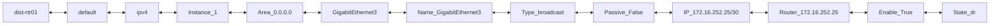
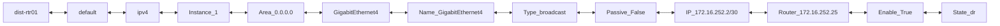
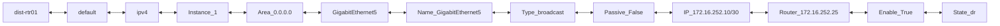
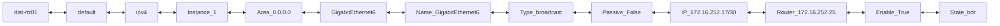

```mermaid
flowchart LR;
dist-rtr01 <--> default <--> ipv4 <--> Instance_1 <--> Area_0.0.0.0 <--> GigabitEthernet2 <--> Name_GigabitEthernet2 <--> Type_broadcast <--> Passive_False <--> IP_172.16.252.21/30 <--> Router_172.16.252.25 <--> Enable_True <--> State_dr
```

```mermaid
flowchart LR;
dist-rtr01 <--> default <--> ipv4 <--> Instance_1 <--> Area_0.0.0.0 <--> GigabitEthernet2 <--> Name_GigabitEthernet2 <--> Type_broadcast <--> Passive_False <--> IP_172.16.252.21/30 <--> Router_172.16.252.25 <--> Enable_True <--> State_dr
```

```mermaid
flowchart LR;
dist-rtr01 <--> default <--> ipv4 <--> Instance_1 <--> Area_0.0.0.0 <--> GigabitEthernet3 <--> Name_GigabitEthernet3 <--> Type_broadcast <--> Passive_False <--> IP_172.16.252.25/30 <--> Router_172.16.252.25 <--> Enable_True <--> State_dr
```

```mermaid
flowchart LR;
dist-rtr01 <--> default <--> ipv4 <--> Instance_1 <--> Area_0.0.0.0 <--> GigabitEthernet3 <--> Name_GigabitEthernet3 <--> Type_broadcast <--> Passive_False <--> IP_172.16.252.25/30 <--> Router_172.16.252.25 <--> Enable_True <--> State_dr
```

```mermaid
flowchart LR;
dist-rtr01 <--> default <--> ipv4 <--> Instance_1 <--> Area_0.0.0.0 <--> GigabitEthernet4 <--> Name_GigabitEthernet4 <--> Type_broadcast <--> Passive_False <--> IP_172.16.252.2/30 <--> Router_172.16.252.25 <--> Enable_True <--> State_dr
```

```mermaid
flowchart LR;
dist-rtr01 <--> default <--> ipv4 <--> Instance_1 <--> Area_0.0.0.0 <--> GigabitEthernet4 <--> Name_GigabitEthernet4 <--> Type_broadcast <--> Passive_False <--> IP_172.16.252.2/30 <--> Router_172.16.252.25 <--> Enable_True <--> State_dr
```

```mermaid
flowchart LR;
dist-rtr01 <--> default <--> ipv4 <--> Instance_1 <--> Area_0.0.0.0 <--> GigabitEthernet5 <--> Name_GigabitEthernet5 <--> Type_broadcast <--> Passive_False <--> IP_172.16.252.10/30 <--> Router_172.16.252.25 <--> Enable_True <--> State_dr
```

```mermaid
flowchart LR;
dist-rtr01 <--> default <--> ipv4 <--> Instance_1 <--> Area_0.0.0.0 <--> GigabitEthernet5 <--> Name_GigabitEthernet5 <--> Type_broadcast <--> Passive_False <--> IP_172.16.252.10/30 <--> Router_172.16.252.25 <--> Enable_True <--> State_dr
```

```mermaid
flowchart LR;
dist-rtr01 <--> default <--> ipv4 <--> Instance_1 <--> Area_0.0.0.0 <--> GigabitEthernet6 <--> Name_GigabitEthernet6 <--> Type_broadcast <--> Passive_False <--> IP_172.16.252.17/30 <--> Router_172.16.252.25 <--> Enable_True <--> State_bdr
```

```mermaid
flowchart LR;
dist-rtr01 <--> default <--> ipv4 <--> Instance_1 <--> Area_0.0.0.0 <--> GigabitEthernet6 <--> Name_GigabitEthernet6 <--> Type_broadcast <--> Passive_False <--> IP_172.16.252.17/30 <--> Router_172.16.252.25 <--> Enable_True <--> State_bdr
```