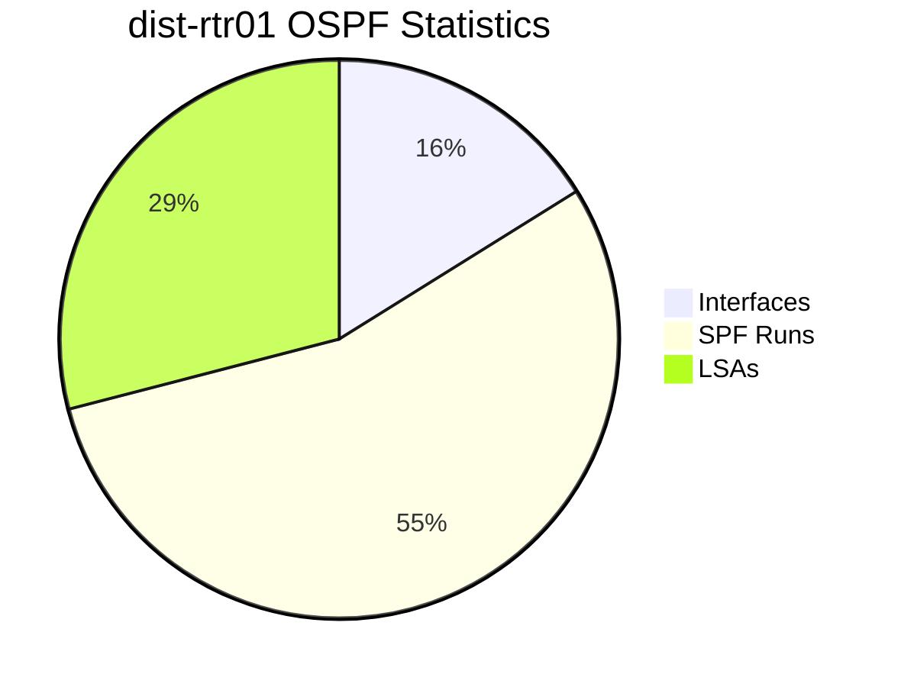

```mermaid
pie
title dist-rtr01 OSPF Statistics
"Interfaces" : 5
"SPF Runs" : 17
"LSAs" : 9
```

```mermaid
pie
title dist-rtr01 OSPF Totals
"Total Areas" : 1
"Normal Areas" : 1
"NSSA Areas" : 0
"Stub Areas" :0
```mermaid
pie
title dist-rtr01 OSPF Statistics
"Interfaces" : 5
"SPF Runs" : 17
"LSAs" : 9
```
```mermaid
pie
title dist-rtr01 OSPF Totals
"Total Areas" : 1
"Normal Areas" : 1
"NSSA Areas" : 0
"Stub Areas" :0