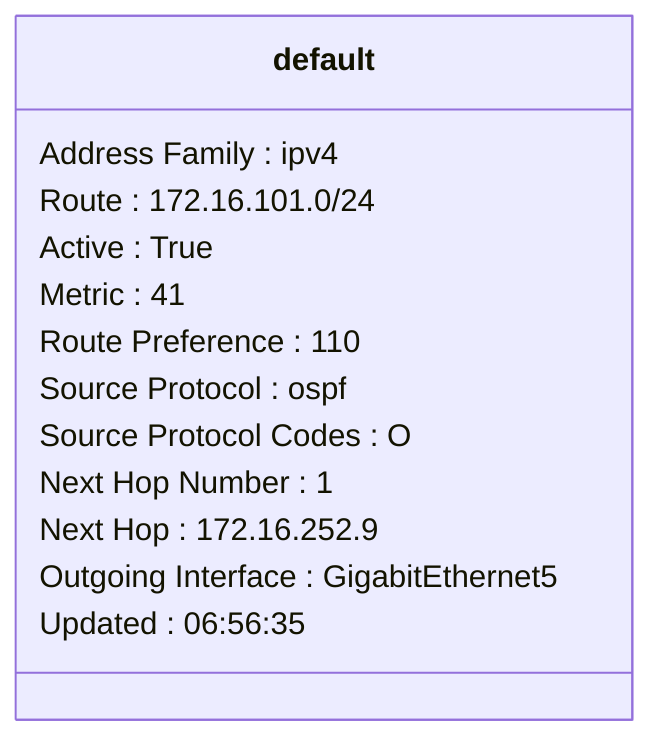
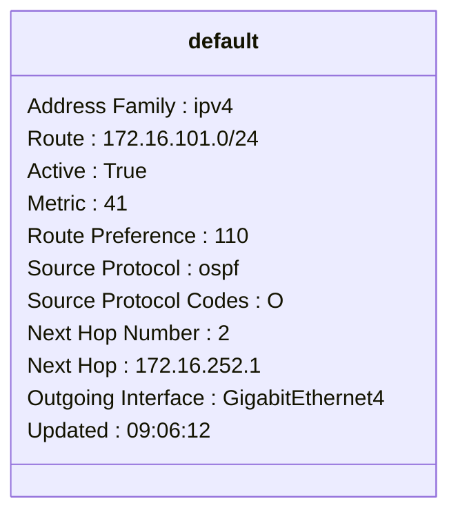
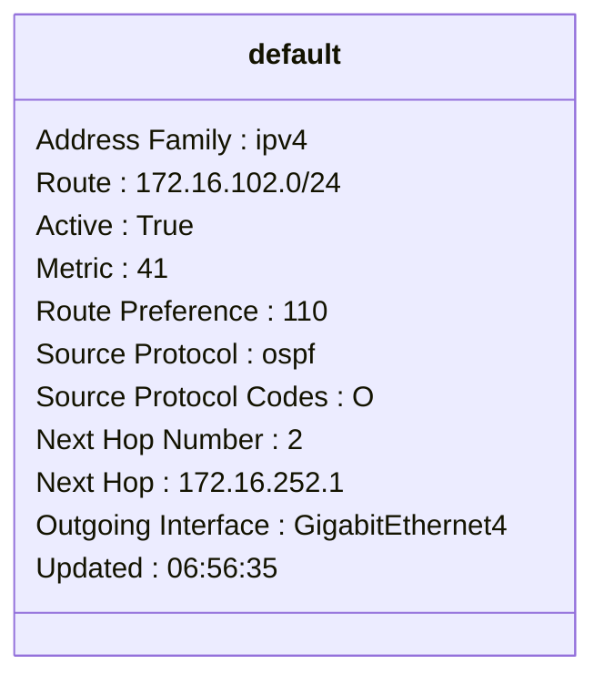
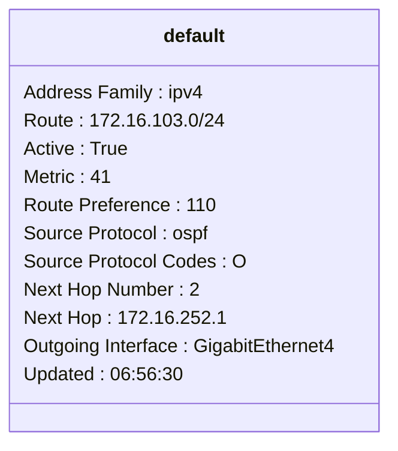
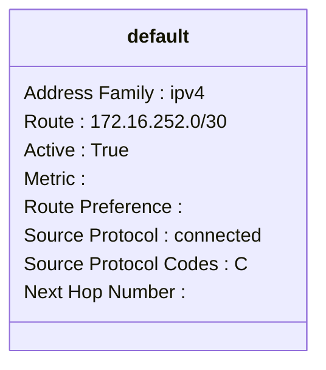
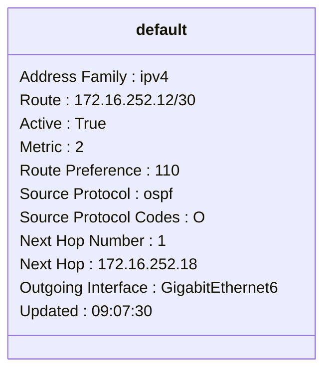
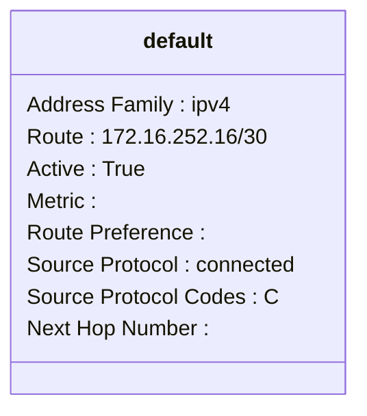
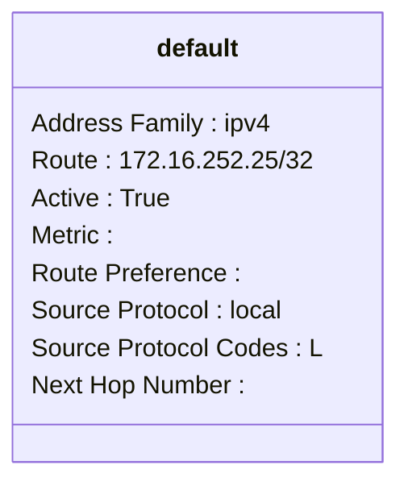

```mermaid
classDiagram
class default {
Address Family : ipv4
Route : 172.16.252.28/30
Active : True
Metric : 2
Route Preference : 110
Source Protocol : ospf
Source Protocol Codes : O
Next Hop Number : 1
Next Hop : 172.16.252.18
Outgoing Interface : GigabitEthernet6
Updated : 09:07:30
}
```
```mermaid
classDiagram
class default {
Address Family : ipv4
Route : 172.16.252.32/30
Active : True
Metric : 2
Route Preference : 110
Source Protocol : ospf
Source Protocol Codes : O
Next Hop Number : 1
Next Hop : 172.16.252.18
Outgoing Interface : GigabitEthernet6
Updated : 09:07:30
}
```
```mermaid
classDiagram
class default {
Address Family : ipv4
Route : 172.16.252.4/30
Active : True
Metric : 2
Route Preference : 110
Source Protocol : ospf
Source Protocol Codes : O
Next Hop Number : 1
Next Hop : 172.16.252.18
Outgoing Interface : GigabitEthernet6
Updated : 09:07:30
}
```  
```mermaid
classDiagram
class default {
Address Family : ipv4
Route : 172.16.252.8/30
Active : True
Metric : 
Route Preference : 
Source Protocol : connected
Source Protocol Codes : C
Next Hop Number : 
}
```