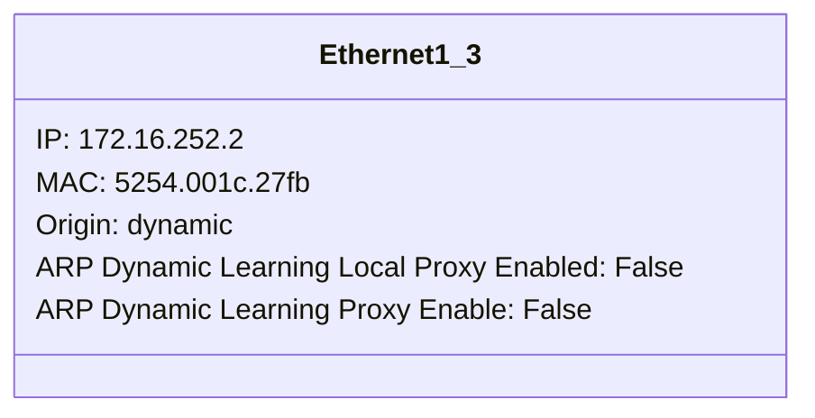
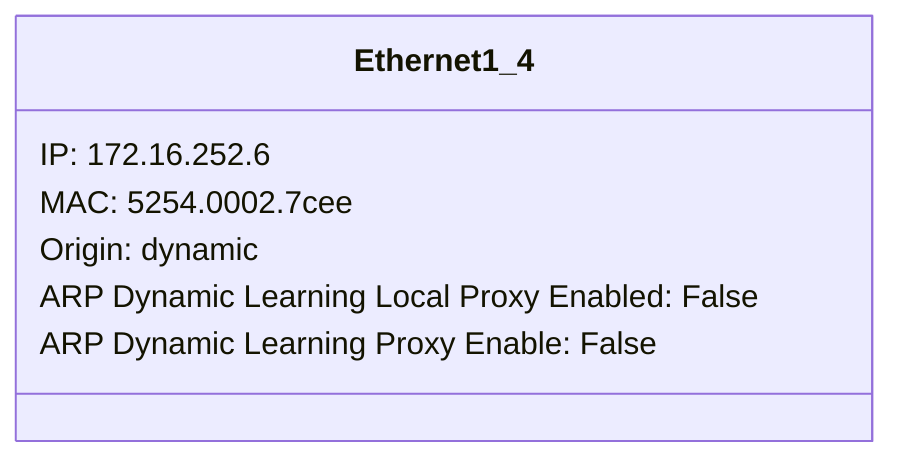
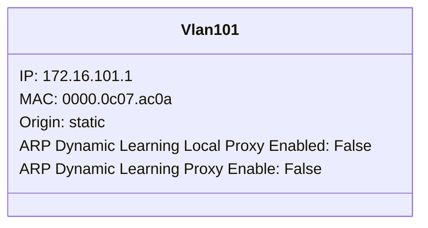
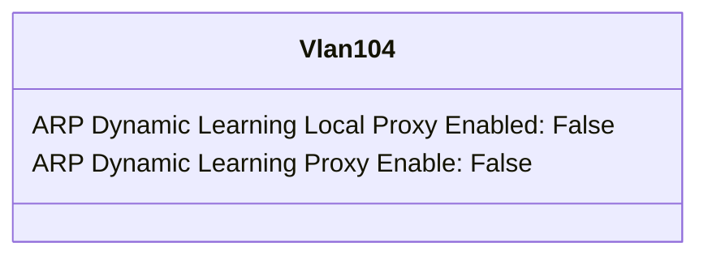
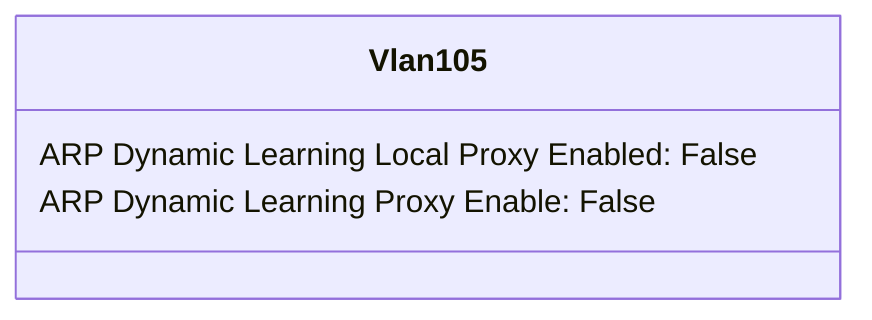
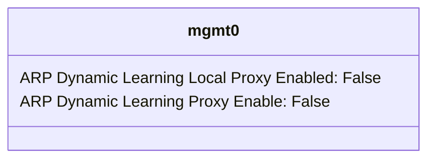
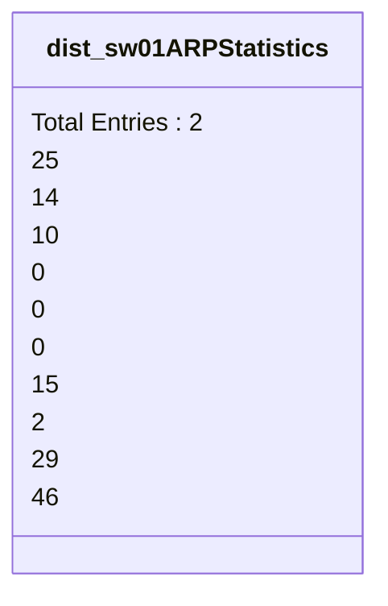

```mermaid
classDiagram
class Ethernet1_3{
IP: 172.16.252.2
MAC: 5254.001c.27fb
Origin: dynamic
ARP Dynamic Learning Local Proxy Enabled: False
ARP Dynamic Learning Proxy Enable: False
}
```

```mermaid
classDiagram
class Ethernet1_4{
IP: 172.16.252.6
MAC: 5254.0002.7cee
Origin: dynamic
ARP Dynamic Learning Local Proxy Enabled: False
ARP Dynamic Learning Proxy Enable: False
}
```

```mermaid
classDiagram
class Vlan101{
IP: 172.16.101.1
MAC: 0000.0c07.ac0a
Origin: static
ARP Dynamic Learning Local Proxy Enabled: False
ARP Dynamic Learning Proxy Enable: False
}
```

```mermaid
classDiagram
class Vlan102{
ARP Dynamic Learning Local Proxy Enabled: False
ARP Dynamic Learning Proxy Enable: False
}
```

```mermaid
classDiagram
class Vlan103{
ARP Dynamic Learning Local Proxy Enabled: False
ARP Dynamic Learning Proxy Enable: False
}
```

```mermaid
classDiagram
class Vlan104{
ARP Dynamic Learning Local Proxy Enabled: False
ARP Dynamic Learning Proxy Enable: False
}
```

```mermaid
classDiagram
class Vlan105{
ARP Dynamic Learning Local Proxy Enabled: False
ARP Dynamic Learning Proxy Enable: False
}
```

```mermaid
classDiagram
class mgmt0{
ARP Dynamic Learning Local Proxy Enabled: False
ARP Dynamic Learning Proxy Enable: False
}
```

```mermaid
classDiagram
class dist_sw01 ARP Statistics{
Total Entries : 2
25
14
10
0
0
0
15
2
29
46
}
```