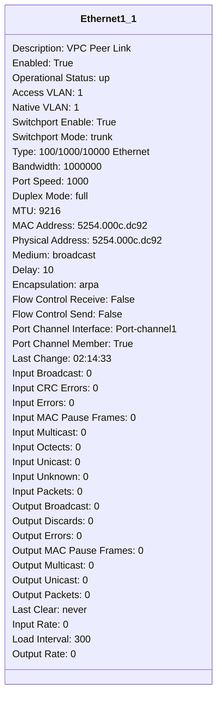
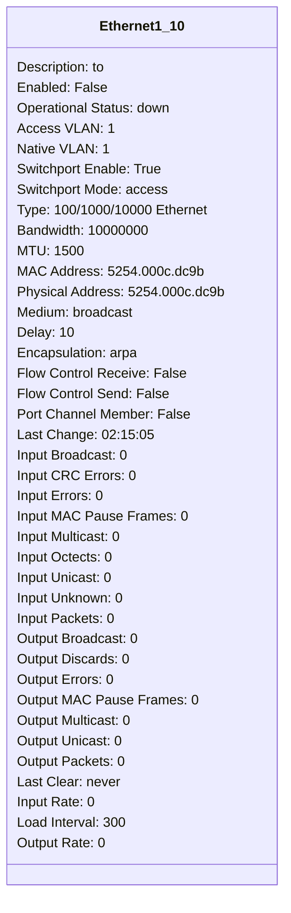
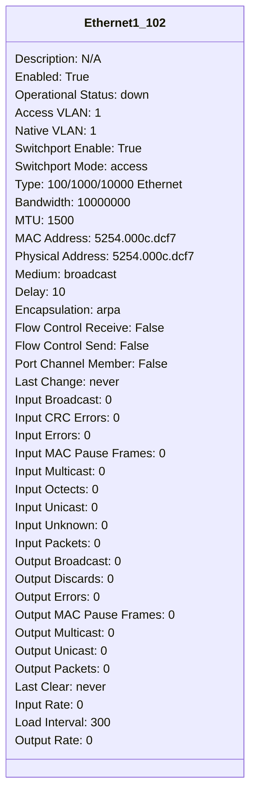
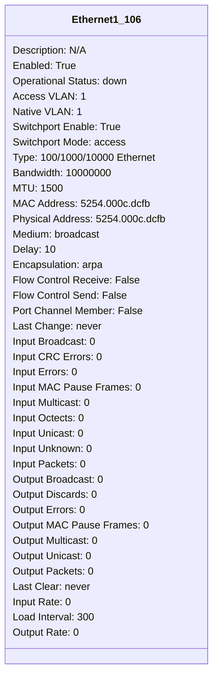
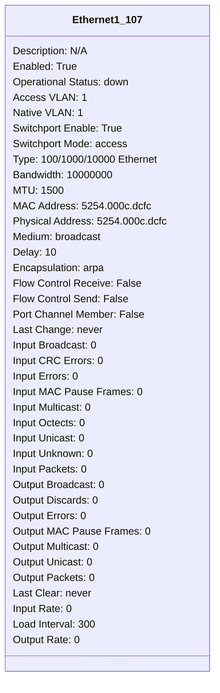
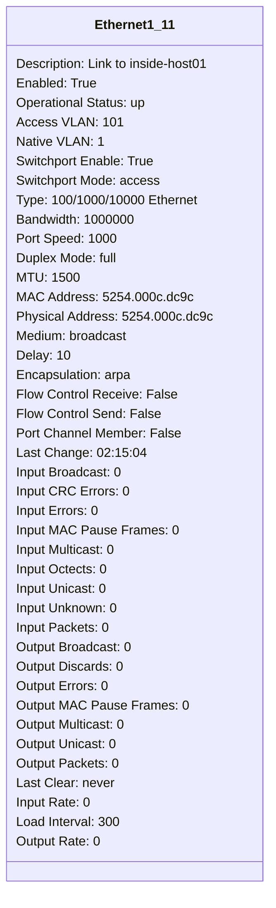
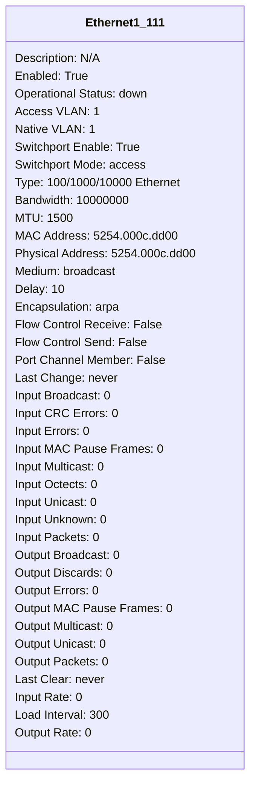
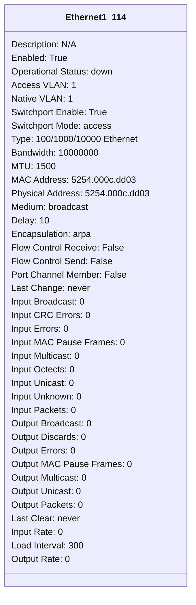

```mermaid
classDiagram
class Ethernet1_117{
Description: N/A
Enabled: True
Operational Status: down
Access VLAN: 1
Native VLAN: 1
Switchport Enable: True
Switchport Mode: access
Type: 100/1000/10000 Ethernet
Bandwidth: 10000000
MTU: 1500
MAC Address: 5254.000c.dd06
Physical Address: 5254.000c.dd06
Medium: broadcast
Delay: 10
Encapsulation: arpa
Flow Control Receive: False
Flow Control Send: False


Port Channel Member: False
Last Change: never
Input Broadcast: 0
Input CRC Errors: 0
Input Errors: 0
Input MAC Pause Frames: 0
Input Multicast: 0
Input Octects: 0
Input Unicast: 0
Input Unknown: 0
Input Packets: 0
Output Broadcast: 0
Output Discards: 0
Output Errors: 0
Output MAC Pause Frames: 0
Output Multicast: 0
Output Unicast: 0
Output Packets: 0
Last Clear: never
Input Rate: 0
Load Interval: 300
Output Rate: 0
}
```
```mermaid
classDiagram
class Ethernet1_118{
Description: N/A
Enabled: True
Operational Status: down
Access VLAN: 1
Native VLAN: 1
Switchport Enable: True
Switchport Mode: access
Type: 100/1000/10000 Ethernet
Bandwidth: 10000000
MTU: 1500
MAC Address: 5254.000c.dd07
Physical Address: 5254.000c.dd07
Medium: broadcast
Delay: 10
Encapsulation: arpa
Flow Control Receive: False
Flow Control Send: False


Port Channel Member: False
Last Change: never
Input Broadcast: 0
Input CRC Errors: 0
Input Errors: 0
Input MAC Pause Frames: 0
Input Multicast: 0
Input Octects: 0
Input Unicast: 0
Input Unknown: 0
Input Packets: 0
Output Broadcast: 0
Output Discards: 0
Output Errors: 0
Output MAC Pause Frames: 0
Output Multicast: 0
Output Unicast: 0
Output Packets: 0
Last Clear: never
Input Rate: 0
Load Interval: 300
Output Rate: 0
}
```
```mermaid
classDiagram
class Ethernet1_119{
Description: N/A
Enabled: True
Operational Status: down
Access VLAN: 1
Native VLAN: 1
Switchport Enable: True
Switchport Mode: access
Type: 100/1000/10000 Ethernet
Bandwidth: 10000000
MTU: 1500
MAC Address: 5254.000c.dd08
Physical Address: 5254.000c.dd08
Medium: broadcast
Delay: 10
Encapsulation: arpa
Flow Control Receive: False
Flow Control Send: False


Port Channel Member: False
Last Change: never
Input Broadcast: 0
Input CRC Errors: 0
Input Errors: 0
Input MAC Pause Frames: 0
Input Multicast: 0
Input Octects: 0
Input Unicast: 0
Input Unknown: 0
Input Packets: 0
Output Broadcast: 0
Output Discards: 0
Output Errors: 0
Output MAC Pause Frames: 0
Output Multicast: 0
Output Unicast: 0
Output Packets: 0
Last Clear: never
Input Rate: 0
Load Interval: 300
Output Rate: 0
}
```
```mermaid
classDiagram
class Ethernet1_12{
Description: N/A
Enabled: True
Operational Status: down
Access VLAN: 1
Native VLAN: 1
Switchport Enable: True
Switchport Mode: access
Type: 100/1000/10000 Ethernet
Bandwidth: 10000000
MTU: 1500
MAC Address: 5254.000c.dc9d
Physical Address: 5254.000c.dc9d
Medium: broadcast
Delay: 10
Encapsulation: arpa
Flow Control Receive: False
Flow Control Send: False


Port Channel Member: False
Last Change: never
Input Broadcast: 0
Input CRC Errors: 0
Input Errors: 0
Input MAC Pause Frames: 0
Input Multicast: 0
Input Octects: 0
Input Unicast: 0
Input Unknown: 0
Input Packets: 0
Output Broadcast: 0
Output Discards: 0
Output Errors: 0
Output MAC Pause Frames: 0
Output Multicast: 0
Output Unicast: 0
Output Packets: 0
Last Clear: never
Input Rate: 0
Load Interval: 300
Output Rate: 0
}
```
```mermaid
classDiagram
class Ethernet1_120{
Description: N/A
Enabled: True
Operational Status: down
Access VLAN: 1
Native VLAN: 1
Switchport Enable: True
Switchport Mode: access
Type: 100/1000/10000 Ethernet
Bandwidth: 10000000
MTU: 1500
MAC Address: 5254.000c.dd09
Physical Address: 5254.000c.dd09
Medium: broadcast
Delay: 10
Encapsulation: arpa
Flow Control Receive: False
Flow Control Send: False


Port Channel Member: False
Last Change: never
Input Broadcast: 0
Input CRC Errors: 0
Input Errors: 0
Input MAC Pause Frames: 0
Input Multicast: 0
Input Octects: 0
Input Unicast: 0
Input Unknown: 0
Input Packets: 0
Output Broadcast: 0
Output Discards: 0
Output Errors: 0
Output MAC Pause Frames: 0
Output Multicast: 0
Output Unicast: 0
Output Packets: 0
Last Clear: never
Input Rate: 0
Load Interval: 300
Output Rate: 0
}
```
```mermaid
classDiagram
class Ethernet1_121{
Description: N/A
Enabled: True
Operational Status: down
Access VLAN: 1
Native VLAN: 1
Switchport Enable: True
Switchport Mode: access
Type: 100/1000/10000 Ethernet
Bandwidth: 10000000
MTU: 1500
MAC Address: 5254.000c.dd0a
Physical Address: 5254.000c.dd0a
Medium: broadcast
Delay: 10
Encapsulation: arpa
Flow Control Receive: False
Flow Control Send: False


Port Channel Member: False
Last Change: never
Input Broadcast: 0
Input CRC Errors: 0
Input Errors: 0
Input MAC Pause Frames: 0
Input Multicast: 0
Input Octects: 0
Input Unicast: 0
Input Unknown: 0
Input Packets: 0
Output Broadcast: 0
Output Discards: 0
Output Errors: 0
Output MAC Pause Frames: 0
Output Multicast: 0
Output Unicast: 0
Output Packets: 0
Last Clear: never
Input Rate: 0
Load Interval: 300
Output Rate: 0
}
```
```mermaid
classDiagram
class Ethernet1_122{
Description: N/A
Enabled: True
Operational Status: down
Access VLAN: 1
Native VLAN: 1
Switchport Enable: True
Switchport Mode: access
Type: 100/1000/10000 Ethernet
Bandwidth: 10000000
MTU: 1500
MAC Address: 5254.000c.dd0b
Physical Address: 5254.000c.dd0b
Medium: broadcast
Delay: 10
Encapsulation: arpa
Flow Control Receive: False
Flow Control Send: False


Port Channel Member: False
Last Change: never
Input Broadcast: 0
Input CRC Errors: 0
Input Errors: 0
Input MAC Pause Frames: 0
Input Multicast: 0
Input Octects: 0
Input Unicast: 0
Input Unknown: 0
Input Packets: 0
Output Broadcast: 0
Output Discards: 0
Output Errors: 0
Output MAC Pause Frames: 0
Output Multicast: 0
Output Unicast: 0
Output Packets: 0
Last Clear: never
Input Rate: 0
Load Interval: 300
Output Rate: 0
}
```
```mermaid
classDiagram
class Ethernet1_123{
Description: N/A
Enabled: True
Operational Status: down
Access VLAN: 1
Native VLAN: 1
Switchport Enable: True
Switchport Mode: access
Type: 100/1000/10000 Ethernet
Bandwidth: 10000000
MTU: 1500
MAC Address: 5254.000c.dd0c
Physical Address: 5254.000c.dd0c
Medium: broadcast
Delay: 10
Encapsulation: arpa
Flow Control Receive: False
Flow Control Send: False


Port Channel Member: False
Last Change: never
Input Broadcast: 0
Input CRC Errors: 0
Input Errors: 0
Input MAC Pause Frames: 0
Input Multicast: 0
Input Octects: 0
Input Unicast: 0
Input Unknown: 0
Input Packets: 0
Output Broadcast: 0
Output Discards: 0
Output Errors: 0
Output MAC Pause Frames: 0
Output Multicast: 0
Output Unicast: 0
Output Packets: 0
Last Clear: never
Input Rate: 0
Load Interval: 300
Output Rate: 0
}
```
```mermaid
classDiagram
class Ethernet1_124{
Description: N/A
Enabled: True
Operational Status: down
Access VLAN: 1
Native VLAN: 1
Switchport Enable: True
Switchport Mode: access
Type: 100/1000/10000 Ethernet
Bandwidth: 10000000
MTU: 1500
MAC Address: 5254.000c.dd0d
Physical Address: 5254.000c.dd0d
Medium: broadcast
Delay: 10
Encapsulation: arpa
Flow Control Receive: False
Flow Control Send: False


Port Channel Member: False
Last Change: never
Input Broadcast: 0
Input CRC Errors: 0
Input Errors: 0
Input MAC Pause Frames: 0
Input Multicast: 0
Input Octects: 0
Input Unicast: 0
Input Unknown: 0
Input Packets: 0
Output Broadcast: 0
Output Discards: 0
Output Errors: 0
Output MAC Pause Frames: 0
Output Multicast: 0
Output Unicast: 0
Output Packets: 0
Last Clear: never
Input Rate: 0
Load Interval: 300
Output Rate: 0
}
```
```mermaid
classDiagram
class Ethernet1_125{
Description: N/A
Enabled: True
Operational Status: down
Access VLAN: 1
Native VLAN: 1
Switchport Enable: True
Switchport Mode: access
Type: 100/1000/10000 Ethernet
Bandwidth: 10000000
MTU: 1500
MAC Address: 5254.000c.dd0e
Physical Address: 5254.000c.dd0e
Medium: broadcast
Delay: 10
Encapsulation: arpa
Flow Control Receive: False
Flow Control Send: False


Port Channel Member: False
Last Change: never
Input Broadcast: 0
Input CRC Errors: 0
Input Errors: 0
Input MAC Pause Frames: 0
Input Multicast: 0
Input Octects: 0
Input Unicast: 0
Input Unknown: 0
Input Packets: 0
Output Broadcast: 0
Output Discards: 0
Output Errors: 0
Output MAC Pause Frames: 0
Output Multicast: 0
Output Unicast: 0
Output Packets: 0
Last Clear: never
Input Rate: 0
Load Interval: 300
Output Rate: 0
}
```
```mermaid
classDiagram
class Ethernet1_126{
Description: N/A
Enabled: True
Operational Status: down
Access VLAN: 1
Native VLAN: 1
Switchport Enable: True
Switchport Mode: access
Type: 100/1000/10000 Ethernet
Bandwidth: 10000000
MTU: 1500
MAC Address: 5254.000c.dd0f
Physical Address: 5254.000c.dd0f
Medium: broadcast
Delay: 10
Encapsulation: arpa
Flow Control Receive: False
Flow Control Send: False


Port Channel Member: False
Last Change: never
Input Broadcast: 0
Input CRC Errors: 0
Input Errors: 0
Input MAC Pause Frames: 0
Input Multicast: 0
Input Octects: 0
Input Unicast: 0
Input Unknown: 0
Input Packets: 0
Output Broadcast: 0
Output Discards: 0
Output Errors: 0
Output MAC Pause Frames: 0
Output Multicast: 0
Output Unicast: 0
Output Packets: 0
Last Clear: never
Input Rate: 0
Load Interval: 300
Output Rate: 0
}
```
```mermaid
classDiagram
class Ethernet1_127{
Description: N/A
Enabled: True
Operational Status: down
Access VLAN: 1
Native VLAN: 1
Switchport Enable: True
Switchport Mode: access
Type: 100/1000/10000 Ethernet
Bandwidth: 10000000
MTU: 1500
MAC Address: 5254.000c.dd10
Physical Address: 5254.000c.dd10
Medium: broadcast
Delay: 10
Encapsulation: arpa
Flow Control Receive: False
Flow Control Send: False


Port Channel Member: False
Last Change: never
Input Broadcast: 0
Input CRC Errors: 0
Input Errors: 0
Input MAC Pause Frames: 0
Input Multicast: 0
Input Octects: 0
Input Unicast: 0
Input Unknown: 0
Input Packets: 0
Output Broadcast: 0
Output Discards: 0
Output Errors: 0
Output MAC Pause Frames: 0
Output Multicast: 0
Output Unicast: 0
Output Packets: 0
Last Clear: never
Input Rate: 0
Load Interval: 300
Output Rate: 0
}
```
```mermaid
classDiagram
class Ethernet1_128{
Description: N/A
Enabled: True
Operational Status: down
Access VLAN: 1
Native VLAN: 1
Switchport Enable: True
Switchport Mode: access
Type: 100/1000/10000 Ethernet
Bandwidth: 10000000
MTU: 1500
MAC Address: 5254.000c.dd11
Physical Address: 5254.000c.dd11
Medium: broadcast
Delay: 10
Encapsulation: arpa
Flow Control Receive: False
Flow Control Send: False


Port Channel Member: False
Last Change: never
Input Broadcast: 0
Input CRC Errors: 0
Input Errors: 0
Input MAC Pause Frames: 0
Input Multicast: 0
Input Octects: 0
Input Unicast: 0
Input Unknown: 0
Input Packets: 0
Output Broadcast: 0
Output Discards: 0
Output Errors: 0
Output MAC Pause Frames: 0
Output Multicast: 0
Output Unicast: 0
Output Packets: 0
Last Clear: never
Input Rate: 0
Load Interval: 300
Output Rate: 0
}
```
```mermaid
classDiagram
class Ethernet1_13{
Description: N/A
Enabled: True
Operational Status: down
Access VLAN: 1
Native VLAN: 1
Switchport Enable: True
Switchport Mode: access
Type: 100/1000/10000 Ethernet
Bandwidth: 10000000
MTU: 1500
MAC Address: 5254.000c.dc9e
Physical Address: 5254.000c.dc9e
Medium: broadcast
Delay: 10
Encapsulation: arpa
Flow Control Receive: False
Flow Control Send: False


Port Channel Member: False
Last Change: never
Input Broadcast: 0
Input CRC Errors: 0
Input Errors: 0
Input MAC Pause Frames: 0
Input Multicast: 0
Input Octects: 0
Input Unicast: 0
Input Unknown: 0
Input Packets: 0
Output Broadcast: 0
Output Discards: 0
Output Errors: 0
Output MAC Pause Frames: 0
Output Multicast: 0
Output Unicast: 0
Output Packets: 0
Last Clear: never
Input Rate: 0
Load Interval: 300
Output Rate: 0
}
```
```mermaid
classDiagram
class Ethernet1_14{
Description: N/A
Enabled: True
Operational Status: down
Access VLAN: 1
Native VLAN: 1
Switchport Enable: True
Switchport Mode: access
Type: 100/1000/10000 Ethernet
Bandwidth: 10000000
MTU: 1500
MAC Address: 5254.000c.dc9f
Physical Address: 5254.000c.dc9f
Medium: broadcast
Delay: 10
Encapsulation: arpa
Flow Control Receive: False
Flow Control Send: False


Port Channel Member: False
Last Change: never
Input Broadcast: 0
Input CRC Errors: 0
Input Errors: 0
Input MAC Pause Frames: 0
Input Multicast: 0
Input Octects: 0
Input Unicast: 0
Input Unknown: 0
Input Packets: 0
Output Broadcast: 0
Output Discards: 0
Output Errors: 0
Output MAC Pause Frames: 0
Output Multicast: 0
Output Unicast: 0
Output Packets: 0
Last Clear: never
Input Rate: 0
Load Interval: 300
Output Rate: 0
}
```
```mermaid
classDiagram
class Ethernet1_15{
Description: N/A
Enabled: True
Operational Status: down
Access VLAN: 1
Native VLAN: 1
Switchport Enable: True
Switchport Mode: access
Type: 100/1000/10000 Ethernet
Bandwidth: 10000000
MTU: 1500
MAC Address: 5254.000c.dca0
Physical Address: 5254.000c.dca0
Medium: broadcast
Delay: 10
Encapsulation: arpa
Flow Control Receive: False
Flow Control Send: False


Port Channel Member: False
Last Change: never
Input Broadcast: 0
Input CRC Errors: 0
Input Errors: 0
Input MAC Pause Frames: 0
Input Multicast: 0
Input Octects: 0
Input Unicast: 0
Input Unknown: 0
Input Packets: 0
Output Broadcast: 0
Output Discards: 0
Output Errors: 0
Output MAC Pause Frames: 0
Output Multicast: 0
Output Unicast: 0
Output Packets: 0
Last Clear: never
Input Rate: 0
Load Interval: 300
Output Rate: 0
}
```
```mermaid
classDiagram
class Ethernet1_16{
Description: N/A
Enabled: True
Operational Status: down
Access VLAN: 1
Native VLAN: 1
Switchport Enable: True
Switchport Mode: access
Type: 100/1000/10000 Ethernet
Bandwidth: 10000000
MTU: 1500
MAC Address: 5254.000c.dca1
Physical Address: 5254.000c.dca1
Medium: broadcast
Delay: 10
Encapsulation: arpa
Flow Control Receive: False
Flow Control Send: False


Port Channel Member: False
Last Change: never
Input Broadcast: 0
Input CRC Errors: 0
Input Errors: 0
Input MAC Pause Frames: 0
Input Multicast: 0
Input Octects: 0
Input Unicast: 0
Input Unknown: 0
Input Packets: 0
Output Broadcast: 0
Output Discards: 0
Output Errors: 0
Output MAC Pause Frames: 0
Output Multicast: 0
Output Unicast: 0
Output Packets: 0
Last Clear: never
Input Rate: 0
Load Interval: 300
Output Rate: 0
}
```
```mermaid
classDiagram
class Ethernet1_17{
Description: N/A
Enabled: True
Operational Status: down
Access VLAN: 1
Native VLAN: 1
Switchport Enable: True
Switchport Mode: access
Type: 100/1000/10000 Ethernet
Bandwidth: 10000000
MTU: 1500
MAC Address: 5254.000c.dca2
Physical Address: 5254.000c.dca2
Medium: broadcast
Delay: 10
Encapsulation: arpa
Flow Control Receive: False
Flow Control Send: False


Port Channel Member: False
Last Change: never
Input Broadcast: 0
Input CRC Errors: 0
Input Errors: 0
Input MAC Pause Frames: 0
Input Multicast: 0
Input Octects: 0
Input Unicast: 0
Input Unknown: 0
Input Packets: 0
Output Broadcast: 0
Output Discards: 0
Output Errors: 0
Output MAC Pause Frames: 0
Output Multicast: 0
Output Unicast: 0
Output Packets: 0
Last Clear: never
Input Rate: 0
Load Interval: 300
Output Rate: 0
}
```
```mermaid
classDiagram
class Ethernet1_18{
Description: N/A
Enabled: True
Operational Status: down
Access VLAN: 1
Native VLAN: 1
Switchport Enable: True
Switchport Mode: access
Type: 100/1000/10000 Ethernet
Bandwidth: 10000000
MTU: 1500
MAC Address: 5254.000c.dca3
Physical Address: 5254.000c.dca3
Medium: broadcast
Delay: 10
Encapsulation: arpa
Flow Control Receive: False
Flow Control Send: False


Port Channel Member: False
Last Change: never
Input Broadcast: 0
Input CRC Errors: 0
Input Errors: 0
Input MAC Pause Frames: 0
Input Multicast: 0
Input Octects: 0
Input Unicast: 0
Input Unknown: 0
Input Packets: 0
Output Broadcast: 0
Output Discards: 0
Output Errors: 0
Output MAC Pause Frames: 0
Output Multicast: 0
Output Unicast: 0
Output Packets: 0
Last Clear: never
Input Rate: 0
Load Interval: 300
Output Rate: 0
}
```
```mermaid
classDiagram
class Ethernet1_19{
Description: N/A
Enabled: True
Operational Status: down
Access VLAN: 1
Native VLAN: 1
Switchport Enable: True
Switchport Mode: access
Type: 100/1000/10000 Ethernet
Bandwidth: 10000000
MTU: 1500
MAC Address: 5254.000c.dca4
Physical Address: 5254.000c.dca4
Medium: broadcast
Delay: 10
Encapsulation: arpa
Flow Control Receive: False
Flow Control Send: False


Port Channel Member: False
Last Change: never
Input Broadcast: 0
Input CRC Errors: 0
Input Errors: 0
Input MAC Pause Frames: 0
Input Multicast: 0
Input Octects: 0
Input Unicast: 0
Input Unknown: 0
Input Packets: 0
Output Broadcast: 0
Output Discards: 0
Output Errors: 0
Output MAC Pause Frames: 0
Output Multicast: 0
Output Unicast: 0
Output Packets: 0
Last Clear: never
Input Rate: 0
Load Interval: 300
Output Rate: 0
}
```
```mermaid
classDiagram
class Ethernet1_2{
Description: VPC Peer Link
Enabled: True
Operational Status: up
Access VLAN: 1
Native VLAN: 1
Switchport Enable: True
Switchport Mode: trunk
Type: 100/1000/10000 Ethernet
Bandwidth: 1000000
Port Speed: 1000
Duplex Mode: full
MTU: 9216
MAC Address: 5254.000c.dc93
Physical Address: 5254.000c.dc93
Medium: broadcast
Delay: 10
Encapsulation: arpa
Flow Control Receive: False
Flow Control Send: False

Port Channel Interface: Port-channel1


Port Channel Member: True
Last Change: 02:14:34
Input Broadcast: 0
Input CRC Errors: 0
Input Errors: 0
Input MAC Pause Frames: 0
Input Multicast: 0
Input Octects: 0
Input Unicast: 0
Input Unknown: 0
Input Packets: 0
Output Broadcast: 0
Output Discards: 0
Output Errors: 0
Output MAC Pause Frames: 0
Output Multicast: 0
Output Unicast: 0
Output Packets: 0
Last Clear: never
Input Rate: 0
Load Interval: 300
Output Rate: 0
}
```
```mermaid
classDiagram
class Ethernet1_20{
Description: N/A
Enabled: True
Operational Status: down
Access VLAN: 1
Native VLAN: 1
Switchport Enable: True
Switchport Mode: access
Type: 100/1000/10000 Ethernet
Bandwidth: 10000000
MTU: 1500
MAC Address: 5254.000c.dca5
Physical Address: 5254.000c.dca5
Medium: broadcast
Delay: 10
Encapsulation: arpa
Flow Control Receive: False
Flow Control Send: False


Port Channel Member: False
Last Change: never
Input Broadcast: 0
Input CRC Errors: 0
Input Errors: 0
Input MAC Pause Frames: 0
Input Multicast: 0
Input Octects: 0
Input Unicast: 0
Input Unknown: 0
Input Packets: 0
Output Broadcast: 0
Output Discards: 0
Output Errors: 0
Output MAC Pause Frames: 0
Output Multicast: 0
Output Unicast: 0
Output Packets: 0
Last Clear: never
Input Rate: 0
Load Interval: 300
Output Rate: 0
}
```
```mermaid
classDiagram
class Ethernet1_21{
Description: N/A
Enabled: True
Operational Status: down
Access VLAN: 1
Native VLAN: 1
Switchport Enable: True
Switchport Mode: access
Type: 100/1000/10000 Ethernet
Bandwidth: 10000000
MTU: 1500
MAC Address: 5254.000c.dca6
Physical Address: 5254.000c.dca6
Medium: broadcast
Delay: 10
Encapsulation: arpa
Flow Control Receive: False
Flow Control Send: False


Port Channel Member: False
Last Change: never
Input Broadcast: 0
Input CRC Errors: 0
Input Errors: 0
Input MAC Pause Frames: 0
Input Multicast: 0
Input Octects: 0
Input Unicast: 0
Input Unknown: 0
Input Packets: 0
Output Broadcast: 0
Output Discards: 0
Output Errors: 0
Output MAC Pause Frames: 0
Output Multicast: 0
Output Unicast: 0
Output Packets: 0
Last Clear: never
Input Rate: 0
Load Interval: 300
Output Rate: 0
}
```
```mermaid
classDiagram
class Ethernet1_22{
Description: N/A
Enabled: True
Operational Status: down
Access VLAN: 1
Native VLAN: 1
Switchport Enable: True
Switchport Mode: access
Type: 100/1000/10000 Ethernet
Bandwidth: 10000000
MTU: 1500
MAC Address: 5254.000c.dca7
Physical Address: 5254.000c.dca7
Medium: broadcast
Delay: 10
Encapsulation: arpa
Flow Control Receive: False
Flow Control Send: False


Port Channel Member: False
Last Change: never
Input Broadcast: 0
Input CRC Errors: 0
Input Errors: 0
Input MAC Pause Frames: 0
Input Multicast: 0
Input Octects: 0
Input Unicast: 0
Input Unknown: 0
Input Packets: 0
Output Broadcast: 0
Output Discards: 0
Output Errors: 0
Output MAC Pause Frames: 0
Output Multicast: 0
Output Unicast: 0
Output Packets: 0
Last Clear: never
Input Rate: 0
Load Interval: 300
Output Rate: 0
}
```
```mermaid
classDiagram
class Ethernet1_23{
Description: N/A
Enabled: True
Operational Status: down
Access VLAN: 1
Native VLAN: 1
Switchport Enable: True
Switchport Mode: access
Type: 100/1000/10000 Ethernet
Bandwidth: 10000000
MTU: 1500
MAC Address: 5254.000c.dca8
Physical Address: 5254.000c.dca8
Medium: broadcast
Delay: 10
Encapsulation: arpa
Flow Control Receive: False
Flow Control Send: False


Port Channel Member: False
Last Change: never
Input Broadcast: 0
Input CRC Errors: 0
Input Errors: 0
Input MAC Pause Frames: 0
Input Multicast: 0
Input Octects: 0
Input Unicast: 0
Input Unknown: 0
Input Packets: 0
Output Broadcast: 0
Output Discards: 0
Output Errors: 0
Output MAC Pause Frames: 0
Output Multicast: 0
Output Unicast: 0
Output Packets: 0
Last Clear: never
Input Rate: 0
Load Interval: 300
Output Rate: 0
}
```
```mermaid
classDiagram
class Ethernet1_24{
Description: N/A
Enabled: True
Operational Status: down
Access VLAN: 1
Native VLAN: 1
Switchport Enable: True
Switchport Mode: access
Type: 100/1000/10000 Ethernet
Bandwidth: 10000000
MTU: 1500
MAC Address: 5254.000c.dca9
Physical Address: 5254.000c.dca9
Medium: broadcast
Delay: 10
Encapsulation: arpa
Flow Control Receive: False
Flow Control Send: False


Port Channel Member: False
Last Change: never
Input Broadcast: 0
Input CRC Errors: 0
Input Errors: 0
Input MAC Pause Frames: 0
Input Multicast: 0
Input Octects: 0
Input Unicast: 0
Input Unknown: 0
Input Packets: 0
Output Broadcast: 0
Output Discards: 0
Output Errors: 0
Output MAC Pause Frames: 0
Output Multicast: 0
Output Unicast: 0
Output Packets: 0
Last Clear: never
Input Rate: 0
Load Interval: 300
Output Rate: 0
}
```
```mermaid
classDiagram
class Ethernet1_25{
Description: N/A
Enabled: True
Operational Status: down
Access VLAN: 1
Native VLAN: 1
Switchport Enable: True
Switchport Mode: access
Type: 100/1000/10000 Ethernet
Bandwidth: 10000000
MTU: 1500
MAC Address: 5254.000c.dcaa
Physical Address: 5254.000c.dcaa
Medium: broadcast
Delay: 10
Encapsulation: arpa
Flow Control Receive: False
Flow Control Send: False


Port Channel Member: False
Last Change: never
Input Broadcast: 0
Input CRC Errors: 0
Input Errors: 0
Input MAC Pause Frames: 0
Input Multicast: 0
Input Octects: 0
Input Unicast: 0
Input Unknown: 0
Input Packets: 0
Output Broadcast: 0
Output Discards: 0
Output Errors: 0
Output MAC Pause Frames: 0
Output Multicast: 0
Output Unicast: 0
Output Packets: 0
Last Clear: never
Input Rate: 0
Load Interval: 300
Output Rate: 0
}
```
```mermaid
classDiagram
class Ethernet1_26{
Description: N/A
Enabled: True
Operational Status: down
Access VLAN: 1
Native VLAN: 1
Switchport Enable: True
Switchport Mode: access
Type: 100/1000/10000 Ethernet
Bandwidth: 10000000
MTU: 1500
MAC Address: 5254.000c.dcab
Physical Address: 5254.000c.dcab
Medium: broadcast
Delay: 10
Encapsulation: arpa
Flow Control Receive: False
Flow Control Send: False


Port Channel Member: False
Last Change: never
Input Broadcast: 0
Input CRC Errors: 0
Input Errors: 0
Input MAC Pause Frames: 0
Input Multicast: 0
Input Octects: 0
Input Unicast: 0
Input Unknown: 0
Input Packets: 0
Output Broadcast: 0
Output Discards: 0
Output Errors: 0
Output MAC Pause Frames: 0
Output Multicast: 0
Output Unicast: 0
Output Packets: 0
Last Clear: never
Input Rate: 0
Load Interval: 300
Output Rate: 0
}
```
```mermaid
classDiagram
class Ethernet1_27{
Description: N/A
Enabled: True
Operational Status: down
Access VLAN: 1
Native VLAN: 1
Switchport Enable: True
Switchport Mode: access
Type: 100/1000/10000 Ethernet
Bandwidth: 10000000
MTU: 1500
MAC Address: 5254.000c.dcac
Physical Address: 5254.000c.dcac
Medium: broadcast
Delay: 10
Encapsulation: arpa
Flow Control Receive: False
Flow Control Send: False


Port Channel Member: False
Last Change: never
Input Broadcast: 0
Input CRC Errors: 0
Input Errors: 0
Input MAC Pause Frames: 0
Input Multicast: 0
Input Octects: 0
Input Unicast: 0
Input Unknown: 0
Input Packets: 0
Output Broadcast: 0
Output Discards: 0
Output Errors: 0
Output MAC Pause Frames: 0
Output Multicast: 0
Output Unicast: 0
Output Packets: 0
Last Clear: never
Input Rate: 0
Load Interval: 300
Output Rate: 0
}
```
```mermaid
classDiagram
class Ethernet1_28{
Description: N/A
Enabled: True
Operational Status: down
Access VLAN: 1
Native VLAN: 1
Switchport Enable: True
Switchport Mode: access
Type: 100/1000/10000 Ethernet
Bandwidth: 10000000
MTU: 1500
MAC Address: 5254.000c.dcad
Physical Address: 5254.000c.dcad
Medium: broadcast
Delay: 10
Encapsulation: arpa
Flow Control Receive: False
Flow Control Send: False


Port Channel Member: False
Last Change: never
Input Broadcast: 0
Input CRC Errors: 0
Input Errors: 0
Input MAC Pause Frames: 0
Input Multicast: 0
Input Octects: 0
Input Unicast: 0
Input Unknown: 0
Input Packets: 0
Output Broadcast: 0
Output Discards: 0
Output Errors: 0
Output MAC Pause Frames: 0
Output Multicast: 0
Output Unicast: 0
Output Packets: 0
Last Clear: never
Input Rate: 0
Load Interval: 300
Output Rate: 0
}
```
```mermaid
classDiagram
class Ethernet1_29{
Description: N/A
Enabled: True
Operational Status: down
Access VLAN: 1
Native VLAN: 1
Switchport Enable: True
Switchport Mode: access
Type: 100/1000/10000 Ethernet
Bandwidth: 10000000
MTU: 1500
MAC Address: 5254.000c.dcae
Physical Address: 5254.000c.dcae
Medium: broadcast
Delay: 10
Encapsulation: arpa
Flow Control Receive: False
Flow Control Send: False


Port Channel Member: False
Last Change: never
Input Broadcast: 0
Input CRC Errors: 0
Input Errors: 0
Input MAC Pause Frames: 0
Input Multicast: 0
Input Octects: 0
Input Unicast: 0
Input Unknown: 0
Input Packets: 0
Output Broadcast: 0
Output Discards: 0
Output Errors: 0
Output MAC Pause Frames: 0
Output Multicast: 0
Output Unicast: 0
Output Packets: 0
Last Clear: never
Input Rate: 0
Load Interval: 300
Output Rate: 0
}
```
```mermaid
classDiagram
class Ethernet1_3{
Description: L3 link to dist-rtr01
Enabled: True
Operational Status: up
Type: 100/1000/10000 Ethernet
Bandwidth: 1000000
Port Speed: 1000
Duplex Mode: full
MTU: 1500
MAC Address: 5254.000c.dc91
Physical Address: 5254.000c.dc94
IP Address: 172.16.252.1/30
Medium: broadcast
Delay: 10
Encapsulation: arpa
Flow Control Receive: False
Flow Control Send: False


Port Channel Member: False
Last Change: 02:15:06
Input Broadcast: 0
Input CRC Errors: 0
Input Errors: 0
Input MAC Pause Frames: 0
Input Multicast: 0
Input Octects: 0
Input Unicast: 0
Input Unknown: 0
Input Packets: 0
Output Broadcast: 0
Output Discards: 0
Output Errors: 0
Output MAC Pause Frames: 0
Output Multicast: 0
Output Unicast: 0
Output Packets: 0
Last Clear: never
Input Rate: 0
Load Interval: 300
Output Rate: 0
}
```
```mermaid
classDiagram
class Ethernet1_30{
Description: N/A
Enabled: True
Operational Status: down
Access VLAN: 1
Native VLAN: 1
Switchport Enable: True
Switchport Mode: access
Type: 100/1000/10000 Ethernet
Bandwidth: 10000000
MTU: 1500
MAC Address: 5254.000c.dcaf
Physical Address: 5254.000c.dcaf
Medium: broadcast
Delay: 10
Encapsulation: arpa
Flow Control Receive: False
Flow Control Send: False


Port Channel Member: False
Last Change: never
Input Broadcast: 0
Input CRC Errors: 0
Input Errors: 0
Input MAC Pause Frames: 0
Input Multicast: 0
Input Octects: 0
Input Unicast: 0
Input Unknown: 0
Input Packets: 0
Output Broadcast: 0
Output Discards: 0
Output Errors: 0
Output MAC Pause Frames: 0
Output Multicast: 0
Output Unicast: 0
Output Packets: 0
Last Clear: never
Input Rate: 0
Load Interval: 300
Output Rate: 0
}
```
```mermaid
classDiagram
class Ethernet1_31{
Description: N/A
Enabled: True
Operational Status: down
Access VLAN: 1
Native VLAN: 1
Switchport Enable: True
Switchport Mode: access
Type: 100/1000/10000 Ethernet
Bandwidth: 10000000
MTU: 1500
MAC Address: 5254.000c.dcb0
Physical Address: 5254.000c.dcb0
Medium: broadcast
Delay: 10
Encapsulation: arpa
Flow Control Receive: False
Flow Control Send: False


Port Channel Member: False
Last Change: never
Input Broadcast: 0
Input CRC Errors: 0
Input Errors: 0
Input MAC Pause Frames: 0
Input Multicast: 0
Input Octects: 0
Input Unicast: 0
Input Unknown: 0
Input Packets: 0
Output Broadcast: 0
Output Discards: 0
Output Errors: 0
Output MAC Pause Frames: 0
Output Multicast: 0
Output Unicast: 0
Output Packets: 0
Last Clear: never
Input Rate: 0
Load Interval: 300
Output Rate: 0
}
```
```mermaid
classDiagram
class Ethernet1_32{
Description: N/A
Enabled: True
Operational Status: down
Access VLAN: 1
Native VLAN: 1
Switchport Enable: True
Switchport Mode: access
Type: 100/1000/10000 Ethernet
Bandwidth: 10000000
MTU: 1500
MAC Address: 5254.000c.dcb1
Physical Address: 5254.000c.dcb1
Medium: broadcast
Delay: 10
Encapsulation: arpa
Flow Control Receive: False
Flow Control Send: False


Port Channel Member: False
Last Change: never
Input Broadcast: 0
Input CRC Errors: 0
Input Errors: 0
Input MAC Pause Frames: 0
Input Multicast: 0
Input Octects: 0
Input Unicast: 0
Input Unknown: 0
Input Packets: 0
Output Broadcast: 0
Output Discards: 0
Output Errors: 0
Output MAC Pause Frames: 0
Output Multicast: 0
Output Unicast: 0
Output Packets: 0
Last Clear: never
Input Rate: 0
Load Interval: 300
Output Rate: 0
}
```
```mermaid
classDiagram
class Ethernet1_33{
Description: N/A
Enabled: True
Operational Status: down
Access VLAN: 1
Native VLAN: 1
Switchport Enable: True
Switchport Mode: access
Type: 100/1000/10000 Ethernet
Bandwidth: 10000000
MTU: 1500
MAC Address: 5254.000c.dcb2
Physical Address: 5254.000c.dcb2
Medium: broadcast
Delay: 10
Encapsulation: arpa
Flow Control Receive: False
Flow Control Send: False


Port Channel Member: False
Last Change: never
Input Broadcast: 0
Input CRC Errors: 0
Input Errors: 0
Input MAC Pause Frames: 0
Input Multicast: 0
Input Octects: 0
Input Unicast: 0
Input Unknown: 0
Input Packets: 0
Output Broadcast: 0
Output Discards: 0
Output Errors: 0
Output MAC Pause Frames: 0
Output Multicast: 0
Output Unicast: 0
Output Packets: 0
Last Clear: never
Input Rate: 0
Load Interval: 300
Output Rate: 0
}
```
```mermaid
classDiagram
class Ethernet1_34{
Description: N/A
Enabled: True
Operational Status: down
Access VLAN: 1
Native VLAN: 1
Switchport Enable: True
Switchport Mode: access
Type: 100/1000/10000 Ethernet
Bandwidth: 10000000
MTU: 1500
MAC Address: 5254.000c.dcb3
Physical Address: 5254.000c.dcb3
Medium: broadcast
Delay: 10
Encapsulation: arpa
Flow Control Receive: False
Flow Control Send: False


Port Channel Member: False
Last Change: never
Input Broadcast: 0
Input CRC Errors: 0
Input Errors: 0
Input MAC Pause Frames: 0
Input Multicast: 0
Input Octects: 0
Input Unicast: 0
Input Unknown: 0
Input Packets: 0
Output Broadcast: 0
Output Discards: 0
Output Errors: 0
Output MAC Pause Frames: 0
Output Multicast: 0
Output Unicast: 0
Output Packets: 0
Last Clear: never
Input Rate: 0
Load Interval: 300
Output Rate: 0
}
```
```mermaid
classDiagram
class Ethernet1_35{
Description: N/A
Enabled: True
Operational Status: down
Access VLAN: 1
Native VLAN: 1
Switchport Enable: True
Switchport Mode: access
Type: 100/1000/10000 Ethernet
Bandwidth: 10000000
MTU: 1500
MAC Address: 5254.000c.dcb4
Physical Address: 5254.000c.dcb4
Medium: broadcast
Delay: 10
Encapsulation: arpa
Flow Control Receive: False
Flow Control Send: False


Port Channel Member: False
Last Change: never
Input Broadcast: 0
Input CRC Errors: 0
Input Errors: 0
Input MAC Pause Frames: 0
Input Multicast: 0
Input Octects: 0
Input Unicast: 0
Input Unknown: 0
Input Packets: 0
Output Broadcast: 0
Output Discards: 0
Output Errors: 0
Output MAC Pause Frames: 0
Output Multicast: 0
Output Unicast: 0
Output Packets: 0
Last Clear: never
Input Rate: 0
Load Interval: 300
Output Rate: 0
}
```
```mermaid
classDiagram
class Ethernet1_36{
Description: N/A
Enabled: True
Operational Status: down
Access VLAN: 1
Native VLAN: 1
Switchport Enable: True
Switchport Mode: access
Type: 100/1000/10000 Ethernet
Bandwidth: 10000000
MTU: 1500
MAC Address: 5254.000c.dcb5
Physical Address: 5254.000c.dcb5
Medium: broadcast
Delay: 10
Encapsulation: arpa
Flow Control Receive: False
Flow Control Send: False


Port Channel Member: False
Last Change: never
Input Broadcast: 0
Input CRC Errors: 0
Input Errors: 0
Input MAC Pause Frames: 0
Input Multicast: 0
Input Octects: 0
Input Unicast: 0
Input Unknown: 0
Input Packets: 0
Output Broadcast: 0
Output Discards: 0
Output Errors: 0
Output MAC Pause Frames: 0
Output Multicast: 0
Output Unicast: 0
Output Packets: 0
Last Clear: never
Input Rate: 0
Load Interval: 300
Output Rate: 0
}
```
```mermaid
classDiagram
class Ethernet1_37{
Description: N/A
Enabled: True
Operational Status: down
Access VLAN: 1
Native VLAN: 1
Switchport Enable: True
Switchport Mode: access
Type: 100/1000/10000 Ethernet
Bandwidth: 10000000
MTU: 1500
MAC Address: 5254.000c.dcb6
Physical Address: 5254.000c.dcb6
Medium: broadcast
Delay: 10
Encapsulation: arpa
Flow Control Receive: False
Flow Control Send: False


Port Channel Member: False
Last Change: never
Input Broadcast: 0
Input CRC Errors: 0
Input Errors: 0
Input MAC Pause Frames: 0
Input Multicast: 0
Input Octects: 0
Input Unicast: 0
Input Unknown: 0
Input Packets: 0
Output Broadcast: 0
Output Discards: 0
Output Errors: 0
Output MAC Pause Frames: 0
Output Multicast: 0
Output Unicast: 0
Output Packets: 0
Last Clear: never
Input Rate: 0
Load Interval: 300
Output Rate: 0
}
```
```mermaid
classDiagram
class Ethernet1_38{
Description: N/A
Enabled: True
Operational Status: down
Access VLAN: 1
Native VLAN: 1
Switchport Enable: True
Switchport Mode: access
Type: 100/1000/10000 Ethernet
Bandwidth: 10000000
MTU: 1500
MAC Address: 5254.000c.dcb7
Physical Address: 5254.000c.dcb7
Medium: broadcast
Delay: 10
Encapsulation: arpa
Flow Control Receive: False
Flow Control Send: False


Port Channel Member: False
Last Change: never
Input Broadcast: 0
Input CRC Errors: 0
Input Errors: 0
Input MAC Pause Frames: 0
Input Multicast: 0
Input Octects: 0
Input Unicast: 0
Input Unknown: 0
Input Packets: 0
Output Broadcast: 0
Output Discards: 0
Output Errors: 0
Output MAC Pause Frames: 0
Output Multicast: 0
Output Unicast: 0
Output Packets: 0
Last Clear: never
Input Rate: 0
Load Interval: 300
Output Rate: 0
}
```
```mermaid
classDiagram
class Ethernet1_39{
Description: N/A
Enabled: True
Operational Status: down
Access VLAN: 1
Native VLAN: 1
Switchport Enable: True
Switchport Mode: access
Type: 100/1000/10000 Ethernet
Bandwidth: 10000000
MTU: 1500
MAC Address: 5254.000c.dcb8
Physical Address: 5254.000c.dcb8
Medium: broadcast
Delay: 10
Encapsulation: arpa
Flow Control Receive: False
Flow Control Send: False


Port Channel Member: False
Last Change: never
Input Broadcast: 0
Input CRC Errors: 0
Input Errors: 0
Input MAC Pause Frames: 0
Input Multicast: 0
Input Octects: 0
Input Unicast: 0
Input Unknown: 0
Input Packets: 0
Output Broadcast: 0
Output Discards: 0
Output Errors: 0
Output MAC Pause Frames: 0
Output Multicast: 0
Output Unicast: 0
Output Packets: 0
Last Clear: never
Input Rate: 0
Load Interval: 300
Output Rate: 0
}
```
```mermaid
classDiagram
class Ethernet1_4{
Description: L3 link to dist-rtr02
Enabled: True
Operational Status: up
Type: 100/1000/10000 Ethernet
Bandwidth: 1000000
Port Speed: 1000
Duplex Mode: full
MTU: 1500
MAC Address: 5254.000c.dc91
Physical Address: 5254.000c.dc95
IP Address: 172.16.252.5/30
Medium: broadcast
Delay: 10
Encapsulation: arpa
Flow Control Receive: False
Flow Control Send: False


Port Channel Member: False
Last Change: 02:15:06
Input Broadcast: 0
Input CRC Errors: 0
Input Errors: 0
Input MAC Pause Frames: 0
Input Multicast: 0
Input Octects: 0
Input Unicast: 0
Input Unknown: 0
Input Packets: 0
Output Broadcast: 0
Output Discards: 0
Output Errors: 0
Output MAC Pause Frames: 0
Output Multicast: 0
Output Unicast: 0
Output Packets: 0
Last Clear: never
Input Rate: 0
Load Interval: 300
Output Rate: 0
}
```
```mermaid
classDiagram
class Ethernet1_40{
Description: N/A
Enabled: True
Operational Status: down
Access VLAN: 1
Native VLAN: 1
Switchport Enable: True
Switchport Mode: access
Type: 100/1000/10000 Ethernet
Bandwidth: 10000000
MTU: 1500
MAC Address: 5254.000c.dcb9
Physical Address: 5254.000c.dcb9
Medium: broadcast
Delay: 10
Encapsulation: arpa
Flow Control Receive: False
Flow Control Send: False


Port Channel Member: False
Last Change: never
Input Broadcast: 0
Input CRC Errors: 0
Input Errors: 0
Input MAC Pause Frames: 0
Input Multicast: 0
Input Octects: 0
Input Unicast: 0
Input Unknown: 0
Input Packets: 0
Output Broadcast: 0
Output Discards: 0
Output Errors: 0
Output MAC Pause Frames: 0
Output Multicast: 0
Output Unicast: 0
Output Packets: 0
Last Clear: never
Input Rate: 0
Load Interval: 300
Output Rate: 0
}
```
```mermaid
classDiagram
class Ethernet1_41{
Description: N/A
Enabled: True
Operational Status: down
Access VLAN: 1
Native VLAN: 1
Switchport Enable: True
Switchport Mode: access
Type: 100/1000/10000 Ethernet
Bandwidth: 10000000
MTU: 1500
MAC Address: 5254.000c.dcba
Physical Address: 5254.000c.dcba
Medium: broadcast
Delay: 10
Encapsulation: arpa
Flow Control Receive: False
Flow Control Send: False


Port Channel Member: False
Last Change: never
Input Broadcast: 0
Input CRC Errors: 0
Input Errors: 0
Input MAC Pause Frames: 0
Input Multicast: 0
Input Octects: 0
Input Unicast: 0
Input Unknown: 0
Input Packets: 0
Output Broadcast: 0
Output Discards: 0
Output Errors: 0
Output MAC Pause Frames: 0
Output Multicast: 0
Output Unicast: 0
Output Packets: 0
Last Clear: never
Input Rate: 0
Load Interval: 300
Output Rate: 0
}
```
```mermaid
classDiagram
class Ethernet1_42{
Description: N/A
Enabled: True
Operational Status: down
Access VLAN: 1
Native VLAN: 1
Switchport Enable: True
Switchport Mode: access
Type: 100/1000/10000 Ethernet
Bandwidth: 10000000
MTU: 1500
MAC Address: 5254.000c.dcbb
Physical Address: 5254.000c.dcbb
Medium: broadcast
Delay: 10
Encapsulation: arpa
Flow Control Receive: False
Flow Control Send: False


Port Channel Member: False
Last Change: never
Input Broadcast: 0
Input CRC Errors: 0
Input Errors: 0
Input MAC Pause Frames: 0
Input Multicast: 0
Input Octects: 0
Input Unicast: 0
Input Unknown: 0
Input Packets: 0
Output Broadcast: 0
Output Discards: 0
Output Errors: 0
Output MAC Pause Frames: 0
Output Multicast: 0
Output Unicast: 0
Output Packets: 0
Last Clear: never
Input Rate: 0
Load Interval: 300
Output Rate: 0
}
```
```mermaid
classDiagram
class Ethernet1_43{
Description: N/A
Enabled: True
Operational Status: down
Access VLAN: 1
Native VLAN: 1
Switchport Enable: True
Switchport Mode: access
Type: 100/1000/10000 Ethernet
Bandwidth: 10000000
MTU: 1500
MAC Address: 5254.000c.dcbc
Physical Address: 5254.000c.dcbc
Medium: broadcast
Delay: 10
Encapsulation: arpa
Flow Control Receive: False
Flow Control Send: False


Port Channel Member: False
Last Change: never
Input Broadcast: 0
Input CRC Errors: 0
Input Errors: 0
Input MAC Pause Frames: 0
Input Multicast: 0
Input Octects: 0
Input Unicast: 0
Input Unknown: 0
Input Packets: 0
Output Broadcast: 0
Output Discards: 0
Output Errors: 0
Output MAC Pause Frames: 0
Output Multicast: 0
Output Unicast: 0
Output Packets: 0
Last Clear: never
Input Rate: 0
Load Interval: 300
Output Rate: 0
}
```
```mermaid
classDiagram
class Ethernet1_44{
Description: N/A
Enabled: True
Operational Status: down
Access VLAN: 1
Native VLAN: 1
Switchport Enable: True
Switchport Mode: access
Type: 100/1000/10000 Ethernet
Bandwidth: 10000000
MTU: 1500
MAC Address: 5254.000c.dcbd
Physical Address: 5254.000c.dcbd
Medium: broadcast
Delay: 10
Encapsulation: arpa
Flow Control Receive: False
Flow Control Send: False


Port Channel Member: False
Last Change: never
Input Broadcast: 0
Input CRC Errors: 0
Input Errors: 0
Input MAC Pause Frames: 0
Input Multicast: 0
Input Octects: 0
Input Unicast: 0
Input Unknown: 0
Input Packets: 0
Output Broadcast: 0
Output Discards: 0
Output Errors: 0
Output MAC Pause Frames: 0
Output Multicast: 0
Output Unicast: 0
Output Packets: 0
Last Clear: never
Input Rate: 0
Load Interval: 300
Output Rate: 0
}
```
```mermaid
classDiagram
class Ethernet1_45{
Description: N/A
Enabled: True
Operational Status: down
Access VLAN: 1
Native VLAN: 1
Switchport Enable: True
Switchport Mode: access
Type: 100/1000/10000 Ethernet
Bandwidth: 10000000
MTU: 1500
MAC Address: 5254.000c.dcbe
Physical Address: 5254.000c.dcbe
Medium: broadcast
Delay: 10
Encapsulation: arpa
Flow Control Receive: False
Flow Control Send: False


Port Channel Member: False
Last Change: never
Input Broadcast: 0
Input CRC Errors: 0
Input Errors: 0
Input MAC Pause Frames: 0
Input Multicast: 0
Input Octects: 0
Input Unicast: 0
Input Unknown: 0
Input Packets: 0
Output Broadcast: 0
Output Discards: 0
Output Errors: 0
Output MAC Pause Frames: 0
Output Multicast: 0
Output Unicast: 0
Output Packets: 0
Last Clear: never
Input Rate: 0
Load Interval: 300
Output Rate: 0
}
```
```mermaid
classDiagram
class Ethernet1_46{
Description: N/A
Enabled: True
Operational Status: down
Access VLAN: 1
Native VLAN: 1
Switchport Enable: True
Switchport Mode: access
Type: 100/1000/10000 Ethernet
Bandwidth: 10000000
MTU: 1500
MAC Address: 5254.000c.dcbf
Physical Address: 5254.000c.dcbf
Medium: broadcast
Delay: 10
Encapsulation: arpa
Flow Control Receive: False
Flow Control Send: False


Port Channel Member: False
Last Change: never
Input Broadcast: 0
Input CRC Errors: 0
Input Errors: 0
Input MAC Pause Frames: 0
Input Multicast: 0
Input Octects: 0
Input Unicast: 0
Input Unknown: 0
Input Packets: 0
Output Broadcast: 0
Output Discards: 0
Output Errors: 0
Output MAC Pause Frames: 0
Output Multicast: 0
Output Unicast: 0
Output Packets: 0
Last Clear: never
Input Rate: 0
Load Interval: 300
Output Rate: 0
}
```
```mermaid
classDiagram
class Ethernet1_47{
Description: N/A
Enabled: True
Operational Status: down
Access VLAN: 1
Native VLAN: 1
Switchport Enable: True
Switchport Mode: access
Type: 100/1000/10000 Ethernet
Bandwidth: 10000000
MTU: 1500
MAC Address: 5254.000c.dcc0
Physical Address: 5254.000c.dcc0
Medium: broadcast
Delay: 10
Encapsulation: arpa
Flow Control Receive: False
Flow Control Send: False


Port Channel Member: False
Last Change: never
Input Broadcast: 0
Input CRC Errors: 0
Input Errors: 0
Input MAC Pause Frames: 0
Input Multicast: 0
Input Octects: 0
Input Unicast: 0
Input Unknown: 0
Input Packets: 0
Output Broadcast: 0
Output Discards: 0
Output Errors: 0
Output MAC Pause Frames: 0
Output Multicast: 0
Output Unicast: 0
Output Packets: 0
Last Clear: never
Input Rate: 0
Load Interval: 300
Output Rate: 0
}
```
```mermaid
classDiagram
class Ethernet1_48{
Description: N/A
Enabled: True
Operational Status: down
Access VLAN: 1
Native VLAN: 1
Switchport Enable: True
Switchport Mode: access
Type: 100/1000/10000 Ethernet
Bandwidth: 10000000
MTU: 1500
MAC Address: 5254.000c.dcc1
Physical Address: 5254.000c.dcc1
Medium: broadcast
Delay: 10
Encapsulation: arpa
Flow Control Receive: False
Flow Control Send: False


Port Channel Member: False
Last Change: never
Input Broadcast: 0
Input CRC Errors: 0
Input Errors: 0
Input MAC Pause Frames: 0
Input Multicast: 0
Input Octects: 0
Input Unicast: 0
Input Unknown: 0
Input Packets: 0
Output Broadcast: 0
Output Discards: 0
Output Errors: 0
Output MAC Pause Frames: 0
Output Multicast: 0
Output Unicast: 0
Output Packets: 0
Last Clear: never
Input Rate: 0
Load Interval: 300
Output Rate: 0
}
```
```mermaid
classDiagram
class Ethernet1_49{
Description: N/A
Enabled: True
Operational Status: down
Access VLAN: 1
Native VLAN: 1
Switchport Enable: True
Switchport Mode: access
Type: 100/1000/10000 Ethernet
Bandwidth: 10000000
MTU: 1500
MAC Address: 5254.000c.dcc2
Physical Address: 5254.000c.dcc2
Medium: broadcast
Delay: 10
Encapsulation: arpa
Flow Control Receive: False
Flow Control Send: False


Port Channel Member: False
Last Change: never
Input Broadcast: 0
Input CRC Errors: 0
Input Errors: 0
Input MAC Pause Frames: 0
Input Multicast: 0
Input Octects: 0
Input Unicast: 0
Input Unknown: 0
Input Packets: 0
Output Broadcast: 0
Output Discards: 0
Output Errors: 0
Output MAC Pause Frames: 0
Output Multicast: 0
Output Unicast: 0
Output Packets: 0
Last Clear: never
Input Rate: 0
Load Interval: 300
Output Rate: 0
}
```
```mermaid
classDiagram
class Ethernet1_5{
Description: to
Enabled: False
Operational Status: down
Access VLAN: 1
Native VLAN: 1
Switchport Enable: True
Switchport Mode: access
Type: 100/1000/10000 Ethernet
Bandwidth: 10000000
MTU: 1500
MAC Address: 5254.000c.dc96
Physical Address: 5254.000c.dc96
Medium: broadcast
Delay: 10
Encapsulation: arpa
Flow Control Receive: False
Flow Control Send: False


Port Channel Member: False
Last Change: 02:15:06
Input Broadcast: 0
Input CRC Errors: 0
Input Errors: 0
Input MAC Pause Frames: 0
Input Multicast: 0
Input Octects: 0
Input Unicast: 0
Input Unknown: 0
Input Packets: 0
Output Broadcast: 0
Output Discards: 0
Output Errors: 0
Output MAC Pause Frames: 0
Output Multicast: 0
Output Unicast: 0
Output Packets: 0
Last Clear: never
Input Rate: 0
Load Interval: 300
Output Rate: 0
}
```
```mermaid
classDiagram
class Ethernet1_50{
Description: N/A
Enabled: True
Operational Status: down
Access VLAN: 1
Native VLAN: 1
Switchport Enable: True
Switchport Mode: access
Type: 100/1000/10000 Ethernet
Bandwidth: 10000000
MTU: 1500
MAC Address: 5254.000c.dcc3
Physical Address: 5254.000c.dcc3
Medium: broadcast
Delay: 10
Encapsulation: arpa
Flow Control Receive: False
Flow Control Send: False


Port Channel Member: False
Last Change: never
Input Broadcast: 0
Input CRC Errors: 0
Input Errors: 0
Input MAC Pause Frames: 0
Input Multicast: 0
Input Octects: 0
Input Unicast: 0
Input Unknown: 0
Input Packets: 0
Output Broadcast: 0
Output Discards: 0
Output Errors: 0
Output MAC Pause Frames: 0
Output Multicast: 0
Output Unicast: 0
Output Packets: 0
Last Clear: never
Input Rate: 0
Load Interval: 300
Output Rate: 0
}
```
```mermaid
classDiagram
class Ethernet1_51{
Description: N/A
Enabled: True
Operational Status: down
Access VLAN: 1
Native VLAN: 1
Switchport Enable: True
Switchport Mode: access
Type: 100/1000/10000 Ethernet
Bandwidth: 10000000
MTU: 1500
MAC Address: 5254.000c.dcc4
Physical Address: 5254.000c.dcc4
Medium: broadcast
Delay: 10
Encapsulation: arpa
Flow Control Receive: False
Flow Control Send: False


Port Channel Member: False
Last Change: never
Input Broadcast: 0
Input CRC Errors: 0
Input Errors: 0
Input MAC Pause Frames: 0
Input Multicast: 0
Input Octects: 0
Input Unicast: 0
Input Unknown: 0
Input Packets: 0
Output Broadcast: 0
Output Discards: 0
Output Errors: 0
Output MAC Pause Frames: 0
Output Multicast: 0
Output Unicast: 0
Output Packets: 0
Last Clear: never
Input Rate: 0
Load Interval: 300
Output Rate: 0
}
```
```mermaid
classDiagram
class Ethernet1_52{
Description: N/A
Enabled: True
Operational Status: down
Access VLAN: 1
Native VLAN: 1
Switchport Enable: True
Switchport Mode: access
Type: 100/1000/10000 Ethernet
Bandwidth: 10000000
MTU: 1500
MAC Address: 5254.000c.dcc5
Physical Address: 5254.000c.dcc5
Medium: broadcast
Delay: 10
Encapsulation: arpa
Flow Control Receive: False
Flow Control Send: False


Port Channel Member: False
Last Change: never
Input Broadcast: 0
Input CRC Errors: 0
Input Errors: 0
Input MAC Pause Frames: 0
Input Multicast: 0
Input Octects: 0
Input Unicast: 0
Input Unknown: 0
Input Packets: 0
Output Broadcast: 0
Output Discards: 0
Output Errors: 0
Output MAC Pause Frames: 0
Output Multicast: 0
Output Unicast: 0
Output Packets: 0
Last Clear: never
Input Rate: 0
Load Interval: 300
Output Rate: 0
}
```
```mermaid
classDiagram
class Ethernet1_53{
Description: N/A
Enabled: True
Operational Status: down
Access VLAN: 1
Native VLAN: 1
Switchport Enable: True
Switchport Mode: access
Type: 100/1000/10000 Ethernet
Bandwidth: 10000000
MTU: 1500
MAC Address: 5254.000c.dcc6
Physical Address: 5254.000c.dcc6
Medium: broadcast
Delay: 10
Encapsulation: arpa
Flow Control Receive: False
Flow Control Send: False


Port Channel Member: False
Last Change: never
Input Broadcast: 0
Input CRC Errors: 0
Input Errors: 0
Input MAC Pause Frames: 0
Input Multicast: 0
Input Octects: 0
Input Unicast: 0
Input Unknown: 0
Input Packets: 0
Output Broadcast: 0
Output Discards: 0
Output Errors: 0
Output MAC Pause Frames: 0
Output Multicast: 0
Output Unicast: 0
Output Packets: 0
Last Clear: never
Input Rate: 0
Load Interval: 300
Output Rate: 0
}
```
```mermaid
classDiagram
class Ethernet1_54{
Description: N/A
Enabled: True
Operational Status: down
Access VLAN: 1
Native VLAN: 1
Switchport Enable: True
Switchport Mode: access
Type: 100/1000/10000 Ethernet
Bandwidth: 10000000
MTU: 1500
MAC Address: 5254.000c.dcc7
Physical Address: 5254.000c.dcc7
Medium: broadcast
Delay: 10
Encapsulation: arpa
Flow Control Receive: False
Flow Control Send: False


Port Channel Member: False
Last Change: never
Input Broadcast: 0
Input CRC Errors: 0
Input Errors: 0
Input MAC Pause Frames: 0
Input Multicast: 0
Input Octects: 0
Input Unicast: 0
Input Unknown: 0
Input Packets: 0
Output Broadcast: 0
Output Discards: 0
Output Errors: 0
Output MAC Pause Frames: 0
Output Multicast: 0
Output Unicast: 0
Output Packets: 0
Last Clear: never
Input Rate: 0
Load Interval: 300
Output Rate: 0
}
```
```mermaid
classDiagram
class Ethernet1_55{
Description: N/A
Enabled: True
Operational Status: down
Access VLAN: 1
Native VLAN: 1
Switchport Enable: True
Switchport Mode: access
Type: 100/1000/10000 Ethernet
Bandwidth: 10000000
MTU: 1500
MAC Address: 5254.000c.dcc8
Physical Address: 5254.000c.dcc8
Medium: broadcast
Delay: 10
Encapsulation: arpa
Flow Control Receive: False
Flow Control Send: False


Port Channel Member: False
Last Change: never
Input Broadcast: 0
Input CRC Errors: 0
Input Errors: 0
Input MAC Pause Frames: 0
Input Multicast: 0
Input Octects: 0
Input Unicast: 0
Input Unknown: 0
Input Packets: 0
Output Broadcast: 0
Output Discards: 0
Output Errors: 0
Output MAC Pause Frames: 0
Output Multicast: 0
Output Unicast: 0
Output Packets: 0
Last Clear: never
Input Rate: 0
Load Interval: 300
Output Rate: 0
}
```
```mermaid
classDiagram
class Ethernet1_56{
Description: N/A
Enabled: True
Operational Status: down
Access VLAN: 1
Native VLAN: 1
Switchport Enable: True
Switchport Mode: access
Type: 100/1000/10000 Ethernet
Bandwidth: 10000000
MTU: 1500
MAC Address: 5254.000c.dcc9
Physical Address: 5254.000c.dcc9
Medium: broadcast
Delay: 10
Encapsulation: arpa
Flow Control Receive: False
Flow Control Send: False


Port Channel Member: False
Last Change: never
Input Broadcast: 0
Input CRC Errors: 0
Input Errors: 0
Input MAC Pause Frames: 0
Input Multicast: 0
Input Octects: 0
Input Unicast: 0
Input Unknown: 0
Input Packets: 0
Output Broadcast: 0
Output Discards: 0
Output Errors: 0
Output MAC Pause Frames: 0
Output Multicast: 0
Output Unicast: 0
Output Packets: 0
Last Clear: never
Input Rate: 0
Load Interval: 300
Output Rate: 0
}
```
```mermaid
classDiagram
class Ethernet1_57{
Description: N/A
Enabled: True
Operational Status: down
Access VLAN: 1
Native VLAN: 1
Switchport Enable: True
Switchport Mode: access
Type: 100/1000/10000 Ethernet
Bandwidth: 10000000
MTU: 1500
MAC Address: 5254.000c.dcca
Physical Address: 5254.000c.dcca
Medium: broadcast
Delay: 10
Encapsulation: arpa
Flow Control Receive: False
Flow Control Send: False


Port Channel Member: False
Last Change: never
Input Broadcast: 0
Input CRC Errors: 0
Input Errors: 0
Input MAC Pause Frames: 0
Input Multicast: 0
Input Octects: 0
Input Unicast: 0
Input Unknown: 0
Input Packets: 0
Output Broadcast: 0
Output Discards: 0
Output Errors: 0
Output MAC Pause Frames: 0
Output Multicast: 0
Output Unicast: 0
Output Packets: 0
Last Clear: never
Input Rate: 0
Load Interval: 300
Output Rate: 0
}
```
```mermaid
classDiagram
class Ethernet1_58{
Description: N/A
Enabled: True
Operational Status: down
Access VLAN: 1
Native VLAN: 1
Switchport Enable: True
Switchport Mode: access
Type: 100/1000/10000 Ethernet
Bandwidth: 10000000
MTU: 1500
MAC Address: 5254.000c.dccb
Physical Address: 5254.000c.dccb
Medium: broadcast
Delay: 10
Encapsulation: arpa
Flow Control Receive: False
Flow Control Send: False


Port Channel Member: False
Last Change: never
Input Broadcast: 0
Input CRC Errors: 0
Input Errors: 0
Input MAC Pause Frames: 0
Input Multicast: 0
Input Octects: 0
Input Unicast: 0
Input Unknown: 0
Input Packets: 0
Output Broadcast: 0
Output Discards: 0
Output Errors: 0
Output MAC Pause Frames: 0
Output Multicast: 0
Output Unicast: 0
Output Packets: 0
Last Clear: never
Input Rate: 0
Load Interval: 300
Output Rate: 0
}
```
```mermaid
classDiagram
class Ethernet1_59{
Description: N/A
Enabled: True
Operational Status: down
Access VLAN: 1
Native VLAN: 1
Switchport Enable: True
Switchport Mode: access
Type: 100/1000/10000 Ethernet
Bandwidth: 10000000
MTU: 1500
MAC Address: 5254.000c.dccc
Physical Address: 5254.000c.dccc
Medium: broadcast
Delay: 10
Encapsulation: arpa
Flow Control Receive: False
Flow Control Send: False


Port Channel Member: False
Last Change: never
Input Broadcast: 0
Input CRC Errors: 0
Input Errors: 0
Input MAC Pause Frames: 0
Input Multicast: 0
Input Octects: 0
Input Unicast: 0
Input Unknown: 0
Input Packets: 0
Output Broadcast: 0
Output Discards: 0
Output Errors: 0
Output MAC Pause Frames: 0
Output Multicast: 0
Output Unicast: 0
Output Packets: 0
Last Clear: never
Input Rate: 0
Load Interval: 300
Output Rate: 0
}
```
```mermaid
classDiagram
class Ethernet1_6{
Description: to
Enabled: False
Operational Status: down
Access VLAN: 1
Native VLAN: 1
Switchport Enable: True
Switchport Mode: access
Type: 100/1000/10000 Ethernet
Bandwidth: 10000000
MTU: 1500
MAC Address: 5254.000c.dc97
Physical Address: 5254.000c.dc97
Medium: broadcast
Delay: 10
Encapsulation: arpa
Flow Control Receive: False
Flow Control Send: False


Port Channel Member: False
Last Change: 02:15:05
Input Broadcast: 0
Input CRC Errors: 0
Input Errors: 0
Input MAC Pause Frames: 0
Input Multicast: 0
Input Octects: 0
Input Unicast: 0
Input Unknown: 0
Input Packets: 0
Output Broadcast: 0
Output Discards: 0
Output Errors: 0
Output MAC Pause Frames: 0
Output Multicast: 0
Output Unicast: 0
Output Packets: 0
Last Clear: never
Input Rate: 0
Load Interval: 300
Output Rate: 0
}
```
```mermaid
classDiagram
class Ethernet1_60{
Description: N/A
Enabled: True
Operational Status: down
Access VLAN: 1
Native VLAN: 1
Switchport Enable: True
Switchport Mode: access
Type: 100/1000/10000 Ethernet
Bandwidth: 10000000
MTU: 1500
MAC Address: 5254.000c.dccd
Physical Address: 5254.000c.dccd
Medium: broadcast
Delay: 10
Encapsulation: arpa
Flow Control Receive: False
Flow Control Send: False


Port Channel Member: False
Last Change: never
Input Broadcast: 0
Input CRC Errors: 0
Input Errors: 0
Input MAC Pause Frames: 0
Input Multicast: 0
Input Octects: 0
Input Unicast: 0
Input Unknown: 0
Input Packets: 0
Output Broadcast: 0
Output Discards: 0
Output Errors: 0
Output MAC Pause Frames: 0
Output Multicast: 0
Output Unicast: 0
Output Packets: 0
Last Clear: never
Input Rate: 0
Load Interval: 300
Output Rate: 0
}
```
```mermaid
classDiagram
class Ethernet1_61{
Description: N/A
Enabled: True
Operational Status: down
Access VLAN: 1
Native VLAN: 1
Switchport Enable: True
Switchport Mode: access
Type: 100/1000/10000 Ethernet
Bandwidth: 10000000
MTU: 1500
MAC Address: 5254.000c.dcce
Physical Address: 5254.000c.dcce
Medium: broadcast
Delay: 10
Encapsulation: arpa
Flow Control Receive: False
Flow Control Send: False


Port Channel Member: False
Last Change: never
Input Broadcast: 0
Input CRC Errors: 0
Input Errors: 0
Input MAC Pause Frames: 0
Input Multicast: 0
Input Octects: 0
Input Unicast: 0
Input Unknown: 0
Input Packets: 0
Output Broadcast: 0
Output Discards: 0
Output Errors: 0
Output MAC Pause Frames: 0
Output Multicast: 0
Output Unicast: 0
Output Packets: 0
Last Clear: never
Input Rate: 0
Load Interval: 300
Output Rate: 0
}
```
```mermaid
classDiagram
class Ethernet1_62{
Description: N/A
Enabled: True
Operational Status: down
Access VLAN: 1
Native VLAN: 1
Switchport Enable: True
Switchport Mode: access
Type: 100/1000/10000 Ethernet
Bandwidth: 10000000
MTU: 1500
MAC Address: 5254.000c.dccf
Physical Address: 5254.000c.dccf
Medium: broadcast
Delay: 10
Encapsulation: arpa
Flow Control Receive: False
Flow Control Send: False


Port Channel Member: False
Last Change: never
Input Broadcast: 0
Input CRC Errors: 0
Input Errors: 0
Input MAC Pause Frames: 0
Input Multicast: 0
Input Octects: 0
Input Unicast: 0
Input Unknown: 0
Input Packets: 0
Output Broadcast: 0
Output Discards: 0
Output Errors: 0
Output MAC Pause Frames: 0
Output Multicast: 0
Output Unicast: 0
Output Packets: 0
Last Clear: never
Input Rate: 0
Load Interval: 300
Output Rate: 0
}
```
```mermaid
classDiagram
class Ethernet1_63{
Description: N/A
Enabled: True
Operational Status: down
Access VLAN: 1
Native VLAN: 1
Switchport Enable: True
Switchport Mode: access
Type: 100/1000/10000 Ethernet
Bandwidth: 10000000
MTU: 1500
MAC Address: 5254.000c.dcd0
Physical Address: 5254.000c.dcd0
Medium: broadcast
Delay: 10
Encapsulation: arpa
Flow Control Receive: False
Flow Control Send: False


Port Channel Member: False
Last Change: never
Input Broadcast: 0
Input CRC Errors: 0
Input Errors: 0
Input MAC Pause Frames: 0
Input Multicast: 0
Input Octects: 0
Input Unicast: 0
Input Unknown: 0
Input Packets: 0
Output Broadcast: 0
Output Discards: 0
Output Errors: 0
Output MAC Pause Frames: 0
Output Multicast: 0
Output Unicast: 0
Output Packets: 0
Last Clear: never
Input Rate: 0
Load Interval: 300
Output Rate: 0
}
```
```mermaid
classDiagram
class Ethernet1_64{
Description: N/A
Enabled: True
Operational Status: down
Access VLAN: 1
Native VLAN: 1
Switchport Enable: True
Switchport Mode: access
Type: 100/1000/10000 Ethernet
Bandwidth: 10000000
MTU: 1500
MAC Address: 5254.000c.dcd1
Physical Address: 5254.000c.dcd1
Medium: broadcast
Delay: 10
Encapsulation: arpa
Flow Control Receive: False
Flow Control Send: False


Port Channel Member: False
Last Change: never
Input Broadcast: 0
Input CRC Errors: 0
Input Errors: 0
Input MAC Pause Frames: 0
Input Multicast: 0
Input Octects: 0
Input Unicast: 0
Input Unknown: 0
Input Packets: 0
Output Broadcast: 0
Output Discards: 0
Output Errors: 0
Output MAC Pause Frames: 0
Output Multicast: 0
Output Unicast: 0
Output Packets: 0
Last Clear: never
Input Rate: 0
Load Interval: 300
Output Rate: 0
}
```
```mermaid
classDiagram
class Ethernet1_65{
Description: N/A
Enabled: True
Operational Status: down
Access VLAN: 1
Native VLAN: 1
Switchport Enable: True
Switchport Mode: access
Type: 100/1000/10000 Ethernet
Bandwidth: 10000000
MTU: 1500
MAC Address: 5254.000c.dcd2
Physical Address: 5254.000c.dcd2
Medium: broadcast
Delay: 10
Encapsulation: arpa
Flow Control Receive: False
Flow Control Send: False


Port Channel Member: False
Last Change: never
Input Broadcast: 0
Input CRC Errors: 0
Input Errors: 0
Input MAC Pause Frames: 0
Input Multicast: 0
Input Octects: 0
Input Unicast: 0
Input Unknown: 0
Input Packets: 0
Output Broadcast: 0
Output Discards: 0
Output Errors: 0
Output MAC Pause Frames: 0
Output Multicast: 0
Output Unicast: 0
Output Packets: 0
Last Clear: never
Input Rate: 0
Load Interval: 300
Output Rate: 0
}
```
```mermaid
classDiagram
class Ethernet1_66{
Description: N/A
Enabled: True
Operational Status: down
Access VLAN: 1
Native VLAN: 1
Switchport Enable: True
Switchport Mode: access
Type: 100/1000/10000 Ethernet
Bandwidth: 10000000
MTU: 1500
MAC Address: 5254.000c.dcd3
Physical Address: 5254.000c.dcd3
Medium: broadcast
Delay: 10
Encapsulation: arpa
Flow Control Receive: False
Flow Control Send: False


Port Channel Member: False
Last Change: never
Input Broadcast: 0
Input CRC Errors: 0
Input Errors: 0
Input MAC Pause Frames: 0
Input Multicast: 0
Input Octects: 0
Input Unicast: 0
Input Unknown: 0
Input Packets: 0
Output Broadcast: 0
Output Discards: 0
Output Errors: 0
Output MAC Pause Frames: 0
Output Multicast: 0
Output Unicast: 0
Output Packets: 0
Last Clear: never
Input Rate: 0
Load Interval: 300
Output Rate: 0
}
```
```mermaid
classDiagram
class Ethernet1_67{
Description: N/A
Enabled: True
Operational Status: down
Access VLAN: 1
Native VLAN: 1
Switchport Enable: True
Switchport Mode: access
Type: 100/1000/10000 Ethernet
Bandwidth: 10000000
MTU: 1500
MAC Address: 5254.000c.dcd4
Physical Address: 5254.000c.dcd4
Medium: broadcast
Delay: 10
Encapsulation: arpa
Flow Control Receive: False
Flow Control Send: False


Port Channel Member: False
Last Change: never
Input Broadcast: 0
Input CRC Errors: 0
Input Errors: 0
Input MAC Pause Frames: 0
Input Multicast: 0
Input Octects: 0
Input Unicast: 0
Input Unknown: 0
Input Packets: 0
Output Broadcast: 0
Output Discards: 0
Output Errors: 0
Output MAC Pause Frames: 0
Output Multicast: 0
Output Unicast: 0
Output Packets: 0
Last Clear: never
Input Rate: 0
Load Interval: 300
Output Rate: 0
}
```
```mermaid
classDiagram
class Ethernet1_68{
Description: N/A
Enabled: True
Operational Status: down
Access VLAN: 1
Native VLAN: 1
Switchport Enable: True
Switchport Mode: access
Type: 100/1000/10000 Ethernet
Bandwidth: 10000000
MTU: 1500
MAC Address: 5254.000c.dcd5
Physical Address: 5254.000c.dcd5
Medium: broadcast
Delay: 10
Encapsulation: arpa
Flow Control Receive: False
Flow Control Send: False


Port Channel Member: False
Last Change: never
Input Broadcast: 0
Input CRC Errors: 0
Input Errors: 0
Input MAC Pause Frames: 0
Input Multicast: 0
Input Octects: 0
Input Unicast: 0
Input Unknown: 0
Input Packets: 0
Output Broadcast: 0
Output Discards: 0
Output Errors: 0
Output MAC Pause Frames: 0
Output Multicast: 0
Output Unicast: 0
Output Packets: 0
Last Clear: never
Input Rate: 0
Load Interval: 300
Output Rate: 0
}
```
```mermaid
classDiagram
class Ethernet1_69{
Description: N/A
Enabled: True
Operational Status: down
Access VLAN: 1
Native VLAN: 1
Switchport Enable: True
Switchport Mode: access
Type: 100/1000/10000 Ethernet
Bandwidth: 10000000
MTU: 1500
MAC Address: 5254.000c.dcd6
Physical Address: 5254.000c.dcd6
Medium: broadcast
Delay: 10
Encapsulation: arpa
Flow Control Receive: False
Flow Control Send: False


Port Channel Member: False
Last Change: never
Input Broadcast: 0
Input CRC Errors: 0
Input Errors: 0
Input MAC Pause Frames: 0
Input Multicast: 0
Input Octects: 0
Input Unicast: 0
Input Unknown: 0
Input Packets: 0
Output Broadcast: 0
Output Discards: 0
Output Errors: 0
Output MAC Pause Frames: 0
Output Multicast: 0
Output Unicast: 0
Output Packets: 0
Last Clear: never
Input Rate: 0
Load Interval: 300
Output Rate: 0
}
```
```mermaid
classDiagram
class Ethernet1_7{
Description: to
Enabled: False
Operational Status: down
Access VLAN: 1
Native VLAN: 1
Switchport Enable: True
Switchport Mode: access
Type: 100/1000/10000 Ethernet
Bandwidth: 10000000
MTU: 1500
MAC Address: 5254.000c.dc98
Physical Address: 5254.000c.dc98
Medium: broadcast
Delay: 10
Encapsulation: arpa
Flow Control Receive: False
Flow Control Send: False


Port Channel Member: False
Last Change: 02:15:05
Input Broadcast: 0
Input CRC Errors: 0
Input Errors: 0
Input MAC Pause Frames: 0
Input Multicast: 0
Input Octects: 0
Input Unicast: 0
Input Unknown: 0
Input Packets: 0
Output Broadcast: 0
Output Discards: 0
Output Errors: 0
Output MAC Pause Frames: 0
Output Multicast: 0
Output Unicast: 0
Output Packets: 0
Last Clear: never
Input Rate: 0
Load Interval: 300
Output Rate: 0
}
```
```mermaid
classDiagram
class Ethernet1_70{
Description: N/A
Enabled: True
Operational Status: down
Access VLAN: 1
Native VLAN: 1
Switchport Enable: True
Switchport Mode: access
Type: 100/1000/10000 Ethernet
Bandwidth: 10000000
MTU: 1500
MAC Address: 5254.000c.dcd7
Physical Address: 5254.000c.dcd7
Medium: broadcast
Delay: 10
Encapsulation: arpa
Flow Control Receive: False
Flow Control Send: False


Port Channel Member: False
Last Change: never
Input Broadcast: 0
Input CRC Errors: 0
Input Errors: 0
Input MAC Pause Frames: 0
Input Multicast: 0
Input Octects: 0
Input Unicast: 0
Input Unknown: 0
Input Packets: 0
Output Broadcast: 0
Output Discards: 0
Output Errors: 0
Output MAC Pause Frames: 0
Output Multicast: 0
Output Unicast: 0
Output Packets: 0
Last Clear: never
Input Rate: 0
Load Interval: 300
Output Rate: 0
}
```
```mermaid
classDiagram
class Ethernet1_71{
Description: N/A
Enabled: True
Operational Status: down
Access VLAN: 1
Native VLAN: 1
Switchport Enable: True
Switchport Mode: access
Type: 100/1000/10000 Ethernet
Bandwidth: 10000000
MTU: 1500
MAC Address: 5254.000c.dcd8
Physical Address: 5254.000c.dcd8
Medium: broadcast
Delay: 10
Encapsulation: arpa
Flow Control Receive: False
Flow Control Send: False


Port Channel Member: False
Last Change: never
Input Broadcast: 0
Input CRC Errors: 0
Input Errors: 0
Input MAC Pause Frames: 0
Input Multicast: 0
Input Octects: 0
Input Unicast: 0
Input Unknown: 0
Input Packets: 0
Output Broadcast: 0
Output Discards: 0
Output Errors: 0
Output MAC Pause Frames: 0
Output Multicast: 0
Output Unicast: 0
Output Packets: 0
Last Clear: never
Input Rate: 0
Load Interval: 300
Output Rate: 0
}
```
```mermaid
classDiagram
class Ethernet1_72{
Description: N/A
Enabled: True
Operational Status: down
Access VLAN: 1
Native VLAN: 1
Switchport Enable: True
Switchport Mode: access
Type: 100/1000/10000 Ethernet
Bandwidth: 10000000
MTU: 1500
MAC Address: 5254.000c.dcd9
Physical Address: 5254.000c.dcd9
Medium: broadcast
Delay: 10
Encapsulation: arpa
Flow Control Receive: False
Flow Control Send: False


Port Channel Member: False
Last Change: never
Input Broadcast: 0
Input CRC Errors: 0
Input Errors: 0
Input MAC Pause Frames: 0
Input Multicast: 0
Input Octects: 0
Input Unicast: 0
Input Unknown: 0
Input Packets: 0
Output Broadcast: 0
Output Discards: 0
Output Errors: 0
Output MAC Pause Frames: 0
Output Multicast: 0
Output Unicast: 0
Output Packets: 0
Last Clear: never
Input Rate: 0
Load Interval: 300
Output Rate: 0
}
```
```mermaid
classDiagram
class Ethernet1_73{
Description: N/A
Enabled: True
Operational Status: down
Access VLAN: 1
Native VLAN: 1
Switchport Enable: True
Switchport Mode: access
Type: 100/1000/10000 Ethernet
Bandwidth: 10000000
MTU: 1500
MAC Address: 5254.000c.dcda
Physical Address: 5254.000c.dcda
Medium: broadcast
Delay: 10
Encapsulation: arpa
Flow Control Receive: False
Flow Control Send: False


Port Channel Member: False
Last Change: never
Input Broadcast: 0
Input CRC Errors: 0
Input Errors: 0
Input MAC Pause Frames: 0
Input Multicast: 0
Input Octects: 0
Input Unicast: 0
Input Unknown: 0
Input Packets: 0
Output Broadcast: 0
Output Discards: 0
Output Errors: 0
Output MAC Pause Frames: 0
Output Multicast: 0
Output Unicast: 0
Output Packets: 0
Last Clear: never
Input Rate: 0
Load Interval: 300
Output Rate: 0
}
```
```mermaid
classDiagram
class Ethernet1_74{
Description: N/A
Enabled: True
Operational Status: down
Access VLAN: 1
Native VLAN: 1
Switchport Enable: True
Switchport Mode: access
Type: 100/1000/10000 Ethernet
Bandwidth: 10000000
MTU: 1500
MAC Address: 5254.000c.dcdb
Physical Address: 5254.000c.dcdb
Medium: broadcast
Delay: 10
Encapsulation: arpa
Flow Control Receive: False
Flow Control Send: False


Port Channel Member: False
Last Change: never
Input Broadcast: 0
Input CRC Errors: 0
Input Errors: 0
Input MAC Pause Frames: 0
Input Multicast: 0
Input Octects: 0
Input Unicast: 0
Input Unknown: 0
Input Packets: 0
Output Broadcast: 0
Output Discards: 0
Output Errors: 0
Output MAC Pause Frames: 0
Output Multicast: 0
Output Unicast: 0
Output Packets: 0
Last Clear: never
Input Rate: 0
Load Interval: 300
Output Rate: 0
}
```
```mermaid
classDiagram
class Ethernet1_75{
Description: N/A
Enabled: True
Operational Status: down
Access VLAN: 1
Native VLAN: 1
Switchport Enable: True
Switchport Mode: access
Type: 100/1000/10000 Ethernet
Bandwidth: 10000000
MTU: 1500
MAC Address: 5254.000c.dcdc
Physical Address: 5254.000c.dcdc
Medium: broadcast
Delay: 10
Encapsulation: arpa
Flow Control Receive: False
Flow Control Send: False


Port Channel Member: False
Last Change: never
Input Broadcast: 0
Input CRC Errors: 0
Input Errors: 0
Input MAC Pause Frames: 0
Input Multicast: 0
Input Octects: 0
Input Unicast: 0
Input Unknown: 0
Input Packets: 0
Output Broadcast: 0
Output Discards: 0
Output Errors: 0
Output MAC Pause Frames: 0
Output Multicast: 0
Output Unicast: 0
Output Packets: 0
Last Clear: never
Input Rate: 0
Load Interval: 300
Output Rate: 0
}
```
```mermaid
classDiagram
class Ethernet1_76{
Description: N/A
Enabled: True
Operational Status: down
Access VLAN: 1
Native VLAN: 1
Switchport Enable: True
Switchport Mode: access
Type: 100/1000/10000 Ethernet
Bandwidth: 10000000
MTU: 1500
MAC Address: 5254.000c.dcdd
Physical Address: 5254.000c.dcdd
Medium: broadcast
Delay: 10
Encapsulation: arpa
Flow Control Receive: False
Flow Control Send: False


Port Channel Member: False
Last Change: never
Input Broadcast: 0
Input CRC Errors: 0
Input Errors: 0
Input MAC Pause Frames: 0
Input Multicast: 0
Input Octects: 0
Input Unicast: 0
Input Unknown: 0
Input Packets: 0
Output Broadcast: 0
Output Discards: 0
Output Errors: 0
Output MAC Pause Frames: 0
Output Multicast: 0
Output Unicast: 0
Output Packets: 0
Last Clear: never
Input Rate: 0
Load Interval: 300
Output Rate: 0
}
```
```mermaid
classDiagram
class Ethernet1_77{
Description: N/A
Enabled: True
Operational Status: down
Access VLAN: 1
Native VLAN: 1
Switchport Enable: True
Switchport Mode: access
Type: 100/1000/10000 Ethernet
Bandwidth: 10000000
MTU: 1500
MAC Address: 5254.000c.dcde
Physical Address: 5254.000c.dcde
Medium: broadcast
Delay: 10
Encapsulation: arpa
Flow Control Receive: False
Flow Control Send: False


Port Channel Member: False
Last Change: never
Input Broadcast: 0
Input CRC Errors: 0
Input Errors: 0
Input MAC Pause Frames: 0
Input Multicast: 0
Input Octects: 0
Input Unicast: 0
Input Unknown: 0
Input Packets: 0
Output Broadcast: 0
Output Discards: 0
Output Errors: 0
Output MAC Pause Frames: 0
Output Multicast: 0
Output Unicast: 0
Output Packets: 0
Last Clear: never
Input Rate: 0
Load Interval: 300
Output Rate: 0
}
```
```mermaid
classDiagram
class Ethernet1_78{
Description: N/A
Enabled: True
Operational Status: down
Access VLAN: 1
Native VLAN: 1
Switchport Enable: True
Switchport Mode: access
Type: 100/1000/10000 Ethernet
Bandwidth: 10000000
MTU: 1500
MAC Address: 5254.000c.dcdf
Physical Address: 5254.000c.dcdf
Medium: broadcast
Delay: 10
Encapsulation: arpa
Flow Control Receive: False
Flow Control Send: False


Port Channel Member: False
Last Change: never
Input Broadcast: 0
Input CRC Errors: 0
Input Errors: 0
Input MAC Pause Frames: 0
Input Multicast: 0
Input Octects: 0
Input Unicast: 0
Input Unknown: 0
Input Packets: 0
Output Broadcast: 0
Output Discards: 0
Output Errors: 0
Output MAC Pause Frames: 0
Output Multicast: 0
Output Unicast: 0
Output Packets: 0
Last Clear: never
Input Rate: 0
Load Interval: 300
Output Rate: 0
}
```
```mermaid
classDiagram
class Ethernet1_79{
Description: N/A
Enabled: True
Operational Status: down
Access VLAN: 1
Native VLAN: 1
Switchport Enable: True
Switchport Mode: access
Type: 100/1000/10000 Ethernet
Bandwidth: 10000000
MTU: 1500
MAC Address: 5254.000c.dce0
Physical Address: 5254.000c.dce0
Medium: broadcast
Delay: 10
Encapsulation: arpa
Flow Control Receive: False
Flow Control Send: False


Port Channel Member: False
Last Change: never
Input Broadcast: 0
Input CRC Errors: 0
Input Errors: 0
Input MAC Pause Frames: 0
Input Multicast: 0
Input Octects: 0
Input Unicast: 0
Input Unknown: 0
Input Packets: 0
Output Broadcast: 0
Output Discards: 0
Output Errors: 0
Output MAC Pause Frames: 0
Output Multicast: 0
Output Unicast: 0
Output Packets: 0
Last Clear: never
Input Rate: 0
Load Interval: 300
Output Rate: 0
}
```
```mermaid
classDiagram
class Ethernet1_8{
Description: to
Enabled: False
Operational Status: down
Access VLAN: 1
Native VLAN: 1
Switchport Enable: True
Switchport Mode: access
Type: 100/1000/10000 Ethernet
Bandwidth: 10000000
MTU: 1500
MAC Address: 5254.000c.dc99
Physical Address: 5254.000c.dc99
Medium: broadcast
Delay: 10
Encapsulation: arpa
Flow Control Receive: False
Flow Control Send: False


Port Channel Member: False
Last Change: 02:15:05
Input Broadcast: 0
Input CRC Errors: 0
Input Errors: 0
Input MAC Pause Frames: 0
Input Multicast: 0
Input Octects: 0
Input Unicast: 0
Input Unknown: 0
Input Packets: 0
Output Broadcast: 0
Output Discards: 0
Output Errors: 0
Output MAC Pause Frames: 0
Output Multicast: 0
Output Unicast: 0
Output Packets: 0
Last Clear: never
Input Rate: 0
Load Interval: 300
Output Rate: 0
}
```
```mermaid
classDiagram
class Ethernet1_80{
Description: N/A
Enabled: True
Operational Status: down
Access VLAN: 1
Native VLAN: 1
Switchport Enable: True
Switchport Mode: access
Type: 100/1000/10000 Ethernet
Bandwidth: 10000000
MTU: 1500
MAC Address: 5254.000c.dce1
Physical Address: 5254.000c.dce1
Medium: broadcast
Delay: 10
Encapsulation: arpa
Flow Control Receive: False
Flow Control Send: False


Port Channel Member: False
Last Change: never
Input Broadcast: 0
Input CRC Errors: 0
Input Errors: 0
Input MAC Pause Frames: 0
Input Multicast: 0
Input Octects: 0
Input Unicast: 0
Input Unknown: 0
Input Packets: 0
Output Broadcast: 0
Output Discards: 0
Output Errors: 0
Output MAC Pause Frames: 0
Output Multicast: 0
Output Unicast: 0
Output Packets: 0
Last Clear: never
Input Rate: 0
Load Interval: 300
Output Rate: 0
}
```
```mermaid
classDiagram
class Ethernet1_81{
Description: N/A
Enabled: True
Operational Status: down
Access VLAN: 1
Native VLAN: 1
Switchport Enable: True
Switchport Mode: access
Type: 100/1000/10000 Ethernet
Bandwidth: 10000000
MTU: 1500
MAC Address: 5254.000c.dce2
Physical Address: 5254.000c.dce2
Medium: broadcast
Delay: 10
Encapsulation: arpa
Flow Control Receive: False
Flow Control Send: False


Port Channel Member: False
Last Change: never
Input Broadcast: 0
Input CRC Errors: 0
Input Errors: 0
Input MAC Pause Frames: 0
Input Multicast: 0
Input Octects: 0
Input Unicast: 0
Input Unknown: 0
Input Packets: 0
Output Broadcast: 0
Output Discards: 0
Output Errors: 0
Output MAC Pause Frames: 0
Output Multicast: 0
Output Unicast: 0
Output Packets: 0
Last Clear: never
Input Rate: 0
Load Interval: 300
Output Rate: 0
}
```
```mermaid
classDiagram
class Ethernet1_82{
Description: N/A
Enabled: True
Operational Status: down
Access VLAN: 1
Native VLAN: 1
Switchport Enable: True
Switchport Mode: access
Type: 100/1000/10000 Ethernet
Bandwidth: 10000000
MTU: 1500
MAC Address: 5254.000c.dce3
Physical Address: 5254.000c.dce3
Medium: broadcast
Delay: 10
Encapsulation: arpa
Flow Control Receive: False
Flow Control Send: False


Port Channel Member: False
Last Change: never
Input Broadcast: 0
Input CRC Errors: 0
Input Errors: 0
Input MAC Pause Frames: 0
Input Multicast: 0
Input Octects: 0
Input Unicast: 0
Input Unknown: 0
Input Packets: 0
Output Broadcast: 0
Output Discards: 0
Output Errors: 0
Output MAC Pause Frames: 0
Output Multicast: 0
Output Unicast: 0
Output Packets: 0
Last Clear: never
Input Rate: 0
Load Interval: 300
Output Rate: 0
}
```
```mermaid
classDiagram
class Ethernet1_83{
Description: N/A
Enabled: True
Operational Status: down
Access VLAN: 1
Native VLAN: 1
Switchport Enable: True
Switchport Mode: access
Type: 100/1000/10000 Ethernet
Bandwidth: 10000000
MTU: 1500
MAC Address: 5254.000c.dce4
Physical Address: 5254.000c.dce4
Medium: broadcast
Delay: 10
Encapsulation: arpa
Flow Control Receive: False
Flow Control Send: False


Port Channel Member: False
Last Change: never
Input Broadcast: 0
Input CRC Errors: 0
Input Errors: 0
Input MAC Pause Frames: 0
Input Multicast: 0
Input Octects: 0
Input Unicast: 0
Input Unknown: 0
Input Packets: 0
Output Broadcast: 0
Output Discards: 0
Output Errors: 0
Output MAC Pause Frames: 0
Output Multicast: 0
Output Unicast: 0
Output Packets: 0
Last Clear: never
Input Rate: 0
Load Interval: 300
Output Rate: 0
}
```
```mermaid
classDiagram
class Ethernet1_84{
Description: N/A
Enabled: True
Operational Status: down
Access VLAN: 1
Native VLAN: 1
Switchport Enable: True
Switchport Mode: access
Type: 100/1000/10000 Ethernet
Bandwidth: 10000000
MTU: 1500
MAC Address: 5254.000c.dce5
Physical Address: 5254.000c.dce5
Medium: broadcast
Delay: 10
Encapsulation: arpa
Flow Control Receive: False
Flow Control Send: False


Port Channel Member: False
Last Change: never
Input Broadcast: 0
Input CRC Errors: 0
Input Errors: 0
Input MAC Pause Frames: 0
Input Multicast: 0
Input Octects: 0
Input Unicast: 0
Input Unknown: 0
Input Packets: 0
Output Broadcast: 0
Output Discards: 0
Output Errors: 0
Output MAC Pause Frames: 0
Output Multicast: 0
Output Unicast: 0
Output Packets: 0
Last Clear: never
Input Rate: 0
Load Interval: 300
Output Rate: 0
}
```
```mermaid
classDiagram
class Ethernet1_85{
Description: N/A
Enabled: True
Operational Status: down
Access VLAN: 1
Native VLAN: 1
Switchport Enable: True
Switchport Mode: access
Type: 100/1000/10000 Ethernet
Bandwidth: 10000000
MTU: 1500
MAC Address: 5254.000c.dce6
Physical Address: 5254.000c.dce6
Medium: broadcast
Delay: 10
Encapsulation: arpa
Flow Control Receive: False
Flow Control Send: False


Port Channel Member: False
Last Change: never
Input Broadcast: 0
Input CRC Errors: 0
Input Errors: 0
Input MAC Pause Frames: 0
Input Multicast: 0
Input Octects: 0
Input Unicast: 0
Input Unknown: 0
Input Packets: 0
Output Broadcast: 0
Output Discards: 0
Output Errors: 0
Output MAC Pause Frames: 0
Output Multicast: 0
Output Unicast: 0
Output Packets: 0
Last Clear: never
Input Rate: 0
Load Interval: 300
Output Rate: 0
}
```
```mermaid
classDiagram
class Ethernet1_86{
Description: N/A
Enabled: True
Operational Status: down
Access VLAN: 1
Native VLAN: 1
Switchport Enable: True
Switchport Mode: access
Type: 100/1000/10000 Ethernet
Bandwidth: 10000000
MTU: 1500
MAC Address: 5254.000c.dce7
Physical Address: 5254.000c.dce7
Medium: broadcast
Delay: 10
Encapsulation: arpa
Flow Control Receive: False
Flow Control Send: False


Port Channel Member: False
Last Change: never
Input Broadcast: 0
Input CRC Errors: 0
Input Errors: 0
Input MAC Pause Frames: 0
Input Multicast: 0
Input Octects: 0
Input Unicast: 0
Input Unknown: 0
Input Packets: 0
Output Broadcast: 0
Output Discards: 0
Output Errors: 0
Output MAC Pause Frames: 0
Output Multicast: 0
Output Unicast: 0
Output Packets: 0
Last Clear: never
Input Rate: 0
Load Interval: 300
Output Rate: 0
}
```
```mermaid
classDiagram
class Ethernet1_87{
Description: N/A
Enabled: True
Operational Status: down
Access VLAN: 1
Native VLAN: 1
Switchport Enable: True
Switchport Mode: access
Type: 100/1000/10000 Ethernet
Bandwidth: 10000000
MTU: 1500
MAC Address: 5254.000c.dce8
Physical Address: 5254.000c.dce8
Medium: broadcast
Delay: 10
Encapsulation: arpa
Flow Control Receive: False
Flow Control Send: False


Port Channel Member: False
Last Change: never
Input Broadcast: 0
Input CRC Errors: 0
Input Errors: 0
Input MAC Pause Frames: 0
Input Multicast: 0
Input Octects: 0
Input Unicast: 0
Input Unknown: 0
Input Packets: 0
Output Broadcast: 0
Output Discards: 0
Output Errors: 0
Output MAC Pause Frames: 0
Output Multicast: 0
Output Unicast: 0
Output Packets: 0
Last Clear: never
Input Rate: 0
Load Interval: 300
Output Rate: 0
}
```
```mermaid
classDiagram
class Ethernet1_88{
Description: N/A
Enabled: True
Operational Status: down
Access VLAN: 1
Native VLAN: 1
Switchport Enable: True
Switchport Mode: access
Type: 100/1000/10000 Ethernet
Bandwidth: 10000000
MTU: 1500
MAC Address: 5254.000c.dce9
Physical Address: 5254.000c.dce9
Medium: broadcast
Delay: 10
Encapsulation: arpa
Flow Control Receive: False
Flow Control Send: False


Port Channel Member: False
Last Change: never
Input Broadcast: 0
Input CRC Errors: 0
Input Errors: 0
Input MAC Pause Frames: 0
Input Multicast: 0
Input Octects: 0
Input Unicast: 0
Input Unknown: 0
Input Packets: 0
Output Broadcast: 0
Output Discards: 0
Output Errors: 0
Output MAC Pause Frames: 0
Output Multicast: 0
Output Unicast: 0
Output Packets: 0
Last Clear: never
Input Rate: 0
Load Interval: 300
Output Rate: 0
}
```
```mermaid
classDiagram
class Ethernet1_89{
Description: N/A
Enabled: True
Operational Status: down
Access VLAN: 1
Native VLAN: 1
Switchport Enable: True
Switchport Mode: access
Type: 100/1000/10000 Ethernet
Bandwidth: 10000000
MTU: 1500
MAC Address: 5254.000c.dcea
Physical Address: 5254.000c.dcea
Medium: broadcast
Delay: 10
Encapsulation: arpa
Flow Control Receive: False
Flow Control Send: False


Port Channel Member: False
Last Change: never
Input Broadcast: 0
Input CRC Errors: 0
Input Errors: 0
Input MAC Pause Frames: 0
Input Multicast: 0
Input Octects: 0
Input Unicast: 0
Input Unknown: 0
Input Packets: 0
Output Broadcast: 0
Output Discards: 0
Output Errors: 0
Output MAC Pause Frames: 0
Output Multicast: 0
Output Unicast: 0
Output Packets: 0
Last Clear: never
Input Rate: 0
Load Interval: 300
Output Rate: 0
}
```
```mermaid
classDiagram
class Ethernet1_9{
Description: to
Enabled: False
Operational Status: down
Access VLAN: 1
Native VLAN: 1
Switchport Enable: True
Switchport Mode: access
Type: 100/1000/10000 Ethernet
Bandwidth: 10000000
MTU: 1500
MAC Address: 5254.000c.dc9a
Physical Address: 5254.000c.dc9a
Medium: broadcast
Delay: 10
Encapsulation: arpa
Flow Control Receive: False
Flow Control Send: False


Port Channel Member: False
Last Change: 02:15:05
Input Broadcast: 0
Input CRC Errors: 0
Input Errors: 0
Input MAC Pause Frames: 0
Input Multicast: 0
Input Octects: 0
Input Unicast: 0
Input Unknown: 0
Input Packets: 0
Output Broadcast: 0
Output Discards: 0
Output Errors: 0
Output MAC Pause Frames: 0
Output Multicast: 0
Output Unicast: 0
Output Packets: 0
Last Clear: never
Input Rate: 0
Load Interval: 300
Output Rate: 0
}
```
```mermaid
classDiagram
class Ethernet1_90{
Description: N/A
Enabled: True
Operational Status: down
Access VLAN: 1
Native VLAN: 1
Switchport Enable: True
Switchport Mode: access
Type: 100/1000/10000 Ethernet
Bandwidth: 10000000
MTU: 1500
MAC Address: 5254.000c.dceb
Physical Address: 5254.000c.dceb
Medium: broadcast
Delay: 10
Encapsulation: arpa
Flow Control Receive: False
Flow Control Send: False


Port Channel Member: False
Last Change: never
Input Broadcast: 0
Input CRC Errors: 0
Input Errors: 0
Input MAC Pause Frames: 0
Input Multicast: 0
Input Octects: 0
Input Unicast: 0
Input Unknown: 0
Input Packets: 0
Output Broadcast: 0
Output Discards: 0
Output Errors: 0
Output MAC Pause Frames: 0
Output Multicast: 0
Output Unicast: 0
Output Packets: 0
Last Clear: never
Input Rate: 0
Load Interval: 300
Output Rate: 0
}
```
```mermaid
classDiagram
class Ethernet1_91{
Description: N/A
Enabled: True
Operational Status: down
Access VLAN: 1
Native VLAN: 1
Switchport Enable: True
Switchport Mode: access
Type: 100/1000/10000 Ethernet
Bandwidth: 10000000
MTU: 1500
MAC Address: 5254.000c.dcec
Physical Address: 5254.000c.dcec
Medium: broadcast
Delay: 10
Encapsulation: arpa
Flow Control Receive: False
Flow Control Send: False


Port Channel Member: False
Last Change: never
Input Broadcast: 0
Input CRC Errors: 0
Input Errors: 0
Input MAC Pause Frames: 0
Input Multicast: 0
Input Octects: 0
Input Unicast: 0
Input Unknown: 0
Input Packets: 0
Output Broadcast: 0
Output Discards: 0
Output Errors: 0
Output MAC Pause Frames: 0
Output Multicast: 0
Output Unicast: 0
Output Packets: 0
Last Clear: never
Input Rate: 0
Load Interval: 300
Output Rate: 0
}
```
```mermaid
classDiagram
class Ethernet1_92{
Description: N/A
Enabled: True
Operational Status: down
Access VLAN: 1
Native VLAN: 1
Switchport Enable: True
Switchport Mode: access
Type: 100/1000/10000 Ethernet
Bandwidth: 10000000
MTU: 1500
MAC Address: 5254.000c.dced
Physical Address: 5254.000c.dced
Medium: broadcast
Delay: 10
Encapsulation: arpa
Flow Control Receive: False
Flow Control Send: False


Port Channel Member: False
Last Change: never
Input Broadcast: 0
Input CRC Errors: 0
Input Errors: 0
Input MAC Pause Frames: 0
Input Multicast: 0
Input Octects: 0
Input Unicast: 0
Input Unknown: 0
Input Packets: 0
Output Broadcast: 0
Output Discards: 0
Output Errors: 0
Output MAC Pause Frames: 0
Output Multicast: 0
Output Unicast: 0
Output Packets: 0
Last Clear: never
Input Rate: 0
Load Interval: 300
Output Rate: 0
}
```
```mermaid
classDiagram
class Ethernet1_93{
Description: N/A
Enabled: True
Operational Status: down
Access VLAN: 1
Native VLAN: 1
Switchport Enable: True
Switchport Mode: access
Type: 100/1000/10000 Ethernet
Bandwidth: 10000000
MTU: 1500
MAC Address: 5254.000c.dcee
Physical Address: 5254.000c.dcee
Medium: broadcast
Delay: 10
Encapsulation: arpa
Flow Control Receive: False
Flow Control Send: False


Port Channel Member: False
Last Change: never
Input Broadcast: 0
Input CRC Errors: 0
Input Errors: 0
Input MAC Pause Frames: 0
Input Multicast: 0
Input Octects: 0
Input Unicast: 0
Input Unknown: 0
Input Packets: 0
Output Broadcast: 0
Output Discards: 0
Output Errors: 0
Output MAC Pause Frames: 0
Output Multicast: 0
Output Unicast: 0
Output Packets: 0
Last Clear: never
Input Rate: 0
Load Interval: 300
Output Rate: 0
}
```
```mermaid
classDiagram
class Ethernet1_94{
Description: N/A
Enabled: True
Operational Status: down
Access VLAN: 1
Native VLAN: 1
Switchport Enable: True
Switchport Mode: access
Type: 100/1000/10000 Ethernet
Bandwidth: 10000000
MTU: 1500
MAC Address: 5254.000c.dcef
Physical Address: 5254.000c.dcef
Medium: broadcast
Delay: 10
Encapsulation: arpa
Flow Control Receive: False
Flow Control Send: False


Port Channel Member: False
Last Change: never
Input Broadcast: 0
Input CRC Errors: 0
Input Errors: 0
Input MAC Pause Frames: 0
Input Multicast: 0
Input Octects: 0
Input Unicast: 0
Input Unknown: 0
Input Packets: 0
Output Broadcast: 0
Output Discards: 0
Output Errors: 0
Output MAC Pause Frames: 0
Output Multicast: 0
Output Unicast: 0
Output Packets: 0
Last Clear: never
Input Rate: 0
Load Interval: 300
Output Rate: 0
}
```
```mermaid
classDiagram
class Ethernet1_95{
Description: N/A
Enabled: True
Operational Status: down
Access VLAN: 1
Native VLAN: 1
Switchport Enable: True
Switchport Mode: access
Type: 100/1000/10000 Ethernet
Bandwidth: 10000000
MTU: 1500
MAC Address: 5254.000c.dcf0
Physical Address: 5254.000c.dcf0
Medium: broadcast
Delay: 10
Encapsulation: arpa
Flow Control Receive: False
Flow Control Send: False


Port Channel Member: False
Last Change: never
Input Broadcast: 0
Input CRC Errors: 0
Input Errors: 0
Input MAC Pause Frames: 0
Input Multicast: 0
Input Octects: 0
Input Unicast: 0
Input Unknown: 0
Input Packets: 0
Output Broadcast: 0
Output Discards: 0
Output Errors: 0
Output MAC Pause Frames: 0
Output Multicast: 0
Output Unicast: 0
Output Packets: 0
Last Clear: never
Input Rate: 0
Load Interval: 300
Output Rate: 0
}
```
```mermaid
classDiagram
class Ethernet1_96{
Description: N/A
Enabled: True
Operational Status: down
Access VLAN: 1
Native VLAN: 1
Switchport Enable: True
Switchport Mode: access
Type: 100/1000/10000 Ethernet
Bandwidth: 10000000
MTU: 1500
MAC Address: 5254.000c.dcf1
Physical Address: 5254.000c.dcf1
Medium: broadcast
Delay: 10
Encapsulation: arpa
Flow Control Receive: False
Flow Control Send: False


Port Channel Member: False
Last Change: never
Input Broadcast: 0
Input CRC Errors: 0
Input Errors: 0
Input MAC Pause Frames: 0
Input Multicast: 0
Input Octects: 0
Input Unicast: 0
Input Unknown: 0
Input Packets: 0
Output Broadcast: 0
Output Discards: 0
Output Errors: 0
Output MAC Pause Frames: 0
Output Multicast: 0
Output Unicast: 0
Output Packets: 0
Last Clear: never
Input Rate: 0
Load Interval: 300
Output Rate: 0
}
```
```mermaid
classDiagram
class Ethernet1_97{
Description: N/A
Enabled: True
Operational Status: down
Access VLAN: 1
Native VLAN: 1
Switchport Enable: True
Switchport Mode: access
Type: 100/1000/10000 Ethernet
Bandwidth: 10000000
MTU: 1500
MAC Address: 5254.000c.dcf2
Physical Address: 5254.000c.dcf2
Medium: broadcast
Delay: 10
Encapsulation: arpa
Flow Control Receive: False
Flow Control Send: False


Port Channel Member: False
Last Change: never
Input Broadcast: 0
Input CRC Errors: 0
Input Errors: 0
Input MAC Pause Frames: 0
Input Multicast: 0
Input Octects: 0
Input Unicast: 0
Input Unknown: 0
Input Packets: 0
Output Broadcast: 0
Output Discards: 0
Output Errors: 0
Output MAC Pause Frames: 0
Output Multicast: 0
Output Unicast: 0
Output Packets: 0
Last Clear: never
Input Rate: 0
Load Interval: 300
Output Rate: 0
}
```
```mermaid
classDiagram
class Ethernet1_98{
Description: N/A
Enabled: True
Operational Status: down
Access VLAN: 1
Native VLAN: 1
Switchport Enable: True
Switchport Mode: access
Type: 100/1000/10000 Ethernet
Bandwidth: 10000000
MTU: 1500
MAC Address: 5254.000c.dcf3
Physical Address: 5254.000c.dcf3
Medium: broadcast
Delay: 10
Encapsulation: arpa
Flow Control Receive: False
Flow Control Send: False


Port Channel Member: False
Last Change: never
Input Broadcast: 0
Input CRC Errors: 0
Input Errors: 0
Input MAC Pause Frames: 0
Input Multicast: 0
Input Octects: 0
Input Unicast: 0
Input Unknown: 0
Input Packets: 0
Output Broadcast: 0
Output Discards: 0
Output Errors: 0
Output MAC Pause Frames: 0
Output Multicast: 0
Output Unicast: 0
Output Packets: 0
Last Clear: never
Input Rate: 0
Load Interval: 300
Output Rate: 0
}
```
```mermaid
classDiagram
class Ethernet1_99{
Description: N/A
Enabled: True
Operational Status: down
Access VLAN: 1
Native VLAN: 1
Switchport Enable: True
Switchport Mode: access
Type: 100/1000/10000 Ethernet
Bandwidth: 10000000
MTU: 1500
MAC Address: 5254.000c.dcf4
Physical Address: 5254.000c.dcf4
Medium: broadcast
Delay: 10
Encapsulation: arpa
Flow Control Receive: False
Flow Control Send: False


Port Channel Member: False
Last Change: never
Input Broadcast: 0
Input CRC Errors: 0
Input Errors: 0
Input MAC Pause Frames: 0
Input Multicast: 0
Input Octects: 0
Input Unicast: 0
Input Unknown: 0
Input Packets: 0
Output Broadcast: 0
Output Discards: 0
Output Errors: 0
Output MAC Pause Frames: 0
Output Multicast: 0
Output Unicast: 0
Output Packets: 0
Last Clear: never
Input Rate: 0
Load Interval: 300
Output Rate: 0
}
```
```mermaid
classDiagram
class Loopback0{
Description: to
Enabled: False
Operational Status: down
Bandwidth: 8000000
MTU: 1500
Medium: broadcast
Delay: 5000
Encapsulation: loopback


Port Channel Member: False
}
```
```mermaid
classDiagram
class Mgmt0{
Description: to port8.sandbox-backend
Enabled: True
Operational Status: up
Type: Ethernet
Bandwidth: 1000000
Auto Negotiate: True
Port Speed: 1000
Duplex Mode: full
MTU: 1500
MAC Address: 5254.000c.dc8a
Physical Address: 5254.000c.dc8a
IP Address: 10.10.20.177/24
Medium: broadcast
Delay: 10
Encapsulation: arpa


Port Channel Member: False
Input Broadcast: 9
Input Multicast: 175
Input Octects: 9416388
Input Unicast: 13110
Input Packets: 14986
Input Rate: 20368
Load Interval: 1
Output Rate: 236168
}
```
```mermaid
classDiagram
class Port-channel1{
Description: N/A
Enabled: True
Operational Status: up
Access VLAN: 1
Native VLAN: 1
Switchport Enable: True
Switchport Mode: trunk
Bandwidth: 2000000
Port Speed: 1000
Duplex Mode: full
MTU: 9216
Medium: broadcast
Delay: 10
Encapsulation: arpa
Flow Control Receive: False
Flow Control Send: False


Member: Ethernet1/1
Member: Ethernet1/2

Input Broadcast: 0
Input CRC Errors: 0
Input Errors: 0
Input MAC Pause Frames: 0
Input Multicast: 0
Input Octects: 0
Input Unicast: 0
Input Unknown: 0
Input Packets: 0
Output Broadcast: 0
Output Discards: 0
Output Errors: 0
Output MAC Pause Frames: 0
Output Multicast: 0
Output Unicast: 0
Output Packets: 0
Last Clear: never
Input Rate: 0
Load Interval: 300
Output Rate: 0
}
```
```mermaid
classDiagram
class Vlan1{
Description: N/A
Enabled: False
Operational Status: down
Type: EtherSVI
Bandwidth: 1000000
MTU: 1500
MAC Address: 5254.000c.dc91
Delay: 10
Encapsulation: arpa


Port Channel Member: False
}
```
```mermaid
classDiagram
class Vlan101{
Description: prod svi 
Enabled: True
Operational Status: up
Type: EtherSVI
Bandwidth: 1000000
MTU: 1500
MAC Address: 5254.000c.dc91
IP Address: 172.16.101.2/24
Delay: 10
Encapsulation: arpa


Port Channel Member: False
}
```
```mermaid
classDiagram
class Vlan102{
Description: dev svi 
Enabled: True
Operational Status: up
Type: EtherSVI
Bandwidth: 1000000
MTU: 1500
MAC Address: 5254.000c.dc91
IP Address: 172.16.102.2/24
Delay: 10
Encapsulation: arpa


Port Channel Member: False
}
```
```mermaid
classDiagram
class Vlan103{
Description: test svi 
Enabled: True
Operational Status: up
Type: EtherSVI
Bandwidth: 1000000
MTU: 1500
MAC Address: 5254.000c.dc91
IP Address: 172.16.103.2/24
Delay: 10
Encapsulation: arpa


Port Channel Member: False
}
```
```mermaid
classDiagram
class Vlan104{
Description: security svi 
Enabled: True
Operational Status: up
Type: EtherSVI
Bandwidth: 1000000
MTU: 1500
MAC Address: 5254.000c.dc91
IP Address: 172.16.104.2/24
Delay: 10
Encapsulation: arpa


Port Channel Member: False
}
```
```mermaid
classDiagram
class Vlan105{
Description: iot svi 
Enabled: True
Operational Status: up
Type: EtherSVI
Bandwidth: 1000000
MTU: 1500
MAC Address: 5254.000c.dc91
IP Address: 172.16.105.2/24
Delay: 10
Encapsulation: arpa


Port Channel Member: False
}
```