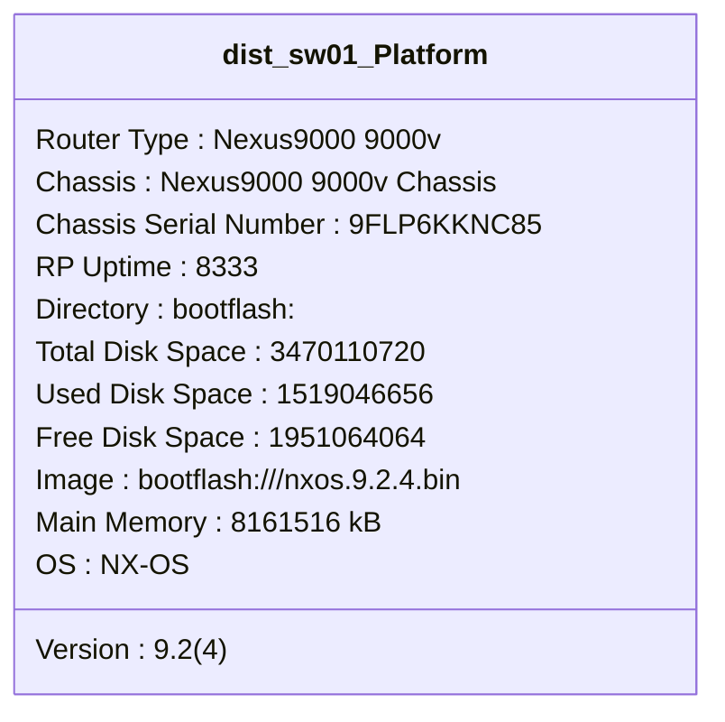
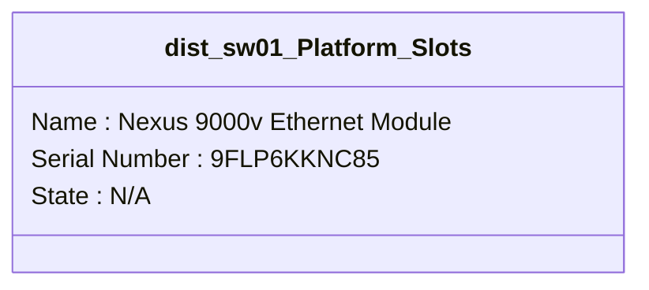
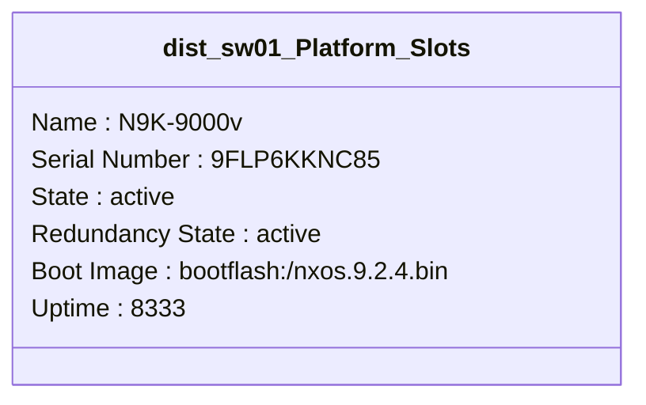
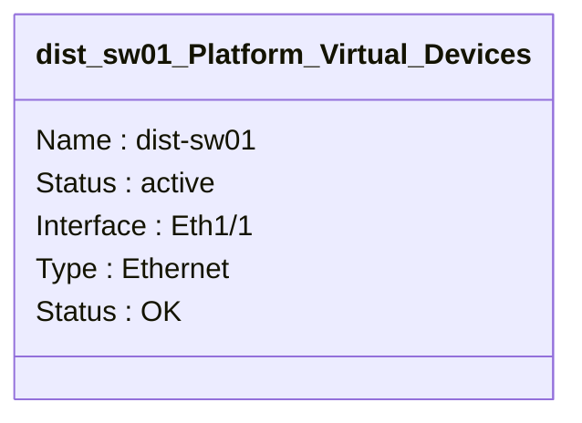
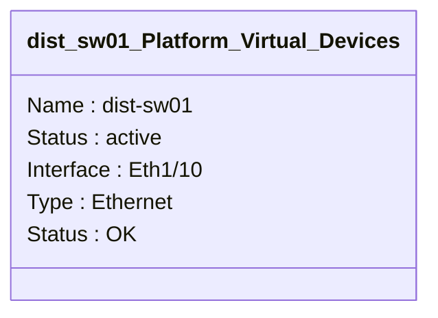
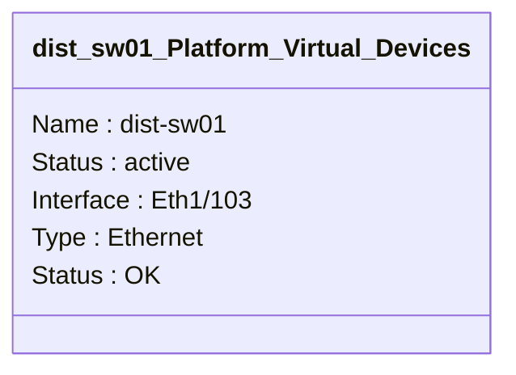

```mermaid
classDiagram
class dist_sw01_Platform_Virtual_Devices {
Name : dist-sw01
Status : active
Interface : Eth1/114
Type : Ethernet
Status : OK
}
```
```mermaid
classDiagram
class dist_sw01_Platform_Virtual_Devices {
Name : dist-sw01
Status : active
Interface : Eth1/115
Type : Ethernet
Status : OK
}
```
```mermaid
classDiagram
class dist_sw01_Platform_Virtual_Devices {
Name : dist-sw01
Status : active
Interface : Eth1/116
Type : Ethernet
Status : OK
}
```
```mermaid
classDiagram
class dist_sw01_Platform_Virtual_Devices {
Name : dist-sw01
Status : active
Interface : Eth1/117
Type : Ethernet
Status : OK
}
```
```mermaid
classDiagram
class dist_sw01_Platform_Virtual_Devices {
Name : dist-sw01
Status : active
Interface : Eth1/118
Type : Ethernet
Status : OK
}
```
```mermaid
classDiagram
class dist_sw01_Platform_Virtual_Devices {
Name : dist-sw01
Status : active
Interface : Eth1/119
Type : Ethernet
Status : OK
}
```
```mermaid
classDiagram
class dist_sw01_Platform_Virtual_Devices {
Name : dist-sw01
Status : active
Interface : Eth1/12
Type : Ethernet
Status : OK
}
```
```mermaid
classDiagram
class dist_sw01_Platform_Virtual_Devices {
Name : dist-sw01
Status : active
Interface : Eth1/120
Type : Ethernet
Status : OK
}
```
```mermaid
classDiagram
class dist_sw01_Platform_Virtual_Devices {
Name : dist-sw01
Status : active
Interface : Eth1/121
Type : Ethernet
Status : OK
}
```
```mermaid
classDiagram
class dist_sw01_Platform_Virtual_Devices {
Name : dist-sw01
Status : active
Interface : Eth1/122
Type : Ethernet
Status : OK
}
```
```mermaid
classDiagram
class dist_sw01_Platform_Virtual_Devices {
Name : dist-sw01
Status : active
Interface : Eth1/123
Type : Ethernet
Status : OK
}
```
```mermaid
classDiagram
class dist_sw01_Platform_Virtual_Devices {
Name : dist-sw01
Status : active
Interface : Eth1/124
Type : Ethernet
Status : OK
}
```
```mermaid
classDiagram
class dist_sw01_Platform_Virtual_Devices {
Name : dist-sw01
Status : active
Interface : Eth1/125
Type : Ethernet
Status : OK
}
```
```mermaid
classDiagram
class dist_sw01_Platform_Virtual_Devices {
Name : dist-sw01
Status : active
Interface : Eth1/126
Type : Ethernet
Status : OK
}
```
```mermaid
classDiagram
class dist_sw01_Platform_Virtual_Devices {
Name : dist-sw01
Status : active
Interface : Eth1/127
Type : Ethernet
Status : OK
}
```
```mermaid
classDiagram
class dist_sw01_Platform_Virtual_Devices {
Name : dist-sw01
Status : active
Interface : Eth1/128
Type : Ethernet
Status : OK
}
```
```mermaid
classDiagram
class dist_sw01_Platform_Virtual_Devices {
Name : dist-sw01
Status : active
Interface : Eth1/13
Type : Ethernet
Status : OK
}
```
```mermaid
classDiagram
class dist_sw01_Platform_Virtual_Devices {
Name : dist-sw01
Status : active
Interface : Eth1/14
Type : Ethernet
Status : OK
}
```
```mermaid
classDiagram
class dist_sw01_Platform_Virtual_Devices {
Name : dist-sw01
Status : active
Interface : Eth1/15
Type : Ethernet
Status : OK
}
```
```mermaid
classDiagram
class dist_sw01_Platform_Virtual_Devices {
Name : dist-sw01
Status : active
Interface : Eth1/16
Type : Ethernet
Status : OK
}
```
```mermaid
classDiagram
class dist_sw01_Platform_Virtual_Devices {
Name : dist-sw01
Status : active
Interface : Eth1/17
Type : Ethernet
Status : OK
}
```
```mermaid
classDiagram
class dist_sw01_Platform_Virtual_Devices {
Name : dist-sw01
Status : active
Interface : Eth1/18
Type : Ethernet
Status : OK
}
```
```mermaid
classDiagram
class dist_sw01_Platform_Virtual_Devices {
Name : dist-sw01
Status : active
Interface : Eth1/19
Type : Ethernet
Status : OK
}
```
```mermaid
classDiagram
class dist_sw01_Platform_Virtual_Devices {
Name : dist-sw01
Status : active
Interface : Eth1/2
Type : Ethernet
Status : OK
}
```
```mermaid
classDiagram
class dist_sw01_Platform_Virtual_Devices {
Name : dist-sw01
Status : active
Interface : Eth1/20
Type : Ethernet
Status : OK
}
```
```mermaid
classDiagram
class dist_sw01_Platform_Virtual_Devices {
Name : dist-sw01
Status : active
Interface : Eth1/21
Type : Ethernet
Status : OK
}
```
```mermaid
classDiagram
class dist_sw01_Platform_Virtual_Devices {
Name : dist-sw01
Status : active
Interface : Eth1/22
Type : Ethernet
Status : OK
}
```
```mermaid
classDiagram
class dist_sw01_Platform_Virtual_Devices {
Name : dist-sw01
Status : active
Interface : Eth1/23
Type : Ethernet
Status : OK
}
```
```mermaid
classDiagram
class dist_sw01_Platform_Virtual_Devices {
Name : dist-sw01
Status : active
Interface : Eth1/24
Type : Ethernet
Status : OK
}
```
```mermaid
classDiagram
class dist_sw01_Platform_Virtual_Devices {
Name : dist-sw01
Status : active
Interface : Eth1/25
Type : Ethernet
Status : OK
}
```
```mermaid
classDiagram
class dist_sw01_Platform_Virtual_Devices {
Name : dist-sw01
Status : active
Interface : Eth1/26
Type : Ethernet
Status : OK
}
```
```mermaid
classDiagram
class dist_sw01_Platform_Virtual_Devices {
Name : dist-sw01
Status : active
Interface : Eth1/27
Type : Ethernet
Status : OK
}
```
```mermaid
classDiagram
class dist_sw01_Platform_Virtual_Devices {
Name : dist-sw01
Status : active
Interface : Eth1/28
Type : Ethernet
Status : OK
}
```
```mermaid
classDiagram
class dist_sw01_Platform_Virtual_Devices {
Name : dist-sw01
Status : active
Interface : Eth1/29
Type : Ethernet
Status : OK
}
```
```mermaid
classDiagram
class dist_sw01_Platform_Virtual_Devices {
Name : dist-sw01
Status : active
Interface : Eth1/3
Type : Ethernet
Status : OK
}
```
```mermaid
classDiagram
class dist_sw01_Platform_Virtual_Devices {
Name : dist-sw01
Status : active
Interface : Eth1/30
Type : Ethernet
Status : OK
}
```
```mermaid
classDiagram
class dist_sw01_Platform_Virtual_Devices {
Name : dist-sw01
Status : active
Interface : Eth1/31
Type : Ethernet
Status : OK
}
```
```mermaid
classDiagram
class dist_sw01_Platform_Virtual_Devices {
Name : dist-sw01
Status : active
Interface : Eth1/32
Type : Ethernet
Status : OK
}
```
```mermaid
classDiagram
class dist_sw01_Platform_Virtual_Devices {
Name : dist-sw01
Status : active
Interface : Eth1/33
Type : Ethernet
Status : OK
}
```
```mermaid
classDiagram
class dist_sw01_Platform_Virtual_Devices {
Name : dist-sw01
Status : active
Interface : Eth1/34
Type : Ethernet
Status : OK
}
```
```mermaid
classDiagram
class dist_sw01_Platform_Virtual_Devices {
Name : dist-sw01
Status : active
Interface : Eth1/35
Type : Ethernet
Status : OK
}
```
```mermaid
classDiagram
class dist_sw01_Platform_Virtual_Devices {
Name : dist-sw01
Status : active
Interface : Eth1/36
Type : Ethernet
Status : OK
}
```
```mermaid
classDiagram
class dist_sw01_Platform_Virtual_Devices {
Name : dist-sw01
Status : active
Interface : Eth1/37
Type : Ethernet
Status : OK
}
```
```mermaid
classDiagram
class dist_sw01_Platform_Virtual_Devices {
Name : dist-sw01
Status : active
Interface : Eth1/38
Type : Ethernet
Status : OK
}
```
```mermaid
classDiagram
class dist_sw01_Platform_Virtual_Devices {
Name : dist-sw01
Status : active
Interface : Eth1/39
Type : Ethernet
Status : OK
}
```
```mermaid
classDiagram
class dist_sw01_Platform_Virtual_Devices {
Name : dist-sw01
Status : active
Interface : Eth1/4
Type : Ethernet
Status : OK
}
```
```mermaid
classDiagram
class dist_sw01_Platform_Virtual_Devices {
Name : dist-sw01
Status : active
Interface : Eth1/40
Type : Ethernet
Status : OK
}
```
```mermaid
classDiagram
class dist_sw01_Platform_Virtual_Devices {
Name : dist-sw01
Status : active
Interface : Eth1/41
Type : Ethernet
Status : OK
}
```
```mermaid
classDiagram
class dist_sw01_Platform_Virtual_Devices {
Name : dist-sw01
Status : active
Interface : Eth1/42
Type : Ethernet
Status : OK
}
```
```mermaid
classDiagram
class dist_sw01_Platform_Virtual_Devices {
Name : dist-sw01
Status : active
Interface : Eth1/43
Type : Ethernet
Status : OK
}
```
```mermaid
classDiagram
class dist_sw01_Platform_Virtual_Devices {
Name : dist-sw01
Status : active
Interface : Eth1/44
Type : Ethernet
Status : OK
}
```
```mermaid
classDiagram
class dist_sw01_Platform_Virtual_Devices {
Name : dist-sw01
Status : active
Interface : Eth1/45
Type : Ethernet
Status : OK
}
```
```mermaid
classDiagram
class dist_sw01_Platform_Virtual_Devices {
Name : dist-sw01
Status : active
Interface : Eth1/46
Type : Ethernet
Status : OK
}
```
```mermaid
classDiagram
class dist_sw01_Platform_Virtual_Devices {
Name : dist-sw01
Status : active
Interface : Eth1/47
Type : Ethernet
Status : OK
}
```
```mermaid
classDiagram
class dist_sw01_Platform_Virtual_Devices {
Name : dist-sw01
Status : active
Interface : Eth1/48
Type : Ethernet
Status : OK
}
```
```mermaid
classDiagram
class dist_sw01_Platform_Virtual_Devices {
Name : dist-sw01
Status : active
Interface : Eth1/49
Type : Ethernet
Status : OK
}
```
```mermaid
classDiagram
class dist_sw01_Platform_Virtual_Devices {
Name : dist-sw01
Status : active
Interface : Eth1/5
Type : Ethernet
Status : OK
}
```
```mermaid
classDiagram
class dist_sw01_Platform_Virtual_Devices {
Name : dist-sw01
Status : active
Interface : Eth1/50
Type : Ethernet
Status : OK
}
```
```mermaid
classDiagram
class dist_sw01_Platform_Virtual_Devices {
Name : dist-sw01
Status : active
Interface : Eth1/51
Type : Ethernet
Status : OK
}
```
```mermaid
classDiagram
class dist_sw01_Platform_Virtual_Devices {
Name : dist-sw01
Status : active
Interface : Eth1/52
Type : Ethernet
Status : OK
}
```
```mermaid
classDiagram
class dist_sw01_Platform_Virtual_Devices {
Name : dist-sw01
Status : active
Interface : Eth1/53
Type : Ethernet
Status : OK
}
```
```mermaid
classDiagram
class dist_sw01_Platform_Virtual_Devices {
Name : dist-sw01
Status : active
Interface : Eth1/54
Type : Ethernet
Status : OK
}
```
```mermaid
classDiagram
class dist_sw01_Platform_Virtual_Devices {
Name : dist-sw01
Status : active
Interface : Eth1/55
Type : Ethernet
Status : OK
}
```
```mermaid
classDiagram
class dist_sw01_Platform_Virtual_Devices {
Name : dist-sw01
Status : active
Interface : Eth1/56
Type : Ethernet
Status : OK
}
```
```mermaid
classDiagram
class dist_sw01_Platform_Virtual_Devices {
Name : dist-sw01
Status : active
Interface : Eth1/57
Type : Ethernet
Status : OK
}
```
```mermaid
classDiagram
class dist_sw01_Platform_Virtual_Devices {
Name : dist-sw01
Status : active
Interface : Eth1/58
Type : Ethernet
Status : OK
}
```
```mermaid
classDiagram
class dist_sw01_Platform_Virtual_Devices {
Name : dist-sw01
Status : active
Interface : Eth1/59
Type : Ethernet
Status : OK
}
```
```mermaid
classDiagram
class dist_sw01_Platform_Virtual_Devices {
Name : dist-sw01
Status : active
Interface : Eth1/6
Type : Ethernet
Status : OK
}
```
```mermaid
classDiagram
class dist_sw01_Platform_Virtual_Devices {
Name : dist-sw01
Status : active
Interface : Eth1/60
Type : Ethernet
Status : OK
}
```
```mermaid
classDiagram
class dist_sw01_Platform_Virtual_Devices {
Name : dist-sw01
Status : active
Interface : Eth1/61
Type : Ethernet
Status : OK
}
```
```mermaid
classDiagram
class dist_sw01_Platform_Virtual_Devices {
Name : dist-sw01
Status : active
Interface : Eth1/62
Type : Ethernet
Status : OK
}
```
```mermaid
classDiagram
class dist_sw01_Platform_Virtual_Devices {
Name : dist-sw01
Status : active
Interface : Eth1/63
Type : Ethernet
Status : OK
}
```
```mermaid
classDiagram
class dist_sw01_Platform_Virtual_Devices {
Name : dist-sw01
Status : active
Interface : Eth1/64
Type : Ethernet
Status : OK
}
```
```mermaid
classDiagram
class dist_sw01_Platform_Virtual_Devices {
Name : dist-sw01
Status : active
Interface : Eth1/65
Type : Ethernet
Status : OK
}
```
```mermaid
classDiagram
class dist_sw01_Platform_Virtual_Devices {
Name : dist-sw01
Status : active
Interface : Eth1/66
Type : Ethernet
Status : OK
}
```
```mermaid
classDiagram
class dist_sw01_Platform_Virtual_Devices {
Name : dist-sw01
Status : active
Interface : Eth1/67
Type : Ethernet
Status : OK
}
```
```mermaid
classDiagram
class dist_sw01_Platform_Virtual_Devices {
Name : dist-sw01
Status : active
Interface : Eth1/68
Type : Ethernet
Status : OK
}
```
```mermaid
classDiagram
class dist_sw01_Platform_Virtual_Devices {
Name : dist-sw01
Status : active
Interface : Eth1/69
Type : Ethernet
Status : OK
}
```
```mermaid
classDiagram
class dist_sw01_Platform_Virtual_Devices {
Name : dist-sw01
Status : active
Interface : Eth1/7
Type : Ethernet
Status : OK
}
```
```mermaid
classDiagram
class dist_sw01_Platform_Virtual_Devices {
Name : dist-sw01
Status : active
Interface : Eth1/70
Type : Ethernet
Status : OK
}
```
```mermaid
classDiagram
class dist_sw01_Platform_Virtual_Devices {
Name : dist-sw01
Status : active
Interface : Eth1/71
Type : Ethernet
Status : OK
}
```
```mermaid
classDiagram
class dist_sw01_Platform_Virtual_Devices {
Name : dist-sw01
Status : active
Interface : Eth1/72
Type : Ethernet
Status : OK
}
```
```mermaid
classDiagram
class dist_sw01_Platform_Virtual_Devices {
Name : dist-sw01
Status : active
Interface : Eth1/73
Type : Ethernet
Status : OK
}
```
```mermaid
classDiagram
class dist_sw01_Platform_Virtual_Devices {
Name : dist-sw01
Status : active
Interface : Eth1/74
Type : Ethernet
Status : OK
}
```
```mermaid
classDiagram
class dist_sw01_Platform_Virtual_Devices {
Name : dist-sw01
Status : active
Interface : Eth1/75
Type : Ethernet
Status : OK
}
```
```mermaid
classDiagram
class dist_sw01_Platform_Virtual_Devices {
Name : dist-sw01
Status : active
Interface : Eth1/76
Type : Ethernet
Status : OK
}
```
```mermaid
classDiagram
class dist_sw01_Platform_Virtual_Devices {
Name : dist-sw01
Status : active
Interface : Eth1/77
Type : Ethernet
Status : OK
}
```
```mermaid
classDiagram
class dist_sw01_Platform_Virtual_Devices {
Name : dist-sw01
Status : active
Interface : Eth1/78
Type : Ethernet
Status : OK
}
```
```mermaid
classDiagram
class dist_sw01_Platform_Virtual_Devices {
Name : dist-sw01
Status : active
Interface : Eth1/79
Type : Ethernet
Status : OK
}
```
```mermaid
classDiagram
class dist_sw01_Platform_Virtual_Devices {
Name : dist-sw01
Status : active
Interface : Eth1/8
Type : Ethernet
Status : OK
}
```
```mermaid
classDiagram
class dist_sw01_Platform_Virtual_Devices {
Name : dist-sw01
Status : active
Interface : Eth1/80
Type : Ethernet
Status : OK
}
```
```mermaid
classDiagram
class dist_sw01_Platform_Virtual_Devices {
Name : dist-sw01
Status : active
Interface : Eth1/81
Type : Ethernet
Status : OK
}
```
```mermaid
classDiagram
class dist_sw01_Platform_Virtual_Devices {
Name : dist-sw01
Status : active
Interface : Eth1/82
Type : Ethernet
Status : OK
}
```
```mermaid
classDiagram
class dist_sw01_Platform_Virtual_Devices {
Name : dist-sw01
Status : active
Interface : Eth1/83
Type : Ethernet
Status : OK
}
```
```mermaid
classDiagram
class dist_sw01_Platform_Virtual_Devices {
Name : dist-sw01
Status : active
Interface : Eth1/84
Type : Ethernet
Status : OK
}
```
```mermaid
classDiagram
class dist_sw01_Platform_Virtual_Devices {
Name : dist-sw01
Status : active
Interface : Eth1/85
Type : Ethernet
Status : OK
}
```
```mermaid
classDiagram
class dist_sw01_Platform_Virtual_Devices {
Name : dist-sw01
Status : active
Interface : Eth1/86
Type : Ethernet
Status : OK
}
```
```mermaid
classDiagram
class dist_sw01_Platform_Virtual_Devices {
Name : dist-sw01
Status : active
Interface : Eth1/87
Type : Ethernet
Status : OK
}
```
```mermaid
classDiagram
class dist_sw01_Platform_Virtual_Devices {
Name : dist-sw01
Status : active
Interface : Eth1/88
Type : Ethernet
Status : OK
}
```
```mermaid
classDiagram
class dist_sw01_Platform_Virtual_Devices {
Name : dist-sw01
Status : active
Interface : Eth1/89
Type : Ethernet
Status : OK
}
```
```mermaid
classDiagram
class dist_sw01_Platform_Virtual_Devices {
Name : dist-sw01
Status : active
Interface : Eth1/9
Type : Ethernet
Status : OK
}
```
```mermaid
classDiagram
class dist_sw01_Platform_Virtual_Devices {
Name : dist-sw01
Status : active
Interface : Eth1/90
Type : Ethernet
Status : OK
}
```
```mermaid
classDiagram
class dist_sw01_Platform_Virtual_Devices {
Name : dist-sw01
Status : active
Interface : Eth1/91
Type : Ethernet
Status : OK
}
```
```mermaid
classDiagram
class dist_sw01_Platform_Virtual_Devices {
Name : dist-sw01
Status : active
Interface : Eth1/92
Type : Ethernet
Status : OK
}
```
```mermaid
classDiagram
class dist_sw01_Platform_Virtual_Devices {
Name : dist-sw01
Status : active
Interface : Eth1/93
Type : Ethernet
Status : OK
}
```
```mermaid
classDiagram
class dist_sw01_Platform_Virtual_Devices {
Name : dist-sw01
Status : active
Interface : Eth1/94
Type : Ethernet
Status : OK
}
```
```mermaid
classDiagram
class dist_sw01_Platform_Virtual_Devices {
Name : dist-sw01
Status : active
Interface : Eth1/95
Type : Ethernet
Status : OK
}
```
```mermaid
classDiagram
class dist_sw01_Platform_Virtual_Devices {
Name : dist-sw01
Status : active
Interface : Eth1/96
Type : Ethernet
Status : OK
}
```
```mermaid
classDiagram
class dist_sw01_Platform_Virtual_Devices {
Name : dist-sw01
Status : active
Interface : Eth1/97
Type : Ethernet
Status : OK
}
```
```mermaid
classDiagram
class dist_sw01_Platform_Virtual_Devices {
Name : dist-sw01
Status : active
Interface : Eth1/98
Type : Ethernet
Status : OK
}
```
```mermaid
classDiagram
class dist_sw01_Platform_Virtual_Devices {
Name : dist-sw01
Status : active
Interface : Eth1/99
Type : Ethernet
Status : OK
}
```