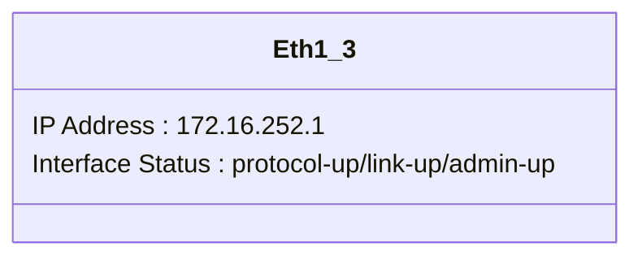
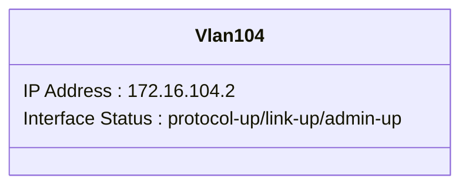

```mermaid
classDiagram
class Eth1_3 {
IP Address : 172.16.252.1
Interface Status : protocol-up/link-up/admin-up
}
```

```mermaid
classDiagram
class Eth1_4 {
IP Address : 172.16.252.5
Interface Status : protocol-up/link-up/admin-up
}
```

```mermaid
classDiagram
class Vlan101 {
IP Address : 172.16.101.2
Interface Status : protocol-up/link-up/admin-up
}
```

```mermaid
classDiagram
class Vlan102 {
IP Address : 172.16.102.2
Interface Status : protocol-up/link-up/admin-up
}
```

```mermaid
classDiagram
class Vlan103 {
IP Address : 172.16.103.2
Interface Status : protocol-up/link-up/admin-up
}
```

```mermaid
classDiagram
class Vlan104 {
IP Address : 172.16.104.2
Interface Status : protocol-up/link-up/admin-up
}
```

```mermaid
classDiagram
class Vlan105 {
IP Address : 172.16.105.2
Interface Status : protocol-up/link-up/admin-up
}
```