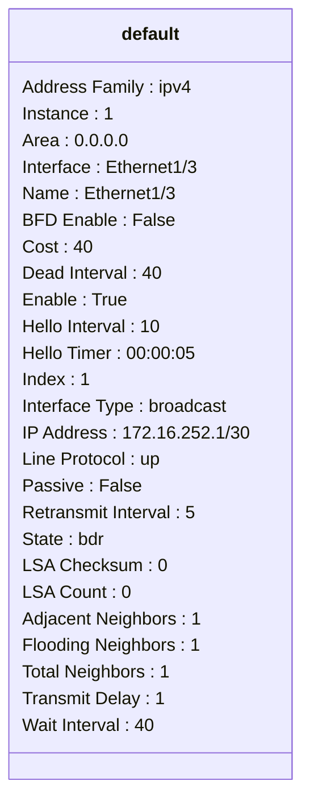
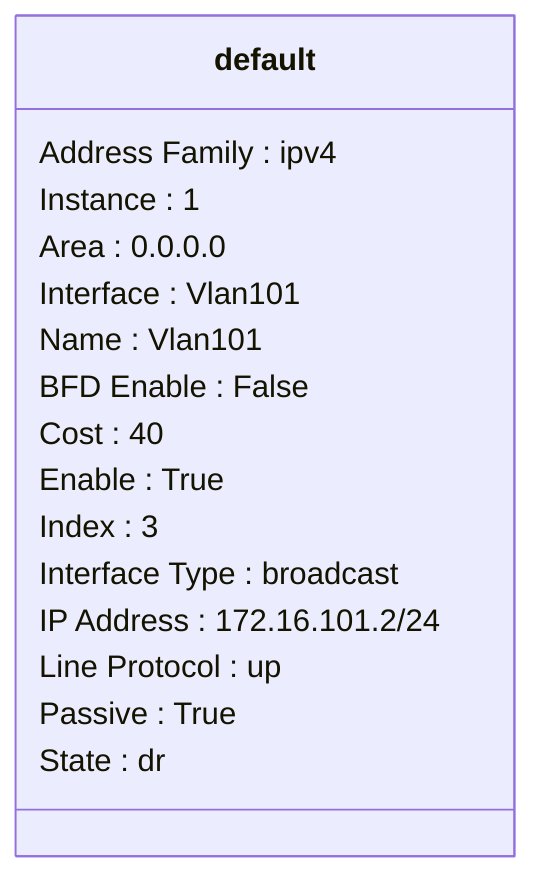
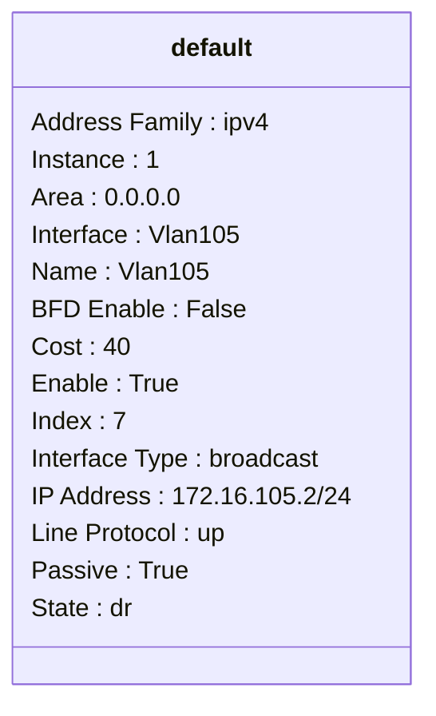

```mermaid
classDiagram
class default {
Address Family : ipv4
Instance : 1
Area : 0.0.0.0
Interface : Ethernet1/3
Name : Ethernet1/3
BFD Enable : False
Cost : 40
Dead Interval : 40
Enable : True
Hello Interval : 10
Hello Timer : 00:00:05
Index : 1
Interface Type : broadcast
IP Address : 172.16.252.1/30
Line Protocol : up
Passive : False
Retransmit Interval : 5
State : bdr
LSA Checksum : 0
LSA Count : 0
Adjacent Neighbors : 1
Flooding Neighbors : 1
Total Neighbors : 1
Transmit Delay : 1
Wait Interval : 40
}
```

```mermaid
classDiagram
class default {
Address Family : ipv4
Instance : 1
Area : 0.0.0.0
Interface : Ethernet1/4
Name : Ethernet1/4
BFD Enable : False
Cost : 40
Dead Interval : 40
Enable : True
Hello Interval : 10
Hello Timer : 00:00:03
Index : 2
Interface Type : broadcast
IP Address : 172.16.252.5/30
Line Protocol : up
Passive : False
Retransmit Interval : 5
State : bdr
LSA Checksum : 0
LSA Count : 0
Adjacent Neighbors : 1
Flooding Neighbors : 1
Total Neighbors : 1
Transmit Delay : 1
Wait Interval : 40
}
```

```mermaid
classDiagram
class default {
Address Family : ipv4
Instance : 1
Area : 0.0.0.0
Interface : Vlan101
Name : Vlan101
BFD Enable : False
Cost : 40
Enable : True
Index : 3
Interface Type : broadcast
IP Address : 172.16.101.2/24
Line Protocol : up
Passive : True
State : dr
}
```

```mermaid
classDiagram
class default {
Address Family : ipv4
Instance : 1
Area : 0.0.0.0
Interface : Vlan102
Name : Vlan102
BFD Enable : False
Cost : 40
Enable : True
Index : 4
Interface Type : broadcast
IP Address : 172.16.102.2/24
Line Protocol : up
Passive : True
State : dr
}
```

```mermaid
classDiagram
class default {
Address Family : ipv4
Instance : 1
Area : 0.0.0.0
Interface : Vlan103
Name : Vlan103
BFD Enable : False
Cost : 40
Enable : True
Index : 5
Interface Type : broadcast
IP Address : 172.16.103.2/24
Line Protocol : up
Passive : True
State : dr
}
```

```mermaid
classDiagram
class default {
Address Family : ipv4
Instance : 1
Area : 0.0.0.0
Interface : Vlan104
Name : Vlan104
BFD Enable : False
Cost : 40
Enable : True
Index : 6
Interface Type : broadcast
IP Address : 172.16.104.2/24
Line Protocol : up
Passive : True
State : dr
}
```

```mermaid
classDiagram
class default {
Address Family : ipv4
Instance : 1
Area : 0.0.0.0
Interface : Vlan105
Name : Vlan105
BFD Enable : False
Cost : 40
Enable : True
Index : 7
Interface Type : broadcast
IP Address : 172.16.105.2/24
Line Protocol : up
Passive : True
State : dr
}
```